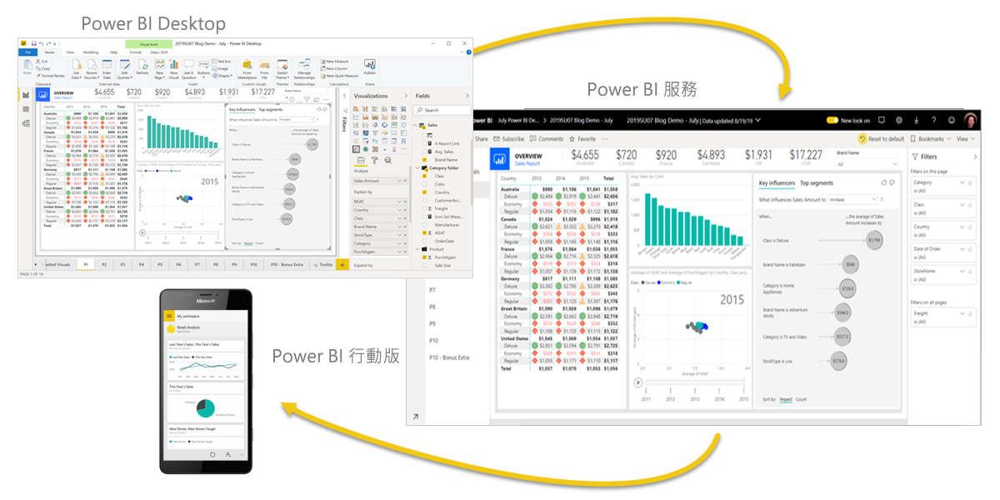
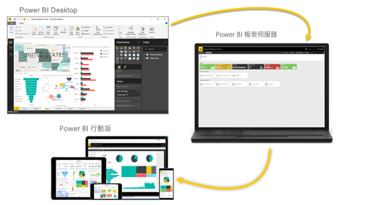

# Power BI 是什麼？
**Power BI** 是軟體服務、應用程式和連接器的集合，它們搭配使用來將不相關的資料來源轉換成相關、視覺上融入的互動式深入剖析。 不論您的資料是簡單的 Excel 試算表，或是一組雲端和內部部署混合式資料倉儲， Power BI 可讓您輕鬆地連線到資料來源、以視覺化方式檢視及探索重要資料，以及與任何人或您想要的任何人共用該資料。

## Power BI 的各部分
Power BI 包含： 
- 稱為 **Power BI Desktop** 的 Windows 傳統型應用程式。
- 稱為 **Power BI 服務**的線上 SaaS (「軟體即服務」  ) 服務。 
- 適用於 Windows、iOS 和 Android 裝置的 Power BI **行動裝置應用程式**。

這三個元素&mdash;Power BI Desktop、服務以及行動裝置應用程式&mdash;旨在讓您透過最符合您和角色需求的方式來建立、共用和取用商業見解。

第四個元素，**Power BI 報表伺服器**，可讓您在 Power BI Desktop 中建立 Power BI 報表之後，將它們發行至內部部署報表伺服器。 深入了解 [Power BI 報表伺服器](#on-premises-reporting-with-power-bi-report-server)。

## Power BI 如何符合您的角色
Power BI 的使用方式可能取決於您在專案或小組中的角色。 其他角色的其他使用者可能以不同方式來使用 Power BI。

例如，您可能主要使用 **Power BI 服務**來檢視報表和儀表板。 負責處理數字、建立業務報表的同事，可能會大量使用 **Power BI Desktop** 來建立報表，並將這些報表發佈到 Power BI 服務以供您檢視。 而銷售部門的同事可能主要使用 **Power BI 行動電話應用程式**來監視銷售額的進度，並鑽研新的潛在客戶詳細資料。

如果您是開發人員，便可以使用 Power BI API 將資料推送至資料集，或將儀表板和報表內嵌至您自己的自訂應用程式。 有新視覺效果的構想嗎？ 您可以自行建置並與其他人分享。  

您也可能會根據您嘗試達成的目標或您在指定專案中角色，在不同時間使用 Power BI 的每個項目。

Power BI 的使用方式取決於 Power BI 的哪些功能或服務是最適合您解決方案的工具。 例如，您可以使用 Power BI Desktop 來為自有小組建立客戶參與統計資料的報表，且您可以在 Power BI 服務中的儀表板上即時檢視庫存和製造進度。 您可以使用 Power BI 的每個部分，這就是它如此具有彈性且吸引人的原因。

探索與您角色相關的文件：
- 適用於[*設計師*](../desktop-what-is-desktop.md)的 Power BI Desktop
- 適用於[*取用者*](../consumer/end-user-consumer.md)的 Power BI
- 適用於[*開發人員*](../developer/what-can-you-do.md)的 Power BI
- 適用於[*系統管理員*](../service-admin-administering-power-bi-in-your-organization.md)的 Power BI

## Power BI 中的工作流程
Power BI 中的一般工作流程是從在 Power BI Desktop 中連線至資料來源並建置報表開始。 接著，您會將該報表從 Power BI Desktop 發佈至 Power BI 服務並加以共用，讓 Power BI 服務和行動裝置中的終端使用者可以檢視報表及與報表互動。
此工作流程是常見的情況，並示範三個主要 Power BI 元素如何彼此互補。

以下是詳細的 [Power BI Desktop 與 Power BI 服務的比較](../designer/service-service-vs-desktop.md)。

## 使用 Power BI 報表伺服器的內部部署報表

但如果您尚未做好移至雲端的準備，而需要將報表保留在公司防火牆後方，該怎麼辦？  請繼續閱讀。

您可以使用 Power BI 報表伺服器提供的多種現成可用工具與服務，來建立、部署及管理內部部署的 Power BI 行動及編頁報表。

「Power BI 報表伺服器」是一項解決方案，您會將其部署在防火牆後方，然後以各種不同方式 (不論是在網頁瀏覽器中、行動裝置上還是以電子郵件形式檢視) 將報表傳遞給正確的使用者。 而由於「Power BI 報表伺服器」與雲端 Power BI 相容，因此您可以在準備就緒後就移至雲端。 

深入了解 [Power BI 報表伺服器](../report-server/get-started.md)。

## 後續步驟
- [快速入門：學習使用 Power BI 服務](../service-the-new-power-bi-experience.md)   
- [教學課程：開始使用 Power BI 服務](../service-get-started.md)
- [快速入門：在 Power BI Desktop 中連線至資料](../desktop-quickstart-connect-to-data.md)
