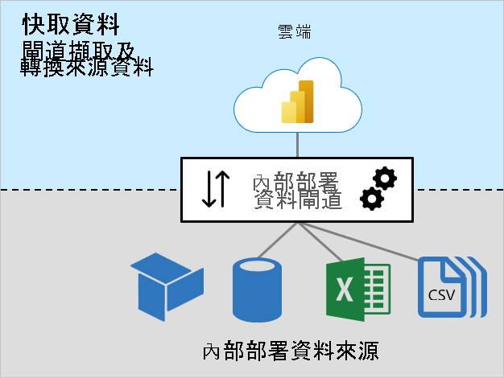

# 內部部署的資料閘道大小調整

此文章適用於需要安裝及管理[內部部署資料閘道](../connect-data/service-gateway-onprem.md)的 Power BI 系統管理員。

每當 Power BI 必須存取無法直接透過網際網路存取的資料時，就需要閘道。 其可以安裝在內部部署伺服器或 VM 裝載的基礎結構即服務 (IaaS) 上。

## 閘道工作負載

內部部署資料閘道支援兩個工作負載。 在我們討論閘道大小與建議之前，請務必先了解這些工作負載。

### 快取的資料工作負載

快取的資料工作負載會擷取並轉換來源資料，以載入 Power BI 資料集。 它會以三個步驟執行：

1. **連線**：閘道連線到來源資料
1. **資料擷取及轉換**：擷取資料，並在必要時進行轉換。 如果可能的話，Power Query 混搭引擎會將轉換步驟推送至資料來源，也就是[查詢摺疊](power-query-folding.md)。 如果不可行，則必須由閘道完成轉換。 在此情況下，閘道將會耗用更多 CPU 與記憶體資源。
1. **傳輸**：資料會傳輸到 Power BI 服務 — 可靠且快速的網際網路連線很重要，尤其是針對大量資料

### 即時連線與 DirectQuery 工作負載

即時連線與 DirectQuery 工作負載主要是以傳遞模式運作。 Power BI 服務會傳送查詢，而閘道會以查詢結果回應。 一般而言，查詢結果的大小很小。

- 如需即時連線的詳細資訊，請參閱 [Power BI 服務中的資料集 (外部裝載模型)](../connect-data/service-datasets-understand.md#external-hosted-models)。
- 如需 DirectQuery 的詳細資訊，請參閱 [Power BI 服務中的資料集模式 (DirectQuery 模式)](../connect-data/service-dataset-modes-understand.md#directquery-mode)。

此工作負載需要 CPU 資源來路由傳送查詢與查詢結果。 CPU 的需求通常會比快取資料工作負載所需的要少得多，特別是在需要轉換資料以進行快取時。

可靠、快速且一致的連線能力非常重要，可確保報表使用者擁有快速回應體驗。

## 大小調整考量

決定閘道電腦的正確大小調整策略可能取決於下列變數：

- 針對快取資料工作負載：
  - 並行資料集重新整理的數目
  - 資料來源的類型 (關聯式資料庫、分析式資料庫、資料摘要或檔案)
  - 要從資料來源擷取的資料量
  - Power Query 混搭引擎所需執行的任何轉換
  - 要傳輸至 Power BI 服務的資料量
- 針對即時連線與 DirectQuery 工作負載：
  - 並行報表使用者的數目
  - 報表頁面上的視覺效果數目 (每個視覺效果至少傳送一個查詢)
  - Power BI 儀表板查詢快取更新的頻率
  - 使用[自動重新整理頁面](../create-reports/desktop-automatic-page-refresh.md)功能的即時報表數目
  - 資料集是否強制執行[資料列層級安全性 (RLS)](../create-reports/desktop-rls.md)

一般而言，即時連線與 DirectQuery 工作負載需要足夠的 CPU，而快取資料工作負載需要更多的 CPU 與記憶體。 這兩個工作負載都取決於與 Power BI 服務以及資料來源的良好連線能力。

> [!NOTE]
> Power BI 容量會限制模型重新整理平行處理原則，以及即時連線與 DirectQuery 輸送量。 調整閘道的大小以提供超過 Power BI 服務所支援的功能是沒有意義的。 限制會因進階 SKU (以及相當大小的 A SKU) 而有所不同。 如需詳細資訊，請參閱[什麼是 Power BI Premium？(容量節點)](../admin/service-premium-what-is.md#capacity-nodes)。

## 建議

閘道大小調整建議取決於許多變數。 在此節中，我們會提供您可以納入考量的一般建議。

### 初始大小

可能難以準確估計正確的大小。 建議您從至少具有 8 個 CPU 核心、8 GB RAM 與多 Gigabit 網路介面卡的電腦開始。 接著，您可以透過記錄 CPU 與記憶體系統計數器來測量一般閘道工作負載。 如需詳細資訊，請參閱[監視並最佳化內部部署資料閘道效能](/data-integration/gateway/service-gateway-performance)。

### 連線能力

規劃 Power BI 服務與您的閘道之間，以及您的閘道與資料來源之間的最佳連線能力。

- 力求可靠性、速度快，以及低且一致的延遲
- 消除 (或減少) 閘道與資料來源之間的電腦躍點數
- 移除防火牆 Proxy 層所加諸的任何網路節流。 如需 Power BI 端點的詳細資訊，請參閱[將 Power BI URL 新增至允許清單](../admin/power-bi-allow-list-urls.md)。
- 設定 [Azure ExpressRoute](/azure/expressroute/expressroute-introduction) 以建立對 Power BI 的私人受控連線
- 針對 Azure VM 中的資料來源，請確定 VM [與 Power BI 服務共置](../admin/service-admin-where-is-my-tenant-located.md)
- 針對涉及動態 RLS 的 SQL Server Analysis Services (SSAS) 即時連線工作負載，請確定閘道電腦與內部部署 Active Directory 之間有良好的連線能力

### 叢集

針對大規模部署，您可以建立叢集安裝的閘道。 叢集可避免單一失敗點，並可對閘道之間的流量進行負載平衡。 您可以：

- 在叢集中安裝一或多個閘道
- 將工作負載隔離到獨立閘道，或者閘道伺服器的叢集

如需詳細資訊，請參閱[管理內部部署資料閘道高可用性叢集和負載平衡](/data-integration/gateway/service-gateway-high-availability-clusters)。

### 資料集設計及設定

資料集設計與其設定可能會對閘道工作負載造成影響。 若要減少閘道工作負載，您可以考慮下列動作。

針對匯入資料集：

- 設定較不頻繁的資料重新整理
- 設定[累加式重新整理](../admin/service-premium-incremental-refresh.md)，以將傳輸的資料量降到最低
- 盡可能確保進行[查詢摺疊](power-query-folding.md)
- 特別是針對大量資料或低延遲結果的需求，請將設計轉換成 DirectQuery 或[複合](../connect-data/service-dataset-modes-understand.md#composite-mode)模型

針對 DirectQuery 資料集：

- 最佳化資料來源、模型與報表設計 — 如需詳細資訊，請參閱 [Power BI Desktop 中的 DirectQuery 模型指南](directquery-model-guidance.md)
- 建立[彙總](../transform-model/desktop-aggregations.md)以快取較高層級的結果，以減少 DirectQuery 要求的數目
- 限制報表設計與容量設定中的[自動頁面重新整理](../create-reports/desktop-automatic-page-refresh.md)間隔
- 特別是在強制執行動態 RLS 時，請限制儀表板快取更新頻率
- 特別是針對較小量的資料或非揮發性資料，請將設計轉換成匯入或[複合](../connect-data/service-dataset-modes-understand.md#composite-mode)模型

針對即時連線資料集：

- 特別是在強制執行動態 RLS 時，請限制儀表板快取更新頻率

## 後續步驟

如需本文的詳細資訊，請參閱下列資源：

- [適用於為 Power BI 部署資料閘道的指引](../connect-data/service-gateway-deployment-guidance.md)
- [設定內部部署資料閘道的 Proxy 設定](/data-integration/gateway/service-gateway-proxy)
- [監視並最佳化內部部署資料閘道效能](/data-integration/gateway/service-gateway-performance)
- [針對閘道進行疑難排解 - Power BI](../connect-data/service-gateway-onprem-tshoot.md)
- [針對內部部署的資料閘道進行疑難排解](/data-integration/gateway/service-gateway-tshoot)
- [查詢摺疊的重要性](power-query-folding.md)
- 有問題嗎？ [嘗試在 Power BI 社群提問](https://community.powerbi.com/)
- 有任何建議嗎？ [貢獻想法來改善 Power BI](https://ideas.powerbi.com)
