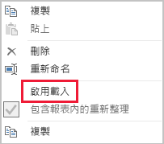

# 匯入模型的資料減少技術

本文的目標對象是正在開發匯入模型的 Power BI Desktop 資料模型製作人員。 它會描述可協助減少載入匯入模型資料量的不同技術。

匯入模型會與壓縮及最佳化的資料一同載入，然後由 VertiPaq 儲存引擎儲存到磁碟。 來源資料載入記憶體時，壓縮率可能會高達 10 倍，因此您可以預期 10 GB 的來源資料在壓縮之後其大小僅會有 1 GB。 此外，保存到磁碟時，其大小還可以再減少 20%。

除了 VertiPaq 儲存引擎所能實驗的效率外，您也必須努力減少載入模型的資料大小。 對於大型模型或是您預期大小會隨著時間逐步成長的模型來說更是如此。 四個吸引人的理由包括：

- 您的容量可能無法支援較大模型。 共用容量可裝載最大 1 GB 的模型，Premium 容量則可以裝載最大 13 GB 的模型。 如需詳細資訊，請參閱 [Power BI Premium 的大型資料集支援](../service-premium-large-datasets.md)一文。
- 較小模型可以減少在容量資源上的競爭，特別是記憶體。 其可讓您更長時間地同時載入更多模型，以降低收回率。 如需詳細資訊，請參閱[管理 Premium 容量](../service-premium-capacity-manage.md)。
- 較小的模型可以更快地進行資料重新整理，降低延遲報告、提高資料集重新整理輸送量，並降低對來源系統和容量資源造成的壓力。
- 較小的資料表資料列計數可以更快地進行計算評估，其可提高整體的查詢效能。

本文會涵蓋八種不同的資料減少技術。 這些技術包括：

- [移除不必要的資料行](#remove-unnecessary-columns)
- [移除不必要的資料列](#remove-unnecessary-rows)
- [分組依據及摘要](#group-by-and-summarize)
- [最佳化資料行資料類型](#optimize-column-data-types)
- [自訂資料行的喜好設定](#preference-for-custom-columns)
- [停用 Power Query 查詢載入](#disable-power-query-query-load)
- [停用自動日期/時間](#disable-auto-datetime)
- [切換到混合模式](#switch-to-mixed-mode)

## 移除不必要的資料行

模型資料表資料行的主要用途有兩種：

- **報告**，以達到能適當篩選、分組和摘要模型資料的報表設計
- **模型結構**，透過支援模型關聯性、模型計算、安全性角色，甚至是資料色彩格式化

無法實現這些用途的資料行即可以加以移除。 移除資料行的過程稱為「垂直篩選」  。

我們建議您根據已知的報告需求，使用完全正確的資料行數來設計模型。 需求可能會隨著時間產生變更，但請記得在稍後新增資料行會比稍後再移除資料行容易。 移除資料行可能會中斷報表或破壞資料結構。

## 移除不必要的資料列

模型資料表應盡可能地載入越少資料列越好。 這可以透過針對兩個不同理由，將經篩選的資料列集載入模型資料表來達成：依據實體進行篩選或依據時間進行篩選。 移除資料列的過程稱為「水平篩選」  。

**依據實體進行篩選**會涉及將來源資料的子集載入模型。 例如只載入單一區域的事實，而非載入所有銷售區域的銷售事實。 這種設計方法可以產生較小的模型，並消除定義資料列層級安全性的需求 (但會需要您在 Power BI 服務中授與特定資料集權限，以及建立連線到每個資料集的「重複」報表)。 您可以透過使用 Power Query 參數和 Power BI 範本檔案來簡化管理及發行。 如需詳細資訊，請參閱 [Deep Dive into Query Parameters and Power BI Templates](https://powerbi.microsoft.com/blog/deep-dive-into-query-parameters-and-power-bi-templates/) (深入探討查詢參數和 Power BI 範本) 部落格項目。

**依據時間進行篩選**則涉及限制載入到事實類型資料表的「資料記錄」  數 (以及限制載入到模型日期資料表的日期資料列)。 我們建議您不要自動載入所有可用的記錄，除非有已知的報告需求。 了解可以參數化以時間為基礎的 Power Query 篩選，甚至設為使用相對時間期間 (相對於重新整理日期，例如過去五年) 相當有幫助。 同時，請記得對時間篩選的追溯變更不會中斷報表；它只會減少 (或增加) 報表中可提供使用的資料記錄。

## 分組依據及摘要

也許減少資料模型最有效的技術便是載入預先經過摘要的資料。 這種技術可以用來提高事實類型資料表的細緻度。 但是這項技術一項明顯的取捨便是會遺失詳細資料。

例如，來源銷售事實資料表會在每個資料列儲存每一筆訂單明細。 摘要所有銷售計量、依據日期、客戶和產品進行分組可以大幅減少資料。 您接著也可以考慮「依據月份」  來根據日期進行分組，更進一步地減少資料量。 這有可能會減少 99% 的模型大小，但是您也無法再繼續存取依據日層級或個別訂單層級的報告。 決定摘要事實類型資料一律都會涉及取捨。 您可以透過混合模式設計來減少取捨；此選項會在[切換到混合模式](#switch-to-mixed-mode)技術中進行描述。

## 最佳化資料行資料類型

VertiPaq 儲存引擎會針對每個資料行使用不同的資料結構。 根據預設，這些資料結構會使用值編碼以針對數值資料行資料來達到最高的最佳化程度。 但是文字和其他非數值資料則會使用雜湊編碼。 這需要儲存引擎將數值識別碼指派給資料行中所包含的每個唯一文字值。 這是一種數值識別碼；然後，系統會將這些識別碼儲存在資料結構中，且在儲存和查詢期間將需要進行雜湊查閱。

在某些特定案例中，您可以將來源文字資料轉換成數值。 例如，您可以一致地為銷售訂單號碼加上文字值的前置詞 (例如"SO123456")。 您可以移除前置詞，而訂單號碼便會轉換成整數。 針對大型資料表，這可以大幅減少資料量，特別是在資料行包含唯一或高基數值時。

在此範例中，我們建議您將資料行的「預設摘要」屬性設為「不進行摘要」。 這可協助將不適當的訂單號碼值摘要降至最低。

## 自訂資料行的喜好設定

VertiPaq 儲存引擎會儲存模型計算結果欄 (定義在 DAX 中)，如同一般的 Power Query 來源資料行。 但是，資料結構會以稍微不同的方式儲存，且通常會使用效率較低的壓縮方式。 此外，一旦載入所有 Power Query 資料表，它們便會進行建置，使資料重新整理時間變得更長。 因此將資料表資料行作為「計算」  結果欄新增的效率，會比 Power Query「計算」  資料行 (定義在 M 中) 的效率更低。

喜好設定應在 Power Query 中建立自訂資料行。 當來源是資料庫時，您可以透過兩種方式達到更高的載入效率。 您可以在 SQL 陳述式 (使用提供者的原生查詢語言) 中定義計算，或將其具體化成資料來源中的資料行。

但是，在某些案例中，模型的計算結果欄可能會是更佳選擇。 當公式涉及評估量值，或需要 DAX 函式中才支援的特定模型功能時，即可能會是這種案例。 如需這種範例的資訊，請參閱[了解 DAX 中父子式階層的功能](/dax/understanding-functions-for-parent-child-hierarchies-in-dax)一文。

## 停用 Power Query 查詢載入

旨在支援與其他查詢進行資料整合的 Power Query 查詢不應載入模型。 若要避免將這種查詢載入模型，請確保您已在這些執行個體中停用查詢載入。

## 停用自動日期/時間

Power BI Desktop 包含一個稱為「自動日期/時間」  的選項。 啟用時，該選項會為日期資料行建立隱藏的自動日期/時間資料表，以便在為行事曆時間週期設定篩選、群組和向下鑽研時支援報表作者。 隱藏的資料表事實上是會增加模型大小的計算資料表。 如需使用此選項的相關指引，請參閱 [Power BI Desktop 中的自動日期/時間指引](../desktop-auto-date-time.md)文章。

## 切換到混合模式

在 Power BI Desktop 中，混合模式設計可以產生複合模型。 基本上，它可以讓您「針對每個資料表」  判斷儲存模式。 因此，每個資料表都可以將其 [儲存模式] 屬性設為 [匯入] 或 [DirectQuery] (Dual 是另一個選項)。

減少模型大小的其中一種有效技術是將較大事實類型資料表 [儲存模式] 屬性設為 [DirectQuery]。 這種設計方法可以搭配先前介紹的[分組依據及摘要](#group-by-and-summarize)技術使用且運作良好。 例如，經摘要後的銷售資料可以用來取得高效能「摘要」報告。 鑽研頁面可以顯示特定 (且經過限縮) 篩選內容的細微銷售資料，顯示所有內容中的銷售訂單。 在此範例中，鑽研頁面會包含視覺效果，這些視覺效果是以擷取銷售訂單資料的 DirectQuery 資料表為基礎。

但是複合模型仍有許多與安全性和效能相關的隱含問題。 如需詳細資訊，請參閱[在 Power BI Desktop 中使用複合模型](../desktop-composite-models.md)一文。

## 後續步驟

如需 Power BI 匯入模型設計的詳細資訊，請參閱下列文章：

- [在 Power BI Desktop 中使用複合模型](../desktop-composite-models.md)
- [Power BI Desktop 中的儲存模式](../desktop-storage-mode.md)
- 有問題嗎？ [嘗試在 Power BI 社群提問](https://community.powerbi.com/)
