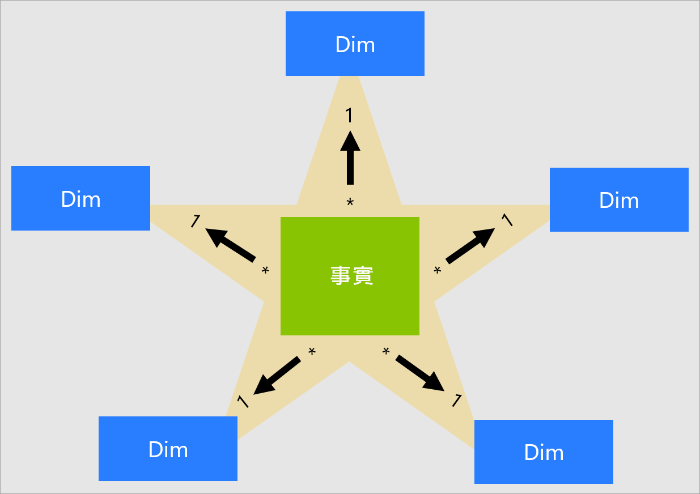
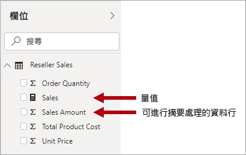
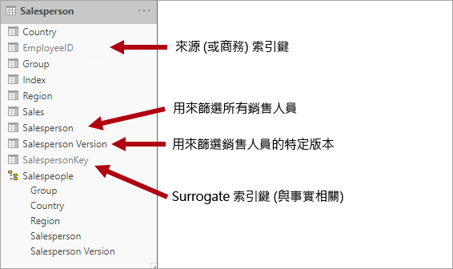
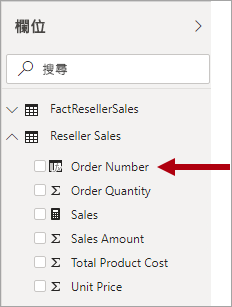

# 了解星型結構描述及其對 Power BI 的重要性

本文適用於 Power BI Desktop 資料模型製作人員。 其中描述星型結構描述設計，以及其與開發針對效能和可用性最佳化的 Power BI 資料模型有何關聯。

此文章不會針對星型結構描述設計提供完整討論。 如需詳細資料，請直接參閱已發佈的內容，例如 Ralph Kimball 等人所著的 "The Data Warehouse Toolkit:  The Definitive Guide to Dimensional Modeling" (2013 年第 3 版)。

## 星型結構描述概觀

**星型結構描述**是關聯式資料倉儲普遍採用的成熟模型化方法。 模型製作人員必須將其模型資料表分類為「維度」  或「事實」  。

**維度資料表**會描述商務實體，也就是您模型化的「事物」  。 這些實體可以包含產品、人員、地點和概念 (包括時間本身)。 您會在星型結構描述中找到的最一致資料表是日期維度資料表。 維度資料表包含一或多個作為唯一識別碼的索引鍵資料行，以及描述性資料行。

**事實資料**會儲存觀測或事件，且可以是銷售訂單、存貨餘額、匯率、溫度等。事實資料表包含與維度資料表相關的維度索引鍵資料行，以及數值量值資料行。 維度索引鍵資料行會決定事實資料表的「維度」  ，而維度索引鍵值則決定事實資料表的「資料粒度」  。 例如，假設有一個事實資料表，其設計目的是為了儲存具有兩個維度索引鍵資料行 **Date** 和 **ProductKey** 的銷售目標。 您輕易就能了解資料表具有兩個維度。 不過，如果不考慮維度索引鍵值，就無法判斷資料粒度。 在此範例中，請考慮 **Date** 資料行中所儲存值是每個月的第一天。 在此案例中，資料粒度是在每月產品層級。

一般而言，維度資料表包含的資料列數目相對較少。 另一方面，事實資料表可以包含非常大量的資料列，並持續隨著時間成長。

## 星型結構描述與 Power BI 模型的相關性

星型結構描述設計及本文介紹的許多相關概念，都與開發針對效能和可用性最佳化的 Power BI 模型高度相關。

請考慮每個 Power BI 報表視覺效果都會產生傳送至 Power BI 模型的查詢 (Power BI 服務會呼叫資料集)。 這些查詢可用來篩選、群組和摘要模型資料。 設計良好模型會提供用於篩選和群組的資料表，以及用於摘要的資料表。 此設計相當符合星型結構描述原則：

- 維度資料表支援「篩選」  和「群組」 
- 事實資料表支援「摘要」 

沒有可供模型製作人員設定來將資料表類型設定為維度或事實的資料表屬性。 事實上，這是由模型關聯性決定的。 模型關聯性會建立兩個資料表之間的篩選傳播路徑，而關聯性的**基數**屬性會決定資料表類型。 常見的關聯性基數包括「一對多」  或相反的「多對一」  。 「一」端一律是維度類型資料表，而「多」端一律是事實類型資料表。 如需關聯性的詳細資訊，請參閱 [Power BI Desktop 中的模型關聯性](../desktop-relationships-understand.md)。

結構良好模型設計應該包含全部是維度類型資料表或事實類型資料表的資料表。 請避免將這兩種類型混合成單一資料表。 此外，建議您應盡力提供正確的資料表數目，並備妥正確的關聯性。 事實類型資料表一律以一致的資料粒度載入資料也很重要。

最後，請務必了解最佳模型設計既是一門科學，也是一門藝術。 有時您可以在合理情況下背離良好的指引。

還有許多其他與星型結構描述相關的概念可套用至 Power BI 模型。 這些概念包括：

- [量值](#measures)
- [Surrogate 索引鍵](#surrogate-keys)
- [雪花式維度](#snowflake-dimensions)
- [角色扮演維度](#role-playing-dimensions)
- [緩時變維度](#slowly-changing-dimensions)
- [雜項維度](#junk-dimensions)
- [變質維度](#degenerate-dimensions)
- [非事實資料表](#factless-fact-tables)

## 量值

在星型結構描述設計中，**量值**是一個事實資料表資料行，用來儲存要摘要的值。

在 Power BI 模型中，**量值**有不同 (但類似) 的定義。 這是以[資料分析運算式 (DAX)](https://docs.microsoft.com/dax/data-analysis-expressions-dax-reference) 撰寫來達成摘要的公式。 量值運算式通常會利用 DAX 彙總函式 (例如 SUM、MIN、MAX、AVERAGE 等) 在查詢時產生純量值結果 (值永遠不會儲存在模型中)。 量值運算式範圍可以從簡單的資料行彙總，到覆寫篩選內容及/或關聯性傳播的更複雜公式。 如需詳細資訊，請參閱 [DAX Basics in Power BI Desktop](https://docs.microsoft.com/power-bi/desktop-quickstart-learn-dax-basics) (Power BI Desktop 的 DAX 基本概念) 一文。

請務必了解 Power BI 模型支援第二種達成摘要的方法。 任何資料行 (通常是數值資料行) 都可以透過報表視覺效果或問與答來進行摘要。 這些資料行稱為「隱含量值」  。 這對身為模型開發人員的您會很方便，因為在許多情況下，您不需要建立量值。 例如，Adventure Works 轉銷商銷售的 [銷售量]  資料行可以透過許多方式 (sum、count、average、median、min、max 等) 進行摘要，而不需要為每個可能的彙總類型建立量值。

不過，即使是簡單的資料行層級摘要，還是有三個必須建立量值的理由：

- 當知道報表作者將使用[多維度運算式 (MDX)](https://docs.microsoft.com/sql/analysis-services/multidimensional-models/mdx/mdx-query-the-basic-query?view=sql-server-2017) 來查詢模型時，則模型必須包含「明確量值」  。 明確量值是使用 DAX 運算式來定義。 這種設計方法在使用 MDX 查詢 Power BI 資料集時高度相關，因為 MDX 無法達成資料行值的摘要。 值得注意的是，執行[使用 Excel 分析](https://docs.microsoft.com/power-bi/service-analyze-in-excel)時，將會使用 MDX，因為樞紐分析表會發出 MDX 查詢。
- 當知道報表作者將使用 MDX 查詢設計工具來建立 Power BI 編頁報表時，則模型必須包含明確量值。 只有 MDX 查詢設計工具支援[伺服器彙總](/sql/reporting-services/report-design/report-builder-functions-aggregate-function)。 因此，如果報表作者需要以 Power BI (而非由編頁報表引擎評估) 來評估量值 ，則必須使用 MDX 查詢設計工具。
- 當需要確保報表作者只能以特定方式摘要資料行時。 例如，轉售商銷售的 [單價]  資料行 (代表每個單位費率) 可進行摘要，但只能透過使用特定彙總函式。 一律不應該進行加總，但最好使用其他彙總函式 (min、max、average 等) 來進行摘要。在此情況下，模型製作人員可以隱藏 [單價]  資料行，並為所有適當的彙總函式建立量值。

這種設計方法相當適用於在 Power BI 服務中撰寫的報表，以及問與答。 不過，Power BI Desktop 即時連接可讓報表作者在 [欄位]  窗格中顯示隱藏的欄位，進而規避這種設計方法。

## Surrogate 索引鍵

**Surrogate 索引鍵**是您新增至資料表以支援星型結構描述模型的唯一識別碼。 根據定義，它不會定義或儲存在來源資料中。 Surrogate 索引鍵通常會新增至關聯式資料倉儲維度資料表，來為每個維度資料表資料列提供唯一識別碼。

Power BI 模型關聯性是根據一個資料表中單一不重複的資料行，這會將篩選傳播至不同資料表中的單一資料行。 當模型中維度類型資料表不包含單一不重複的資料行時，您必須新增唯一識別碼，使其成為關聯性的「一」端。 在 Power BI Desktop 中，您可以透過建立 [Power Query 索引資料行](https://docs.microsoft.com/powerquery-m/table-addindexcolumn)來輕鬆達成此需求。

您必須將此查詢與「多」端查詢合併，讓您也可以在其中新增索引資料行。 當您將這些查詢載入模型時，您可以接著在模型資料表之間建立一對多關聯性。

## 雪花式維度

**雪花式維度**是單一商務實體的一組正規化資料表。 例如，Adventure Works 會依類別和子類別來分類產品。 類別會指派給子類別，而產品會轉而指派給子類別。 在 Adventure Works 關聯式資料倉儲中，產品維度會正規化並儲存在三個相關資料表中：**DimProductCategory**、**DimProductSubcategory** 與 **DimProduct**。

如果您運用想像力，可以想像正規化資料表是從事實資料表朝外形成雪花式設計。

在 Power BI Desktop 中，您可以選擇模擬雪花式維度設計 (可能是因為您的來源資料如此)，或將來源資料表整合 (反正規化) 成單一模型資料表。 一般來說，單一模型資料表優點超過多個模型資料表的優點。 最佳決策可能取決於資料量和模型的可用性需求。

當您選擇模擬雪花式維度設計時：

- Power BI 會載入更多資料表，從儲存空間和效能的觀點來看，這會降低效率。 這些資料表必須包含支援模型關聯性的資料行，因此可能導致更大的模型大小。
- 需要往返的關聯性篩選傳播鏈結更長，因此可能比套用至單一資料表的篩選更沒有效率。
- [欄位]  窗格會向報表作者呈現更多模型資料表，而可能導致較不直覺的體驗，特別是當雪花式維度資料表只包含一或兩個資料行時。
- 您無法建立跨越資料表的階層。

當您選擇整合成單一模型資料表時，您也可以定義階層來包含維度的最高和最低資料粒度。 儲存多餘的反正規化資料可能會導致模型儲存空間大小增加，特別是對於非常大型的維度資料表而言。

## 緩時變維度

**緩時變維度** (SCD) 是指適當管理維度成員在一段時間內變化的維度。 它適用於商務實體值會在一段時間內以特定方式變化的情況。 「緩時」  變維度的一個很好例子是客戶維度，特別是其連絡人詳細資料行 (例如電子郵件地址和電話號碼)。 相反地，當維度屬性經常變更時 (例如股票的市場價格)，則會將這些維度視為「快速」  變更。 在這些情況下，常見設計方法是將快速變更的屬性值儲存在事實資料表量值中。

星型結構描述設計理論是指兩個常見的 SCD 類型：類型 1 和類型 2。 維度類型資料表可以是類型 1 或類型 2，或同時針對不同的資料行支援這兩種類型。

### 類型 1 SCD

**類型 1** **SCD** 一律會反映最新的值；當偵測到來源資料中的變更時，將會覆寫維度資料表資料。 此設計方法常見於儲存補充值的資料行，例如客戶的電子郵件地址或電話號碼。 當客戶的電子郵件地址或電話號碼變更時，維度資料表會以新的值更新客戶資料列。 就像客戶總是擁有此連絡人資訊一樣。

Power BI 模型維度類型資料表非累加式重新整理會達成類型 1 SCD 的結果。 它會重新整理資料表資料，以確保載入最新的值。

### 類型 2 SCD

**類型 2** **SCD** 支援維度成員的版本設定。 如果來源系統不會儲存版本，則通常會由資料倉儲載入處理序來偵測變更，並適當地管理維度資料表中的變更。 在此情況下，維度資料表必須使用 Surrogate 索引鍵來提供維度成員「版本」  的唯一參考。 它也包含定義版本有效日期範圍的資料行 (例如 **StartDate** 與 **EndDate**)，而且也可能包含用來輕鬆依目前維度成員進行篩選的旗標資料行 (例如 **IsCurrent**)。

例如，Adventure Works 會將銷售人員指派給銷售區域。 當銷售人員變換區域時，必須建立新的銷售人員版本，以確保歷程記錄事實與先前的區域保持關聯。 為了支援對銷售人員銷售量進行準確的歷程記錄分析，維度資料表必須儲存銷售人員的版本及其相關聯的區域。 資料表也應該包含開始和結束日期值，以定義有效期間。 目前的版本可以定義空白結束日期 (或 12/31/9999)，其表示資料列是目前的版本。 資料表也必須定義 Surrogate 索引鍵，因為商務索引鍵 (在本例中為員工識別碼) 不是唯一的。

請務必了解當來源資料不會儲存版本時，您必須使用中繼系統 (例如資料倉儲) 來偵測及儲存變更。 資料表載入程序必須保留現有的資料並偵測變更。 偵測到變更時，資料表載入程序必須使目前的版本過期。 其記錄這些變更的方法是更新 **EndDate** 值，然後插入其 **StartDate** 值以先前 **EndDate** 值起始的新版本。 此外，相關事實必須使用以時間為基礎的查閱，來擷取與事實日期相關的維度索引鍵值。 使用 Power Query 的 Power BI 模型無法產生此結果。 不過，它可以從預先載入的 SCD 類型 2 維度資料表載入資料。

Power BI 模型應該支援查詢成員的歷程記錄資料 (不論是否有變更)，以及特定成員版本 (代表特定時間的成員狀態)。 在 Adventure Works 的內容中，此設計可讓您查詢銷售人員 (不論指派的銷售區域)，或特定銷售人員版本。

為了滿足這項需求，Power BI 模型維度類型資料表必須包含一個用於篩選銷售人員的資料行，以及另一個用於篩選特定銷售人員版本的資料行。 版本資料行必須提供明確的描述，例如 "Michael Blythe (12/15/2008-06/26/2019)" 或 "Michael Blythe (current)"。 也請務必教育報表作者和取用者關於 SCD 類型 2 的基本概念，以及如何藉由套用正確篩選來達成適當的報表設計。

加入允許視覺效果向下切入至版本層級的階層也是一個良好設計做法。

## 角色扮演維度

**角色扮演維度**是可利用不同方式篩選相關事實的維度。 例如，在 Adventure Works，日期維度資料表與轉售商銷售事實有三個關聯性。 您可以使用相同的維度資料表，依訂單日期、出貨日期或交貨日期來篩選事實。

在資料倉儲中，接受的設計方法是定義單一日期維度資料表。 在查詢時，日期維度「角色」是由您用來聯結資料表的事實資料行所建立。 例如，當您依訂單日期分析銷售時，資料表聯結會與轉售商銷售訂單日期資料行相關聯。

在 Power BI 模型中，可藉由在兩個資料表之間建立多個關聯性來模擬此設計。 在 Adventure Works 範例中，日期和轉售商銷售資料表會有三個關聯性。 雖然此設計是可行的，但請務必了解兩個 Power BI 模型資料表之間只能有一個使用中的關聯性。 其餘所有關聯性都必須設定為非作用中。 只有一個作用中的關聯性表示從日期到轉售商銷售有預設篩選傳播。 在此情況下，作用中關聯性會設定為報表最常用的篩選，這在 Adventure Works 中會是訂單日期關聯性。

非作用中的關聯性只會用來定義使用 [USERELATIONSHIP 函式](https://docs.microsoft.com/dax/userelationship-function-dax)的 DAX 運算式。 在我們的範例中，模型開發人員必須建立量值，依出貨日期和交貨日期來進行轉售商銷售分析。 這項工作可能很繁瑣，特別是當轉售商資料表定義許多量值時。 它也會導致 [欄位]  窗格因量值過多而很雜亂。 還有其他限制：

- 當報表作者依賴摘要資料行，而不是定義量值時，他們無法在未撰寫報表層級量值的情況下，達成非作用中關聯性的摘要。 只有在 Power BI Desktop 中撰寫報表時，才能定義報表層級量值。
- 由於日期與轉售商銷售之間只有一個作用中的關聯性路徑，因此無法同時依不同日期類型來篩選轉售商銷售。 例如，您無法產生依出貨銷售量繪製訂單日期銷售量的視覺效果。

為了克服這些限制，常見的 Power BI 模型技術是為每個角色扮演執行個體建立維度類型資料表。 您通常會使用 DAX 來建立其他維度資料表作為[導出資料表](https://docs.microsoft.com/dax/calculatetable-function-dax)。 使用導出資料表，模型就可以包含 [日期]  資料表、[出貨日期]  資料表和 [交貨日期]  資料表，分別與其個別轉售商銷售資料表資料行有單一且作用中的關聯性。

這種設計方法不需要您針對不同日期角色定義多個量值，它可讓您同時依不同日期角色進行篩選。 不過，使用這種設計方法需要付出一個相對不大的代價，那就是日期維度資料表的重複會導致模型儲存空間大小增加。 由於維度類型資料表通常會儲存比事實類型資料表更少的資料列，因此這很少會構成問題。

當您為每個角色建立模型維度類型資料表時，請觀察下列良好的設計做法：

- 確定資料行名稱是自我描述的。 雖然所有日期資料表中都可能會有 [年份]  資料行 (資料行名稱在其資料表中是唯一的)，但這不是預設視覺效果標題的自我描述。 請考慮重新命名每個維度角色資料表中的資料行，讓 [出貨日期]  資料表具有一個名為 [出貨年份]  等的年份資料行。
- 如果相關，請確定資料表描述會提供關於如何設定篩選傳播的意見反應給報表作者 (透過 [欄位]  窗格工具提示)。 當模型包含一般名稱的資料表 (例如 [日期]  ) 時，此明確性會很重要，這可用來篩選多個事實類型資料表。 如果此資料表與轉售商銷售訂單日期資料行有作用中的關聯性，請考慮提供「依訂單日期篩選轉售商銷售」之類的資料表描述。

如需詳細資訊，請參閱[作用中與非作用中關聯性指導方針](relationships-active-inactive.md) \(英文\)。

## 雜項維度

**雜項維度**適用於有許多維度 (特別是由幾個屬性或可能一個屬性所組成)，且這些屬性有幾個值的情況。 良好的候選項目包括訂單狀態資料行，或客戶人口統計資料行 (性別、年齡群組等)。

雜項維度的設計目標是將許多「小型」維度合併成單一維度，除了減少模型儲存空間大小，也會因呈現較少模型資料表而降低 [欄位]  窗格的雜亂情況。

雜項維度資料表通常是所有維度屬性成員的笛卡兒乘積，且具有 Surrogate 索引鍵資料行。 Surrogate 索引鍵提供資料表中每個資料列的唯一參考。 您可以在資料倉儲中建置此維度，或使用 Power Query 建立執行[完整外部查詢聯結](https://docs.microsoft.com/powerquery-m/table-join)的查詢，再新增 Surrogate 索引鍵 (索引資料行)。

您可以將此查詢載入模型作為維度類型資料表。 您也需要將此查詢與事實查詢合併，以便將索引資料行載入模型來支援建立「一對多」模型關聯性。

## 變質維度

**變質維度**是指篩選所需的事實資料表屬性。 在 Adventure Works，轉售商銷售訂單號碼就是一個很好的例子。 在此案例中，建立只包含這個資料行的獨立資料表不算是良好模型設計，因為它會增加模型儲存空間大小並導致 [欄位]  窗格雜亂。

在 Power BI 模型中，您可以適當地將銷售訂單號碼資料行新增至事實類型資料表，以允許依銷售訂單號碼進行篩選或群組。 這是先前所介紹不應該混合資料表類型規則的例外 (一般來說，模型資料表通常應該全部是維度類型或事實類型)。

不過，如果 Adventure Works 轉銷商銷售資料表具有訂單號碼「和」  明細行號碼資料行，且這兩者是篩選的必要項目，則變質維度資料表會是不錯的設計。 如需詳細資訊，請參閱[一對一關聯性指導方針 (變質維度)](relationships-one-to-one.md#degenerate-dimensions)。

## 非事實資料表

**非事實**資料表不包含任何量值資料行。 它只包含維度索引鍵。

非事實資料表可以儲存維度索引鍵所定義的觀察。 例如，特定客戶在特定日期和時間登入您的網站。 您可以定義一個用於計算非事實資料表資料列數目的量值，來分析客戶的登入時間和登入人數。

非事實資料表的一個更有趣使用方式，就是用來儲存維度之間的關聯性，這也是我們建議用於定義多對多維度關聯性的 Power BI 模型設計方法。 在[多對多維度關聯性設計](relationships-many-to-many.md#relate-many-to-many-dimensions)中，非事實資料表稱為「橋接資料表」  。

例如，假設銷售人員可以指派給一「或多個」  銷售區域。 橋接資料表設計成由兩個資料行所組成的非事實資料表：銷售人員索引鍵和區域索引鍵。 這兩個資料行中都可以儲存重複的值。

此多對多設計方法已妥善記載，且可以在沒有橋接資料表的情況下達成。 不過，橋接資料表方法被視為關聯兩個維度時的最佳做法。 如需詳細資訊，請參閱[多對多關聯性指導方針 (建立兩個維度類型資料表的關聯)](relationships-many-to-many.md#relate-many-to-many-dimensions)。

## 後續步驟

如需星型結構描述設計或 Power BI 模型設計的詳細資訊，請參閱下列文章：

- [Dimensional modeling (維度模型) Wikipedia 文章](https://go.microsoft.com/fwlink/p/?linkid=246459)
- [Create and manage relationships in Power BI Desktop](../desktop-create-and-manage-relationships.md) (在 Power BI Desktop 中建立和管理關聯性)
- [一對一關聯性指導方針](relationships-one-to-one.md)
- [多對多關聯性指引](relationships-many-to-many.md)
- [雙向關聯性指導方針](relationships-bidirectional-filtering.md)
- [作用中與非作用中關聯性指導方針](relationships-active-inactive.md)
- 有問題嗎？ [嘗試在 Power BI 社群提問](https://community.powerbi.com/)
- 有任何建議嗎？ [貢獻想法來改善 Power BI](https://ideas.powerbi.com/)
