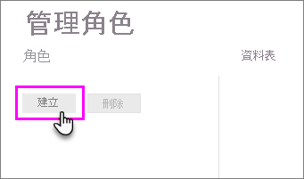

## 在 Power BI Desktop 中定義角色和規則
您可以在 Power BI Desktop 中定義角色和規則。 當發佈到 Power BI 時，也會發佈角色定義。

若要定義安全性角色，請遵循這些步驟。

1. 將資料匯入 Power BI Desktop 報表，或設定 DirectQuery 連線。
   
   > [!NOTE]
   > 您不能在 Power BI Desktop 中定義 Analysis Services 即時連線的角色。 您必須在 Analysis Services 模型中進行此動作。
   > 
   > 
1. 選取 [模型] 索引標籤。
2. 選取 [管理角色]。
   
   
4. 選取 [建立]。
   
   
5. 提供角色名稱。 
6. 選取要套用 DAX 規則的資料表。
7. 輸入 DAX 運算式。 此運算式應該傳回 true 或 false。 例如：[Entity ID] = “Value”。
   
   > [!NOTE]
   > 這個運算式中可以使用 *username()*。 請注意，*username()* 在 Power BI Desktop 中的格式為「網域\使用者名稱」。 在 Power BI 服務和 Power BI 報表伺服器中，格式則為使用者的使用者主體名稱 (UPN)。 或者，您可以使用 *userprincipalname()*，這一律會以使用者主體名稱的格式 (*username\@contoso.com*) 傳回使用者。
   > 
   > 
   
   
8. 建立 DAX 運算式之後，您可以選取運算式上方的核取方塊，以驗證運算式。
   
   
9. 選取 [儲存]。

您無法在 Power BI Desktop 中指派使用者給角色。 請在 Power BI 服務中指派他們。 在 Power BI Desktop 內，您可以使用 *username()* 或 *userprincipalname()* DAX 函式，並設定合適的關聯性，以啟用動態安全性。 

