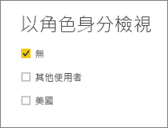

## 在 Power BI Desktop 中驗證角色
在建立角色之後，於 Power BI Desktop 中測試角色的結果。

1. 選取 [以角色身分檢視]  。 

    

    在 [以角色身分檢視]  中，您會看到您已建立的角色。

    

3. 選取您建立的角色 > [確定]  來套用該角色。 報表會呈現該角色的相關資料。 

4. 您也可以選取 [其他使用者]  並提供指定的使用者。 建議提供使用者主體名稱 (UPN)，原因是 Power BI 服務和 Power BI 報表伺服器都會用到。

    

1. 選取 [確定]  ，報表就會呈現該使用者可以看到的內容。 

如果您使用以 DAX 運算式為基礎的動態安全性，則在 Power BI Desktop 中，[其他使用者]  只會顯示不同的結果。 

