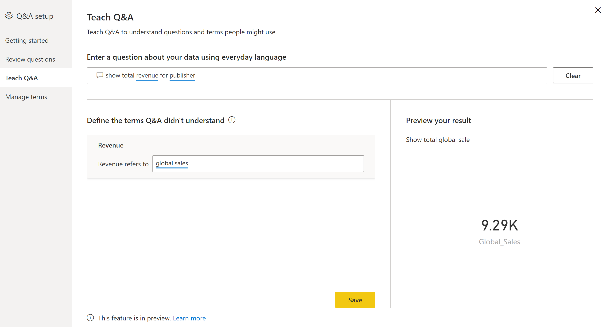

# 用於訓練 Power BI 問與答 (預覽) 的問與答工具簡介

使用 Power BI 問與答「工具」  ，您可以改善使用者的自然語言體驗。 身為設計師或系統管理員，您可以與自然語言引擎互動，並在三個領域中進行改善： 

- 檢閱使用者已詢問的問題。
- 教學 Q&A 以了解問題。
- 管理您已教學 Q&A 的字詞。

除了這些專用工具功能以外，Power BI Desktop 中的 [模型]  索引標籤還提供更多選項：  

- 同義字
- 資料列標籤
- 從問與答隱藏
- 設定語言結構描述 (進階)

## 開始使用問與答工具

問與答工具僅適用於 Power BI Desktop，且目前僅支援匯入模式。

1. 開啟 Power BI Desktop 並使用問與答來建立視覺效果。 
2. 選取視覺效果角落的齒輪圖示。 

    

    [開始使用] 頁面隨即開啟。  

    ![問與答的 [開始使用]](media/q-and-a-tooling-intro/qna-tooling-dialog.png)

### 檢閱問題

選取 [檢閱問題]  以查看租用戶 Power BI 服務中所使用的資料集清單。 [檢閱問題]  頁面也會顯示資料集擁有者、工作區和上次重新整理日期。 您可以從這裡選取資料集，然後查看使用者已詢問的問題。 此資料也會顯示無法辨識的字組。 這裡顯示的所有資料都是過去 28 天內資料。

![問與答的 [檢閱問題]](media/q-and-a-tooling-intro/qna-tooling-review-questions.png)

### 教導問與答

[教學 Q&A]  區段可讓您訓練問與答來辨識字組。 若要開始進行，請鍵入一個問題，其中包含問與答無法辨識的一或多個字組。 問與答會提示您輸入該字詞的定義。 請輸入對應至該字組所代表內容的篩選條件或欄位名稱。 然後，問與答會重新解譯原始問題。 如果您對結果感到滿意，您可以儲存輸入。 若要深入了解，請參閱[教學 Q&A](q-and-a-tooling-teach-q-and-a.md)

### 管理字詞

您從 [教學 Q&A] 區段儲存的任何內容都會顯示在這裡，因此您可以檢閱或刪除已定義的字詞。 您目前無法編輯現有的定義，因此若要重新定義字詞，您必須刪除並重新建立該字詞。

![問與答的 [管理字詞]](media/q-and-a-tooling-intro/qna-manage-terms.png)

### 建議問題

在不進行任何設定下，問與答視覺效果會建議幾個問題，以協助您開始使用。 這些問題是根據資料模型所自動產生的。 在 [建議問題]  中，您可使用自有問題來覆寫自動產生的問題。 

若要開始，請在文字方塊中鍵入所要新增的問題。 在預覽區段中，您可看到結果在問與答視覺效果中的外觀。 

:::image type="content" source="media/q-and-a-tooling-intro/power-bi-qna-suggest-questions.png" alt-text="建議的問與答問題":::
 
選取 [新增]  按鈕來將此問題新增到 [您的建議問題]  。 每個新增的問題都會新增到清單結尾。 問題在問與答視覺效果中顯示的順序都會與其在清單中順序相同。 

:::image type="content" source="media/q-and-a-tooling-intro/power-bi-qna-save-suggest-questions.png" alt-text="儲存建議的問題":::
 
請務必選取 [儲存]  來在問與答視覺效果中顯示建議的問題清單。 

## 其他問與答設定

### 大量同義字

Power BI Desktop 的 [模型]  索引標籤有更多選項可以改善問與答體驗。 

1. 在 Power BI Desktop 中，選取模型檢視。

2. 選取一個欄位或資料表以顯示 [屬性]  窗格。  此窗格會顯示在畫布的右側，並列出數個問與答動作。 其中一個選項是 [同義字]  。 在 [同義字]  方塊中，您可以快速定義所選資料表或欄位的替代項目。 您也可以在 [工具] 對話方塊的 [教學 Q&A]  區段中定義同義字，但在這裡為資料表中的多個欄位定義同義字通常會更快。

    ![問與答 [模型] 窗格的同義字](media/q-and-a-tooling-intro/qna-modelling-pane-synonyms.png)

3. 若要為單一欄位定義多個同義字，請使用逗號來表示下一個同義字。

### 從問與答隱藏

您也可以隱藏欄位和資料表，使其不會出現在問與答結果中。 

1. 在 Power BI Desktop 中，選取模型檢視。

2. 選取一個欄位或資料表以顯示 [屬性]  窗格，然後將 [已隱藏]  設定為 [開啟]  。

    問與答會採用該設定，並確保問與答無法辨識該欄位。 例如，您可能想要隱藏識別碼欄位和外部索引鍵，以避免具有相同名稱的不必要重複欄位。 即使隱藏欄位，您仍然可以將其用於 Power BI Desktop 中問與答以外的視覺效果。

### 設定資料列標籤

資料列標籤可讓您定義哪一個資料行 (或「欄位」  ) 最能識別資料表中的單一資料列。 例如，對於名為「客戶」的資料表，資料列標籤通常是「顯示名稱」。 提供此額外的中繼資料可讓問與答在使用者鍵入「依客戶顯示我的銷售額」時，繪製更有用的視覺效果。 問與答不會將「客戶」視為資料表，而是改用「顯示名稱」，並以橫條圖顯示每個客戶的銷售額。 您只能設定資料列標籤模型檢視。 

1. 在 Power BI Desktop 中，選取模型檢視。

2. 選取一個資料表以顯示 [屬性]  窗格。

3. 在 [資料列標籤]  方塊中，選取一個欄位。

## 設定語言結構描述 (進階)

在 Power BI 中，您完全可以訓練並增強問與答中的自然語言引擎，包括變更基礎自然語言結果的計分和加權。 若要了解做法，請參閱[編輯問與答語言結構描述和新增片語](q-and-a-tooling-advanced.md)。

## 後續步驟

有一些最佳做法可以改善自然語言引擎。 如需詳細資訊，請參閱[問與答最佳做法](q-and-a-best-practices.md)。
