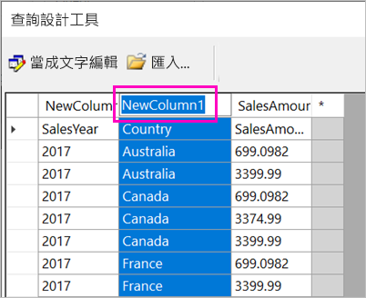
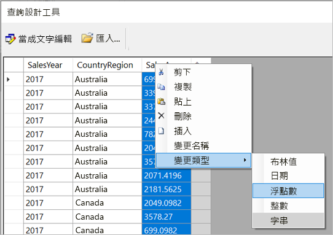
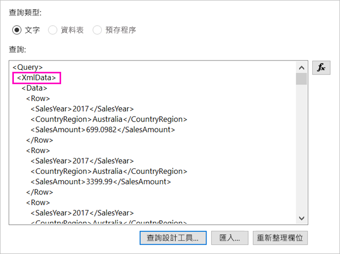

# <a name="enter-data-directly-in-a-paginated-report-in-report-builder---power-bi"></a>直接在報表產生器的編頁報表中輸入資料 - Power BI

[!INCLUDE [applies-to](../includes/applies-to.md)] [!INCLUDE [yes-service](../includes/yes-service.md)] [!INCLUDE [yes-paginated](../includes/yes-paginated.md)] [!INCLUDE [yes-premium](../includes/yes-premium.md)] [!INCLUDE [no-desktop](../includes/no-desktop.md)] 

在本文中，您將了解新版 Microsoft Power BI 報表產生器中的一項功能，此功能可供在 RDL 報表中直接輸入資料作為內嵌資料集。  此功能類似於 Power BI Desktop。 您可以在報表的資料集中直接鍵入資料，或從另一個應用程式 (例如 Microsoft Excel) 貼上資料。 藉由輸入資料來建立資料集之後，您可以如同已建立的任何其他內嵌資料集一樣加以使用。 此外，您可以新增多個資料表，並使用某個資料表作為其他資料表的篩選條件。 對於您可能需要在報表中使用的小型靜態資料集 (例如報表參數)，這項功能特別有用。
 
## <a name="prerequisites"></a>必要條件

- 若要直接在分頁報表中輸入資料，請[下載並安裝 Power BI 報表產生器](https://aka.ms/pbireportbuilder)。 
- 若要將編頁報表儲存至 Power BI 服務，您需要 [Power BI Pro 帳戶](../fundamentals/service-self-service-signup-for-power-bi.md)以及 [Power BI Premium 容量](../admin/service-premium-what-is.md)中工作區的寫入權限。
- 若要將編頁報表儲存至報表伺服器，您需要[編輯 RsReportServer.config 檔案](#upload-the-paginated-report-to-a-report-server)的權限。

## <a name="create-a-data-source-and-dataset"></a>建立資料來源和資料集

在下載並安裝報表產生器之後，您會遵循用來將內嵌資料來源和資料集新增至報表的相同工作流程。 在下列程序中，您會在 [資料來源] 下看到一個新選項：[輸入資料]。  您只需要在報表中設定此資料來源一次。 之後，您可以建立多個輸入資料的資料表來作為個別資料集，其全部使用該單一資料來源。

1. 在 [報表資料] 窗格中，選取[新增] > [資料集]。

    ![報表產生器新增 [資料集] 的螢幕擷取畫面。](media/paginated-reports-enter-data/paginated-new-dataset.png)

1. 在 [資料集屬性] 對話方塊中，選取 [使用內嵌在報表中的資料集]。

1. 選取 [資料來源] 旁的 [新增]。

    ![新增內嵌 [資料來源] 的螢幕擷取畫面。](media/paginated-reports-enter-data/paginated-new-data-source.png)

1. 在 [資料來源屬性] 對話方塊中，選取 [使用內嵌於報表中的連接]。
2. 在 [選取連接類型] 方塊中，選取 [輸入資料] > [確定]。

    ![[輸入資料] 資料來源的螢幕擷取畫面。](media/paginated-reports-enter-data/paginated-data-source-properties-enter-data.png)

1. 回到 [資料集屬性] 對話方塊中，選取 [查詢設計工具]。
2. 在 [查詢設計工具] 窗格中，以滑鼠右鍵按一下資料表，並在其中貼上您的資料。

    ![在 [查詢設計工具] 中輸入資料的螢幕擷取畫面。](media/paginated-reports-enter-data/paginated-enter-data.png)

1. 若要設定資料行名稱，請按兩下每個 [NewColumn] 並鍵入資料行名稱。

    

1. 如果第一個資料列包含來自原始資料的資料行標題，請以滑鼠右鍵按一下該資料列並將其刪除。
    
9. 根據預設，每個資料行的資料類型是字串。 若要變更資料類型，請以滑鼠右鍵按一下資料行標頭 > [變更類型]，並將它設定為另一個資料類型，例如日期或浮點數。

    

1. 當您完成建立資料表時，請選取 [確定]。  

    所產生查詢與您使用 XML 資料來源時看到的查詢相同。 實際上，我們會使用 XML 作為資料提供者。  我們已重新規劃此功能以一併啟用這個案例。

    

12. 在 [資料集屬性] 對話方塊中，選取 [確定]。

13. 您會在 [報表資料] 窗格中看到資料來源和資料集。

    ![[報表資料] 窗格中資料集的螢幕擷取畫面。](media/paginated-reports-enter-data/paginated-report-data-pane.png)

您可以在報表中使用資料集作為資料視覺效果的基礎。 也可以新增另一個資料集，並為其使用相同的資料來源。

## <a name="design-the-report"></a>設計報表

現在已有資料來源和資料集，您可開始建立報表。 下列程序會使用上一區段中的資料來建立簡單報表。

1. 在 [插入] 功能表中，選取 [資料表] > [資料表精靈]。

    :::image type="content" source="media/paginated-reports-enter-data/paginated-table-wizard.png" alt-text="選取 [資料表精靈] 選項的螢幕擷取畫面。":::

1. 選取剛才建立的資料集 > [下一步]。

    :::image type="content" source="media/paginated-reports-enter-data/paginated-choose-dataset.png" alt-text="[選擇資料集] 對話方塊的螢幕擷取畫面。":::

2.  在 [排列欄位] 頁面中，將要分組的欄位從 [可用的欄位] 方塊拖曳至 [資料列群組] 方塊。 在此範例中：

    - CountryRegion
    - SalesYear

3.  將要彙總的欄位從 [可用的欄位] 方塊拖曳至 [值] 方塊。 在此範例中：

    - SalesAmount

    根據預設，報表產生器會加總 [值] 方塊中的欄位，但也可以選擇另一組彙總。

    :::image type="content" source="media/paginated-reports-enter-data/paginated-select-aggregation.png" alt-text="各種可供選擇彙總的螢幕擷取畫面。":::
 
1. 選取 [下一步]。
4.  在 [選擇版面配置] 頁面中，保留所有預設設定，但清除 [展開或摺疊群組]。 一般而言，展開和摺疊群組很實用，但這次我們想要查看所有資料。

5.  選取 [下一步] >  [完成]。 資料表即會顯示於設計介面上。

    :::image type="content" source="media/paginated-reports-enter-data/paginated-design-view-matrix.png" alt-text="[設計] 檢視中報表的螢幕擷取畫面。":::

### <a name="run-the-report"></a>執行報表

若要查看實際值並預覽報表，請加以執行。

1. 在 [首頁] 功能區中，選取 [執行]。

    :::image type="content" source="media/paginated-reports-enter-data/paginated-run-report.png" alt-text="選取 [首頁] 功能區上 [執行] 的螢幕擷取畫面。":::

    您現在會看到值。 矩陣其資料列數目比在 [設計] 檢視中所看到的更多！  您可在儲存到本機電腦或發佈至服務之前，決定將頁面格式化或使用預設設定。

1. 若要查看報表在列印時的外觀，請選取 [整頁模式]。

    :::image type="content" source="media/paginated-reports-enter-data/paginated-select-print.png" alt-text="選取 [整頁模式] 的螢幕擷取畫面。":::

    現在即可看到報表在列印頁面上的外觀。

    :::image type="content" source="media/paginated-reports-enter-data/paginated-print-layout.png" alt-text="[整頁模式] 檢視中報表的螢幕擷取畫面。":::

## <a name="upload-the-paginated-report-to-the-power-bi-service"></a>將編頁報表上傳到 Power BI 服務

現在，Power BI 服務已支援分頁報表，您可以將分頁報表上傳到 Premium 容量。 如需詳細資訊，請參閱[上傳編頁報表](paginated-reports-save-to-power-bi-service.md)。

## <a name="upload-the-paginated-report-to-a-report-server"></a>將編頁報表上傳到報表伺服器

您還可以將編頁報表上傳到 Power BI 報表伺服器或 SQL Server Reporting Services 2016 或 2017 報表伺服器。 在這麼做之前，您需要將下列項目新增至 RsReportServer.config 作為額外的資料延伸模組。 請在進行變更之前備份 RsReportServer.config 檔案，以防您遇到任何問題。

```xml
<Extension Name="ENTERDATA" Type="Microsoft.ReportingServices.DataExtensions.XmlDPConnection,Microsoft.ReportingServices.DataExtensions">
    <Configuration>
        <ConfigName>ENTERDATA</ConfigName>
    </Configuration>
</Extension>
```

編輯完成後，設定檔中的資料提供者清單應該看起來如下：


這樣就大功告成了，您現在可以將使用這項新功能的報表發佈到報表伺服器。

## <a name="next-steps"></a>後續步驟

- [什麼是 Power BI Premium 中的編頁報表？](paginated-reports-report-builder-power-bi.md)
- [什麼是 Power BI 報表伺服器？](../report-server/get-started.md)
