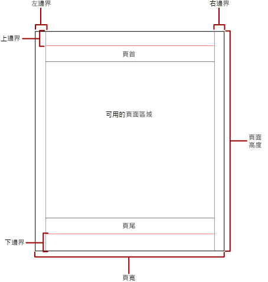

# Power BI 編頁報表中的分頁

 「分頁」  是指報表內的頁數，以及報表項目在這些頁面上的排列方式。 Power BI 編頁報表中的分頁，會根據您用於檢視與傳遞報表的轉譯延伸模組而有所不同。 當您在報表伺服器上執行報表時，報表會使用 HTML 轉譯器。 HTML 會遵循一組特定的分頁規則。 例如，如果您將相同的報表匯出至 PDF，則會使用 PDF 轉譯器，以使用一組不同的規則。 因此，報表會以不同方式進行編頁。 您必須了解用來控制 Power BI 編頁報表中分頁的規則。 之後就能成功設計簡單易讀的報表，並針對您打算用來傳遞報表的轉譯器進行最佳化。  
  
 本主題討論實體頁面大小和報表配置對強制分頁轉譯器如何轉譯報表的影響。 您可以使用 [報表屬性]  窗格、[屬性]  窗格或 [版面設定]  對話方塊來設定屬性，以修改實體頁面大小和邊界，並將報表分割成數個欄位。 按一下報表主體外面的藍色區域，即可存取 [報表屬性]  窗格。 在 [首頁] 索引標籤上按一下 [執行]  ，然後按一下 [執行] 索引標籤上的 [版面設定]  ，即可存取 [版面設定]  對話方塊。  
  
> [!NOTE]  
>  如果您將報表設計成一個頁面寬，但其會轉譯成多個頁面，請檢查報表主體的寬度 (包括邊界) 是否不大於實體頁面大小寬度。 若要避免將空白頁面新增至您的報表，您可以將容器角落向左拖曳，以降低容器大小。  

## 報表主體  
 報表主體是一個矩形容器，在設計介面上會顯示為空白字元。 報表主體可以放大或縮小，以容納其中包含的報表項目。 報表主體不會反映實體頁面大小，且報表主體實際上可以放大超過實體頁面大小的界限來跨多個報表頁面。 某些轉譯器 (例如 Microsoft Excel、Word、HTML 和 MHTML) 會根據頁面內容轉譯放大或縮小的報表。 以這些格式轉譯的報表，會針對螢幕型的檢視進行最佳化，例如在網頁瀏覽器中。 這些轉譯器會在必要時新增垂直分頁符號。  
  
 您可以使用框線色彩、框線樣式和框線寬度來格式化報表主體。 您也可以新增背景色彩和背景影像。  
  
## 實體頁面  
 實體頁面大小是紙張大小。 您為報表指定的紙張大小，會控制報表的轉譯方式。 以強制分頁格式轉譯的報表，會根據實體頁面大小以水平和垂直方式插入分頁符號。 這些分頁符號在以強制分頁檔案格式列印或檢視時，會提供最佳的閱讀體驗。 以非強制分頁格式轉譯的報表會根據實體大小以水平方式插入分頁符號。 同樣地，這些分頁符號在網頁瀏覽器中檢視時，會提供最佳的閱讀體驗。  
  
 根據預設，頁面大小為 8.5 x 11 英吋，但是您可以在 [報表屬性]  窗格或 [版面設定]  對話方塊中變更此大小，或在 [屬性]  窗格中變更 PageHeight 和 PageWidth 屬性。 頁面大小不會放大或縮小以容納報表主體的內容。 如果您想要讓報表顯示在單一頁面上，報表主體中的所有內容都必須符合實體頁面。 如果不符合且您使用的是強制分頁格式，則報表會需要額外的頁面。 如果報表主體放大超過實體頁面的右邊緣，則會以水平方式插入一個分頁符號。 如果報表主體放大超過實體頁面的下邊緣，則會以垂直方式插入一個分頁符號。  
  
 如果您想要覆寫報表中定義的實體頁面大小，您可以針對用來匯出報表的特定轉譯器，使用裝置資訊設定來指定實體頁面大小。 如需完整清單，請參閱 SQL Server Reporting Services 文件中[轉譯延伸模組的裝置資訊設定](https://docs.microsoft.com/sql/reporting-services/device-information-settings-for-rendering-extensions-reporting-services?view=sql-server-2017)。  
  
### 邊界

 邊界會從實體頁面維度的邊緣，向內描繪到指定的邊界設定。 如果報表項目延伸到邊界區域，則會進行裁剪，以避免轉譯重疊的區域。 如果您指定的邊界大小造成頁面水平或垂直寬度等於零，則邊界設定會預設為零。 在 [報表屬性]  窗格或 [版面設定]  對話方塊中指定邊界，或變更 [屬性]  窗格中的 TopMargin、BottomMargin、LeftMargin 和 RightMargin 屬性來指定。 如果您想要覆寫報表中定義的邊界大小，您可以針對用來匯出報表的特定轉譯器，使用裝置資訊設定來指定邊界大小。  
  
 在空間配置給邊界、資料行間距以及頁首和頁尾之後所剩餘的實體頁面區域，稱為「可用的頁面區域」  。 只有當以強制分頁轉譯器格式轉譯及列印報表時，才會套用邊界。 下圖指出實體頁面的邊界和可用頁面區域。  
  
 
  
### 報紙樣式的資料行  

 您的報表可以分割成資料行，例如報紙中的欄。 系統會將資料行視為在相同「實體」  頁面上轉譯的「邏輯」  頁面。 其順序為從左至右、從上到下，並以每個資料行之間的空白字元分隔。 如果報表分割成一個以上的資料行，則每個實體頁面會垂直分割成資料行，而每個資料行都會視為一個邏輯頁面。 例如，假設您在實體頁面上有兩個資料行。 您報表的內容會先填滿第一個資料行，然後填入第二個資料行。 如果報表在前兩個資料行內不完全符合，報表就會在第一個和第二個資料行的下一頁上填滿。 資料行會從左至右、從上到下繼續填滿，直到所有報表項目都轉譯為止。 如果您指定的資料行大小導致水平寬度或垂直寬度等於零，則資料行間距會預設為零。  
  
 您會在 [報表屬性]  窗格或 [版面設定]  對話方塊中指定資料行，或變更 [屬性]  窗格中的 TopMargin、BottomMargin、LeftMargin 和 RightMargin 屬性來指定。 如果您想要使用未定義的邊界大小，您可以針對要匯出報表的特定轉譯器，使用裝置資訊設定來指定邊界大小。 只有當您以 PDF 或影像格式轉譯和列印報表時，才會套用資料行。 下圖指出頁面中包含資料行的可用頁面區域。  
  

  
## 分頁符號和頁面名稱

 當報表具有頁面名稱時，報表可能會更容易閱讀，且其資料會更易於進行稽核與匯出。 Reporting Services 提供報表的屬性；資料表、矩陣和清單資料區域；群組；報表中的矩形用於控制分頁、重設頁碼，並在分頁符號上提供新的報表頁面名稱。 不論報表轉譯的格式為何，這些功能都可以增強報表，但在將報表匯出至 Excel 活頁簿時特別有用。

> [!NOTE]
> 資料表、矩陣和清單資料區域在本質上都是同類型的資料區域：*tablix*。 因此，您可能會遇到該名稱。 

 InitialPageName 屬性會提供報表的初始頁面名稱。 如果報表不包含分頁符號的頁面名稱，則初始頁面名稱會用於分頁符號所建立的所有新頁面。 您不需要使用初始頁面名稱。  
  
 轉譯的報表可以為分頁符號所造成新頁面提供新頁面名稱。 若要提供頁面名稱，您可以設定資料表、矩陣、清單、群組或矩形的 PageName 屬性。 您不需要在中斷位置指定頁面名稱。 如果您未這麼做，則會改用 InitialPageName 的值。 如果 InitialPageName 也是空白，則新頁面將沒有名稱。  
  
 資料表、矩陣和清單資料區、群組和矩形都支援分頁符號。  
  
 分頁符號包含下列屬性：  
  
- **BreakLocation** 會針對啟用分頁的報表項目提供中斷位置：開頭、結尾或開始和結束。 在群組上，BreakLocation 可以位於群組之間。  
  
- **Disabled** 指出分頁符號是否套用至報表項目。 如果此屬性評估為 True，則會忽略分頁符號。 這個屬性可用來在執行報表時，根據運算式以動態方式停用分頁符號。  
  
- **ResetPageNumber** 指出當分頁符號出現時，是否應將頁碼重設為 1。 如果此屬性評估為 True，則會重設頁碼。  
  
 您可以在 [Tablix 屬性]  、[矩形屬性]  或 [群組屬性]  對話方塊中設定 BreakLocation 屬性，但您必須在 [報表產生器屬性] 窗格中設定 Disabled、ResetPageNumber 和 PageName 屬性。 如果 [屬性] 窗格中的屬性是依類別目錄來組織，則您會在 [PageBreak]  類別目錄中找到屬性。 針對群組，[PageBreak]  類別目錄位於 [群組]  類別目錄內。  
  
 您可以使用常數和簡單或複雜運算式來設定 Disabled 和 ResetPageNumber 屬性的值。 不過，您不能使用具有 BreakLocation 屬性的運算式。 如需撰寫和使用運算式的詳細資訊，請參閱 [Power BI 報表產生器中的運算式](report-builder-expressions.md)。  
  
 在您的報表中，您可以使用 **Globals** 集合來撰寫參考目前頁面名稱或頁碼的運算式。 如需詳細資訊，請參閱報表產生器和 Reporting Services 文件中的[內建全域和使用者參考](https://docs.microsoft.com/sql/reporting-services/report-design/built-in-collections-built-in-globals-and-users-references-report-builder?view=sql-server-2017)。
  
### 命名 Excel 工作表索引標籤

 當您將報表匯出至 Excel 活頁簿時，這些屬性會很有用。 當您匯出報表時，請使用 InitialPage 屬性來指定工作表索引標籤名稱的預設名稱，並使用分頁符號和 PageName 屬性為每個工作表提供不同的名稱。 每個新的報表頁面 (由分頁符號定義) 都會匯出至不同工作表，並以 PageName 屬性的值命名。 如果 PageName 為空白，但報表具有初始頁面名稱，則 Excel 活頁簿中的所有工作表都會使用相同名稱，也就是初始頁面名稱。  
  
 如需如何在將報表匯出至 Excel 時使用這些屬性的詳細資訊，請參閱報表產生器和 Reporting Services 文件中的[匯出至 Microsoft Excel](https://docs.microsoft.com/sql/reporting-services/report-builder/exporting-to-microsoft-excel-report-builder-and-ssrs)。  
  
## 後續步驟

- [檢視 Power BI 服務中的編頁報表](../consumer/paginated-reports-view-power-bi-service.md)
- [避免在列印編頁報表時出現空白頁面](../guidance/report-paginated-blank-page.md)
- 有其他問題嗎？ [試試 Power BI 社群](https://community.powerbi.com/)
