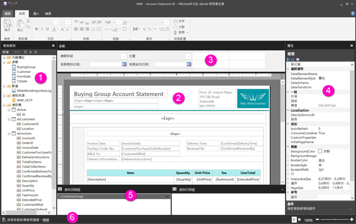

# 在報表設計檢視中瀏覽編頁報表

[!INCLUDE [applies-to](../includes/applies-to.md)] [!INCLUDE [yes-service](../includes/yes-service.md)] [!INCLUDE [yes-paginated](../includes/yes-paginated.md)] [!INCLUDE [yes-premium](../includes/yes-premium.md)] [!INCLUDE [no-desktop](../includes/no-desktop.md)] 

Power BI 報表產生器中的報表設計檢視，是用於建立可以發佈到 Power BI 服務之分頁報表的設計空間。 設計介面位於報表產生器的中心，其周圍是功能區和窗格。 設計介面是您可以加入和組織報表項目的位置。 本文所說明的窗格可用來加入、選取並組織報表資源，以及變更報表項目屬性。  

1. [[報表資料] 窗格](#1-report-data-pane) 
2. [[報表設計] 介面](#2-report-design-surface)  
3. [[參數] 窗格](#3-parameters-pane) 
4. [[屬性] 窗格](#4-properties-pane) 
5. [群組窗格](#5-grouping-pane) 
6. [目前報表狀態列](#6-current-report-status-bar)  
  
## 1 個 [報表資料] 窗格  
 在 [報表資料] 窗格中，您可以定義報表所需的報表資料和報表資源，然後再設計報表配置。 例如，您可以將資料來源、資料集、導出欄位、報表參數和影像加入至 [報表資料] 窗格。  
  
 當您將項目加入至 [報表資料] 窗格之後，只需要將欄位拖曳到設計介面上的報表項目，就可以控制資料要出現在報表中的位置。  
  
> [!TIP]  
>  如果您將欄位從 [報表資料] 窗格直接拖曳到報表設計介面，而不是將它放置在像是資料表或圖表等資料區域中，當您執行報表時，就只會看到該欄位中資料的第一個值。  
  
 您也可以將內建欄位從 [報表資料] 窗格拖曳到設計介面上。 進行轉譯時，這些欄位會提供有關報表的資訊，例如報表名稱、報表中的總頁數，以及目前的頁碼。  
  
 當您將某個項目加入到報表設計介面時，會自動將一些項目加入到 [報表資料] 窗格。 例如，如果您在報表中內嵌影像，則會將其加入到 [報表資料] 窗格中的 [影像] 資料夾。  
  
> [!NOTE]  
>  您可以使用 [新增] 按鈕，將新的項目新增至 [報表資料] 窗格。 您可以從相同的資料來源或其他資料來源，將多個資料集加入至報表。 若要從相同的資料來源加入新的資料集，請以滑鼠右鍵按一下資料來源 > [加入資料集]。  
  
## 2 個 [報表設計] 介面  
 報表產生器的設計介面是設計報表時的主要工作區域。 若要在報表中放置資料區域、子報表、文字方塊、影像、矩形和線條等報表項目，可以將這些項目從功能區或報表組件庫加入設計介面中。 您可以從這裡對報表項目加入群組、運算式、參數、篩選、動作、可見性和格式。  
  
 也可以變更下列項目：  
  
-   報表主體屬性 (例如框線和填滿色彩)，以滑鼠右鍵按一下設計介面上任何報表項目外部的白色區域，然後選取 [主體屬性]。  
  
-   頁首和頁尾屬性 (例如框線和填滿色彩)，以滑鼠右鍵按一下頁首或頁尾區域中任何報表項目外部的設計介面的白色區域，然後選取 [標頭屬性] 或 [頁尾屬性]。  
  
-   報表本身的屬性 (例如版面設定)，以滑鼠右鍵按一下設計介面周圍的灰色區域，並選擇 [報表屬性]。  
  
-   報表項目的屬性，以滑鼠右鍵按一下報表項目並選取 [屬性]。  
  
### 設計介面大小和列印區域  
設計介面大小可能與您指定來列印報表的頁面大小列印區域不同。 變更設計介面的大小無法變更報表的列印區域。 無論您為報表所設定的列印區域大小為何，完整的設計區域大小都不會變更。 如需詳細資訊，請參閱轉譯行為。 
  
- 若要顯示尺規，請在 [檢視] 索引標籤上選取 [尺規] 核取方塊。  
  
## 3 個 [參數]窗格  
 您可以使用報表參數控制報表資料、將相關的報表連接在一起，以及變更報表呈現方式。 [參數] 窗格提供報表參數的彈性配置。  
  
 深入了解報表參數   
  
## 4 個 [屬性] 窗格
 報表中的每個項目 (包括資料區域、影像、文字方塊和報表主體本身) 都具有相關聯的屬性。 例如，文字方塊的 BorderColor 屬性會顯示文字方塊框線的色彩值，而報表的 PageSize 屬性會顯示報表的頁面大小。  
  
 這些屬性會顯示在 [屬性] 窗格中。 窗格中的屬性會因您所選取的報表項目而有所不同。  
  
- 若要查看 [屬性] 窗格，請移至 [檢視] 索引標籤上 [顯示/隱藏群組] 中的 > [屬性]。  
  
### 變更屬性值  
 在報表產生器中，您可以用許多方式來變更報表項目的屬性：  
  
-   透過選取功能區上的按鈕和清單。  
  
-   變更對話方塊內的設定。  
  
-   變更 [屬性] 窗格內的屬性值。  
  
 對話方塊和功能區會提供最常用的屬性。  
  
 根據屬性，您可以從下拉式清單中設定屬性值、輸入值，或選取 `<Expression>` 即可建立運算式。  
  
### 變更屬性窗格檢視  
 根據預設，顯示在 [屬性] 窗格中的屬性會組織成一些廣泛的類別目錄，例如 [動作]、[框線]、[填滿]、[字型] 和 [一般]。 每個類別目錄都具有一組相關聯的屬性。 例如，下列屬性列於 [字型] 類別目錄中：[Color]、[FontFamily]、[FontSize]、[FontStyle]、[FontWeight]、[LineHeight] 和 [TextDecoration]。 如果您想要，也可以依字母順序排列此窗格中所列的所有屬性。 這樣做會移除這些類別目錄並按照字母順序列出所有屬性，不論類別目錄為何。  
  
 [屬性] 窗格在窗格頂端有三個按鈕：[類別]、[按字母排列] 和 [屬性頁]。 選取 [類別] 和 [按字母排列] 按鈕，可在 [屬性] 窗格檢視之間切換。 選取 [屬性頁] 按鈕，以開啟所選的報表項目的 [屬性] 對話方塊。  
  
  
## 5 個 [群組] 窗格

 群組的用途在於將報表資料組織為視覺階層以及計算總計。 您可以在設計介面和 [群組] 窗格中檢視資料區域內的資料列和資料行群組。 [群組] 窗格具有兩個窗格：[資料列群組] 和 [資料行群組]。 當您選取某個資料區域時，[群組] 窗格就會將該資料區域內的所有群組顯示成階層式清單：子群組會以縮排方式顯示在其父群組底下。  
  
 您可以從 [報表資料] 窗格中拖曳欄位，然後將這些欄位放置在設計介面或 [群組] 窗格中，藉以建立群組。 在 [群組] 窗格中，您可以加入父群組、相鄰群組和子群組、變更群組屬性，以及刪除群組。  
  
 預設會顯示 [群組] 窗格，但您可以藉由清除 [檢視] 索引標籤上的 [群組] 窗格核取方塊將它關閉。[群組] 窗格不適用於圖表或量測計資料區域。  
  
 如需詳細資訊，請參閱群組窗格和了解群組。  
  
## 6 個目前報表狀態列

目前報表狀態列顯示報表連接的伺服器名稱，或者顯示「沒有目前的報表伺服器」。 您可以選取 [連線] 連接到伺服器。

## 後續步驟

[什麼是 Power BI Premium 中的編頁報表？](paginated-reports-report-builder-power-bi.md) 

  
  
