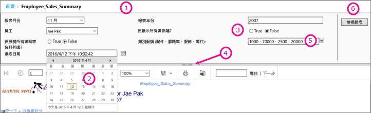
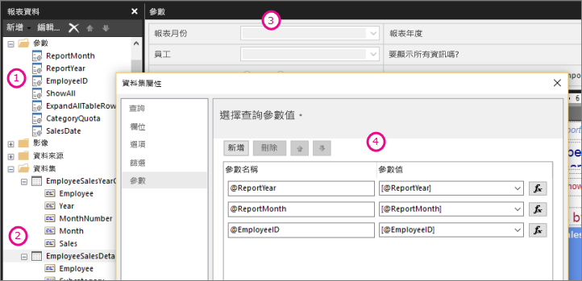

# Power BI 報表產生器中的報表參數

[!INCLUDE [applies-to](../includes/applies-to.md)] [!INCLUDE [yes-service](../includes/yes-service.md)] [!INCLUDE [yes-paginated](../includes/yes-paginated.md)] [!INCLUDE [yes-premium](../includes/yes-premium.md)] [!INCLUDE [no-desktop](../includes/no-desktop.md)] 

此主題描述 Power BI 報表產生器報表參數的常見使用案例、您可以設定的屬性等。 報表參數可讓您控制報表資料、將相關的報表連接在一起，以及變更報表呈現方式。 您可以在您於報表產生器中建立的分頁報表中使用報表參數。

##  參數的常見使用案例

 以下提供部分最常使用參數的方式。  
  
**控制分頁報表資料**
  
- 透過撰寫包含變數的資料集查詢，在資料來源篩選分頁報表資料。  
  
- 可讓使用者指定值，以自訂分頁報表中的資料。 例如，提供兩個參數，做為銷售資料的開始日期和結束日期。  
  
**變更報表呈現方式**
  
- 可讓使用者指定值，協助自訂報表的外觀。 例如，提供 Boolean 參數，指出要展開或摺疊資料表中的所有巢狀資料列群組。  
  
- 在運算式中包含參數，讓使用者自訂報表資料和外觀。  
  
##  檢視具有參數的報表

當您檢視具有參數的報表時，報表檢視器工具列會顯示每一個參數，讓您能夠以互動的方式指定值。 下圖顯示使用參數 @ReportMonth、@ReportYear、@EmployeeID、@ShowAll、@ExpandTableRows、@CategoryQuota 及 @SalesDate 之報表的參數區域。  

  
1. **參數窗格** ：報表檢視器工具列會顯示每個參數的提示和預設值。 您可以在參數窗格中自訂參數的配置。  
  
2. **@SalesDate 參數** ：@SalesDate 參數的資料類型是 **DateTime** 。 文字方塊旁會顯示 [選取日期] 提示。 若要修改日期，請在文字方塊中輸入新日期，或是使用行事曆控制項。  
  
3. **@ShowAll 參數**@ShowAll 參數的資料類型是 **Boolean (布林值)** 。 使用選項按鈕可指定 **True** 或 **False** 。  
  
4. **顯示或隱藏參數區域控點** ：在報表檢視器工具列上，按一下此箭頭可顯示或隱藏參數窗格。  
  
5. **@CategoryQuota 參數**@CategoryQuota 參數的資料類型是 **Float (浮點數)** ，因此會接受一個數值。  @CategoryQuota 設為允許多個值。  
  
6. **檢視報表** ：輸入參數值之後，您可以按一下 [檢視報表] 以執行報表。 如果所有參數都有預設值，則報表會在第一次檢視時自動執行。  
  
##  建立參數

您可以利用幾個不同方式建立報表參數。
  
> [!NOTE]
>  並非所有的資料來源都支援參數。
  
**具有參數的資料集查詢或預存程序**
  
 新增包含變數的資料集查詢，或者包含輸入參數的資料集預存程序。 每個變數或輸入參數都會建立資料集參數，每個資料集參數都會建立報表參數。  
  

  
 報表產生器的此圖顯示：  
  
1.  [報表資料] 窗格中的報表參數。  
  
2.  具有參數的資料集。  
  
3.  [參數] 窗格。  
  
4.  [資料集屬性] 對話方塊中所列的參數。  
  
**手動建立參數**
  
從 [報表資料] 窗格手動建立參數。 您可以設定報表參數，讓使用者能夠以互動的方式輸入值，協助自訂報表的內容或外觀。 您也可以設定報表參數，讓使用者無法變更預先設定的值。  
  
> [!NOTE]  
>  由於參數是在伺服器上獨立管理，因此使用新參數設定重新發佈主要報表，不會覆寫報表上現有的參數設定。  

### 參數值

 下列是在報表中選取參數值的選項。  
  
- 從下拉式清單選取單一參數值。  
  
- 從下拉式清單選取多個參數值。  
  
- 從下拉式清單選取一個參數的值，它會決定其他參數下拉式清單中可用的值。 這些是串聯參數。 串聯參數可讓您後續從數千個值篩選出能夠管理的參數值數目。 如需詳細資訊，請參閱[在編頁報表中使用串聯參數](../guidance/paginated-report-cascading-parameter.md)。
  
- 不需要先選取參數值就能執行報表，因為已經為參數建立預設值。  
  
##  報表參數屬性

 您可以使用 [報表屬性] 對話方塊來變更報表參數屬性。 下表摘要說明您可以針對每個參數設定的屬性：  
  
|屬性|描述|  
|--------------|-----------------|  
|Name|輸入區分大小寫的參數名稱。 此名稱必須以字母開頭，可以包含字母、數字和底線 (_)。 名稱不能有空格。 若是自動產生的參數，此名稱會與資料集查詢中的參數相同。 根據預設，手動建立的參數類似於 ReportParameter1。|  
|Prompt|在報表檢視器工具列上顯示於參數旁邊的文字。|  
|資料類型|報表參數的資料類型必須是下列其中一種：   **Boolean** (布林值)。 使用者會從選項按鈕中選取 True 或 False。   **DateTime** 。 使用者會從日曆控制項中選取日期。   **Integer** (整數)。 使用者會在文字方塊中輸入值。   **Float** (浮點數)。 使用者會在文字方塊中輸入值。   **Text** (文字)。 使用者會在文字方塊中輸入值。   針對某個參數定義了可用的值之後，使用者就可以從下拉式清單中選擇值，即使資料類型是 **DateTime** 也一樣。|  
|允許空白值|如果參數值可為空字串或空白，則選取此選項。   如果您為參數指定有效值，而且希望空白值是其中一個有效值，則必須將它納入做為您指定的其中一個有效值。 選取此選項不會自動將空白包含在可用值中。|  
|允許 null 值|如果參數值可為 null，則選取此選項。   如果您為參數指定有效值，而且希望 null 是其中一個有效值，則必須將 null 納入做為您指定的其中一個有效值。 選取此選項不會自動將 Null 包含在可用值中。|  
|允許多個值|提供可用的值，建立可供使用者選擇的下拉式清單。 這是確保資料集查詢中只會提交有效值的好方法。   如果參數值可以是顯示在下拉式清單中的多個值，則選取此選項。 不允許 Null 值。 選取此選項時，系統會將核取方塊加入到參數下拉式清單內可用值的清單中。 清單的頂端包含 **[全選]** 核取方塊。 使用者可以檢查想要的值。   如果提供值的資料迅速改變，則使用者看見的清單可能不是最新的。|  
|可見|選取此選項來在執行時於報表頂端顯示報表參數。 此選項可讓使用者在執行階段選取參數值。|  
|Hidden|選取此選項來隱藏已發行報表中的報表參數。 您仍然可以在報表 URL、訂閱定義或報表伺服器上設定報表參數值。|  
|內部|選取此選項來隱藏報表參數。 已發行報表中的報表參數只能在報表定義中檢視。|  
|可用值|如果您已為參數指定可用的值，則有效值會固定顯示為下拉式清單。 例如，如果您為 **DateTime** 參數提供可用的值，則參數窗格中會出現日期的下拉式清單，而不是行事曆控制項。   為確保報表和子報表之間的值清單一致，您可以在資料來源上設定一個選項，針對與資料來源相關聯的資料集中的所有查詢使用單一交易。   **安全性注意事項** ：在任何包含 **Text** 資料類型參數的報表中，請務必使用可用值清單 (也稱為有效值清單)，並確保任何執行報表的使用者都只有檢視報表中資料所需權限。|  
|預設值|設定來自查詢或靜態清單的預設值。   如果每個參數都有預設值，則報表會在第一次檢視時自動執行。|  
|進階|設定報表定義屬性 **UsedInQuery** ，其值指出此參數直接或間接影響報表中的資料。   **自動判斷何時重新整理**  當您想要讓報表處理器判斷此值的設定時，請選擇此選項。 如果報表處理器偵測到一個資料集查詢，且其中包含一個這個參數的直接或間接參照，或者如果報表中有子報表，則此值為 **True** 。   **永遠重新整理**  在資料集查詢或參數運算式中直接或間接使用報表參數時，請選擇此選項。 此選項會將 **UsedInQuery** 設定為 True。   **永不重新整理**  不在資料集查詢或參數運算式中直接或間接使用報表參數時，請選擇此選項。 此選項會將 **UsedInQuery** 設定為 False。   **警告** ：請小心使用 [永不重新整理]。 在報表伺服器上， **UsedInQuery** 用於協助控制報表資料與已轉譯之報表的快取選項，以及快照集報表的參數選項。 如果未正確設定 **[永不重新整理]** ，您可能會快取不正確的報表資料或報表，或者使快照集報表的資料不一致。 |  
  
##   資料集查詢  
 若要篩選資料集查詢中的資料，您可以加入限制子句，透過指定結果集中要包含或排除的值限制擷取的資料。  
  
 使用資料來源的查詢設計工具，可協助您建立參數化查詢。  
  
-   針對 Transact-SQL 查詢，不同資料來源支援不同的參數語法。 支援的範圍是查詢中依據位置或名稱識別的參數。 在關聯式查詢設計工具中，您必須為篩選選取參數選項，才能建立參數化查詢。   
  
-   針對以多維度資料來源 (例如 Microsoft SQL Server Analysis Services) 為基礎的查詢，您可以指定是否要根據您在查詢設計工具中指定的篩選建立參數。 
  
##   已發佈報表的參數管理  
 當您設計報表時，報表參數會儲存在報表定義中。 當您發行報表時，報表參數會儲存，並且與報表定義分開管理。  
  
 在已發行的報表中，可以使用下列項目：  
  
-   **報表參數屬性。** 直接在報表伺服器上，從報表定義個別變更報表參數值。  
  
-   **報表訂閱。** 您可以指定參數值來篩選資料，並透過訂用帳戶傳遞報表。 
  
 若重新發行了報表定義，將會保留已發佈之報表的參數屬性。 如果報表定義和報表同樣重新發行，且參數名稱和資料類型保持相同，則會保留屬性設定。 如果您加入或刪除報表定義中的參數，或變更現有參數的資料類型或名稱，您就可能需要變更已發行報表的參數屬性。  
  
 並非所有的參數都可以在任何情況下修改。 如果報表參數從資料集查詢取得預設值，無法針對已發行的報表修改該值，也無法在報表伺服器上修改該值。 執行階段使用的值會在查詢執行時決定，如果是以運算式為基礎的參數，則會在評估運算式時決定。  
  
 報表執行選項會影響處理參數的方式。 以快照集執行的報表無法使用從查詢所衍生的參數，除非查詢包括參數的預設值。  
  
##   訂閱的參數  
 您可以定義視需要或快照集報表的訂閱，並指定在訂閱處理過程中要使用的參數值。  
  
-   **隨選報表。**  您可以為隨選報表中所列的每個參數，指定不同於發佈值的參數值。 例如，假設您有一個呼叫服務報表，使用 *Time Period* 參數傳回客戶在目前日期、星期、或月份的服務要求。 如果報表的預設參數值設定為 **today** ，您的訂閱可以使用不同的參數值 (例如， **week** 或 **month** )，以產生包含每週或每月數字的報表。  
  
## 後續步驟

- [什麼是 Power BI Premium 中的編頁報表？](paginated-reports-report-builder-power-bi.md)  
- [在分頁報表中使用串聯參數](../guidance/paginated-report-cascading-parameter.md)
