# 建立以 Power BI 共用資料集為基礎的編頁報表

[!INCLUDE [applies-to](../includes/applies-to.md)] [!INCLUDE [yes-service](../includes/yes-service.md)] [!INCLUDE [yes-paginated](../includes/yes-paginated.md)] [!INCLUDE [yes-premium](../includes/yes-premium.md)] [!INCLUDE [yes-desktop](../includes/yes-desktop.md)] 

您可以使用您在 Power BI Desktop 中建立的資料集，作為 Power BI 報表產生器編頁報表的資料來源。 想像下列情節：您已在 Power BI Desktop 中建立 Power BI 報表。 您花了很多時間來設計資料模型，然後建立美觀的 Power BI 報表，其中包含各種絕佳的視覺效果。 報表具有包含多個資料列的矩陣，因此您必須捲動才能查看全部。 報表讀者想要一個他們可以列印出來的報表，以顯示該矩陣中的所有資料列。 Power BI 編頁報表可以執行此作業：將執行的資料表或矩陣列印到多個頁面，頁面中包含頁首和頁尾，以及您設計的完美頁面配置。 它可補充 Power BI Desktop 報表。 您希望它們以完全相同的資料為基礎，而不會產生不一致的情況，因此您可以使用相同的資料集。

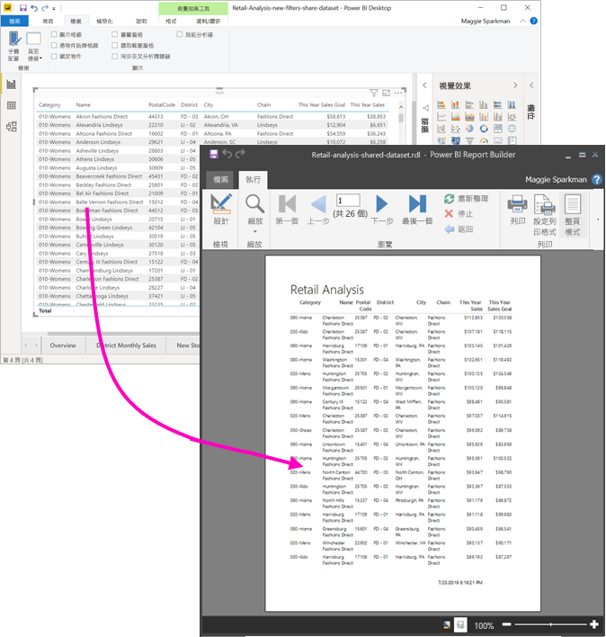

此資料集不一定要位於 Premium 容量的工作區中，因此您不需要是該工作區的成員。 您只需要擁有資料集的[建置權限](../connect-data/service-datasets-build-permissions.md)。 若要發佈編頁報表，您需要 Power BI Pro 授權。 針對 Premium 容量中的工作區，您還需要至少一個「參與者」角色。

## 必要條件

以下是您在 Power BI 報表產生器中使用共用資料集時，需要和不需要的項目清單。

- Power BI 報表產生器。 [下載及安裝 Power BI 報表產生器](https://aka.ms/pbireportbuilder)。
- 若要存取 Power BI 資料集，您需要有該資料集的建置權限。 請參閱[建置權限](../connect-data/service-datasets-build-permissions.md)。
- 您不需要 Power BI Pro 授權，即可在報表產生器中建立編頁報表。 
- 您需要有 Power BI Pro 授權，才能發佈編頁報表。 針對 Premium 容量中的工作區，您還需要至少一個「參與者」角色。 
- 選擇性：如果您想要遵循本文的指示進行，請下載 Power BI Desktop [零售分析範例 .pbix](https://download.microsoft.com/download/9/6/D/96DDC2FF-2568-491D-AAFA-AFDD6F763AE3/Retail%20Analysis%20Sample%20PBIX.pbix) 檔案，在 Power BI Desktop 中開啟該檔案，然後新增包含許多資料行的資料表。 在 [格式] 窗格中，關閉 [總計]。 然後將它發佈到 Power BI 服務中的工作區。

    ![[總計] 關閉](media/report-builder-shared-datasets/power-bi-desktop-totals-off.png)

## 連接到 Power BI 資料集

1. 開啟 Power BI 報表產生器。
1. 選取報表產生器右上角的 [登入]，以登入您的 Power BI 帳戶。
1. 在 [報表資料] 窗格中，選取 [新增] > [Power BI 資料集連線]。

    ![在 [報表資料] 窗格中新增資料集](media/report-builder-shared-datasets/power-bi-report-builder-new-dataset.png)

    > [!NOTE]
    > 您無法使用報表產生器的 [資料表精霊]、[矩陣精霊] 或 [圖表精霊]，針對 Power BI 資料集建立資料來源或資料集。 在建立它們之後，您可以使用精霊來建立以其為基礎的資料表、矩陣或圖表。

1. 搜尋或瀏覽其所在的資料集或工作區 > [選取]。
    報表產生器填入資料集名稱。

    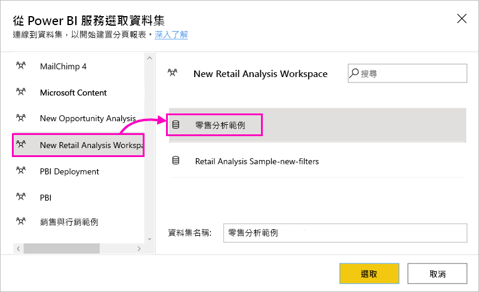
    
1. 此資料集會列在 [報表資料] 窗格的 [資料來源] 底下。

    ![[報表資料] 窗格中 [資料來源] 底下的資料集](media/report-builder-shared-datasets/power-bi-report-builder-data-source.png)

    請記住，您可以在相同的編頁報表中連接到多個 Power BI 資料集和其他資料來源。

## 取得資料集的 DAX 查詢

您想要 Power BI 報表和報表產生器報表中的資料都相同時，連接到資料集並不足夠。 您還需要建置在該資料集基礎之上的查詢。

### 影片：取得 DAX 查詢

在下列影片中，Chris Finlan 會示範如何為編頁報表取得所需的 DAX。

<iframe width="400" height="450" src="https://www.youtube.com/embed/NfoOK4QRkhI" frameborder="0" allowfullscreen></iframe>

### 取得 DAX 查詢的步驟

以下是取得查詢的步驟。

1. 在 Power BI Desktop 中開啟 Power BI 報表 (.pbix)。
1. 確定您的報表中有一個資料表，其中包含您在編頁報表中所需的所有資料。 資料表必須符合這兩項需求：
    - 必須是二維資料表，而不是矩陣或其他視覺效果。 如果不是資料表，請立即將其轉換成資料表，逐一完成後列的效能分析器步驟，再將其轉換回所要的視覺效果。
    - 您必須在數值欄位使用「預先定義的量值」。 其旁邊有一個計算機符號。 深人了解[建立量值](../transform-model/desktop-measures.md)。 

        

1. 在 [檢視] 功能區中，選取 [效能分析器]。

    ![開啟 [效能分析器]](media/report-builder-shared-datasets/power-bi-performance-analyzer.png)

1. 在 [效能分析器] 窗格中，選取 [開始錄製]，然後選取 [重新整理視覺效果]。

    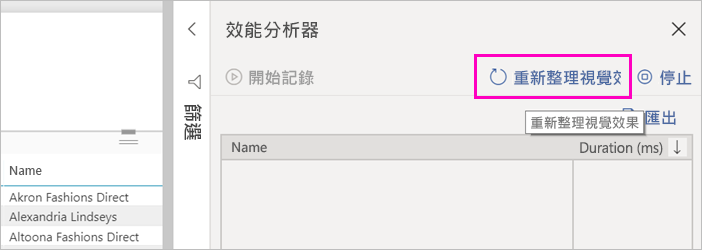

1. 展開資料表名稱旁邊的加號 ( **+** )，然後選取 [複製查詢]。 此查詢是 Power BI 報表產生器中資料集所需的 DAX 公式。

    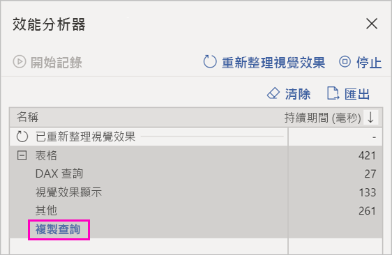

## 使用查詢建立資料集

1. 回到 Power BI 報表產生器。
1. 以滑鼠右鍵按一下 [資料來源] 底下的資料集，然後選取 [新增資料集]。

    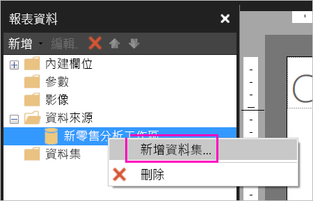

1. 在 [資料集屬性] 中為其命名，然後選取 [查詢設計工具]。

4. 確定已選取 [DAX] 並取消選取 **設計模式** 圖示。

    ![報表產生器的 [查詢設計工具]](media/report-builder-shared-datasets/power-bi-report-builder-query-designer.png)

1. 在上方的方塊中，貼上您從 Power BI Desktop 複製的查詢。

    > [!NOTE]
    > 若查詢包含 TOPN 函數，請將其從查詢中刪除。

1. 選取 [執行查詢] (紅色驚嘆號 (!))，以確定您的查詢能夠運作。 

    

    您會在下方方塊中看到查詢的結果。

    

1. 選取 [確定]。

    您會在 [資料集屬性] 對話方塊 [查詢] 視窗中看到您的查詢。

    ![[資料集屬性] 對話方塊](media/report-builder-shared-datasets/power-bi-report-builder-dataset-properties.png)

1. 選取 [確定]。

    現在，您會在 [報表資料] 窗格中看到新的資料集，其中包含資料集欄位的清單。

    ![[報表資料] 窗格中的資料集](media/report-builder-shared-datasets/power-bi-report-builder-dataset.png)

## 在報表中建立資料表

建立資料表的其中一個快速方式是使用 [資料表精靈]。

1. 在 [插入] 功能區中，選取 [資料表] > [資料表精靈]。

    ![啟動 [資料表精靈]](media/report-builder-shared-datasets/power-bi-report-builder-table-wizard.png)

1. 選擇您使用 DAX 查詢所建立的資料集 > [下一步]。

    

1. 若要建立一般資料表，請在 [可用的欄位] 中選取您所想要欄位。 您可以選取您想要的第一個欄位，按住 Shift 鍵，然後選取最後一個欄位，以一次選取多個欄位。

    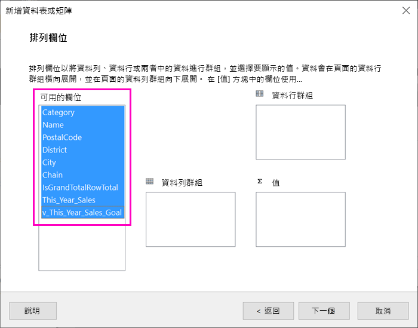

1. 將欄位拖曳至 [值] 方塊 > [下一步]。

    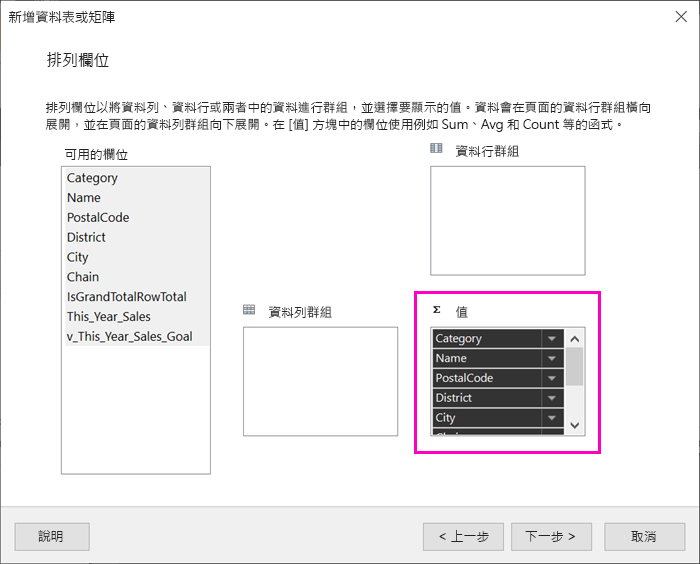

1. 選擇您想要的版面配置選項 > [下一步]。

1. 選取 [完成] 。
    您會在設計檢視中看到您的資料表。

    ![[報表設計] 檢視](media/report-builder-shared-datasets/power-bi-report-builder-design-view.png)

1. 選取 [按一下以新增標題]，然後新增標題。

1. 選取 [執行] 來預覽報表。

    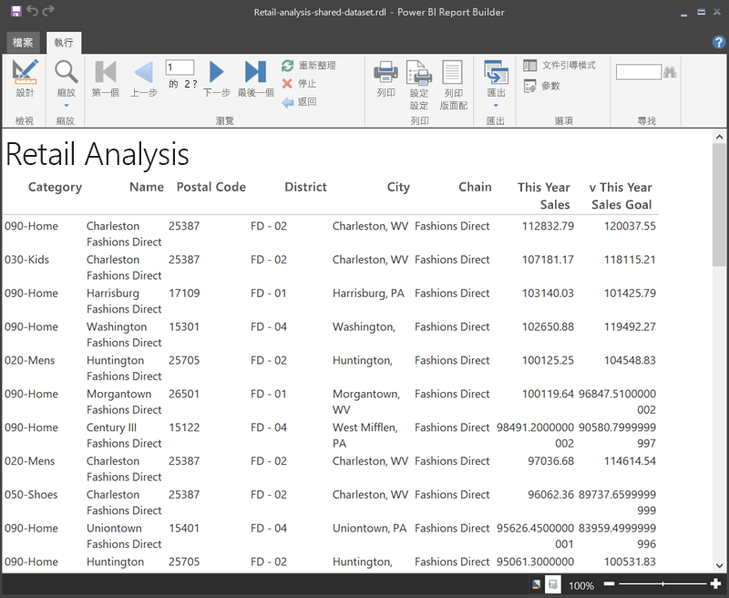

1. 選取 [整頁模式] 來查看報表的列印效果。 

    此報表的版面配置需要進行一些工作。 它有 54 頁，因為資料行和邊界讓資料表變成兩個頁面的寬度。

    ![報表的 [整頁模式]](media/report-builder-shared-datasets/power-bi-report-builder-print-layout-2-p1-p2.png)

## 將報表格式化

您有數個格式設定選項，可將資料表調整至一頁大小。 

1. 您可以在 [屬性] 窗格中縮小頁面的邊界。 如果您沒有看到 [屬性] 窗格，請在 [檢視] 功能區中選取 [屬性] 核取方塊。

1. 選取報表，而不是資料表或標題。
1. 在 [報表屬性] 窗格的 [頁面] 底下，展開 [邊界]，然後將每一個變更為 [0.75in]。

    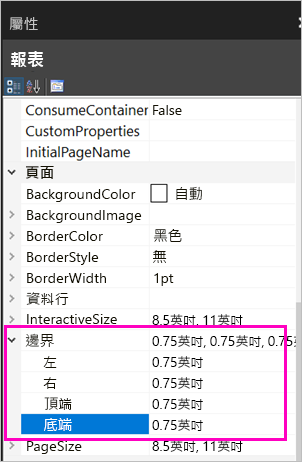

1. 您也可以讓資料行變窄。 請選取資料行框線，並將右側向左拖曳。

    

1. 另一個選項是確保數值的格式正確。 請選取含有數值的資料格。 
    > [!TIP]
    > 當您選取其他資料格時，可以藉由按住 Shift 鍵來一次格式化多個資料格。

    

1. 在 [常用] 功能區的 [數字] 區段中，將 [預設] 格式變更為 [貨幣] 之類的數字格式。

    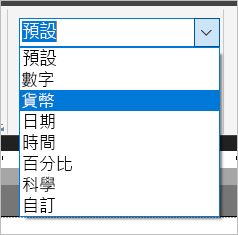

1. 將 [預留位置] 樣式變更為 [範例值]，您就可以在資料格中查看格式設定。 

    

1. 如果適當的話，在 [數字] 區段中減少小數，以節省更多空間。

### 去除空白頁面

即使您已縮小邊界和資料表資料行，最終仍然可能會導致每個其他頁面都是空白。 為什麼？ 因為數學運算。 

當您合計所設定的頁面邊界，加上報表「本文」的寬度時，它必須小於報表格式的寬度。

例如，假設您的報表具有 8.5" X 11" 格式，且您已將側邊界設定為各 0.75。 兩個邊界合在一起會變成 1.5"，因此本文的寬度必須小於 7"。

1. 選取報表設計介面的右邊緣並拖曳，使其小於尺規上的所需數字。 

    > [!TIP]
    > 您可以在 [本文] 屬性中更精確地加以設定。 請在 [大小] 底下設定 [寬度] 屬性。

    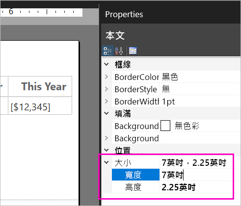

1. 選取 [執行] 以預覽您的報表，並確定您已去除空白頁面。 此報表現在只有 26 個頁面，而不是原始的 54。 成功！

    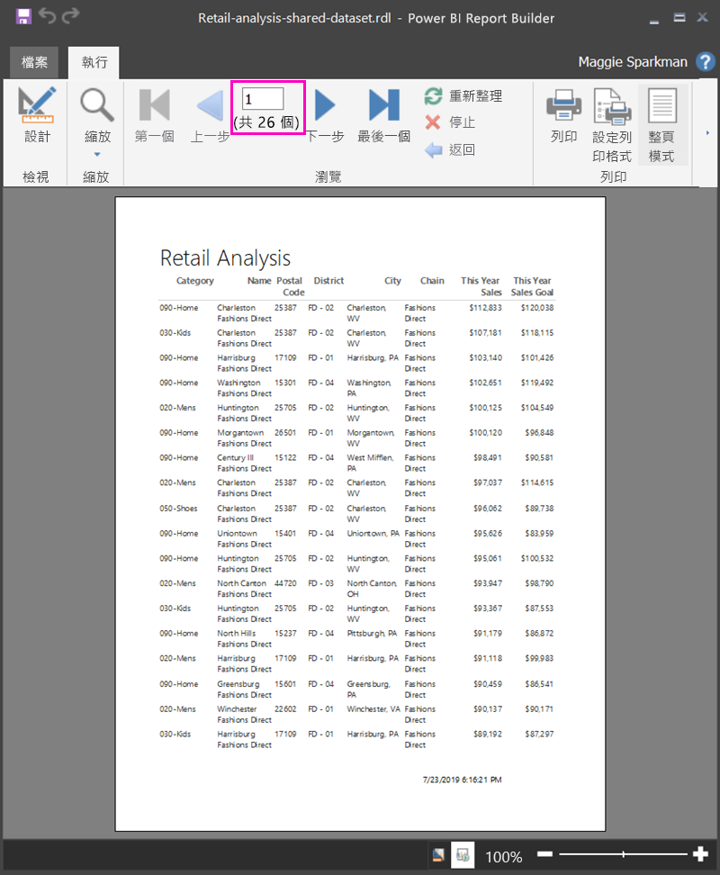

## 限制與考量 

- 對於使用即時連線連接到 Analysis Services 的資料集，您可以使用基礎 Analysis Services 連線 (而不是共用資料集) 來直接連接。
- 若您想要使用在 Power BI 報表產生器中使用 DirectQuery 的 Power BI 資料集，即使您不打算在報表中呈現量值，資料集也必須包含量值。 若沒有此量值，資料集將不會傳回適當的資料結果。
- 具有已升級或已認證簽署的資料集會出現在可用資料集清單中，但不會將其標記為可用資料集。 
- 您無法在「應用程式擁有資料」案例中，內嵌以 Power BI 共用資料集為基礎的編頁報表。

## 後續步驟

- [什麼是 Power BI Premium 中的編頁報表？](paginated-reports-report-builder-power-bi.md)
