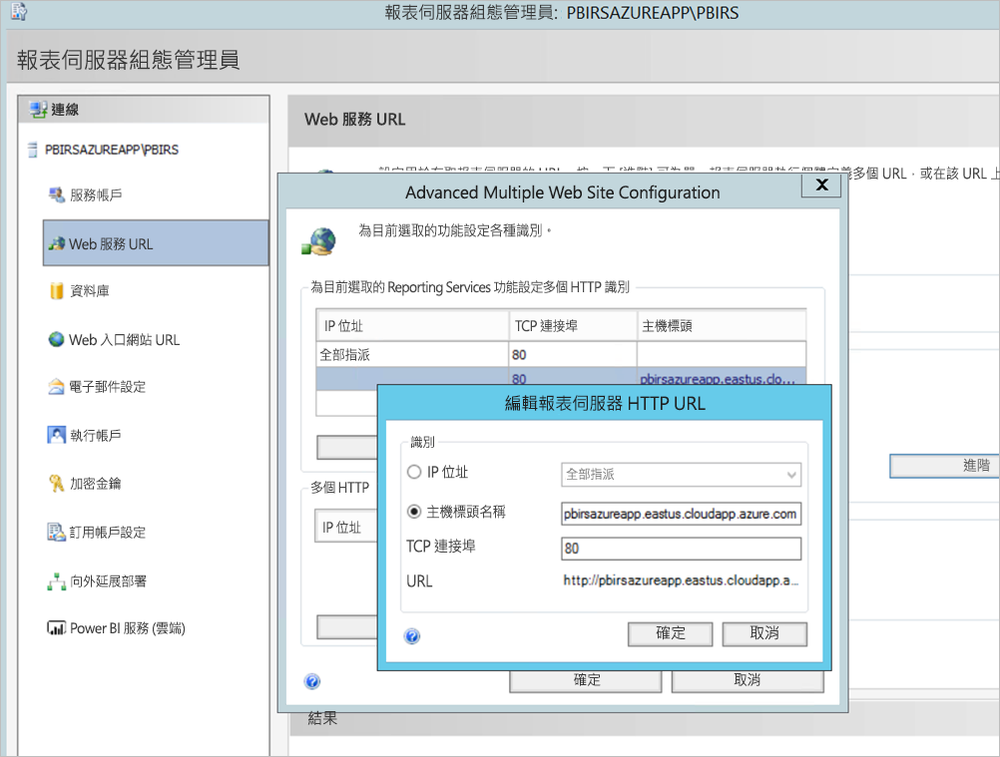
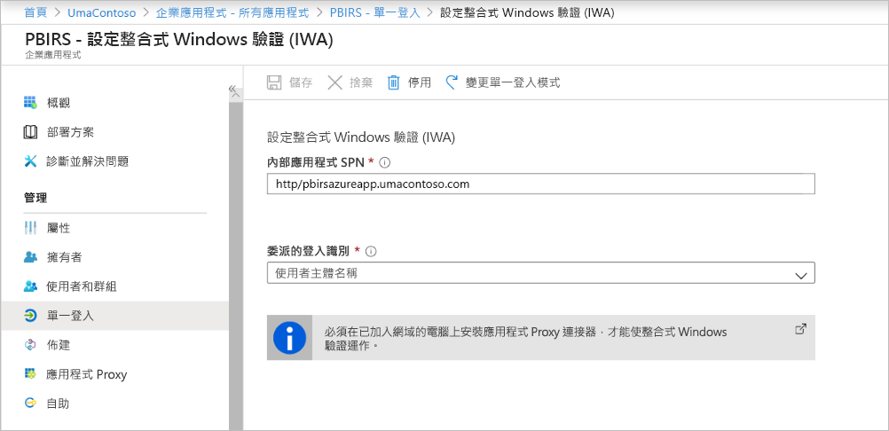
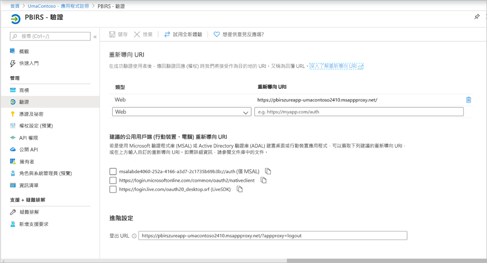
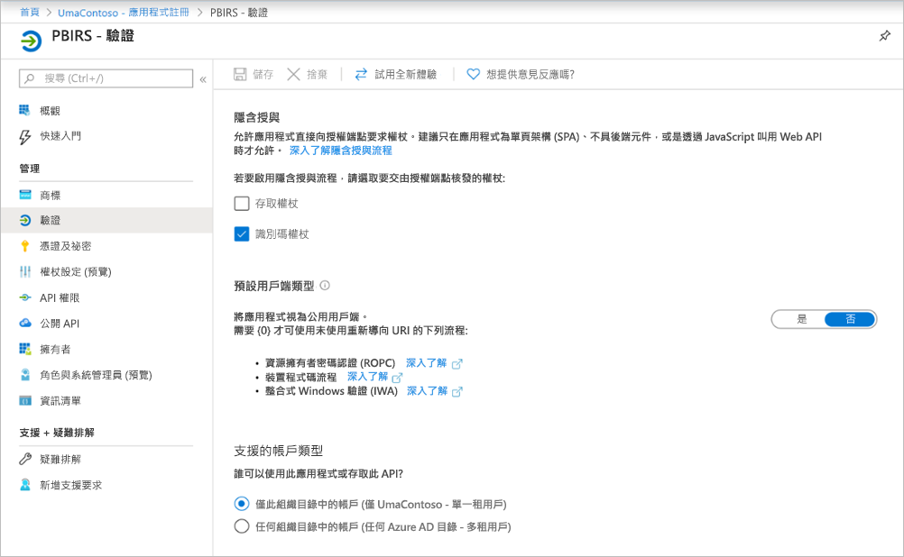
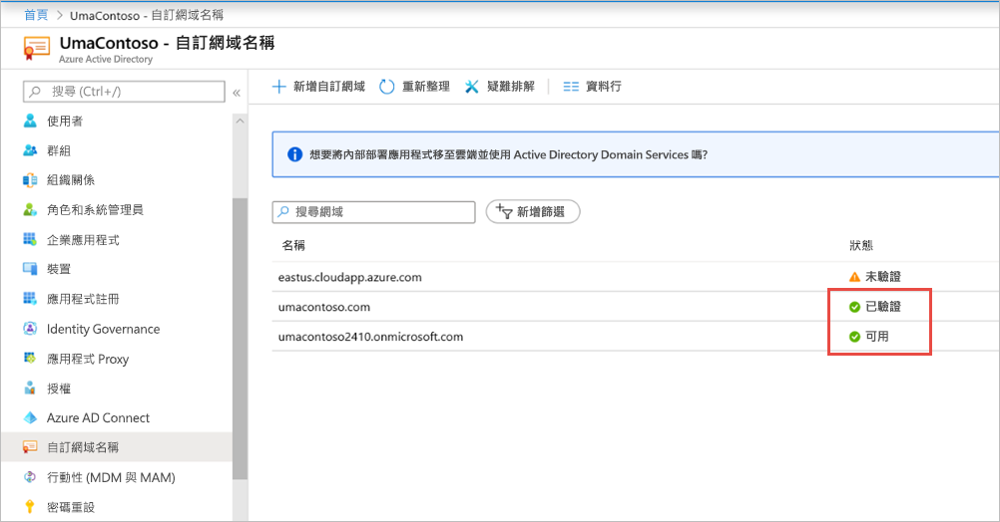
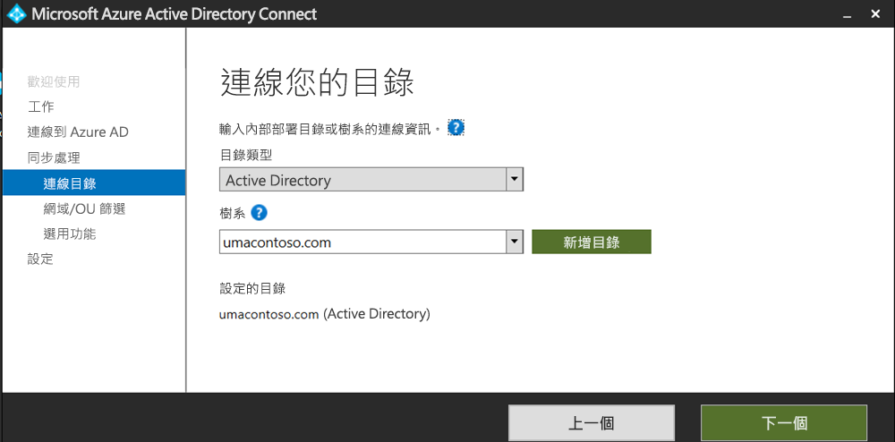
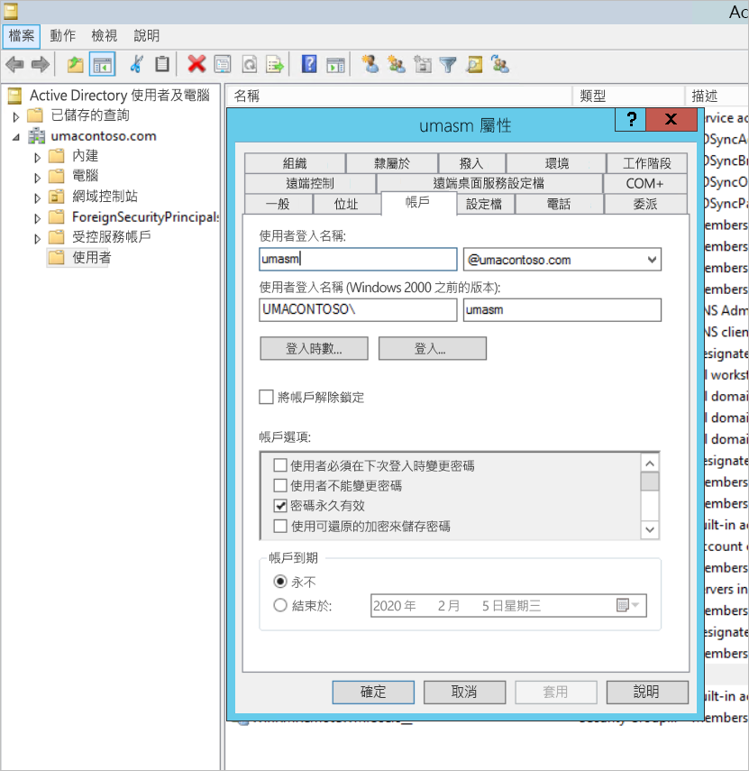
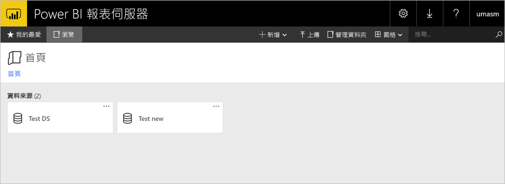
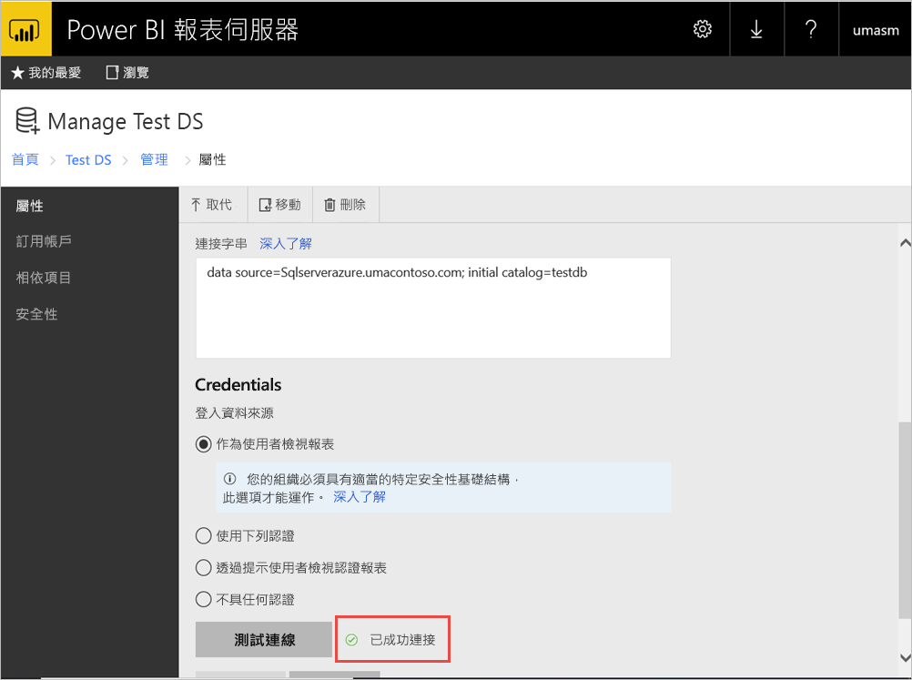

# <a name="configure-power-bi-report-server-with-azure-application-proxy"></a>使用 Azure 應用程式 Proxy 設定 Power BI 報表伺服器

此文章討論如何使用 Azure Active Directory 應用程式 Proxy 來連線到 Power BI 報表伺服器與 SQL Server Reporting Services (SSRS) 2016 和更新版本。 透過此整合，離開公司網路的使用者可以從其用戶端瀏覽器存取其 Power BI 報表伺服器與 Reporting Services 報表，並受到 Azure Active Directory (AD) 的保護。 深入了解如何[透過 Azure Active Directory 的應用程式 Proxy](/azure/active-directory/manage-apps/application-proxy) \(部分機器翻譯\) 遠端存取內部部署應用程式。

## <a name="environment-details"></a>環境詳細資料

我們將在建立的範例中使用這些值。 

- 網域：umacontoso.com
- Power BI 報表伺服器：PBIRSAZUREAPP.umacontoso.com
- SQL Server 資料來源：SQLSERVERAZURE.umacontoso.com

## <a name="configure-power-bi-report-server"></a>設定 Power BI 報表伺服器

安裝 Power BI 報表伺服器 (假設是在 Azure VM 上) 之後，請使用下列步驟來設定 Power BI 報表伺服器 Web 服務與入口網站 URL：

1. 在 VM 防火牆上針對連接埠 80 建立連入與連出規則 (如果您已設定 https URL，則為連接埠 443)。 此外，也從 Azure 入口網站建立 Azure VM 的 TCP 通訊協定 (連接埠 80) 連入與連出規則。
2. 為我們環境中的 VM 所設定的 DNS 名稱是 `pbirsazureapp.eastus.cloudapp.azure.com`。
3. 透過選取 [進階] 索引標籤 > [新增] 按鈕 > **選擇主機標頭名稱**並新增主機名稱 (DNS 名稱) 來設定 Power BI 報表伺服器外部 Web 服務與入口網站 URL，如下所示。

    

1. 我們已針對 Web 服務與入口網站區段執行上一個步驟，並取得在報表伺服器 Configuration Manager 上註冊的 URL：

    - `https://pbirsazureapp.eastus.cloudapp.azure.com/ReportServer`
    - `https://pbirsazureapp.eastus.cloudapp.azure.com/Reports`

2. 在 Azure 入口網站中，我們在網路區段中看到 VM 的兩個 IP 位址 

    - **公用 IP**。 
    - **私人 IP**。 
    
    公用 IP 位址是用於從虛擬機器外部存取。

3. 因此，我們新增了 VM (Power BI 報表伺服器) 上的主機檔案項目，以包含公用 IP 位址與主機名稱 `pbirsazureapp.eastus.cloudapp.azure.com`。
4. 請注意，在將 VM 重新啟動時，動態 IP 位址可能會變更，因此您可能需要在主機檔案中再次新增正確的 IP 位址。 若要避免此情況，您可以在 Azure 入口網站中將公用 IP 位址設定為靜態。
5. 進行上述變更之後，應該可以成功存取 Web 服務與 Web 入口網站 URL。
6. 存取伺服器上的 URL `https://pbirsazureapp.eastus.cloudapp.azure.com/ReportServer` 時，系統會提示您輸入認證三次，並看到空白畫面。
7. 新增下列登錄項目：

    `HKEY\_LOCAL\_MACHINE \SYSTEM\CurrentControlset\Control \Lsa\ MSV1\_0` 登錄機碼

1. 新增值 `BackConnectionHostNames` (多字串值)，並提供主機名稱 `pbirsazureapp.eastus.cloudapp.azure.com`。

完成之後，我們也可以在伺服器上存取該 URL。

## <a name="configure-power-bi-report-server-to-work-with-kerberos"></a>設定 Power BI 報表伺服器以搭配 Kerberos 使用

### <a name="1-configure-the-authentication-type"></a>1.設定驗證類型

我們需要設定報表伺服器的驗證類型，以執行 Kerberos 限制委派。 此設定是在 **rsreportserver.config** 檔案內完成的。

在 rsreportserver.config 檔案內，找到 **Authentication/AuthenticationTypes** 區段。

我們想要確定 RSWindowsNegotiate 已在驗證類型清單中列出且為第一個。 它看起來應該如下所示。

```
<AuthenticationTypes>

    <RSWindowsNegotiate/>

</AuthenticationTypes>
```

如果必須變更設定檔，請從報表伺服器 Configuration Manager **停止並重新啟動報表伺服器**，以確定變更生效。

### <a name="2-register-service-principal-names-spns"></a>2.註冊服務主體名稱 (SPN)

以系統管理員身分開啟命令提示字元，並執行下列步驟。

使用下列命令，在帳戶 **Power BI 報表伺服器服務帳戶**下註冊下列 SPN

```
setspn -s http/ Netbios name\_of\_Power BI Report Server\_server<space> Power BI Report Server\_ServiceAccount

setspn -s http/ FQDN\_of Power BI Report Server\_server<space> Power BI Report Server\_ServiceAccount
```

使用下列命令 (針對 SQL Server 的預設執行個體)，在 SQL Server 服務帳戶下註冊下列 SPN：

```
setspn -s MSSQLSVC/FQDN\_of\_SQL\_Server: 1433 (PortNumber) <SQL service service account>

setspn -s MSSQLSVC/FQDN\_of\_SQL\_Server<SQL service service account>
```

### <a name="3-configure-delegation-settings"></a>3.設定委派設定

我們必須設定報表伺服器服務帳戶的委派設定。

1. 開啟 [Active Directory 使用者和電腦]。
2. 開啟 [Active Directory 使用者和電腦] 內的報表伺服器服務帳戶內容。
3. 我們想要使用通訊協定傳輸來設定限制委派。 使用限制委派時，我們必須明確指出要委派的目標服務。
4. 以滑鼠右鍵按一下**報表伺服器服務帳戶**，然後選取 [內容]。
5. 選取 [委派] 索引標籤。
6. 選取 [信任這個使用者，但只委派指定的服務]。
7. 選取 [使用任何驗證通訊協定]。
8. 在 [這個帳戶可以呈送委派認證的服務:] 下方，選取 [新增]。
9. 在新的對話方塊中，選取 [使用者或電腦]。
10. 輸入 **SQL 伺服器服務的服務帳戶**，然後選取 [確定]。

    其開頭為 MSSQLSVC。

1. 新增 SPN。
2. 選取 [確定]。 您現在應該會在清單中看到 SPN。

這些步驟有助於設定 Power BI 報表伺服器以搭配 Kerberos 驗證機制使用，並讓本機電腦上資料來源的測試連線能運作。

## <a name="configure-azure-application-proxy-connector"></a>設定 Azure 應用程式 Proxy 連接器

請參閱[應用程式 Proxy 連接器](/azure/active-directory/manage-apps/application-proxy-add-on-premises-application#add-an-on-premises-app-to-azure-ad) \(部分機器翻譯\) 相關設定一文

我們已在 Power BI 報表伺服器上安裝應用程式 Proxy 連接器，但是您可以在不同的伺服器上加以設定，並確定已正確設定委派。

### <a name="ensure-the-connector-is-trusted-for-delegation"></a>確定連接器受信任且可供委派

確定連接器是受信任的，並可委派加入至報表伺服器應用程式集區帳戶的 SPN。

設定 Kerberos 限制委派 (KCD)，讓 Azure AD 應用程式 Proxy 服務可以將使用者身分識別委派給報表伺服器應用程式集區帳戶。 啟用應用程式 Proxy 連接器來設定 KCD，以便為已在 Azure AD 中驗證的使用者擷取 Kerberos 票證。 然後該伺服器會將內容傳遞至目標應用程式，在此案例中即為 Power BI 報表伺服器。

若要設定 KCD，請針對每部連接器機器重複下列步驟。

1. 以網域系統管理員身分登入網域控制站，然後開啟 [Active Directory 使用者和電腦]。
2. 尋找連接器執行所在的電腦。
3. 按兩下該電腦，然後選取 [委派] 索引標籤。
4. 將委派設定為 [信任這台電腦，但只委派指定的服務]。 然後，選取 [使用任何驗證通訊協定]。
5. 選取 [新增]，然後選取 [使用者或電腦]。
6. 輸入您要用於 Power BI 報表伺服器的服務帳戶。 此帳戶是您在報表伺服器設定內新增 SPN 的帳戶。
7. 按一下 [確定]。 
8. 若要儲存變更，請按一下 [確定]。

## <a name="publish-through-azure-ad-application-proxy"></a>透過 Azure AD 應用程式 Proxy 發佈

現在您已準備好要設定 Azure AD 應用程式 Proxy。

使用下列設定，透過應用程式 Proxy 發佈 Power BI 報表伺服器。 如需如何透過應用程式 Proxy 發佈應用程式逐步指示，請參閱[使用 Azure AD 應用程式 Proxy 發佈應用程式](/azure/active-directory/manage-apps/application-proxy-add-on-premises-application#add-an-on-premises-app-to-azure-ad) \(部分機器翻譯\)。

- **內部 URL**：輸入報表伺服器的 URL (連接器可以在公司網路中連線至該報表伺服器)。 請確定可從安裝連接器的伺服器連線到此 URL。 最佳做法是使用頂層網域 (例如 `https://servername/`)，以避免透過應用程式 Proxy 發佈之子路徑的問題。 例如，使用 `https://servername/`，而不是 `https://servername/reports/` 或 `https://servername/reportserver/`。 我們已使用 `https://pbirsazureapp.eastus.cloudapp.azure.com/` 來設定環境。

    > [!NOTE]
    > 我們建議您對報表伺服器使用安全 HTTPS 連線。 如需關於做法的資訊，請參閱[在原生模式報表伺服器上設定 SSL 連線](/sql/reporting-services/security/configure-ssl-connections-on-a-native-mode-report-server)。

- **外部 URL**：輸入 Power BI 行動應用程式將連線的公用 URL。 例如，如果使用自訂網域，其看起來可能像 `https://reports.contoso.com`。 若要使用自訂網域，請上傳網域的憑證，並將 DNS 記錄指向您應用程式的預設 msappproxy.net 網域。 如需詳細步驟，請參閱[在 Azure AD 應用程式 Proxy 中使用自訂網域](/azure/active-directory/manage-apps/application-proxy-configure-custom-domain) \(部分機器翻譯\)。

我們針對環境將外部 URL 設定為 `https://pbirsazureapp-umacontoso2410.msappproxy.net/`。

- **預先驗證方法**：Azure Active Directory。
- **連接器群組：** 預設值。


我們尚未在 [其他設定] 區段中進行任何變更。 因此，其設定為使用預設選項。

> [!IMPORTANT]
> 設定應用程式 Proxy 時，請注意，**後端應用程式逾時**屬性會設為 [預設] (85 秒)。 如果您的報表執行時間超過 85 秒，請將此屬性設定為 [長] (180 秒)，這是最高的逾時值上限。 當設定為 [長] 時，所有報表都必須在 180 秒內完成，否則就會逾時導致錯誤。


### <a name="configure-single-sign-on"></a>設定單一登入

發佈您的應用程式之後，請按照下列步驟設定單一登入設定：

1. 在入口網站的應用程式頁面上，選取 [單一登入]。
2. 針對 [單一登入模式]，選取 [整合式 Windows 驗證]。
3. 將**內部應用程式 SPN** 設定為您先前設定的值。 您可以使用下列步驟來識別此值：

    - 請嘗試執行報表，或執行資料來源的測試連線，以建立 Kerberos 票證。
    - 成功執行報表/測試連線之後，請開啟命令提示字元，並執行命令：`klist`。 在結果區段中，您應該會看到具有 `http/` SPN 的票證。 如果其與您已用於設定 Power BI 報表伺服器的 SPN 相同，請在此區段中使用該 SPN。

1. 針對要代表使用者使用的連接器選擇 [委派的登入身分識別]。 如需詳細資訊，請參閱[使用不同的內部部署和雲端身分識別](/azure/active-directory/manage-apps/application-proxy-configure-single-sign-on-with-kcd#working-with-different-on-premises-and-cloud-identities) \(部分機器翻譯\)。

    我們建議使用使用者主體名稱。 在我們的範例中，我們已將其設定為使用 [使用者主體名稱] 選項：

    

1. 按一下 [確定] 儲存變更。

### <a name="finish-setting-up-your-application"></a>完成設定您的應用程式

若要完成您的應用程式設定，請移至 [使用者和群組]區段，並指派使用者存取此應用程式。

1. 針對 [重新導向 URL] 與 [進階設定]，為 Power BI 報表伺服器應用程式設定應用程式註冊的 [驗證] 區段，如下所示：

    - 建立新的重新導向 URL，並使用 **Type** = **Web** 與 **Redirect URI** = `https://pbirsazureapp-umacontoso2410.msappproxy.net/` 加以設定
    - 在 [進階設定] 區段中，將 [登出 URL] 設定為 `https://pbirsazureapp-umacontoso2410.msappproxy.net/?Appproxy=logout`

    

1. 針對 [隱含授與]、[預設用戶端類型] 和 [支援的帳戶類型] 繼續為 Power BI 報表伺服器應用程式設定應用程式註冊的 [驗證] 區段，如下所示：

    - 將 [隱含授與] 設定為 [識別碼權杖]。
    - 將 [預設用戶端類型] 設定為 [否]。
    - 將 [支援的帳戶類型] 變更為 [僅此組織目錄中的帳戶 (僅 UmaContoso - 單一租用戶)]。

    

1. 一旦設定好單一登入且 URL `https://pbirsazureapp-umacontoso2410.msappproxy.net` 正常運作，我們就必須確定用來登入的帳戶已與 Power BI 報表伺服器中提供權限的帳戶同步處理。

1. 我們必須先設定計劃要在登入中使用的自訂網域，然後確定其已驗證
2. 在此案例中，我們已購買名為 umacontoso.com 的網域，並使用項目來設定 DNS 區域。 您也可以嘗試使用 `onmicrosoft.com` 網域，並將其與內部部署 AD 同步。

    如需參考，請參閱[教學課程：將現有的自訂 DNS 名稱對應至 Azure App Service](/Azure/app-service/app-service-web-tutorial-custom-domain) \(部分機器翻譯\) 一文。

1. 成功驗證自訂網域的 DNS 項目之後，您應該能夠從入口網站看到對應網域的狀態為 [已驗證]。

    

1. 在網域控制站伺服器上安裝 Microsoft Azure AD Connect，並將其設定為與 Azure AD 同步處理。

    

1. 一旦 Azure AD 與內部部署 AD 同步之後，我們可以從 Azure 入口網站看到下列狀態：

    

1. 此外，同步處理成功之後，請在網域控制站上開啟 AD 網域和信任。 以滑鼠右鍵按一下 [Active Directory 網域及信任] > [內容]，然後新增 UPN。 在我們的環境中，`umacontoso.com` 是我們購買的自訂網域。

1. 新增 UPN 之後，您應該能夠使用 UPN 來設定使用者帳戶，以連接 Azure AD 帳戶與內部部署 AD 帳戶，並在驗證期間辨識權杖。

    執行上一個步驟之後，AD 網域名稱會列在 [使用者登入名稱] 區段的下拉式清單中。 設定使用者名稱，然後從 AD 使用者屬性的 [使用者登入名稱] 區段的下拉式清單中選取網域。

    

1. AD 同步處理成功之後，您會看到內部部署 AD 帳戶出現在 Azure 入口網站中該應用程式的 [使用者和群組] 區段下。 帳戶的來源是 **Windows Server AD。**
2. 使用 `umasm@umacontoso.com` 登入相當於使用 Windows 認證 `Umacontoso\umasm`。

    如果您已設定內部部署 AD，而且打算將其與 Azure AD 同步處理，則適用這些先前步驟。

    實作上述步驟之後成功登入：

    

    Web 入口網站隨即顯示：

    

    使用 Kerberos 作為驗證，成功測試資料來源連線：

    

## <a name="access-from-power-bi-mobile-apps"></a>從 Power BI 行動應用程式存取

### <a name="configure-the-application-registration"></a>設定應用程式註冊

在 Power BI 的行動裝置應用程式可以連線並存取 Power BI 報表伺服器之前，您必須先設定自動為您建立的應用程式註冊，如此文章稍早的[透過 Azure AD 應用程式 Proxy 發佈](#publish-through-azure-ad-application-proxy)中所述。

1. 在 Azure Active Directory [概觀] 頁面上，選取 [應用程式註冊]。
2. 在 [所有應用程式] 索引標籤上，搜尋您為 Power BI 報表伺服器建立的應用程式。
3. 選取應用程式，然後選取 [驗證]。
4. 根據您所使用的平台，新增下列重新導向 URI。

    設定 Power BI 行動版 **iOS** 的應用程式時，請新增下列公用用戶端 (行動裝置和電腦) 類型的重新導向 URI：

    - `msauth://code/mspbi-adal%3a%2f%2fcom.microsoft.powerbimobile`
    - `msauth://code/mspbi-adalms%3a%2f%2fcom.microsoft.powerbimobilems`
    - `mspbi-adal://com.microsoft.powerbimobile`
    - `mspbi-adalms://com.microsoft.powerbimobilems`

    設定 Power BI 行動版 **Android** 的應用程式時，請新增下列公用用戶端 (行動裝置和電腦) 類型的重新導向 URI：

    - `urn:ietf:wg:oauth:2.0:oob`
    - `mspbi-adal://com.microsoft.powerbimobile`
    - `msauth://com.microsoft.powerbim/g79ekQEgXBL5foHfTlO2TPawrbI%3D`
    - `msauth://com.microsoft.powerbim/izba1HXNWrSmQ7ZvMXgqeZPtNEU%3D`

    設定 Power BI 行動版 iOS 與 Android 的應用程式時，請將下列公用用戶端 (行動裝置和電腦) 類型的重新導向 URI 新增至為 iOS 設定的重新導向 URI 清單：

    - `urn:ietf:wg:oauth:2.0:oob`

    > [!IMPORTANT]
    > 必須新增重新導向 URI，應用程式才能正常運作。

### <a name="connect-from-the-power-bi-mobile-apps"></a>從 Power BI 行動裝置應用程式連線

1. 在 Power BI 行動裝置應用程式中，連線到您的報表伺服器執行個體。 若要連線，請輸入您透過應用程式 Proxy 發佈之應用程式的 [外部 URL]。
2. 選取 [連接]。 系統會將您導向至 Azure Active Directory 登入頁面。
3. 輸入使用者的有效認證，然後選取 [登入]。 您會看到來自您報表伺服器的元素。

## <a name="next-steps"></a>後續步驟

[使用 Azure AD 應用程式 Proxy 啟用 Power BI 行動版的遠端存取](/azure/active-directory/manage-apps/application-proxy-integrate-with-power-bi)

有其他問題嗎？ [嘗試在 Power BI 社群提問](https://community.powerbi.com/)
