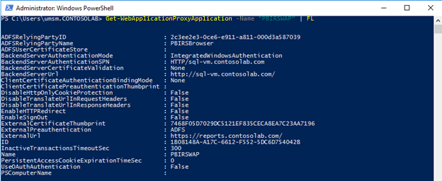

# <a name="use-web-application-proxy-and-active-directory-federated-services---power-bi-report-server"></a>使用 Web 應用程式 Proxy 和 Active Directory 同盟服務 - Power BI 報表伺服器

本文討論如何使用 Web 應用程式 Proxy (WAP) 和 Active Directory 同盟服務 (AD FS) 來連線到 Power BI 報表伺服器及 SQL Server Reporting Services (SSRS) 2016 和更新版本。 透過這項整合，離開公司網路的使用者可以從他們的用戶端瀏覽器存取其 Power BI 報表伺服器和 Reporting Services 報表，並受到 AD FS 預先驗證的保護。 針對 Power BI 行動應用程式，您也必須[設定 OAuth 以連線至 Power BI 報表伺服器和 SSRS](../consumer/mobile/mobile-oauth-ssrs.md)。

## <a name="prerequisites"></a>必要條件

### <a name="domain-name-services-dns-configuration"></a>網域名稱系統 (DNS) 設定

- 決定使用者將與之連線的公用 URL。 這看似以下範例：`https://reports.contosolab.com`。
- 為主機名稱 (例如 `reports.contosolab.com`) 設定 DNS 記錄，以指向 Web 應用程式 Proxy (WAP) 伺服器的公用 IP 位址。
- 為您的 AD FS 伺服器設定公用 DNS 記錄。 例如，您可能已為 AD FS 伺服器設定下列 URL：`https://adfs.contosolab.com`。
- 將您的 DNS 記錄設定為指向 Web 應用程式 Proxy (WAP) 伺服器的公用 IP 位址，例如 `adfs.contosolab.com`。 這會發佈為 WAP 應用程式的一部分。

### <a name="certificates"></a>憑證

您必須為 WAP 應用程式和 AD FS 伺服器設定憑證。 這兩個憑證都必須屬於機器能辨識的有效憑證授權單位。

## <a name="1-configure-the-report-server"></a>1.設定報表伺服器

我們必須確定我們有有效的服務主體名稱 (SPN)。 有效的 SPN 可促使適當的 Kerberos 驗證發生，並讓報表伺服器進行交涉驗證。

### <a name="service-principal-name-spn"></a>服務主體名稱 (SPN)

SPN 是使用 Kerberos 驗證之服務的唯一識別碼。 確定您具有報表伺服器的適當 HTTP SPN。

如需如何設定報表伺服器之適當服務主體名稱 (SPN) 的資訊，請參閱[為報表伺服器註冊服務主體名稱 (SPN)](/sql/reporting-services/report-server/register-a-service-principal-name-spn-for-a-report-server)。

### <a name="enabling-negotiate-authentication"></a>啟用交涉驗證

若要讓報表伺服器使用 Kerberos 驗證，您需要將報表伺服器的驗證類型設定為 RSWindowsNegotiate。 您會在 rsreportserver.config 檔案內進行設定。

```
<AuthenticationTypes>

    <RSWindowsNegotiate />

    <RSWindowsNTLM />

</AuthenticationTypes>
```

如需詳細資訊，請參閱[修改 Reporting Services 設定檔](/sql/reporting-services/report-server/modify-a-reporting-services-configuration-file-rsreportserver-config)和[設定報表伺服器上的 Windows 驗證](/sql/reporting-services/security/configure-windows-authentication-on-the-report-server)。

## <a name="2-configure-active-directory-federation-services-ad-fs"></a>2.設定 Active Directory 同盟服務 (ADFS)

您需要在環境內的 Windows 2016 伺服器上設定 ADFS。 透過伺服器管理員並選取 [管理] 下的 [新增角色及功能] 即可完成設定。 如需詳細資訊，請參閱 [Active Directory Federation Services](/windows-server/identity/active-directory-federation-services)。

在 AD FS 伺服器上，使用 AD FS 管理應用程式完成下列步驟。

1. 以滑鼠右鍵按一下 [信賴憑證者信任]   > [新增信賴憑證者信任]  。

    

2. 遵循**新增信賴憑證者信任**精靈中的步驟。

    選擇 [非宣告感知]  選項，以使用 Windows 整合式安全性作為驗證機制。

    

    請在 [指定顯示名稱]  中輸入您偏好的名稱，然後選取 [下一步]  。
    新增信賴憑證者信任識別碼：`<ADFS\_URL>/adfs/services/trust`

    例如：`https://adfs.contosolab.com/adfs/services/trust`

    

    選擇符合組織需求的 [存取控制原則]  ，然後選取 [下一步]  。

    
    
    選取 [下一步]  ，然後選取 [完成]  來完成**新增信賴憑證者信任**精靈。

    完成時，信賴憑證者信任的屬性應如下所示。

    

## <a name="3-configure-web-application-proxy-wap"></a>3.設定 Web 應用程式 Proxy (WAP)

您要在環境內的伺服器上啟用 Windows 角色「Web 應用程式 Proxy」(角色)。 它必須位於 Windows 2016 伺服器上。 如需詳細資訊，請參閱 [Web Application Proxy in Windows Server 2016](/windows-server/remote/remote-access/web-application-proxy/web-application-proxy-windows-server) (Windows Server 2016 中的 Web 應用程式 Proxy) 和 [Publishing Applications using AD FS Preauthentication](/windows-server/remote/remote-access/web-application-proxy/Publishing-Applications-using-AD-FS-Preauthentication) (使用 AD FS 預先驗證發行應用程式)。

### <a name="configure-constrained-delegation"></a>設定限制委派

若要從表單驗證轉換為 Windows 驗證，我們需要搭配使用限制委派與通訊協定轉換。 此步驟是 Kerberos 設定的一部分。 我們已經在報表伺服器設定中定義報表伺服器 SPN。

我們需要在 Active Directory 內設定 WAP 伺服器電腦帳戶的限制委派。 如果您沒有 Active Directory 的權限，則可能需要使用網域系統管理員。

若要設定限制委派，請遵循這些步驟。

1. 在已安裝 Active Directory 工具的電腦上，啟動 [Active Directory 使用者和電腦]  。
2. 尋找 WAP 伺服器的電腦帳戶。 根據預設，該帳戶會在**電腦**容器中。
3. 以滑鼠右鍵按一下 WAP 伺服器，並移至 [內容]  。
4. 在 [委派]  索引標籤上，選取 [信任這台電腦，但只委派指定的服務]  ，然後選取 [使用任何驗證通訊協定]  。

    

1. 此選項會設定此 WAP 伺服器電腦帳戶的限制委派。 接著，我們需要指定允許委派此電腦的服務。
2. 在 [服務] 方塊下選取 [新增]  。

    

1. 選取 [使用者或電腦]  。
2. 輸入您要用於報表伺服器的服務帳戶。 此帳戶與您在先前在[報表伺服器設定](#1-configure-the-report-server)一節中用來新增 HTTP SPN 的帳戶相同。 

3. 選取報表伺服器的 HTTP SPN，然後選取 [確定]  。

    > [!NOTE]
    > 您只能看到 NetBIOS SPN。 其實際會選取 NetBIOS 和 FQDN SPN (如果兩者都存在)。

1. 當您選取核取 [展開]  核取方塊時，結果應該與下列範例類似。

    

### <a name="add-wap-application"></a>新增 WAP 應用程式

1. 在 Web 應用程式 Proxy 伺服器上，開啟 [遠端存取管理]  主控台，然後在瀏覽窗格中選取 [Web 應用程式 Proxy]  。 

2. 選取 [工作]  窗格中的 [發佈]  。

2. 在歡迎頁面上，選取 [下一步]  。

    

3. 在 [預先驗證]  頁面上選取 [Active Directory 同盟服務 (AD FS)]  ，然後選取 [下一步]  。

    

4. 選取 **Web 和 MSOFBA** 預先驗證，因為我們只會為報表伺服器設定瀏覽器存取，而不是行動應用程式存取。

    

5. 新增我們在 AD FS 伺服器中建立的**信賴憑證者** (如下所示)，然後選取 [下一步]  。

    

6. 在 [外部 URL]  區段中，放入 WAP 伺服器上設定的可公開存取 URL。 新增透過報表伺服器 (報表伺服器組態管理員) 設定的 URL，如下列**後端伺服器 URL**一節所示。 在**後端伺服器 SPN** 區段中，新增報表伺服器的 SPN。

    

7. 選取 [下一步]  ，然後選取 [發佈]  。
8. 執行下列 PowerShell 命令可驗證 WAP 組態。

    ```
    Get-WebApplicationProxyApplication "PBIRSBrowser" | FL
    ```

    

## <a name="connect-to-the-report-server-through-the-browser"></a>透過瀏覽器連線到報表伺服器

接著，您就可以從瀏覽器存取公用 WAP URL，例如 `https://reports.contosolab.com/ReportServer` (Web 服務) 及 `https://reports.contosolab.com/Reports` (Web 入口網站)。 成功驗證之後，您就可以查看報告。


## <a name="next-steps"></a>後續步驟

* [設定 OAuth 以連線至 Power BI 報表伺服器和 SSRS](../consumer/mobile/mobile-oauth-ssrs.md)
*[什麼是 Power BI 報表伺服器？](get-started.md)  

有其他問題嗎？ [嘗試在 Power BI 社群提問](https://community.powerbi.com/)