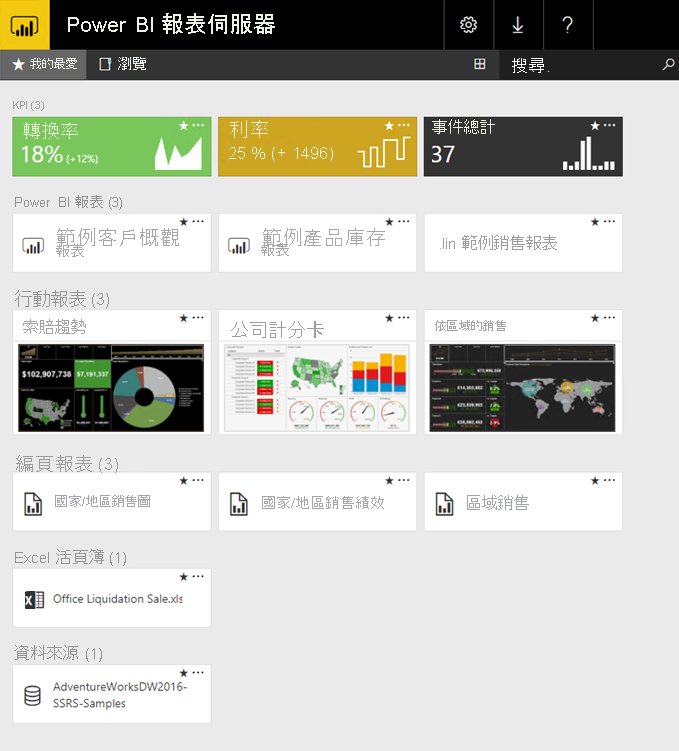

# 什麼是 Power BI 報表伺服器？

Power BI 報表伺服器是具有入口網站的內部部署報表伺服器，您可以在該入口網站中顯示和管理報表及 KPI。 同時出現的還有用來建立 Power BI 報表、編頁報表、行動報表和 KPI 的工具。 您的使用者可以透過各種不同方式存取這些報表：在網頁瀏覽器或行動裝置中檢視，或是在其收件匣中以電子郵件的形式檢視。

## 比較 Power BI 報表伺服器 
「Power BI 報表伺服器」與 SQL Server Reporting Services 和 Power BI 線上服務都類似，但方式不同。 和 Power BI 服務一樣，Power BI 報表伺服器能裝載 Power BI 報表 (.pbix)、Excel 檔案及分頁報表 (.rdl)。 和 Reporting Services 相同，Power BI 報表伺服器位於內部部署環境。 Power BI 報表伺服器功能是 Reporting Services 的超集：所有可以在 Reporting Services 中執行的作業，都能透過 Power BI 報表伺服器來執行，同時它也支援 Power BI 報表。 如需詳細資料，請參閱[比較 Power BI 報表伺服器與 Power BI 服務](compare-report-server-service.md)。

## 授權 Power BI 報表伺服器
Power BI 報表伺服器可透過兩個不同的授權取得：含軟體保證的 [Power BI Premium](../admin/service-premium-what-is.md) 和 SQL Server Enterprise Edition。 如需詳細資料，請參閱 [Microsoft 大量授權](https://www.microsoftvolumelicensing.com/DocumentSearch.aspx?Mode=3&DocumentTypeId=1&ShowArchived=True)。 使用 Power BI Premium 授權時，您可以建立混合了雲端和內部部署環境的混合式部署。

若要將 Power BI 報表發佈至 Power BI 報表伺服器，您也需要 Power BI Pro 授權。 若要在 Power BI 報表伺服器上檢視 Power BI 報表並與其互動，則不需要 Power BI Pro 授權。

> [!NOTE]
> 針對 Power BI Premium，只有 P SKU 中才會包含 Power BI 報表伺服器。 EM SKU 不包含報表伺服器。

## 入口網站
「Power BI 報表伺服器」的入口是一個可在任何新式瀏覽器中檢視的安全入口網站。 您可在該處存取所有報表和 KPI。 入口網站上的內容會採用傳統資料夾階層的組織方式。 在您的資料夾中，內容是依類型分組：Power BI 報表、行動報表、分頁報表、KPI 和 Excel 活頁簿。 共用資料集和共用資料來源位於其本身的資料夾中，可作為報表的建置組塊使用。 您可以標記我的最愛，以在單一資料夾中檢視它們， 並可直接在入口網站中建立 KPI。 

您可以依據您的權限來管理入口網站中的內容。 您可以排定報表處理、視需要存取報表，以及訂閱已發佈的報表。 您也可以將自己的自訂[商標](https://docs.microsoft.com/sql/reporting-services/branding-the-web-portal)套用到入口網站。 

深入了解 [Power BI 報表伺服器入口網站](https://docs.microsoft.com/sql/reporting-services/web-portal-ssrs-native-mode)。

## Power BI 報表
您使用針對報表伺服器最佳化的 Power BI Desktop 版本建立 Power BI 報表 (.pbix)。 然後將這些報表發佈至自有環境的入口網站，並在此入口網站中檢視報表。

Power BI 報表是資料模型的多面向檢視，具有代表來自該資料模型各種不同發現和見解的視覺效果。  報表只能有一種視覺效果或有各種視覺效果的頁面。 視您的角色而定，您可能可以讀取和探索報表，或是為其他項目建立報表。

請參閱[安裝 Microsoft Power BI Desktop](install-powerbi-desktop.md)。

## 編頁報表
分頁報表 (.rdl) 是附帶視覺效果的文件型報表，資料表在此會以水平和垂直方式展開以顯示其所有資料，並視需要一頁接著一頁延伸下去。 它們非常適用於已針對列印進行最佳化的固定配置、像素完美文件，例如 PDF 和 Word 檔案。 

您可使用[報表產生器](https://docs.microsoft.com/sql/reporting-services/report-builder/report-builder-in-sql-server-2016) \(部分機器翻譯\) 或 [SQL Server Data Tools (SSDT)](https://docs.microsoft.com/sql/reporting-services/tools/reporting-services-in-sql-server-data-tools-ssdt) \(部分機器翻譯\) 中的報表設計師來建立編頁報表。

## Reporting Services 行動報表
行動報表會連線至內部部署資料，並具有可因應不同裝置和不同持有方式的回應式配置。 您可以使用「SQL Server 行動報表發行工具」來建立它們。

深入了解 [Reporting Services 行動報表](https://docs.microsoft.com/sql/reporting-services/mobile-reports/create-mobile-reports-with-sql-server-mobile-report-publisher)。 

## 報表伺服器的程式設計功能
您可以利用 Power BI 報表伺服器的程式設計功能來延伸及自訂報表，並使用 API 來整合或延伸自訂應用程式中的資料和報表處理。

其他[報表伺服器開發人員文件](https://docs.microsoft.com/sql/reporting-services/reporting-services-developer-documentation)。

## 後續步驟
[安裝 Power BI 報表伺服器](install-report-server.md)  
[下載報表產生器](https://www.microsoft.com/download/details.aspx?id=53613)  

有其他問題嗎？ [嘗試在 Power BI 社群提問](https://community.powerbi.com/)
