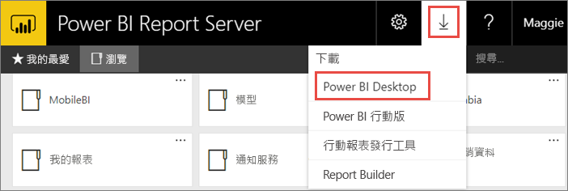

# 安裝 Power BI 報表伺服器的 Power BI Desktop

若要建立 Power BI 報表伺服器的 Power BI 報表，您必須下載並安裝已針對 Power BI 報表伺服器最佳化的 Power BI Desktop 版本。 此版本與搭配 Power BI 服務使用的 Power BI Desktop 不同。 例如，Power BI 服務的 Power BI Desktop 版本包含預覽功能。 這些功能在正式推出之前無法在 Power BI 報表伺服器版本中提供使用。 使用此版本可確保報表伺服器可與已知版本的報告和模型互動。 

別擔心。 您可以在同一部電腦上並存安裝 Power BI Desktop，以及 Power BI 報表伺服器的 Power BI Desktop。

## 下載及安裝 Power BI Desktop

要確定您有最新版本的 Power BI 報表伺服器 Power BI Desktop，最簡單的方式是從報表伺服器的入口網站開始。

1. 在報表伺服器 web 入口網站中，選取 [下載] 箭號 > [Power BI Desktop]。

    

    或移至 [Power BI 報表伺服器](https://powerbi.microsoft.com/report-server/)首頁，然後選取 [進階下載選項]。

2. 在 [下載中心] 頁面上，選取語言，然後選取 [下載]。

3. 根據您的電腦，選取： 

    - **PBIDesktopRS.msi** (32 位元版本) 或
    - **PBIDesktopRS_x64.msi** (64 位元版本)。

1. 下載安裝程式之後，請執行 [Power BI Desktop 安裝精靈]。

2. 在安裝結束時，請選取 [啟動 Power BI Desktop]。

    其會自動啟動，一切即就緒。

## 確認您使用的版本正確
確認您使用正確 Power BI Desktop 的方式非常簡單：請查看 Power BI Desktop 中的啟動畫面或標題列。 您可以告訴您有正確的版本，因為 **Power BI Desktop (2021 年1月)** 或更新版本會在標題列中。 而且，Power BI 標誌的色彩也會反轉，從黃底黑圖案變成黑底黃圖案。

Power BI 服務的 Power BI Desktop 版本不會在標題列中顯示年份和月份。

## 副檔名關聯
假設您已針對相同電腦上的 Power BI 報表伺服器安裝 Power BI Desktop 和 Power BI Desktop。 您最近安裝的 Power BI Desktop 具有與 .pbix 檔案的檔案關聯。 因此，當您按兩下 .pbix 檔案時，便會啟動最近安裝的 Power BI Desktop。

如果您已 Power BI Desktop 然後安裝 Power BI Desktop 的 Power BI 報表伺服器，則所有 .pbix 檔案預設會在 Power BI 報表伺服器的 Power BI Desktop 中開啟。 如果您偏好在開啟 .pbix 檔案時，預設啟動 Power BI Desktop，那麼請[從 Microsoft Store 重新安裝 Power BI Desktop](https://aka.ms/pbidesktopstore)。

您隨時可以開啟您想要先用的 Power BI Desktop 版本， 然後再從 Power BI Desktop 中開啟檔案。

以下是確保開啟正確版本 Power BI Desktop 的最安全方式。 從 Power BI 報表伺服器內開始編輯 Power BI 報表，或從 Power BI 服務建立新的 Power BI 報表。

## 考量與限制

Power BI 報表伺服器、Power BI 服務 (`https://app.powerbi.com`) 和 Power BI 行動裝置應用程式中的 Power BI 報表行為幾乎完全相同，但部分功能不同。

### 選取語言

針對 Power BI 報表伺服器的 Power BI Desktop，您可以在安裝應用程式時選取語言。 之後，您就無法變更語言，但可以安裝其他語言的版本。

### 瀏覽器中的報表視覺效果

Power BI 報表伺服器的報表支援幾乎所有視覺效果，包括 Power BI 視覺效果。 Power BI 報表伺服器報表不支援：

* R 視覺效果
* 階層連結
* Power BI Desktop 預覽功能

### Power BI 行動裝置應用程式中的報表

Power BI 報表伺服器報表支援 [Power BI 行動裝置應用程式](../consumer/mobile/mobile-apps-for-mobile-devices.md)中的所有基本功能，包括：

* [手機報表配置](../create-reports/desktop-create-phone-report.md)：您可以針對 Power BI 行動裝置應用程式來最佳化報表。 在您的行動電話上，最佳化的報表會有特殊圖示，以及版面配置。
  
    

Power BI 報表伺服器報表不支援 Power BI 行動裝置應用程式中的下列功能：

* R 視覺效果
* Power BI 視覺效果
* 階層連結
* 地區篩選或條碼

### 自訂安全性

Power BI 報表伺服器的 Power BI Desktop 不支援自訂安全性。 如果 Power BI 報表伺服器設定了自訂安全性延伸模組，您就無法將 Power BI 報表從 Power BI Desktop (針對 Power BI 報表伺服器最佳化) 儲存到 Power BI 報表伺服器執行個體。 您必須從 Power BI Desktop 儲存 .pbix 報表檔案，並將此檔案上傳至 Power BI 報表伺服器入口網站。

### 將報表儲存到不同網域中的 Power BI 報表伺服器

當將 Power BI 報表儲存到 Power BI 報表伺服器時會使用 Windows 認證。 不支援直接儲存到與 Windows 認證不同個網域中的報表伺服器。 您可使用網頁瀏覽器來檢視報表伺服器，並改為從電腦手動上傳檔案。

## 後續步驟

現在您已安裝 Power BI Desktop，即可開始建立 Power BI 報表。

[建立 Power BI 報表伺服器的 Power BI 報表](quickstart-create-powerbi-report.md)  
[什麼是 Power BI 報表伺服器？](get-started.md)

有其他問題嗎？ [嘗試在 Power BI 社群提問](https://community.powerbi.com/)

