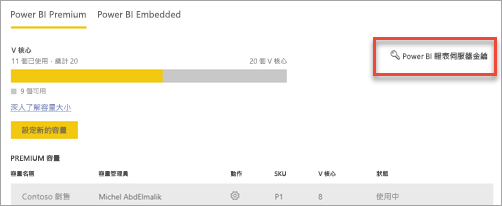
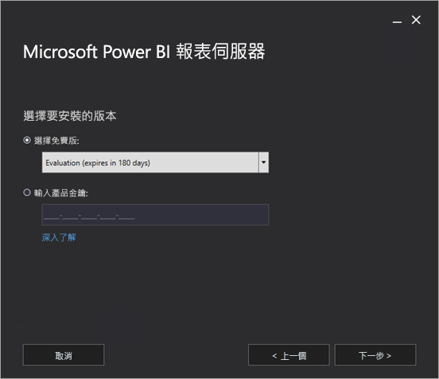
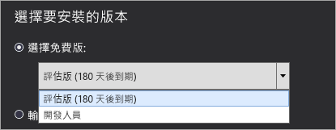
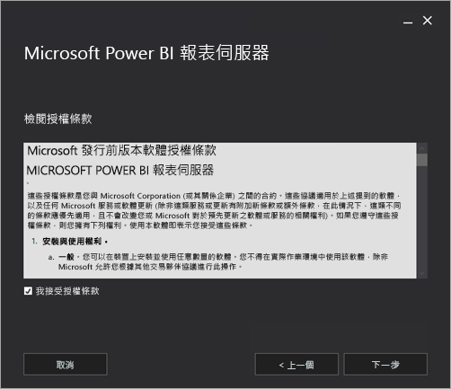
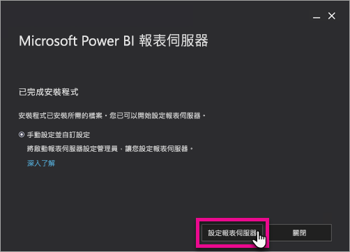
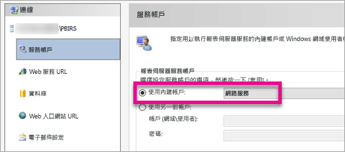

# 安裝 Power BI 報表伺服器

了解如何安裝 Power BI 報表伺服器。

 **下載**

若要下載 Power BI 報表伺服器，請前往[使用 Power BI 報表伺服器的內部部署報表](https://powerbi.microsoft.com/report-server/)，然後選取 [下載免費試用]。 

## 開始之前

安裝 Power BI 報表伺服器之前，建議您先檢閱[安裝 Power BI 報表伺服器的硬體和軟體需求](system-requirements.md)。

 > [!IMPORTANT]
 > 雖然您可以將 Power BI 報表伺服器安裝在有唯讀網域控制站 (RODC) 的環境中，但 Power BI 報表伺服器需要存取讀寫網域控制站才能正常運作。 如果 Power BI 報表伺服器只能存取 RODC，您在嘗試管理服務時可能會發生錯誤。

### Power BI 報表伺服器產品金鑰

#### Power BI Premium

如果您已購買 Power BI Premium，則在 Power BI 管理入口網站的 [進階設定] 索引標籤內，您可存取 Power BI 報表伺服器產品金鑰。 這只適用於全域系統管理員，或已獲指派 Power BI 服務系統管理員角色的使用者。

選取 [Power BI 報表伺服器金鑰] 會顯示一個包含產品金鑰的對話方塊。 您可以複製金鑰，並在安裝時使用。

#### SQL Server Enterprise 軟體保證 (SA)

如果您有 SQL Server Enterprise SA 合約，您可以從[大量授權服務中心](https://www.microsoft.com/Licensing/servicecenter/)取得您的產品金鑰。

## 安裝報表伺服器

安裝 Power BI 報表伺服器不難。 安裝檔案只要幾個步驟。

安裝時不需要使用 SQL Server 資料庫引擎伺服器。 但在安裝之後需要一部來設定 Reporting Services。

1. 找到 PowerBIReportServer.exe 的位置並啟動安裝程式。

2. 選取 [安裝 Power BI 報表伺服器]。

    
3. 選擇要安裝的版本，然後選取 [下一步]。

    

    您可以從下拉式清單中選擇 Evaluation 或 Developer 版本。

    

    否則，您可以輸入從 Power BI 服務或大量授權服務中心取得的伺服器產品金鑰。 如需如何取得產品金鑰的詳細資訊，請參閱[開始之前](#before-you-begin)一節。
4. 閱讀並接受授權條款和條件，然後選取 [下一步]。

    
5. 您需要有資料庫引擎才能儲存報表伺服器資料庫。 選取 [下一步] 只安裝報表伺服器。

    
6. 指定報表伺服器的安裝位置。 選取 [安裝] 繼續作業。

    

    預設路徑是 C:\Program Files\Microsoft Power BI Report Server。

7. 安裝成功後，請選取 [設定報表伺服器] 啟動 Reporting Services 設定管理員。

    

## 設定報表伺服器

選取安裝程式中的 [設定報表伺服器] 後，您會看到 Reporting Services 設定管理員。 如需詳細資訊，請參閱 [Reporting Services 設定管理員](https://docs.microsoft.com/sql/reporting-services/install-windows/reporting-services-configuration-manager-native-mode)。

您需要[建立報表伺服器資料庫](https://docs.microsoft.com/sql/reporting-services/install-windows/ssrs-report-server-create-a-report-server-database)來完成 Reporting services 的初始設定。 需要 SQL Server 資料庫伺服器才能完成此步驟。

### 在其他伺服器上建立資料庫

如果您要在另一部電腦的資料庫伺服器上建立報表伺服器資料庫，您需要將報表伺服器的服務帳戶變更為資料庫伺服器上可辨識的認證。 

報表伺服器預設使用虛擬服務帳戶。 如果您嘗試在其他伺服器上建立資料庫，可能會在套用連接權限的步驟中收到下列錯誤。

`System.Data.SqlClient.SqlException (0x80131904): Windows NT user or group '(null)' not found. Check the name again.`

為暫時避開錯誤，您可以將服務帳戶變更為網路服務或網域帳戶。 將服務帳戶變更為網路服務，會套用報表伺服器電腦帳戶內容中的權限。

如需詳細資訊，請參閱[設定報表伺服器服務帳戶](https://docs.microsoft.com/sql/reporting-services/install-windows/configure-the-report-server-service-account-ssrs-configuration-manager)。

## Windows 服務

Windows 服務會建立為安裝的一部分。 它會顯示為 **Power BI 報表伺服器**。 服務名稱是 **PowerBIReportServer**。

## 預設的 URL 保留項目

URL 保留項目是由前置詞、主機名稱、連接埠及虛擬目錄所組成︰

| 組件 | 描述 |
| --- | --- |
| 前置詞 |預設的前置詞是 HTTP。 如果之前安裝的是安全通訊端層 (SSL) 憑證，安裝程式會嘗試建立使用 HTTPS 前置詞的 URL 保留項目。 |
| 主機名稱 |預設的主機名稱是強式萬用字元 (+)。 它會指定報表伺服器接受解析為電腦的任何主機名稱的指定連接埠上的任何 HTTP 要求，包括 `http://<computername>/reportserver`、`http://localhost/reportserver` 或 `http://<IPAddress>/reportserver.`。 |
| 連接埠 |預設連接埠為 80。 如果使用連接埠 80 以外的任何連接埠，您必須在瀏覽器視窗中開啟入口網站時，明確將它新增至 URL。 |
| 虛擬目錄 |根據預設，虛擬目錄是以報表伺服器 Web 服務和入口網站報告的 ReportServer 格式建立。 報表伺服器 Web 服務的預設虛擬目錄是 **reportserver**。 入口網站的預設虛擬目錄是 **reports**。 |

完整的 URL 字串範例可能如下︰

* `http://+:80/reportserver` 可以存取報表伺服器。
* `http://+:80/reports` 可以存取入口網站。

## 防火牆

如果要從遠端電腦存取報表伺服器，您會想要確定已設定所有防火牆規則，如果有防火牆存在的話。

您需要開啟已為 Web 服務 URL 和入口網站 URL 設定的 TCP 連接埠。 根據預設，這些都設定在 TCP 連接埠 80。

## 額外設定

* 若要設定與 Power BI 服務整合，以便將報表項目釘選至 Power BI 儀表板，請參閱[與 Power BI 服務整合](https://docs.microsoft.com/sql/reporting-services/install-windows/power-bi-report-server-integration-configuration-manager)。
* 若要設定電子郵件以處理訂用帳戶，請參閱[電子郵件設定](https://docs.microsoft.com/sql/reporting-services/install-windows/e-mail-settings-reporting-services-native-mode-configuration-manager)和[在報表伺服器中傳遞電子郵件](https://docs.microsoft.com/sql/reporting-services/subscriptions/e-mail-delivery-in-reporting-services)。
* 若要設定入口網站可在報表電腦上存取，以便檢視和管理報表，請參閱[設定防火牆以存取報表伺服器](https://docs.microsoft.com/sql/reporting-services/report-server/configure-a-firewall-for-report-server-access)和[設定報表伺服器進行遠端管理](https://docs.microsoft.com/sql/reporting-services/report-server/configure-a-report-server-for-remote-administration)。

## 後續步驟

[系統管理員概觀](admin-handbook-overview.md)  
[如何找到您的報表伺服器產品金鑰](find-product-key.md)  
[安裝針對 Power BI 報表伺服器最佳化的 Power BI Desktop](install-powerbi-desktop.md)  
[確認安裝 Reporting Services ](https://docs.microsoft.com/sql/reporting-services/install-windows/verify-a-reporting-services-installation)  
[設定報表伺服器服務帳戶](https://docs.microsoft.com/sql/reporting-services/install-windows/configure-the-report-server-service-account-ssrs-configuration-manager)  
[設定報表伺服器 URL](https://docs.microsoft.com/sql/reporting-services/install-windows/configure-report-server-urls-ssrs-configuration-manager)  
[設定報表伺服器資料庫連接](https://docs.microsoft.com/sql/reporting-services/install-windows/configure-a-report-server-database-connection-ssrs-configuration-manager)  
[初始化報表伺服器](https://docs.microsoft.com/sql/reporting-services/install-windows/ssrs-encryption-keys-initialize-a-report-server)  
[在報表伺服器上設定 SSL 連線](https://docs.microsoft.com/sql/reporting-services/security/configure-ssl-connections-on-a-native-mode-report-server)  
[設定 Windows 服務帳戶和權限](https://docs.microsoft.com/sql/database-engine/configure-windows/configure-windows-service-accounts-and-permissions)  
[Power BI 報表伺服器的瀏覽器支援](browser-support.md)

有其他問題嗎？ [嘗試在 Power BI 社群提問](https://community.powerbi.com/)