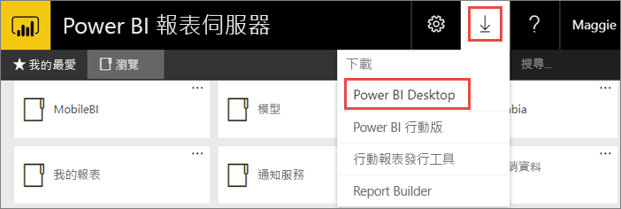
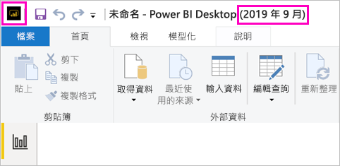
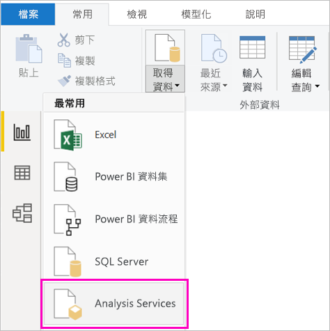
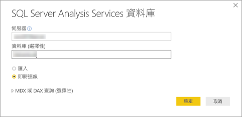
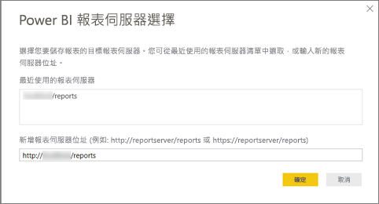
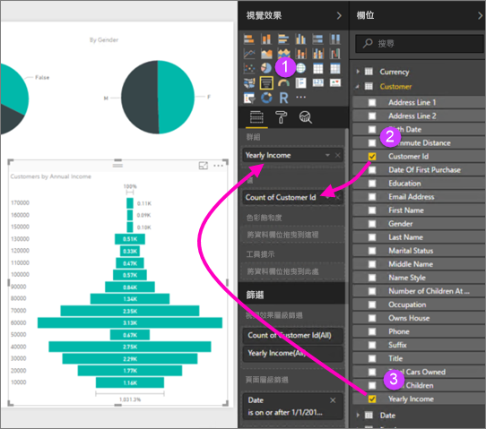
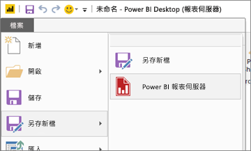

# 建立 Power BI 報表伺服器的 Power BI 報表
您可在 Power BI 報表伺服器入口網站儲存和管理內部部署 Power BI 報表，如同您可在 Power BI 服務 (https://powerbi.com) ) 中將 Power BI 報表儲存於雲端一樣。 在 Power BI Desktop 中建立和編輯報表，並將其發行至入口網站。 接著您組織的報表讀者就可在瀏覽器，或在行動裝置上的 Power BI 行動裝置應用程式中加以檢視。

以下是快速入門的四個步驟。

## 步驟 1：安裝針對 Power BI 報表伺服器最佳化的 Power BI Desktop

如果您已在 Power BI Desktop 中建立 Power BI 報告，就幾乎準備好建立 Power BI 報表伺服器的 Power BI 報告。 建議您安裝針對 Power BI 報表伺服器最佳化的 Power BI Desktop 版本，以便確保伺服器和應用程式一律會保持同步。您在同一部電腦上，可以同時有這兩個版本的 Power BI Desktop 。

1. 在報表伺服器 web 入口網站中，選取 [下載]  箭號 > [Power BI Desktop]  。

    

    或移至 [Power BI 報表伺服器](https://powerbi.microsoft.com/report-server/)首頁，然後選取 [進階下載選項]  。

2. 在 [下載中心] 頁面上，選取 [下載]  。

3. 根據您的電腦，選取：

    - **PBIDesktopRS.msi** (32 位元版本) 或

    - **PBIDesktopRS_x64.msi** (64 位元版本)。

4. 下載安裝程式之後，執行 Power BI Desktop (2019 年 9 月) 安裝精靈。

2. 在安裝結束時，請核取 [立即啟動 Power BI Desktop]  。
   
    其會自動啟動，一切即就緒。 [Power BI Desktop (2019 年 9 月)]  出現在標題列中即表示版本正確。

    

3. 如果您不熟悉 Power BI Desktop，請考慮觀看歡迎畫面上的影片。
   
    

## 步驟 2：選取資料來源
您可以連線到各式各樣的資料來源。 閱讀更多[連接至資料來源](connect-data-sources.md)。

1. 在歡迎畫面上，選取 [取得資料]  。
   
    或是在 [首頁]  索引標籤上，選取 [取得資料]  。
2. 選取您的資料來源 -- 在此範例中為 **Analysis Services**。
   
    
3. 填寫 [伺服器]  ，並選擇性地填寫 [資料庫]  。 確定已選取 [即時連接]  > [確定]  。
   
    
4. 選擇您將在其中儲存報表的報表伺服器。
   
    

## 步驟 3：設計報表
以下是有趣部分：您可以建立呈現您資料的視覺效果。

比方說，您可以依據年收入建立客戶和群組值的漏斗圖。

1. 在 [視覺效果]  中，選取 [漏斗圖]  。
2. 將要計算的欄位拖曳至 [值]  。 如果不是數值欄位，Power BI Desktop 會自動將其轉為「計數」  值。
3. 將要分組的欄位拖曳至 [群組]  。

閱讀更多有關[設計 Power BI 報表](../desktop-report-view.md)的內容。

## 步驟 4：將報表儲存至報表伺服器
當您的報表就緒時，就將其儲存到您在步驟 2 中選擇的 Power BI 報表伺服器。

1. 在 [檔案]  功能表上，選取 [另存新檔]   > [Power BI 報表伺服器]  。
   
    
2. 現在您可以在入口網站中加以檢視。
   
    

## 後續步驟
### Power BI Desktop
有許多絕佳的資源可用來在 Power BI Desktop 中建立報表。 此連結是不錯的起點。

* [開始使用 Power BI Desktop](../desktop-getting-started.md)
* 引導式學習：[探索 Power BI Desktop](/learn/modules/get-data-power-bi/2-getting-started-power-bi-desktop)

### Power BI 報表伺服器
* [安裝針對 Power BI 報表伺服器最佳化的 Power BI Desktop](install-powerbi-desktop.md)  
* [什麼是 Power BI 報表伺服器？](get-started.md)  

有其他問題嗎？ [嘗試在 Power BI 社群提問](https://community.powerbi.com/)
