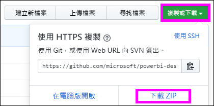
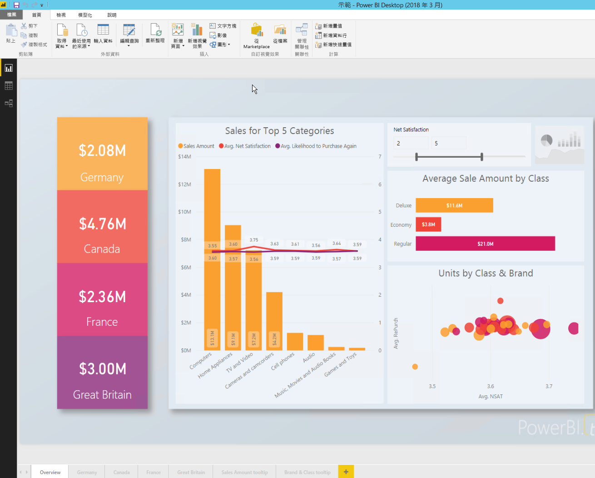
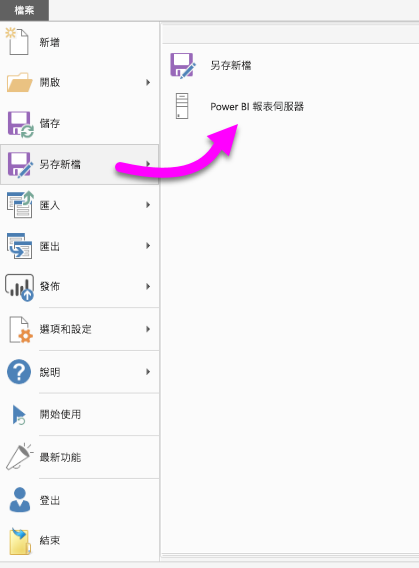
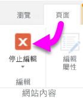

# <a name="embed-a-power-bi-report-server-report-using-an-iframe-in-sharepoint-server"></a>在 SharePoint Server 中使用 iFrame 來內嵌 Power BI 報表伺服器報表

在本文中，您將了解如何在 SharePoint 頁面中使用 iFrame 來內嵌 Power BI 報表伺服器報表。 如果您使用 SharePoint Online，則 Power BI 報表伺服器必須可供公開存取。 在 SharePoint Online 中，與 Power BI 服務搭配運作的 Power BI 網頁組件無法與 Power BI 報表伺服器搭配運作。  


## <a name="prerequisites"></a>先決條件
* 已安裝並設定 [Power BI 報表伺服器](https://powerbi.microsoft.com/report-server/)。
* 已安裝[針對 Power BI 報表伺服器最佳化的 Power BI Desktop](install-powerbi-desktop.md)。
* 已安裝並設定 [SharePoint](https://docs.microsoft.com/sharepoint/install/install) 環境。

## <a name="create-the-power-bi-report-url"></a>建立 Power BI 報表 URL

1. 從 GitHub 下載範例：[部落格示範](https://github.com/Microsoft/powerbi-desktop-samples)。 選取 [複製或下載]  ，然後選取 [下載 ZIP]  。

    

2. 解壓縮檔案，然後在已針對 Power BI 報表伺服器最佳化的 Power BI Desktop 中開啟範例 .pbix 檔案。

    

3. 將報表儲存至「Power BI 報表伺服器」  。 

    

4. 在 Power BI 報表伺服器入口網站中檢視報表。

    

### <a name="capture-the-url-parameter"></a>擷取 URL 參數

取得您的 URL 之後，即可在 SharePoint 頁面內建立 iFrame 來裝載報表。 您可以針對任何 Power BI 報表伺服器報表 URL，新增下列查詢字串參數來將報表內嵌至 SharePoint iFrame：`?rs:embed=true`。

   例如：
    ``` 
    http://myserver/reports/powerbi/Sales?rs:embed=true
    ```
## <a name="embed-the-report-in-a-sharepoint-iframe"></a>在 SharePoint iFrame 內嵌報表

1. 瀏覽至 SharePoint [網站內容]  頁面。

    ![[網站內容] 頁面](media/quickstart-embed/quickstart_embed_05.png)

2. 選擇您想要新增報表的頁面。

    ![[網站內容] 頁面應用程式](media/quickstart-embed/quickstart_embed_06.png)

3. 選取右上方的齒輪圖示，然後選取 [編輯頁面]  。

    ![[編輯頁面] 選項](media/quickstart-embed/quickstart_embed_07.png)

4. 選取 [新增網頁組件]  。

5. 在 [類別]  下，選取 [媒體及內容]  。 在 [組件]  下，選取 [內容編輯器]  ，然後選取 [新增]  。

    ![選取 [內容編輯器] 網頁組件](media/quickstart-embed/quickstart_embed_09.png)

6. 選取 [按一下此處新增內容]  。

7. 從頂端功能表，選取 [文字格式]  ，然後選取 [編輯來源]  。

     

8. 在 [編輯來源]  視窗中，將 iFrame 程式碼貼入 [HTML 原始碼]  ，然後選取 [確定]  。

    

     例如：
     ```html
     <iframe width="800" height="600" src="http://myserver/reports/powerbi/Sales?rs:embed=true" frameborder="0" allowFullScreen="true"></iframe>
     ```

9. 在頂端功能表中，選取 [頁面]  ，然後選取 [停止編輯]  。

    

    報表會顯示在頁面上。

    

## <a name="next-steps"></a>後續步驟

- [建立 Power BI 報表伺服器的 Power BI 報表](quickstart-create-powerbi-report.md)。  
- [建立 Power BI 報表伺服器的編頁報表](quickstart-create-paginated-report.md)。  

有其他問題嗎？ [試試 Power BI 社群](https://community.powerbi.com/)。 