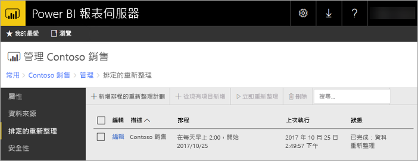

# Power BI 報表伺服器中 Power BI 報表排程的重新整理
Power BI 報表的排程重新整理可讓報表的資料保持在最新狀態。

排程的重新整理專屬於具有內嵌模型的 Power BI 報表。 這表示您是將資料匯入至報表，而不是使用即時連線或 DirectQuery。 當匯入資料時，它會與原始資料來源中斷連線，並且需要更新，讓資料保持在最新狀態。 排程的重新整理是讓資料保持在最新狀態的方式。

排程的重新整理是在報表的管理區段中設定。 如需有關如何設定排程的重新整理的詳細資訊，請參閱[如何設定 Power BI 報表排程的重新整理](configure-scheduled-refresh.md)。

## 運作方式
針對 Power BI 報表使用排程的重新整理時，會牽涉到數個元件。

* SQL Server Agent 作為計時器來產生排程的事件。
* 排程的作業會新增至事件佇列和報表伺服器資料庫中的通知。 在向外延展部署中，佇列會在部署中的所有報表伺服器間共用。
* 因為排程的事件而發生的所有報表處理會以背景處理程序執行。
* 資料模型會在 Analysis Services 執行個體中載入。
* 對於某些資料來源，Power Query 混搭引擎是用來連線至資料來源，並且轉換資料。 其他資料來源可能會直接從用來裝載 Power BI 報表伺服器資料模型的 Analysis Services 服務連線。
* 新的資料會載入至 Analysis services 中的資料模型。
* 在向外延展設定中，資料模型可以跨節點複寫。
* Analysis Services 會處理資料，並執行任何所需的計算。

Power BI 報表伺服器會為所有排程的作業維護事件佇列。 也會定期輪詢此佇列，以檢查是否有新的事件。 根據預設，佇列會以 10 秒鐘的間隔進行掃描。 您可以藉由修改 RSReportServer.config 檔案中的 **PollingInterval**、**IsNotificationService** 和**IsEventService** 組態設定，來變更間隔。 **IsDataModelRefreshService** 也可以用來設定報表伺服器是否處理排程的事件。

### Analysis Services
轉譯 Power BI 報表，以及執行排程的重新整理，需要在 Analysis Services 中載入 Power BI 報表的資料模型。 Analysis Services 處理程序將會與 Power BI 報表伺服器執行。

## 考量與限制
### 排程的重新整理無法使用時
並非所有 Power BI 報表都可以在上面建立排程的重新整理計劃。 以下是您無法建立排程的重新整理計劃之 Power BI 報表的清單。

* 您的報表包含一或多個 Analysis Services 資料來源，使用即時連線。
* 您的報表包含一或多個資料來源，使用 DirectQuery。
* 您的報表不包含任何資料來源。 例如，資料是透過「輸入資料」  手動輸入，或者報表只包含類似影像、文字等的靜態內容。

除了上述清單，在「匯入」  模式中還有資料來源的特定案例，您無法為其建立重新整理計劃。

* 如果使用「檔案」  或「資料夾」  資料來源，且檔案路徑是本機路徑 (例如 C:\Users\user\Documents)，則無法建立重新整理計劃。 路徑必須是報表伺服器可以連線的路徑，例如網路共用。 例如，\\myshare\Documents  。
* 如果資料來源只能使用 OAuth (例如，Facebook、Google Analytics、Salesforce 等) 來連線，則無法建立快取重新整理計劃。 目前，RS 不支援任何資料來源 (無論是分頁、行動或 Power BI 報表) 的 OAuth 驗證。

### 記憶體限制
報表伺服器的傳統工作負載類似於 Web 應用程式。 以匯入的資料或 DirectQuery 載入報表的能力，以及執行排程的重新整理的能力，都依賴與報表伺服器一同裝載的 Analysis Services 執行個體。 因此，這可能會造成伺服器的未預期記憶體壓力。 根據對 Analysis Services 可能會與報表伺服器一起耗用記憶體的了解，來規劃伺服器部署。

如需如何監視 Analysis Services 執行個體的詳細資訊，請參閱[監視 Analysis Services 執行個體](https://docs.microsoft.com/sql/analysis-services/instances/monitor-an-analysis-services-instance)。

如需 Analysis Services 內記憶體設定的詳細資訊，請參閱[記憶體屬性](https://docs.microsoft.com/sql/analysis-services/server-properties/memory-properties)。

### 資料模型大小限制
在排定重新整理期間載入內部 Analysis Services 引擎的資料模型大小上限為 2000 MB (2GB)。 無法設定此大小上限。 如果您的資料模型成長大於 2GB，您會收到重新整理錯誤：「結果長度超過目標大型類型的長度限制 (2GB)」。 在這種情況下，建議將模型裝載於 Analysis Services 執行個體中，並使用報表中模型的即時連線。

## 後續步驟
在 Power BI 報表上設定[排程的重新整理](configure-scheduled-refresh.md)。

有其他問題嗎？ [嘗試在 Power BI 社群提問](https://community.powerbi.com/)
