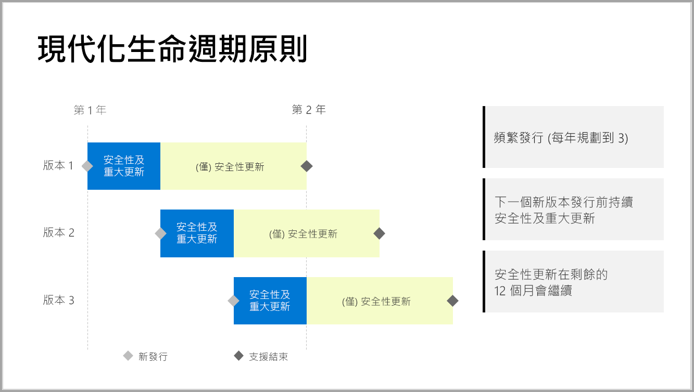

# 支援 Power BI 報表伺服器的時間軸

Power BI 報表伺服器每年發行數次。 下個版本正式推出 (GA) 後，才會提供安全性和重大更新。 下個版本發行後，舊版仍會繼續收到 12 個月發行週期的其餘安全性更新。

此支援原則可讓我們迅速為客戶提供創新的同時，又能讓客戶依自己的步調靈活採用創新。

* 安全性和重大更新服務階段 - 執行目前最新的 Power BI 報表伺服器版本時，您會同時收到安全性和重大更新。
* 安全性更新 (僅限) 服務階段 - 發行新版本後，舊版的支援會降為僅提供 12 個月支援週期剩餘的安全性更新 (如圖 1 所示)。

    

## 版本歷程記錄

| **版本** | **可用性日期** | **支援結束日期** |
| --- | --- | --- |
| 2020 年 1 月 | 2020 年 1 月 | 2020年1月，且不再支援所有舊版
| 2020 年 5 月 | 2020 年 5 月 | 2021 年 5 月
| 2020 年 10 月 | 2020 年 10 月 | 2021 年 10 月
| 2021 年 1 月 | 2021 年 1 月 | 2022年1月

若要下載 Power BI 報表伺服器，並 Power BI Desktop Power BI 報表伺服器，請移至 [內部部署報表與 Power BI 報表伺服器](https://powerbi.microsoft.com/report-server/)。

## 後續步驟
[Power BI 報表伺服器的新功能](whats-new.md)  
[什麼是 Power BI 報表伺服器？](get-started.md)
[管理員概觀](admin-handbook-overview.md)  
[安裝 Power BI 報表伺服器](install-report-server.md)  

有其他問題嗎？ [嘗試在 Power BI 社群提問](https://community.powerbi.com/)
