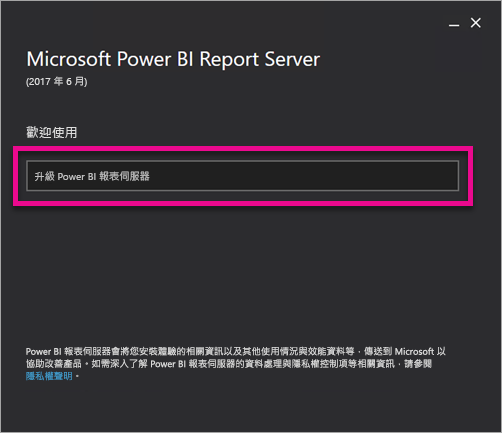
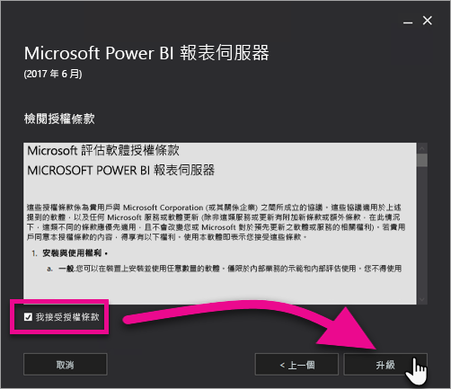
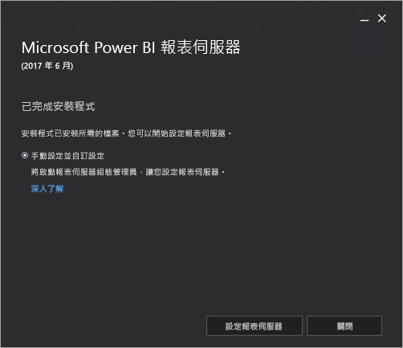

# 升級 Power BI 報表伺服器

了解如何升級 Power BI 報表伺服器。

 **下載**

若要下載 Power BI 報表伺服器，以及針對 Power BI 報表伺服器最佳化的 Power BI Desktop，請移至[使用 Power BI 報表伺服器的內部部署報表](https://powerbi.microsoft.com/report-server/)。

## 開始之前

在升級報表伺服器之前，建議您執行下列步驟來備份報表伺服器。

### 備份加密金鑰

第一次設定報表伺服器安裝時，建議您備份加密金鑰。 每次變更服務帳戶的身分識別或重新命名電腦時，也建議您備份金鑰。 如需詳細資訊，請參閱[備份和還原 Reporting Services 加密金鑰](https://docs.microsoft.com/sql/reporting-services/install-windows/ssrs-encryption-keys-back-up-and-restore-encryption-keys)。

### 備份報表伺服器資料庫

由於報表伺服器是無狀態伺服器，所有應用程式資料都會儲存在 SQL Server 資料庫引擎執行個體上執行的 **reportserver** 和 **reportservertempdb** 資料庫中。 您可以使用其中一種支援備份 SQL Server 資料庫的方法來備份 **reportserver** 和 **reportservertempdb** 資料庫。 針對報表伺服器資料庫的建議如下：

* 使用完整復原模式備份 **reportserver** 資料庫。
* 使用簡單復原模式來備份 **reportservertempdb** 資料庫。
* 您可以對每個資料庫使用不同的備份排程。 備份 **reportservertempdb** 的唯一理由是為了避免在硬體失敗時必須重新建立。 如果發生硬體故障，不需要復原 **reportservertempdb** 中的資料，但您需要資料表結構。 如果您遺失 **reportservertempdb**，找回它的唯一方法是重新建立報表伺服器資料庫。 如果您重新建立 **reportservertempdb**，它的名稱必須與主要報表伺服器資料庫的名稱相同。

如需 SQL Server 關聯式資料庫之備份和復原的詳細資訊，請參閱 [SQL Server 資料庫的備份與還原](https://docs.microsoft.com/sql/relational-databases/backup-restore/back-up-and-restore-of-sql-server-databases)。

### 備份組態檔

Power BI 報表伺服器會使用組態檔來儲存應用程式設定。 第一次設定伺服器時，以及部署任何自訂延伸模組之後，建議您備份檔案。 應該備份的檔案包括：

* config.json
* RSHostingService.exe.config
* Rsreportserver.config
* Rssvrpolicy.config
* Reportingservicesservice.exe.config
* 報表伺服器 ASP.NET 應用程式的 Web.config
* ASP.NET 的 Machine.config

## 升級報表伺服器

升級 Power BI 報表伺服器很簡單。 安裝檔案只要幾個步驟。

1. 找到 PowerBIReportServer.exe 的位置並啟動安裝程式。

2. 選取 [升級 Power BI 報表伺服器]  。

    

3. 閱讀並接受授權條款和條件，然後選取 [升級]  。

    

4. 成功升級之後，您可以選取 [設定報表伺服器]  來啟動 Reporting Services 組態管理員，或選取 [關閉]  來結束安裝程式。

    

## 升級 Power BI Desktop

報表伺服器升級之後，請確定任何 Power BI 報告作者都升級至針對符合伺服器的 Power BI 報表伺服器而最佳化的 Power BI Desktop 版本。

## 後續步驟

* [系統管理員概觀](admin-handbook-overview.md)  
* [安裝針對 Power BI 報表伺服器最佳化的 Power BI Desktop](install-powerbi-desktop.md)  
* [驗證安裝 Reporting Services](https://docs.microsoft.com/sql/reporting-services/install-windows/verify-a-reporting-services-installation)  
* [設定報表伺服器服務帳戶](https://docs.microsoft.com/sql/reporting-services/install-windows/configure-the-report-server-service-account-ssrs-configuration-manager)  
* [設定報表伺服器 URL](https://docs.microsoft.com/sql/reporting-services/install-windows/configure-report-server-urls-ssrs-configuration-manager)  
* [設定報表伺服器資料庫連接](https://docs.microsoft.com/sql/reporting-services/install-windows/configure-a-report-server-database-connection-ssrs-configuration-manager)  
* [初始化報表伺服器](https://docs.microsoft.com/sql/reporting-services/install-windows/ssrs-encryption-keys-initialize-a-report-server)  
* [在報表伺服器上設定 SSL 連線](https://docs.microsoft.com/sql/reporting-services/security/configure-ssl-connections-on-a-native-mode-report-server)  
* [設定 Windows 服務帳戶和權限](https://docs.microsoft.com/sql/database-engine/configure-windows/configure-windows-service-accounts-and-permissions)  
* [Power BI 報表伺服器的瀏覽器支援](browser-support.md)

有其他問題嗎？ [嘗試在 Power BI 社群提問](https://community.powerbi.com/)