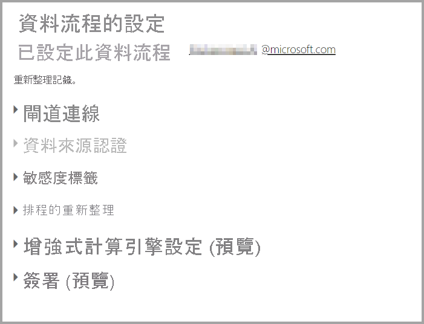
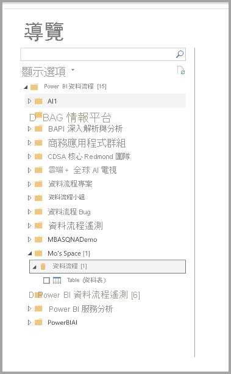

# 設定及取用資料流程

透過資料流程，您可整合多個來源的資料，並針對建立模型準備該整合資料。 當建立資料流程時，您會收到提示，其要求重新整理資料流程的資料。 在 Power BI Desktop 內的資料集中取用資料流程，或將資料流程作為連結或計算實體參考前，重新整理資料流程為必要步驟。

## 設定資料流程

若要設定重新整理資料流程，請選取 [更多] 功能表 (省略符號)，然後選取 [設定]。

[設定] 選項提供許多資料流程的選項，如下列各節所述。

* **取得所有權：** 若您不是資料流程的擁有者，則其中許多設定可能會遭到停用。 若要取得資料流程的所有權，請選取 [接管] 來取得控制權。 您會收到提示，其要求提供認證來確認您具備必要的存取層級。

* **閘道連線：** 在本節中，您可選擇資料流程是否會使用閘道，以及要使用哪個閘道。 

* **資料來源認證：** 在本節中，您可選擇要使用的認證，且可變更資料來源的驗證方式。

* **敏感度標籤：** 您可在這裡定義資料流程中的資料敏感度。 若要深入了解敏感度標籤，請參閱[如何在 Power BI 中套用敏感度標籤](../../admin/service-security-apply-data-sensitivity-labels.md)。

* **排程的重新整理：** 您可在這裡定義所選取資料流程重新整理的天數。 資料流程的重新整理頻率可和資料集相同。

* **增強式計算引擎設定：** 您可在這裡定義資料流程是否會儲存在計算引擎中。 計算引擎允許參考此資料流程的後續資料流程來執行合併、加入及其他轉換，且速度會比使用其他方式來得更快。 其也允許針對資料流程執行 DirectQuery。 選取 [開啟] 以確保 DirectQuery 模式中一律支援資料流程，且任何參考都能受益於引擎。 選取 [最佳化] 表示只會在具有對此資料流程的參考時，才會使用引擎。 選取 [關閉] 會停用此資料流程的計算引擎和 DirectQuery 功能。

* **背書：** 您可定義是否要認證或推廣資料流程。 

## 重新整理資料流程
資料流程會作為彼此的建置組塊。 假設您有一個稱為「原始資料」的資料流程，以及一個稱為「轉換資料」的連結的實體，其中包含對「原始資料」資料流程的連結的實體。 當觸發「原始資料」資料流程的重新整理時，其將會在完成時觸發任何參考該資料流程的資料流程。 這項功能會建立重新整理的鏈結效果，讓您避免手動排程資料流程。 處理連結的實體重新整理時，有幾個要注意的細節：

* 只有當連結的實體存在於相同的工作區時，重新整理才會觸發連結的實體

* 若來源實體正在重新整理，則會封鎖連結的實體，禁止進行編輯。 若參考鏈結中的任何一個資料流程無法重新整理，則所有的資料流程都會復原到舊資料 (資料流程重新整理在工作區內為交易式)。

* 由來源重新整理完成進行觸發時，只會重新整理參考的實體。 若要排程所有實體，建議同時在連結的實體上設定排程重新整理。 請避免在連結的資料流程上設定重新整理排程，以避免重複進行重新整理。

**取消重新整理** 與資料集不同，資料流程支援取消重新整理。 若重新整理執行時間過長，您可選取資料流程選項 (資料流程旁邊的省略符號)，然後選取 [取消重新整理]。

**累加式重新整理 (僅限 Premium)** 資料流程也可以設定為累加式重新整理。 若要執行這項操作，請選取要設為累加式重新整理的資料流程，然後選取累加式重新整理圖示。

設定累加式重新整理會將參數新增至資料流程，以指定日期範圍。 如需如何設定累加式重新整理的詳細資訊，請參閱 [Power Query 中的累加式重新整理](/power-query/dataflows/incremental-refresh) (英文) 一文。

在某些情況下，建議不要設定累加式重新整理：

* 若連結的實體參考資料流程，則連結的實體便不應使用累加式重新整理。 資料流程不支援查詢折疊 (即使實體已啟用 Direct Query 也一樣)。 

* 參考資料流程的資料集不應使用累加式重新整理。 一般而言，資料流程的重新整理為高效能，因此不需要進行累加式重新整理。 若重新整理花費時間過長，請考慮使用計算引擎，或 DirectQuery 模式。

## 取用資料流程

您可透過下列三種方式取用資料流程：

* 從資料流程建立連結的實體，允許另一個資料流程作者使用資料

* 從資料流程建立資料集，允許使用者利用資料來建立報表

* 從外部工具建立連線，以從 CDM 格式進行讀取

**從 Power BI Desktop 取用** 若要取用資料流程，請執行 Power BI Desktop 並選取 [取得資料] 對話方塊中的 [Power BI 資料流程連接器]。

> [!NOTE]
> Power BI 資料流程連接器會使用與目前登入使用者不同的認證集。 這項設計旨在支援多租用戶使用者。

選取所要連線的資料流程和實體。 

> [!NOTE]
> 無論其所在的工作區為何、是否已在 Premium 和非 Premium 工作區中經過定義，您都可以連線到任何資料流程或實體。

若 DirectQuery 可供使用，即會收到提示，其要求選擇是要透過 DirectQuery 或 [匯入] 來連線到實體。 

在 DirectQuery 模式中，您可快速地在本機查閱大規模的資料集。 但是，您無法執行任何其他的轉換。 

使用 [匯入] 可將資料帶入 Power BI，且資料集會需要於資料流程外獨立進行重新整理。

## 後續步驟
下列文章提供資料流程和 Power BI 的詳細資訊：

* [資料流程和自助資料準備簡介](dataflows-introduction-self-service.md)
* [建立資料流程](dataflows-create.md)
* [將資料流程儲存體設定為使用 Azure Data Lake Gen 2](dataflows-azure-data-lake-storage-integration.md)
* [資料流程的進階功能](dataflows-premium-features.md)
* [使用資料流程的 AI](dataflows-machine-learning-integration.md)
* [資料流程限制與考量](dataflows-features-limitations.md)
* [資料流程最佳做法](dataflows-best-practices.md)