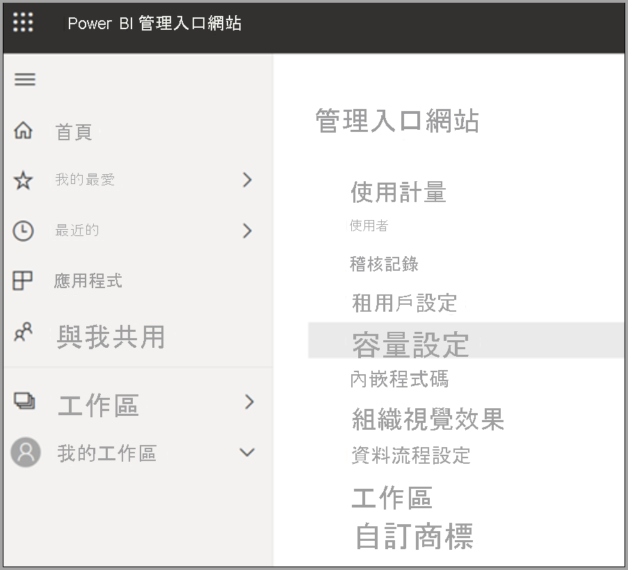
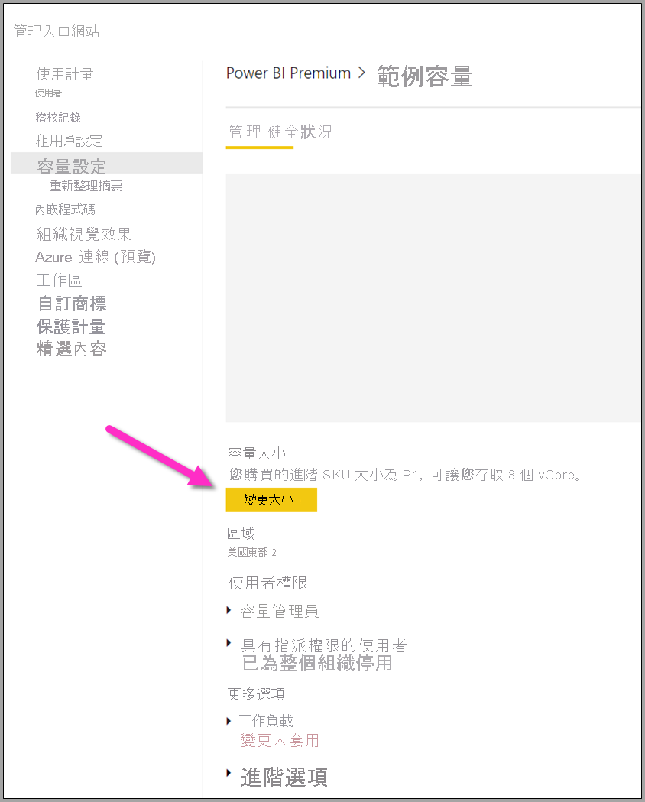
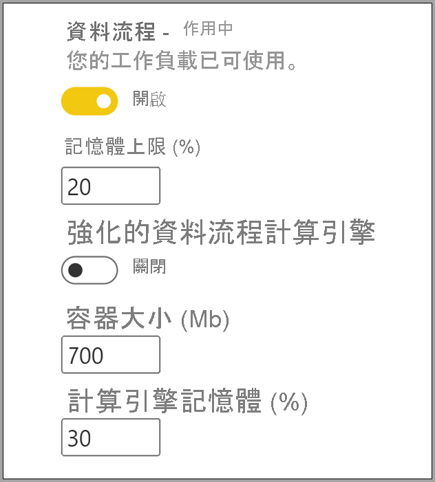

# 設定 Power BI Premium 的資料流程工作負載

您可在 Power BI Premium 訂用帳戶中建立資料流程工作負載。 Power BI 會使用「工作負載」的概念來描述 Premium 內容。 工作負載包括資料集、編頁報表、資料流程與 AI。 「資料流程」工作負載可讓您使用資料流程的自助資料準備來內嵌、轉換、整合以及擴充資料。 Power BI Premium 資料流程是在 [管理入口網站] 中進行管理。

![[管理入口網站] 中的 Power BI Premium 資料流程](media/dataflows-premium-workload-configuration/dataflows-premium-workloads-01.png)

下列各節描述如何在組織中啟用資料流程、如何改善 Premium 容量設定，以及常見使用方式的指引。

## 在 Power BI Premium 中啟用資料流程

在 Power BI Premium 訂用帳戶中使用資料流程的第一個需求，是為組織啟用資料流程的建立與使用功能。 在 [管理入口網站] 中，選取 [租用戶設定]，然後將 [資料流程設定] 底下的滑桿切換為 [啟用]，如下圖所示。

![[管理入口網站] 中的 Power BI Premium 資料流程](media/dataflows-premium-workload-configuration/dataflows-premium-workloads-01.png)

啟用資料流程工作負載之後，即會使用預設設定進行設定。 您可視需要調整這些設定。 接下來，我們將描述這些設定的位置、詳述每個設定，並幫助您了解變更設定值的時機，以將資料流程效能最佳化。

## 改善資料流程設定

啟用資料流程之後，您可使用 [管理入口網站] 來變更或改善資料流程的建立方式，以及資料流程如何使用您在 Power BI Premium 訂用帳戶中的資源。 下列步驟會說明如何調整資料流程設定。

1. 在 [管理入口網站] 中，選取 [租用戶設定]，列出所有已建立的容量。 選取欲管理設定的容量。

    

2. Power BI Premium 容量會反映資料流程可用的資源。 您可選取 [變更大小] 按鈕來變更容量大小，如下圖所示。

    

3. 在 [容量設定] 中，您可展開 [工作負載]，以對資料流程進行設定。

    ![展開 [工作負載] 區段](media/dataflows-premium-workload-configuration/dataflows-premium-workloads-04.png)

4. 在 [工作負載] 區段中，捲動至 [資料流程] 區域。 下圖顯示的設定，可讓您針對容量來控制或改善資料流程工作負載的行為。

    

下表提供資料流程設定的基本描述。

| **管理區段** | **設定名稱** | **描述** |
|---------|---------|---------|
| **容量大小** | **變更大小** | 列出目前選取的容量，以及變更容量的選項。 變更此設定可讓您擴大或縮小容量。 |
| **[工作負載]** | **最大記憶體 (%)** | 資料流程可在容量中使用的可用記憶體百分比上限。 |
| **[工作負載]** | **增強型資料流程計算引擎** | 啟用此選項可讓您在處理大型資料量時，提高計算實體的計算速度高達 20 倍。  **您必須重新啟動容量，才能啟動新的引擎。**  如需詳細資訊，請參閱[強化的資料流程計算引擎](../../admin/service-admin-premium-workloads.md#enhanced-dataflows-compute-engine)。 |
| **[工作負載]** | **容器大小** | 資料流程針對資料流程中每個實體所使用的容器大小上限。 預設值為 700 MB。 如需詳細資訊，請參閱[容器大小](../../admin/service-admin-premium-workloads.md#container-size)。 |
| **[工作負載]** | **計算引擎記憶體 (%))** | 配置給計算引擎記憶體的最大百分比。 預設值為 30% |

在下列各節中，我們將詳細說明每個設定，以及這些設定對資料流程工作負載有何影響。

### 了解資料流程工作負載的選項

您可透過比喻的方式，輕鬆地了解資料流程工作負載選項。 您可將「容量大小」或所擁有的 Power BI Premium 執行個體類型，想像為「餐廳」。 在餐廳中，會有「工作負載記憶體」，即「廚房」。 「計算引擎」則為「烤箱」。 最後，「容器」則類似於「廚師」的手藝。 請想像您要為一場大型或非常重要的晚宴備餐，即評估資料流程工作負載選項。 您有很重要的貴賓出席，而您必須備妥晚餐，才能即時在貴賓到場時提供餐點。

我們會在說明每個設定並提供指引時，將此餐廳作為比喻。 我們會從最上層 (Premium 容量) 開始，因為這是您在使用 Power BI Premium 時的首要選擇。

#### Premium 容量 SKU - 擴大硬體

Power BI Premium 工作負載結合前端與後端核心，在各種不同工作負載類型之間提供快速的查詢。 在[容量節點](../../admin/service-premium-what-is.md#capacity-nodes)一文的圖表中，會說明每個可用工作負載供應項目的目前規格。 因為 A3 及更高的容量可利用計算引擎，所以當想要使用增強的計算引擎時，請參閱[容量節點](../../admin/service-premium-what-is.md#capacity-nodes)。 

在餐廳的比喻法中，選擇容量就像選擇高品質的餐廳。 儘管成本較高，但由於增加了前端核心、後端核心以及更多記憶體，您也能夠獲得高階的效能。 當選擇較大的餐廳時，您會有更大的廚房，以及較好的廚師，這類似於在 Power BI Premium 中升級至較高的 SKU，讓您提升 CPU 速度、增加每個作業的記憶體，以及新增更多平行處理。

#### 最大記憶體 - 專用於資料流程的容量 

[最大記憶體 %] 設定是 Premium 容量可用的實體記憶體中，提供給資料流程工作負載的記憶體百分比。 您可有效率地為資料流程工作負載提供最大容量，而容量會視需要動態擴大至您所設定的配置。 在我們的比喻中，如果讓廚房變大，您就可以處理更多的餐點，同樣地，您可為資料流程增加容量的工作負載大小，並允許更多的資料流程。 當動態資源管理已就緒時，「最大記憶體 %」設定選項就可讓您將 100% 的記憶體專用於資料流程工作負載。 當罕見地想要確保資料流程工作負載可使用容量記憶體，而不是依賴資源管理時，才會使用此設定。 在我們的比喻中，這就像是要確保廚房專心為貴賓準備特定餐點，讓整個廚房全心投入這項任務。 當然，提供更多食物並不意味著更美味的食物，或在更短的時間內上桌，下一節將詳細說明。

#### 容器大小 - 重新整理或記憶體不足問題

接下來，我們要討論 **容器大小 (MB)** 設定。 在內部，資料流程會使用稱為「交互式容器」的處理序來評估 ETL 處理序。 引擎會將查詢邏輯分割至這些容器，以便容器可進行平行處理。 容器的數目會有效提供並行處理，藉此提升效能。 這些容器會先受到 [容量] 的限制，再來是 [最大記憶體 %] 設定，最後是在容器設定中，您特別配置給容器的記憶體數量 (預設為700 MB)。 因此，您可增加硬體記憶體數量並增加容器大小，但這麼做會在為容器內特定 ETL 處理序提供更多記憶體的同時，減少平行作業。 容器數目上限為後端核心數目的三倍，這數字很重要，因為您無法讓容器變得非常小，但又同時具有許多平行容器。 容器大小下限為 200 MB。 容器大小也會限制在查詢層級的範圍內，這表示每個查詢都會在自身的容器中執行，但在查詢參考其他查詢的情況下，查詢會重新整理至相同的容器中。

回到我們的比喻，根據菜單種類與餐點複雜度的不同，在廚房中擁有較少名但更專心的廚師，可讓您更快速地準備餐點。 此處的取捨是廚師較少，但有更多時間專心準備餐點。 同樣地，將容器大小量值增加到 1200-1500 MB，表示較少但較複雜的 ETL 作業 (例如彙總、聯結、樞紐、資料列或資料行操作等活動) 能夠提升效能，因為我們為每個容器提供更多的記憶體，但在這種情況下，則會減少容器的數目。 正如其比喻所示，太多人點餐可能會使廚房出餐變慢，您可用這種方式來思考容器大小。當需要複雜的實體作業來完成工作，且您願意犧牲效能進行平行處理 (因為增加此資源會將記憶體分割給較少的容器) 時，就請這麼想。

總而言之，您會希望根據使用中的查詢，將容器大小最佳化。 例如，將資料從來源載入至實體，並不需要提取資料並執行任何作業，只是將資料載入至儲存體而已。 您希望在這種情況下，盡可能使用更多的平行處理，因為您想要增加負載與重新整理作業的速度。 相反地，當新增更多轉換作業 (複雜的篩選、聯結、彙總) 時，記憶體需求可能會更高，因為我們可能需要在記憶體中處理一些轉換作業。 請注意，如果正在容量上執行其他資料流程作業，這麼做可能會使這些作業變慢，並強制其排入佇列，並在執行位置等候。 為此， **Power BI Premium 容量計量** 應用程式可為監視及管理資料流程、重新整理效能，以及整體容量提供協助。 您可以使用 [Power BI Premium 容量計量](../../admin/service-premium-capacity-optimize.md#what-content-is-using-up-my-capacity)應用程式依容量進行篩選，並檢閱工作區內容的效能計量。 您可檢閱儲存在 Premium 容量中所有內容在過去七天每小時的效能計量和資源使用狀況。所以，建議使用這個應用程式，開始調查資料流程效能。

#### 增強型計算引擎 - 改善效能的機會

在我們的比喻中，[增強型計算引擎](dataflows-premium-features.md#the-enhanced-compute-engine)就如同烤箱。 Power BI 使用計算引擎來處理查詢及重新整理作業。 增強型計算引擎是改善過的標準引擎，其運作方式是將資料載入 SQL Cache，並使用 SQL 加速實體轉換、重新整理作業並啟用 DirectQuery 連線。 如果我們將引擎比喻為烤箱，當利用增強的烤箱時，您即可更快速且更有效率地準備餐點。 如果將計算實體設定為 [開啟] 或 [最佳化]，則在商務邏輯允許的情況下，Power BI 便會使用 SQL 來提高效能。 將引擎設定為 [開啟]，也能提供 DirectQuery 連線。 如同比喻所述，某些餐點可能不需要烤箱，也無法利用烤箱。 您可用類似的方式來思考增強型計算引擎，確定資料流程使用量是以適當的放式運用增強型計算引擎。

> [!NOTE]
> 增強型計算引擎尚未在所有區域中提供使用。

## 常見案例的指引

本節提供搭配 Power BI Premium 使用資料流程工作負載時，常見案例的指引。

### 重新整理緩慢

重新整理緩慢通常是平行處理發生問題。 您應該依序檢查下列選項：

1. 對於重新整理緩慢而言，重點在於您進行資料準備的本質。 在本文稍早的餐廳比喻中，假設已經備妥食物，等待使用。 在此案例中，因為準備時間最短，所以食物的處理後速度會更快。 同樣地，只要您可利用資料來源，實際執行準備及預先查詢邏輯，藉此將緩慢的重新整理最佳化，您就應該這麼做。 具體而言，使用關聯式資料庫 (例如 SQL) 作為來源時，請查看初始查詢是否可在來源上執行，並將該來源查詢用於資料來源的初始擷取資料流程。 如果無法在來源系統中使用原生查詢，請執行資料流程[引擎可摺疊至資料來源](https://docs.microsoft.com/power-query/power-query-folding)的作業。

2. 評估在相同容量下的分配重新整理時間。 重新整理作業是需要大量計算的處理序。 在我們的餐廳比喻中，分配重新整理時間類似於限制餐廳中的貴賓人數。 就像餐廳會為貴賓安排用餐時間並規劃容納人數，您也會想在使用量不是處於尖峰的時候，考慮執行重新整理作業。 這對於減輕容量負荷可能有很大的幫助。

3. 增加分配給工作負載的總記憶體數量。 請將此視為廚房的大小。 改善此資源的方式，類似於調整您可在廚房中容納多少名廚師。 這可藉由調整 [記憶體上限 %] 設定來完成，最多增加至 100%。

4. 減少容器的記憶體數量，以允許使用更多容器。 您可想像為：與其雇用像 Gordon Ramsey 這樣的著名大廚，不如雇用許多名稱職但薪資較低的廚師。 因此，您在廚房中有更多名廚師，但這些廚師只能執行較簡單的工作。 這表示您會有更多容器，但較少的記憶體。

5. 執行上述兩個步驟，因為您有更多廚師以及更大的廚房，表示您可進行更大程度的平行處理。
    
6. 如果本節中步驟無法提供您所需的平行處理程度，請考慮將容量升級為較高的 SKU。 然後再次遵循本節中的步驟。

### 記憶體不足例外狀況

當遇到 **記憶體不足例外狀況** 時，您必須增加容器與記憶體的效能。 請採取下列步驟。

1. 增加容器上的記憶體。 這類似上一節所述，如同一位星級大廚與許多名廚師之間的差異。

2. 為工作負載及容器增加更多記憶體。 在我們的比喻中，這如同建立更大的廚房，以及雇用更高品質的廚師。

3. 如果這些變更無法提供您所需的平行處理程度，請考慮使用較高階的 Power BI Premium SKU。

### 使用計算引擎來改善效能

採取下列步驟，讓工作負載能夠觸發計算引擎，並持續改善效能：

**針對相同工作區中的計算與連結實體：**

1. 針對「內嵌」，請著重於盡快將資料放入儲存體，只有在篩選降低整體資料集大小時，才使用篩選。 最佳做法是讓轉換邏輯與此步驟分開，並讓引擎專注於初始的要素收集。 接下來，使用連結或計算實體，將轉換與商務邏輯在相同工作區中分為不同資料流程，這麼做可讓引擎啟動並加速計算。 在我們的比喻中，這就像在廚房中準備食物：準備食物通常是獨立且不同的步驟，從取得原始食材，到將食物放入烤箱中等事前處理。 同樣地，邏輯必須另外準備好，才能利用計算引擎。

2. 請務必執行可摺疊的作業，例如合併、聯結、轉換[等等](https://docs.microsoft.com/power-query/power-query-folding#transformations-that-can-achieve-folding)。

3. [在已發佈的指引與限制內](dataflows-features-limitations.md#dataflows-in-premium)建置資料流程。

您也可以使用 DirectQuery。

### 計算引擎已開啟，但效能緩慢

在調查計算引擎已開啟，但效能緩慢的案例時，請採取下列步驟：

1. 限制存在於不同工作區之間的計算與連結實體。

2. 如果已開啟計算引擎的初始重新整理，並接著在資料湖與快取中寫入資料， 這種雙重寫入方式會讓這些重新整理會變得緩慢。

3. 如果資料流程連結至多個資料流程，請確定您已為來源資料流程的重新整理進行排程，使其不會同時重新整理。

## 後續步驟
下列文章提供資料流程和 Power BI 的詳細資訊：

* [資料流程和自助資料準備簡介](dataflows-introduction-self-service.md)
* [建立資料流程](dataflows-create.md)
* [設定及取用資料流程](dataflows-configure-consume.md)
* [將資料流程儲存體設定為使用 Azure Data Lake Gen 2](dataflows-azure-data-lake-storage-integration.md)
* [使用資料流程的 AI](dataflows-machine-learning-integration.md)
* [資料流程限制與考量](dataflows-features-limitations.md)
