# 在 Power BI Desktop 中使用彙總

Power BI 中的「彙總」  可讓您減少資料表大小，以便能夠專注於重要的資料並改善查詢效能。 彙總可讓您透過之前不可行的方式來進行巨量資料互動式分析，且可以大幅降低解除鎖定大型資料集以制定決策的成本。

使用彙總的一些優點包括：

- **對巨量資料的查詢效能更佳**。 每次與 Power BI 視覺效果互動時，都會將 DAX 查詢提交給資料集。 所快取彙總資料會使用詳細資料所需的一小部分資源，因此您可以解除鎖定原本無法存取的巨量資料。
- **資料重新整理最佳化**。 較小的快取大小可減少重新整理時間，因此向使用者提供資料的速度更快。
- **架構平衡**。 Power BI 記憶體內部快取可以處理彙總查詢、限制以 DirectQuery 模式傳送的查詢，並協助您符合並行限制。 其餘的詳細層級查詢通常會經過篩選 (交易式層級的查詢)，資料倉儲和巨量資料系統一般能正常處理這些查詢。

維度資料來源 (例如資料倉儲和資料超市) 可以使用[以關聯性為基礎的彙總](#aggregation-based-on-relationships)。 以 Hadoop 為基礎的巨量資料來源通常會[以 GroupBy資料行作為彙總基底](#aggregation-based-on-groupby-columns)。 本文描述每種資料來源類型的一般 Power BI 建模差異。

## 建立彙總資料表

若要建立彙總資料表：
1. 根據資料來源和模型，使用您想要的欄位設定新資料表。 
1. 使用 [管理彙總]  對話方塊來定義彙總。
1. 若適用，請變更彙總資料表的[儲存模式](#storage-modes)。 

### 管理彙總

建立含有所要欄位的新資料表之後，在任何 Power BI Desktop 檢視的 [欄位]  窗格中，以滑鼠右鍵按一下該資料表，然後選取 [管理彙總]  。

![選取 [管理彙總]](media/desktop-aggregations/aggregations-06.png)

[管理彙總]  對話方塊會顯示資料表的每個資料行都有一筆資料列，您可以在此指定彙總行為。 在下列範例中，對 **Sales** 詳細資料資料表的查詢會在內部重新導向至 **Sales Agg** 彙總資料表。 

[管理彙總]  對話方塊中的 [摘要]  下拉式清單提供下列值：
- Count
- GroupBy
- 最大值
- Min
- Sum
- 計數表格列

![[管理彙總] 對話方塊](media/desktop-aggregations/aggregations_07.jpg)

在這個以關聯性為基礎的彙總範例中，GroupBy 項目是選擇性項目。 除了 DISTINCTCOUNT 之外，這些項目不會影響彙總行為，主要是為了方便閱讀。 即使沒有這些 GroupBy 項目，仍會根據關聯性叫用彙總。 這不同於本文稍後的[巨量資料範例](#aggregation-based-on-groupby-columns)，其中的 GroupBy 項目是必要項目。

定義您想要的彙總之後，請選取 [全部套用]  。 

### 驗證

[管理彙總]  對話方塊會強制執行下列值得注意的驗證：

- 除了計數和計數資料表資料列**摘要**函式之外，**詳細資料資料行**必須和**彙總資料行**具有相同資料類型。 計數和計數資料表資料列僅供整數彙總資料行使用，資料類型不用相符。
- 不允許鏈結彙總涵蓋三份或更多的資料表。 例如，**資料表 A** 的彙總無法參考所含彙總參考**資料表 C** 的**資料表 B**。
- 不允許重複彙總有兩個項目使用同一**摘要**函式，且參考相同的**詳細資料資料表**和**詳細資料資料行**。
- **詳細資料資料表**必須使用 [DirectQuery] 儲存模式，而不是 [匯入]。
- 不支援依非作用中關聯性所使用的外部索引鍵資料行進行分組，亦不支援依賴 USERELATIONSHIP 函式進行彙總。

大部分驗證都是透過停用下拉式清單中的值，並在工具提示中顯示說明文字來強制執行，如下圖所示。

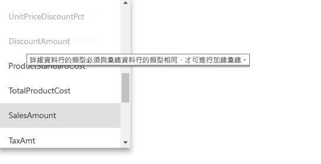

### 彙總資料表為隱藏

具有資料集唯讀存取權的使用者無法查詢彙總資料表。 這可避免與「資料列層級安全性」(RLS)  搭配使用時的安全性疑慮。 取用者和查詢參考的是詳細資料資料表，而不是彙總資料表，也不需要知道彙總資料表。

基於這個理由，[報表]  檢視會隱藏彙總資料表。 如果尚未隱藏資料表，則 [管理彙總]  對話方塊會在您選取 [全部套用]  時，將其設定為隱藏。

### 儲存模式
彙總功能會與資料表層級的儲存模式互動。 Power BI 資料表可以使用 [DirectQuery]  、[匯入]  或 [雙重]  儲存模式。 [DirectQuery] 會直接查詢後端，而 [匯入] 會快取記憶體中的資料，並將查詢傳送至快取的資料。 所有 Power BI 匯入和非多維度的 DirectQuery 資料來源都使用彙總。 

若要將彙總資料表的儲存模式設定為 [匯入] 以加速查詢，請在 Power BI Desktop 的 [模型]  檢視中選取彙總資料表。 在 [屬性]  窗格中，展開 [進階]  ，下拉 [儲存模式]  底下的選取項目，然後選取 [匯入]  。 請注意，此動作無法復原。 

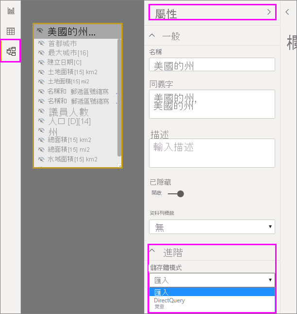

如需資料表儲存模式的詳細資訊，請參閱[管理 Power BI Desktop 中的儲存模式](desktop-storage-mode.md)。

### 適用於彙總的 RLS

為了正確地進行彙總，RLS 運算式應篩選彙總資料表和詳細資料資料表。 

在下列範例中，**Geography** 資料表上的 RLS 運算式適用於彙總，因為 Geography 位於 **Sales** 資料表和 **Sales Agg** 資料表兩者的關聯性篩選端。 不論查詢是否叫用彙總資料表，都會成功套用 RLS 查詢。

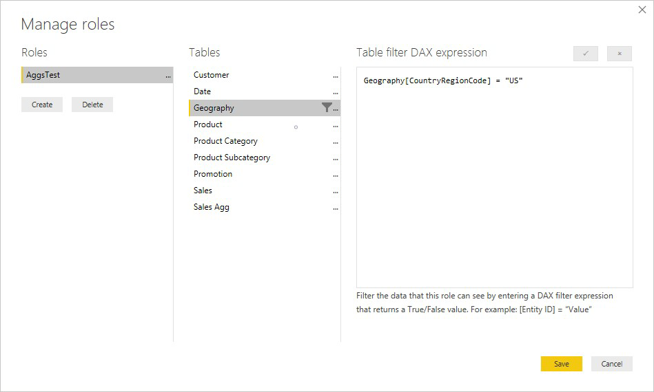

**Product** 資料表上的 RLS 運算式只會篩選 **Sales** 詳細資料資料表，而不會篩選 **Sales Agg** 彙總資料表。 由於彙總資料表是詳細資料資料表中資料的另一種表示法，如果無法套用 RLS 篩選，則從彙總資料表回答查詢是不安全的。 不建議只篩選詳細資料資料資料表，因為來自此角色的使用者查詢不會受益於彙總叫用。 

不允許只篩選 **Sales Agg** 彙總資料表，而不篩選 **Sales** 詳細資料資料表的 RLS 運算式。

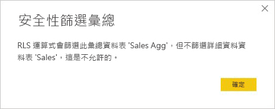

針對[以 GroupBy 資料行為基礎的彙總](#aggregation-based-on-groupby-columns)，套用到詳細資料資料表的 RLS 運算式可以用來篩選彙總資料表，因為詳細資料資料表已涵蓋彙總資料表中的所有 GroupBy 資料行。 另一方面，彙總資料表上的 RLS 篩選無法套用至詳細資料資料表，因此不允許使用。

## 以關聯性為基礎的彙總

維度模型通常會使用「以關聯性為基礎的彙總」  。 來自資料倉儲和資料超市的 Power BI 資料集，類似於星狀/雪花式結構描述，且具有維度資料表與事實資料表間的關聯性。

在來自單一資料來源的下列模型中，資料表會使用 [DirectQuery] 儲存模式。 **銷售**事實資料表包含數十億筆資料列。 將 **Sales** 的儲存模式設定成 [匯入] 以供快取將會耗用大量的記憶體和管理額外負荷。

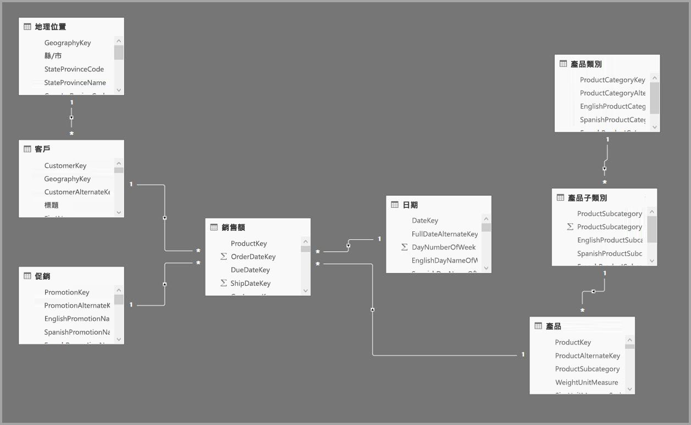

請改為建立 **Sales Agg** 彙總資料表。 在 **Sales Agg** 資料表中，資料列數目應該等於 **SalesAmount** 的總和，而 SalesAmount 是 **CustomerKey**、**DateKey** 以及 **ProductSubcategoryKey** 的組合。 **Sales Agg** 資料表的資料粒度比 **Sales** 還高，因此該資料表可能包含數百萬個資料列，而不是數十億，如此更易於管理。

如果下列維度資料表最常用於具有高度商業價值的查詢，則可以使用「一對多」  或「多對一」  關聯性來篩選 *Sales Agg*。

- 地理位置
- 客戶
- 日期
- 產品子類別
- 產品類別

下圖顯示此模型。

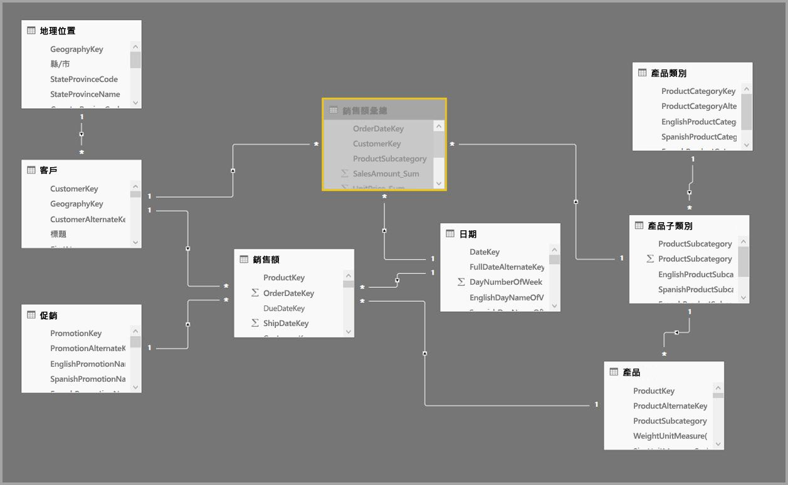

下表顯示 **Sales Agg** 資料表的彙總。

> [!NOTE]
> **Sales Agg** 資料表就像任何資料表一樣，可以各種方式靈活載入。 可使用 ETL/ELT 處理程序在來源資料庫中執行彙總，或由資料表的 [M 運算式](/powerquery-m/power-query-m-function-reference)執行彙總。 彙總資料表可以使用 [匯入] 儲存模式 (包含或不含 [Power BI Premium 中的累加式重新整理](../admin/service-premium-incremental-refresh.md))，或其可使用 [DirectQuery] 且使用[資料行存放區索引](/sql/relational-databases/indexes/columnstore-indexes-overview)來最佳化快速查詢。 此彈性可讓已平衡的架構分散查詢負載，避免出現瓶頸。

將 **Sales Agg** 彙總資料表的儲存模式變更為 [匯入]  會開啟一個對話方塊，指出相關的維度資料表可以設定為 [雙重]  儲存模式。 

![[儲存模式] 對話方塊](media/desktop-aggregations/aggregations_05.jpg)

將相關的維度資料表設定為 [雙重] 可將其當作 [匯入] 或 [DirectQuery] 執行，視子查詢而定。 在範例中︰

- 可以從記憶體內部快取傳回查詢，這些查詢會從匯入模式的 **Sales Agg** 資料表中彙總計量，並依照來自相關雙重模式資料表的屬性進行分組。
- 可以在 DirectQuery 模式中傳回查詢，這些查詢會從 DirectQuery 模式的 **Sales** 資料表中彙總計量，並依照來自相關雙重模式資料表的屬性進行分組。 包含 GroupBy 方式作業的查詢邏輯會向下傳遞至來源資料庫。

如需 [雙重] 儲存模式的詳細資訊，請參閱[管理 Power BI Desktop 中的儲存模式](desktop-storage-mode.md)。

### 強與弱關聯性

根據關聯性叫用彙總需要強關聯性。

強關聯性包含下列儲存模式組合，其中兩個資料表都是來自單一來源：

| 位於「多」  邊的資料表 | 位於單  邊的資料表 |
| ------------- |----------------------| 
| 雙重          | 雙重                 | 
| 匯入        | 匯入或雙重       | 
| DirectQuery   | DirectQuery 或雙重  | 

只有在兩個資料表都設為 [匯入] 的情況下，才會將「跨來源」  關聯性視為強。 多對多關聯性一律視為弱。

針對不依靠關聯性的「跨來源」  彙總叫用，請參閱[以 GroupBy 資料行為基礎的彙總](#aggregation-based-on-groupby-columns)。 

### 以關聯性為基礎的彙總查詢範例

下列查詢叫用彙總，因為 **Date** 資料表中的資料行為可以叫用彙總的資料粒度。 **SalesAmount** 資料行使用 **Sum** 彙總。

下列查詢不會叫用彙總。 儘管要求 **SalesAmount** 的加總，但此查詢仍會對 **Product** 資料表中的資料行執行 GroupBy 作業，其資料粒度不可以叫用彙總。 如果您觀察模型中的關聯性，產品子類別可以有多個 **Product** 資料列。 查詢無法判斷要彙總到哪一個產品。 在此情況下，查詢會還原為 DirectQuery，並將 SQL 查詢提交至資料來源。

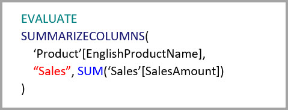

彙總不只是執行簡單加總的簡易計算。 它也可以提供複雜的計算。 就概念而言，複雜計算會細分為每個 SUM、MIN、MAX 和 COUNT 的子查詢，並評估每個子查詢，以判斷其是否能叫用彙總。 因為查詢方案最佳化之故，並非所有情況都適用此邏輯，但通常皆適用。 下列範例會叫用彙總：

COUNTROWS 函式可以受益於彙總。 下列查詢會叫用彙總，因為 **Sales** 資料表已定義**計數資料表資料列**彙總。

AVERAGE 函式可以受益於彙總。 下列查詢會叫用彙總，因為 AVERAGE 會在內部摺疊成除以 COUNT 的 SUM。 因為 **UnitPrice** 資料行已定義 SUM 和 COUNT 的彙總，所以會叫用彙總。

在某些情況下，DISTINCTCOUNT 函式可受益於彙總。 下列查詢會叫用彙總，因為 **CustomerKey** 有 GroupBy 項目，可維護彙總資料表中 **CustomerKey** 的差異。 有 2 百萬以上至 5 百萬個相異值會影響查詢效能，這項技術可能仍會達到此效能閾值。 不過，對於詳細資料資料表有數十億筆資料列，但資料行中有 2 百萬至 5 百萬個相異值的案例，這項技術很有幫助。 在此情況下，DISTINCTCOUNT 執行速度會比掃描具有數十億筆資料列的資料表快，即使該資料表已快取到記憶體中也一樣。

DAX 時間智慧函式為彙總感知。 下列查詢會叫用彙總，因為 DATESYTD 函式會產生 **CalendarDay** 值的資料表，而彙總資料表所產生的資料表，其細微性達到由 **Date** 資料表群組依據資料行所涵蓋的內容。 這是可使用彙總的 CALCULATE 函式資料表值篩選範例。

## 以 GroupBy 資料行為基礎的彙總 

Hadoop 巨量資料模型的特性不同於維度模型。 為避免大型資料表之間的聯結，巨量資料模型通常不會使用關聯性，而是將維度屬性反正規化為事實資料表。 您可以使用「以 GroupBy 資料行為基礎的彙總」  來解除鎖定這類巨量資料模型以進行互動式分析。

下表包含要彙總的 **Movement** 數值資料行。 所有其他資料行都是用於分組的屬性。 此資料表包含 IoT 資料和大量的資料列。 儲存模式為 DirectQuery。 對彙總整個資料集之資料來源的查詢，會因為數量龐大而變慢。 

為對此資料集啟用互動式分析，您可以新增依大部分屬性分組的彙總資料表，但會排除高基數屬性，例如經度和緯度。 這可大幅減少資料列數目，並小到足以鬆散地放入記憶體內部快取。 

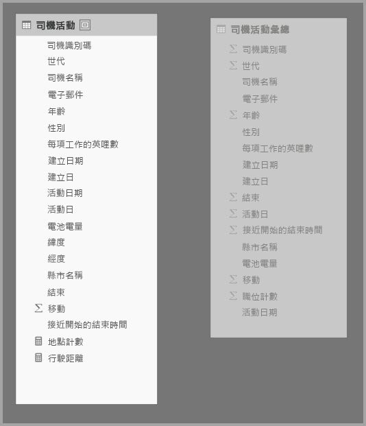

您可以在 [管理彙總]  對話方塊中，定義 **Driver Activity Agg** 資料表的彙總對應。 

![Driver Activity Agg 資料表的 [管理彙總] 對話方塊](media/desktop-aggregations/aggregations_11.jpg)

在以 GroupBy 資料行為基礎的彙總中，**GroupBy** 項目並不是選擇性項目。 如果沒有這些項目，就不會叫用彙總。 這與使用以關聯性為基礎的彙總不同，其中的 GroupBy 項目是選擇性項目。

下表顯示 **Driver Activity Agg** 資料表的彙總。

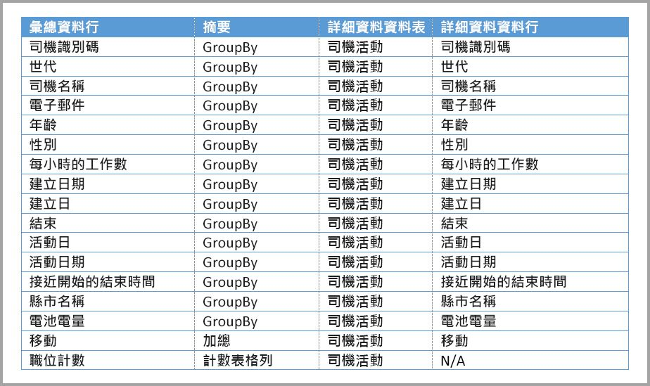

您可以將 **Driver Activity Agg** 彙總資料表的儲存模式設定為 [匯入]。

### GroupBy 彙總查詢範例

下列查詢會叫用彙總，因為彙總資料表涵蓋 **Activity Date** 資料行。 COUNTROWS 函式會使用**計數資料表資料列**彙總。

特別是在事實資料表中包含篩選屬性的模型，最好使用**計數資料表資料列**彙總。 假如使用者未明確要求，Power BI 可以使用 COUNTROWS 將查詢提交至資料集。 例如，[篩選條件] 對話方塊會顯示每個值的資料列計數。

![[篩選] 對話方塊](media/desktop-aggregations/aggregations-12.png)

## 合併的彙總技術

您可以結合關聯性和 GroupBy 資料行技術來進行彙總。 以關聯性為基礎的彙總可能需要將反正規化維度資料表分割成多份資料表。 如果這對某些維度資料表而言太過昂貴或不實用，您可以在彙總資料表中為這些維度複寫所需屬性，並針對其他維度使用關聯性。

例如，下列模型會複寫 **Sales Agg** 資料表的 **Month**、**Quarter**、**Semester** 和 **Year**。 **Sales Agg** 與 **Date** 資料表之間沒有關聯性，但與 **Customer** 和 **Product Subcategory** 有關聯性。 **Sales Agg** 的儲存模式是 Import。

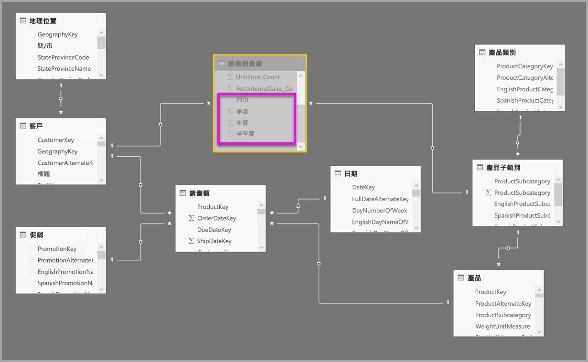

下表顯示在 **Sales Agg** 資料表的 [管理彙總]  對話方塊中設定的項目。 **Date** 為詳細資料資料表的 GroupBy 項目，其一定要為依 **Date** 屬性分組的查詢叫用彙總。 如同上一個範例，因為有關聯性，所以 **CustomerKey** 和 **ProductSubcategoryKey** 的 **GroupBy** 項目不會影響彙總叫用 (DISTINCTCOUNT 除外，因為有關連性)。

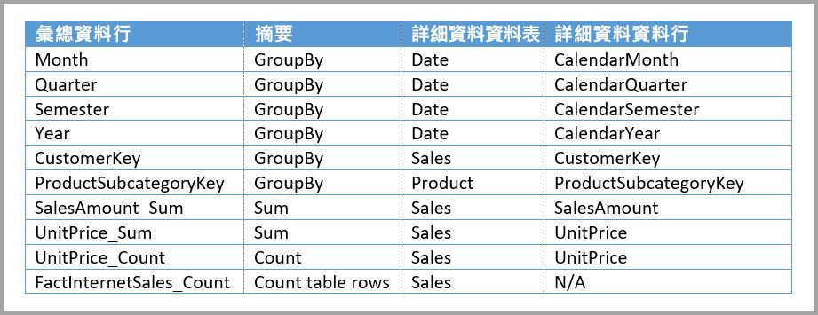

### 合併的彙總查詢範例

下列查詢會叫用彙總，因為彙總資料表涵蓋 **CalendarMonth**，且 **CategoryName** 可透過一對多關聯性存取。 **SalesAmount** 使用 **SUM** 彙總。

下列查詢不會叫用彙總，因為彙總資料表未涵蓋 **CalendarDay**。

下列時間智慧查詢不會叫用彙總，因為 DATESYTD 函式會產生 **CalendarDay** 值的資料表，但彙總資料表並未涵蓋 **CalendarDay**。

## 彙總優先順序

彙總優先順序可讓單一子查詢考慮多份彙總資料表。

下列範例是包含多個來源的[複合模型](desktop-composite-models.md)：

- **Driver Activity** DirectQuery 資料表所含上兆筆資料列含有來自巨量資料系統的 IoT 資料。 它提供鑽研查詢，在受控制的篩選內容中檢視個別的 IoT 讀數。
- **Driver Activity Agg** 資料表是 DirectQuery 模式下的中繼彙總資料表。 此資料表包含 Azure SQL 資料倉儲中 10 億多筆的資料列，並已使用資料行存放區索引在來源端進行最佳化。
- **Driver Activity Agg2** 匯入資料表有很高的資料粒度，因為分組方式屬性很少且基數又低。 資料列數目可低至數千筆，所以可輕鬆放入記憶體內部快取。 這些屬性正好為高設定檔執行儀表板所用，因此參考它們的查詢速度應該盡可能快。

> [!NOTE]
> 只有在彙總資料表來自 SQL Server、Azure SQL 或 Azure SQL 資料倉儲來源時，才支援根據詳細資料資料表使用不同資料來源的 DirectQuery 彙總資料表。

此模型的記憶體磁碟使用量相對較小，但它會解除鎖定大型資料集。 這代表平衡的架構，因為此模型會將查詢負載分散到架構元件中，並根據其強度使用這些元件。

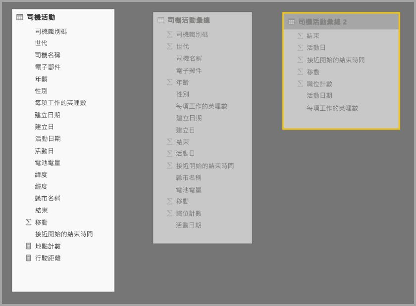

**Driver Activity Agg2** 的 [管理彙總]  對話方塊會將 **Precedence** 欄位設定為 *10* (高於 **Driver Activity Agg**)。 較高優先順序設定表示使用彙總的查詢將會先考慮 **Driver Activity Agg2**。 資料粒度不在 **Driver Activity Agg2** 回答範圍內的子查詢會改為考慮 **Driver Activity Agg**。 兩份彙總資料表皆無法回答的詳細資料查詢，會被導向至 **Driver Activity**。

**Detail Table** 資料行中指定的資料表是 **Driver Activity**，而非 **Driver Activity Agg**，因為不允許鏈結彙總。

![[管理彙總] 對話方塊](media/desktop-aggregations/aggregations_14.jpg)

下表顯示 **Driver Activity Agg 2** 資料表的彙總。

## 偵測查詢是叫用彙總還是遺漏彙總

SQL Profiler 可以偵測查詢是否會從記憶體內部快取儲存引擎傳回，或由 DirectQuery 推送至資料來源。 您可以使用相同的處理程序來偵測是否已叫用彙總。 如需詳細資訊，請參閱[叫用或遺漏快取的查詢](desktop-storage-mode.md#queries-that-hit-or-miss-the-cache)。 

SQL Profiler 也會提供 `Query Processing\Aggregate Table Rewrite Query` 擴充事件。

下列 JSON 程式碼片段示範使用彙總時的事件輸出範例。

- **matchingResult** 顯示子查詢使用了彙總。
- **dataRequest** 顯示子查詢所使用的 GroupBy 資料行和彙總資料行。
- **mapping** 顯示彙總資料表中已對應的資料行。

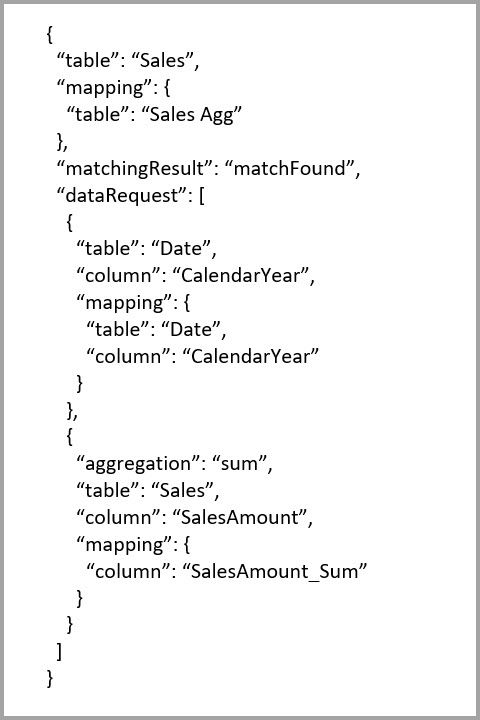

## 讓快取保持同步

除非記憶體內部快取與來源資料保持同步，否則合併 [DirectQuery]、[匯入] 及/或 [雙重] 儲存模式的彙總，可能會傳回不同的資料。 例如，查詢執行不會嘗試篩選 DirectQuery 結果來符合快取值，以掩飾資料問題。 如有必要，可使用一些現有技術，在來源處理這類問題。 效能最佳化只應以不危及您能力的方式用來滿足商務需求。 您應該最了解自己的資料流程，並據此進行設計。 

## 後續步驟

如需複合模型的詳細資訊，請參閱：

- [在 Power BI Desktop 中使用複合模型](desktop-composite-models.md)
- [在 Power BI Desktop 中套用多對多關聯性](desktop-many-to-many-relationships.md)
- [管理 Power BI Desktop 中的儲存模式](desktop-storage-mode.md)

如需 DirectQuery 的詳細資訊，請參閱：

- [如何在 Power BI 中使用 DirectQuery](../connect-data/desktop-directquery-about.md)
- [Power BI 資料來源](../connect-data/power-bi-data-sources.md)
