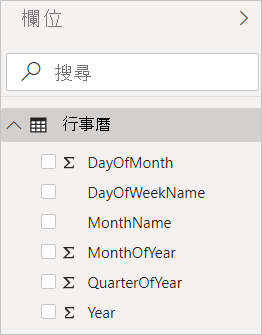
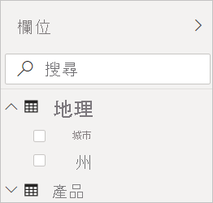
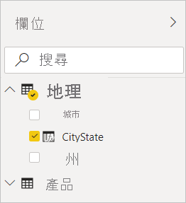

# 在 Power BI Desktop 中建立計算結果欄
透過導出資料行，您可以將新資料加入模型中已有的資料表。 您會建立定義資料行值的資料分析運算式 (DAX) 公式，而不是從資料來源查詢值並將其載入新的資料行。 在 Power BI Desktop 中，計算結果欄是使用 [報表]  檢視中的 [新增資料行] 功能來建立。

與在查詢編輯器中使用 [新增自訂資料行]  建立作為查詢一部分的自訂資料行不同，在 [報表]  檢視或 [資料]  檢視中所建立計算結果欄會依據您已經載入模型的資料。 例如，您可能會選擇串連兩個不同但相關資料表中兩個不同資料行的值、執行加法，或擷取子字串。

您所建立的計算結果欄會出現在 [欄位]  清單中，就像是其他任何欄位一樣，但這些資料行會有特殊圖示來顯示其值為公式的結果。 您可以為資料行指定任何名稱，並將其加入報表視覺效果，就像是其他欄位一樣。

計算結果欄使用 DAX 來計算結果，這是可處理類似 Power BI Desktop 中關聯式資料的公式語言。 DAX 所包含的程式庫是由 200 個以上的函式、運算子和建構函式所組成。 這為建立公式提供極大的彈性，可計算幾乎所有資料分析需求的結果。 若要深入了解 DAX，請參閱 [Power BI Desktop 中的 DAX 基本概念](desktop-quickstart-learn-dax-basics.md).

DAX 公式類似 Excel 公式。 事實上，DAX 有許多函數與 Excel 相同。 不過，DAX 函數是為了處理報表中以互動方式交叉篩選或篩選的資料，就像是在 Power BI Desktop 中一樣。 在 Excel 中，資料表中的每個資料列可以有不同公式。 在 Power BI 中，當您為新資料行建立 DAX 公式時，則會計算資料表中每個資料列的結果。 系統會視需要重新計算資料行值，例如當基礎資料重新整理及值變更時。

## 以下舉例說明
Jeff 是 Contoso 的出貨經理，他想要建立報表，以顯示不同城市的出貨編號。 Jeff 有一個 **Geography** 資料表，內含代表城市和州的個別欄位。 但是，Jeff 希望報表能夠將城市和州值顯示為同一個資料列上的單一值。 目前，Jeff 的 **Geography** 資料表沒有想要的欄位。

但透過計算結果欄，Jeff 可以將 **City** 資料行中的城市與 **State** 資料行中的州放在一起。

Jeff 以滑鼠右鍵按一下 **Geography** 資料表，然後選取 [新增資料行]  。 Jeff 接著在公式列中輸入下列 DAX 公式：

這個公式會直接建立名為 **CityState** 的新資料行。 針對 **Geography** 資料表中的每個資料列，則會擷取 **City** 資料行中的值、新增逗號和空格，然後串連 **State** 資料行中的值。

Jeff 現在有想要的欄位。

Jeff 現在可以將該欄位連同出貨編號一起新增至報表畫布。 不需要太多工作，Jeff 現在會有可新增至任何視覺效果類型的 **CityState** 欄位。 當 Jeff 建立新的地圖時，Power BI Desktop 已了解如何讀取新資料行中的城市和州值。

## 後續步驟
我們在此僅快速介紹導出資料行。 如需詳細資訊，請檢閱下列來源：

* 若要下載範例檔案，並取得有關如何建立更多資料行的逐步解說課程，請參閱[教學課程：在 Power BI Desktop 中建立計算結果欄](desktop-tutorial-create-calculated-columns.md)

* 若要深入了解 DAX，請參閱 [Power BI Desktop 中的 DAX 基本概念](desktop-quickstart-learn-dax-basics.md).

* 若要深入了解您建立作為查詢一部分的資料行，請參閱 [Power BI Desktop 中的常見查詢工作](desktop-common-query-tasks.md)中＜建立自訂資料行＞  一節。  

