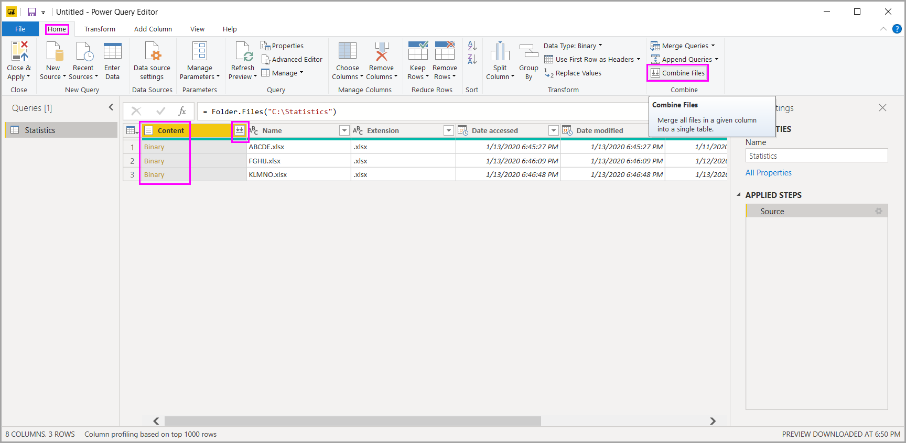

# 在 Power BI Desktop 中合併檔案 (二進位檔)

以下是將資料匯入 **Power BI Desktop** 的強大方法：如果您有多個具有相同結構描述的檔案，請將它們結合成單一邏輯資料表。 這項熱門技術已經變得更方便且更廣泛。

若要開始進行合併同一個資料夾中檔案的程序，請選取 [取得資料]  ，選擇 [檔案]   >  [資料夾]  ，然後選取 [連線]  。

![連線到資料夾檔案，[取得資料] 對話方塊，Power BI Desktop](media/desktop-combine-binaries/combine-binaries_1.png)

輸入資料夾路徑，選取 [確定]  ，然後選取 [轉換資料]  ，以在 Power Query 編輯器中查看資料夾的檔案。

## 合併檔案行為

若要在 Power Query 編輯器中合併二進位檔案，請選取 [內容]  (第一個資料行標籤)，然後選取 [首頁]   >  [合併檔案]  。 或者，您可以直接選取 [內容]  旁的 [合併檔案]  圖示。

*合併檔案* 轉換的行為如下：

* 合併檔案轉換會分析每個輸入檔，以判斷要使用的正確檔案格式，例如「文字」  、「Excel 活頁簿」  或「JSON 檔案」  。
* 轉換可讓您從第一個檔案 (例如「Excel 活頁簿」) 選取要擷取的特定物件。
  
  
* 合併檔案會轉換，然後會自動採取下列動作：
  
  * 建立在單一檔案中執行所有必要擷取步驟的範例查詢。
  * 建立「函數查詢」  ，以將檔案/二進位檔案輸入參數化成「範例查詢」  。 範例查詢和函數查詢會建立連結，因此範例查詢的變更會反映在函數查詢中。
  * 將「函式查詢」  套用至具有輸入二進位檔的原始查詢，例如「資料夾」  查詢。 它會針對每個資料列的二進位輸入套用函式查詢，然後將產生的資料擷取展開為最上層的資料行。

    

> [!NOTE]
> 您在 Excel 活頁簿中選取的範圍，會影響合併二進位檔案的行為。 例如，您可以選取特定的工作表來合併該工作表，或選取根來合併整個檔案。 選取資料夾會合併在該資料夾中找到的檔案。 

藉由合併檔案行為，如果檔案類型與結構相同 (例如相同的資料行)，就能輕鬆將指定資料夾內的所有檔案合併。

此外，您可以藉由修改自動建立的「範例查詢」，輕鬆套用額外轉換或擷取步驟，而不需要花費心力修改或建立額外的函式查詢步驟。 對範例查詢所進行的任何變更都會在已連結的函式查詢中自動產生。

## 後續步驟

您可以使用 Power BI Desktop 連線至各類資料。 如需有關資料來源的詳細資訊，請參閱下列資源︰

* [Power BI Desktop 是什麼？](../fundamentals/desktop-what-is-desktop.md)
* [Power BI Desktop 中的資料來源](../connect-data/desktop-data-sources.md)
* [使用 Power BI Desktop 合併資料並使其成形](../connect-data/desktop-shape-and-combine-data.md)
* [連接至 Power BI Desktop 中的 CSV 檔案](../connect-data/desktop-connect-csv.md)
* [直接將資料輸入 Power BI Desktop 中](../connect-data/desktop-enter-data-directly-into-desktop.md)
