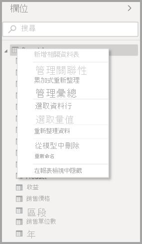

# 在 Power BI Desktop 中使用 [欄位] 清單 (預覽)

從 2020 年 11 月更新開始，我們將開始整合 Power BI Desktop 中的 [模型] 檢視、[資料] 檢視及 [報表] 檢視上的 [欄位] 清單。 透過整合這些檢視，將能為檢視之間的功能和使用者介面 (UI) 帶來一致性，並解決客戶意見反應。

您將在檢視之間注意到的變更包括下列各項：

* 圖示
* 搜尋功能
* 操作功能表項目
* 類似的拖放行為
* 工具提示
* 協助工具增強功能

其意圖是為了改進 Power BI Desktop 的可用性。 這些變更對您的一般資料工作流程應該幾乎不會造成影響。

## 啟用新的 [欄位] 清單 (預覽)

我們會從 [模型] 檢視開始整合 [欄位] 清單，而後續將針對其他檢視加以啟用。 若要啟用整合的 [欄位] 檢視，請在 Power BI Desktop 中瀏覽到 [檔案] > [選項及設定] > [選項]，然後從左窗格中選取 [預覽功能]。 在 [預覽功能] 區段中，選取 [New field list] \(新的欄位清單\) 旁的核取方塊。

![啟用新的 [欄位] 清單](media/desktop-field-list/field-list-01.png)

系統將提示您重新啟動 Power BI Desktop，以便讓選取項目生效。

## [欄位] 清單變更

下表顯示 [欄位] 清單更新。 

|**原始的 [欄位] 清單 ([模型] 檢視)**  | **新的 [欄位] 清單 ([模型] 檢視)**  |
|:---------:|:---------:|
|**原始** |**新增** |
|**圖示與 UI**       ||
|![原始的 [欄位] 清單](media/desktop-field-list/field-list-01a.png)     |![新的 [欄位] 清單](media/desktop-field-list/field-list-01b.png)    |
|**操作功能表 - 欄位**       ||
|     |    |
|**操作功能表 - 資料表**       ||
|     |    |
|**工具提示**       ||
|     |    |

同時也會有新的 [欄位] 清單圖示。 下表顯示原始圖示及其新的對等項目，並提供每個圖示的簡短描述。 

|原始圖示  |新圖示  |描述  |
|:---------:|:---------:|:---------|
|     |           |欄位清單中的資料夾         |
|     |         |數值欄位：例如，數值欄位是可以加總或平均的彙總。 彙總隨資料匯入，並在以報表為基礎的資料模型中定義。 如需詳細資訊，請參閱 [Power BI 報表中的彙總](../create-reports/service-aggregates.md)。         |
|     |         |具有非數值資料類型的計算結果欄：您以資料分析運算式 (DAX) 公式建立的新非數值資料行，其可定義資料行的值。 請深入了解[計算結果欄](desktop-calculated-columns.md)。        |
|     |          |數值計算結果欄：您以資料分析運算式 (DAX) 公式建立的新資料行，其可定義資料行的值。 請深入了解[計算結果欄](desktop-calculated-columns.md)。         |
|     |          |量值:量值有自己的硬式編碼公式。 報表檢視器無法變更計算，例如，如果是總和，就只能是總和。 這些值不會儲存在資料行中。 視值在視覺效果中的位置而定，會即時計算這些值。 如需詳細資訊，請參閱[了解量值](desktop-measures.md)。         |
|     |         |量值群組。         |
|     |         |KPI：一種視覺提示，指出對於可測量目標已達成的進度。 深入了解[關鍵效能指標 (KPI)](../visuals/power-bi-visualization-kpi.md) 視覺效果。         |
|     |           |欄位的階層：選取箭號以查看組成階層的欄位。 如需詳細資訊，請在 YouTube 上觀看這段有關[建立和使用階層](https://www.youtube.com/watch?v=q8WDUAiTGeU)的 Power BI 影片。         |
|     |         |地理資料：這些位置欄位可用於建立地圖視覺效果。         |
|     |          |識別欄位：具有這個圖示的欄位都是唯一的欄位，其會設定為顯示所有值，即使有重複項目亦然。 例如，您的資料中可能有兩位名為 'Robin Smith' 的不同人員記錄，但每一筆都視為唯一。 它們不會進行加總。         |
|     |          |參數：設定參數，讓報表和資料模型的各個部分 (例如查詢篩選、資料來源參考、量值定義等) 相依於一或多個參數值。 如需詳細資訊，請參閱關於[查詢參數](https://powerbi.microsoft.com/blog/deep-dive-into-query-parameters-and-power-bi-templates/)的這篇 Power BI 部落格文章。         |
|     |         |具有內建日期資料表的行事曆日期欄位。         |
|     |          |導出資料表：使用資料分析運算式 (DAX) 公式所建立的資料表，其以已經載入模型的資料為基礎。 這些最適合用於中繼計算，而您想要將其儲存為模型之一部分的情況。         |
|     |         |警告:包含錯誤的導出欄位。 例如，DAX 運算式的語法可能不正確。         |
|     |         |群組：此資料行中的值會以另一個資料行中的分組值為依據，方法是使用群組和量化功能。 您可以參閱如何[使用群組和量化](../create-reports/desktop-grouping-and-binning.md)。         |
| 沒有原始圖示    |          |變更偵測量值：當您設定頁面以進行自動頁面重新整理時，您可以設定要查詢的[變更偵測量值](../create-reports/desktop-grouping-and-binning.md)，以判斷是否應該更新頁面其餘的視覺效果。         |

## 後續步驟

您可能也會對下列文章感興趣：

* [在 Power BI Desktop 中建立計算結果欄](desktop-calculated-columns.md)
* [在 Power BI Desktop 中使用群組和收納](../create-reports/desktop-grouping-and-binning.md)
* [在 Power BI Desktop 報表中使用格線與貼齊格線](../create-reports/desktop-gridlines-snap-to-grid.md)

