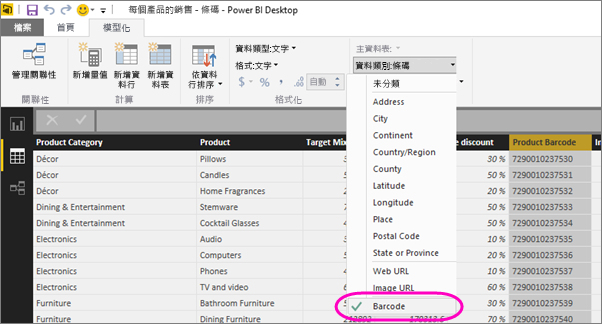

# 在 Power BI Desktop 中標記條碼欄位，以啟用行動裝置應用程式中的條碼掃描篩選

在 Power BI Desktop 中，您可以在資料行內[分類資料](desktop-data-categorization.md)，使 Power BI Desktop 知道在報表中以何種視覺效果處理值。 您也可以將資料行分類為 **條碼**。 然後，當貴公司或組織的某個人使用 iOS 或 Android 手機或平板電腦上 Power BI 行動裝置應用程式來 [掃描產品的條碼](../consumer/mobile/mobile-apps-scan-barcode-iphone.md) 時，他們會看到任何包含該條碼的報表。 當他們開啟報表時，系統會自動將其篩選為與該條碼相關的資料。

## 分類條碼資料

假設您有包含條碼的報表： 

1. 在 Power BI Desktop 中，切換至 [資料檢視]。
2. 選取包含條碼資料的資料行。 請參閱下方[支援的條碼格式](#supported-barcode-formats)清單。
3. 在 [資料 **行工具**] 索引標籤上，選取 [**資料類別**  >  **條碼**]。
   
    

    >[!WARNING]
    >請勿將報表中所有資料表上的多個資料行分類為 **條碼**。 行動裝置應用程式僅針對在所有報表資料表中只有一個條碼資料行的報表支援條碼篩選。 如果報表有一個以上的條碼資料行，就不會進行篩選。

4. 在報表檢視器中，將條碼欄位新增至您想要以條碼篩選的視覺效果。
5. 儲存報表，並將其發行至 Power BI 服務。

現在，當您在適用于 iOS 和 Android 手機和平板電腦的 Power BI 應用程式上開啟掃描器並掃描條碼時，您會在具有條碼的報表清單中看到這份報表。 當您開啟報表時，其視覺效果將會依您掃描的產品條碼進行篩選。

## 支援的條碼格式
如果您可以在 Power BI 報表中標記這些格式，Power BI 可辨識的條碼格式： 

* UPCECode 
* Code39Code  
* A39Mod43Code 
* EAN13Code 
* EAN8Code  
* 93Code  
* 128Code 
* PDF417Code 
* Interleaved2of5Code 
* ITF14Code 

## 下一步
* [從 iOS 或 Android 手機或平板電腦上的 Power BI 應用程式掃描條碼](../consumer/mobile/mobile-apps-scan-barcode-iphone.md)
* [掃描條碼的問題](../consumer/mobile/mobile-apps-scan-barcode-iphone.md#issues-with-scanning-a-barcode)
* [Power BI Desktop 中的資料分類](desktop-data-categorization.md)  
* 有問題嗎？ [嘗試在 Power BI 社群提問](https://community.powerbi.com/)
