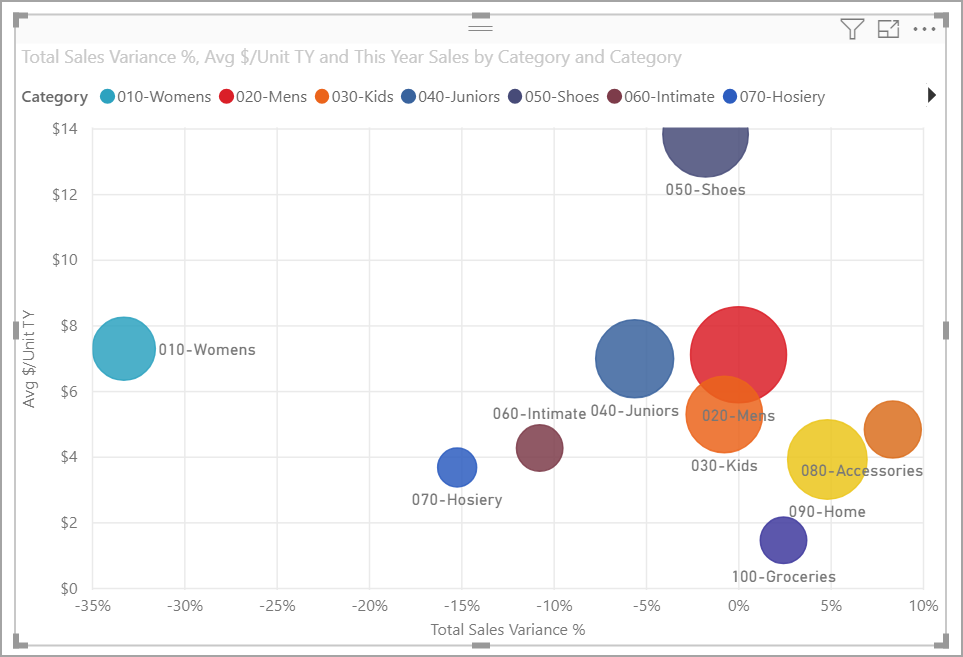
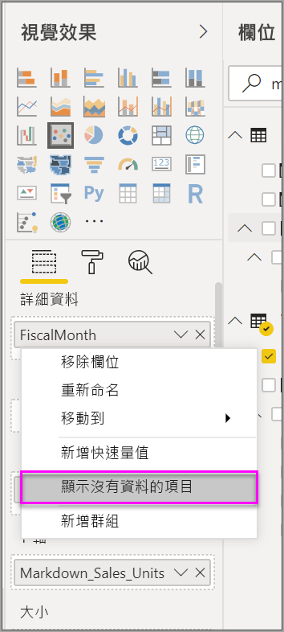
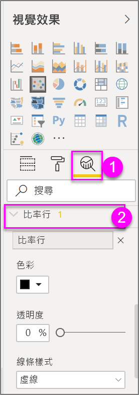

# Power BI 散佈圖中的高密度取樣

[!INCLUDE [power-bi-visuals-desktop-banner](../includes/power-bi-visuals-desktop-banner.md)]

從 **Power BI Desktop** 的 2017 年 9 月版本開始，您即可使用新取樣演算法來改善散佈圖代表高密度資料的方式。

例如，您可以從組織的銷售活動建立散佈圖，每間商店每年有數以萬計的資料點。 這類資訊的散佈圖會可用資料進行取樣 (選取以有意義的方式轉譯該資料，來說明銷售隨著時間的變化)，並建立代表基礎資料的散佈圖。 這是高密度散佈圖中的常見做法。 Power BI 已改善對高密度資料的取樣，本文會描述其詳細資料。

## 高密度散佈圖的運作方式
先前，**Power BI** 透過決定性方式選取完整基礎資料範圍中的範例資料點集合，以建立散佈圖。 具體來說，Power BI 會在散佈圖圖表數列中，選取第一個和最後一個資料列，然後平均分配剩餘的資料列，以便在散佈圖上繪製總計 3500 個資料點。 例如，如果樣本有 35,000 個資料列，則會選取第一個和最後一個資料列來繪製，然後也會繪製每十個資料列 (35000 / 10 = 每十個資料列 = 3,500 個資料點)。 此外，先前資料數列中無法繪製的 null 值或點 (例如文字值) 的點不會顯示，因此在產生視覺效果時並未考慮它們。 使用這樣的取樣，散佈圖的認知密度也是根據代表性資料點，因此隱含的視覺效果密度是取樣點的一種情況，而不是完整的基礎資料集合。

當您啟用 **高密度取樣** 時，Power BI 會實作演算法，刪除重疊的點，並確保視覺效果上的點可以在與視覺效果互動時觸達。 演算法也可確保在視覺效果會代表資料集裡的所有點，為選取點的意義提供內容，而不只是繪製代表性的樣本。

根據定義，取樣高密度資料可在合理範圍內快速建立互動回應的視覺效果。 視覺效果上有太多資料點會拖慢速度，並降低趨勢的可見性。 所以，資料的取樣方式會推動取樣演算法的建立，以提供最佳視覺效果體驗並確保代表所有資料。 在 Power BI 中，此演算法現已改善，可提供回應、轉譯和清楚保留整體資料集中重要點的最佳組合。

> [!NOTE]
> 使用 **高密度取樣** 演算法的散佈圖，最適合繪製在正方形的視覺效果，如同所有散佈圖一樣。
> 
> 

## 新散佈圖取樣演算法的運作方式
散佈圖的新 **高密度取樣** 演算法會利用方法，擷取並更有效地代表基礎資料，同時消除重疊的點。 它會從每個資料點的小半徑開始 (視覺效果上的指定點的視覺效果圓形大小)。 然後增加所有資料點的半徑。當兩個 (或更多) 資料點重疊時，單一圓形 (半徑大小增加) 會代表這些重疊的資料點。 此演算法會繼續增加資料點的半徑，直到半徑值導致有合理的資料點數目 - 3,500 - 顯示在散佈圖中。

此演算法中的方法可確保在產生的視覺效果中表示出極端值。 判斷重疊時，演算法會尊重小數位數，使得指數小數位數在視覺化時能忠實於基礎的視覺效果點。

演算法也會保留散佈圖的整體圖形。

> [!NOTE]
> 針對散佈圖使用 **高密度取樣** 演算法時，資料的「正確分佈」是目標，而隱含的視覺效果密度「不是」目標。 例如，您可能會看到散佈圖有很多在特定區域裡重疊 (密度) 的圓圈，並想像有許多資料點必須叢集在那裡。因為 **高密度取樣** 演算法可以使用一個圓形來代表許多資料點，所以不會顯示這樣的隱含視覺效果密度 (或「叢集」)。 若要在指定區域裡有更多詳細資料，您可以使用交叉分析篩選器拉近。
> 
> 

此外，無法繪製的資料點 (例如 null 值或文字值) 會被忽略，因此會選取另一個可繪製的值，進一步確保維護散佈圖的真實圖形。

### 針對散佈圖使用標準演算法的時機
有些情況下無法套用 **高密度取樣** 至散佈圖，而會使用原始的演算法。 這些情況如下所示：

* 如果您以滑鼠右鍵按一下 [詳細資料] 下的值，然後從功能表將它設為 [顯示沒有資料的項目]，散佈圖會還原成原始的演算法。
  
  
* [播放] 軸中的任何值將導致散佈圖還原成原始的演算法。
* 如果散佈圖上同時遺漏 X 和 Y 軸，圖表會還原為原始的演算法。
* 在 [分析] 窗格中使用 [比率行] 會導致圖表還原成原始的演算法。
  
  

## 如何開啟散佈圖的高密度取樣
若要開啟 **高密度取樣**，請選取散佈圖並移至 [格式] 窗格，展開 [一般] 卡片，在該卡片底部的附近，將 [高密度取樣] 切換滑桿移至 [開啟]。

> [!NOTE]
> 一旦開啟滑桿，Power BI 會嘗試盡可能使用 **高密度取樣** 演算法。 無法使用此演算法時 (例如，您在「播放」軸放了值)，滑桿會停留在 [開啟]位置，但圖表已還原成標準演算法。 如果您接著從「播放」軸移除值 (或是狀況變更為可使用高密度取樣演算法)，圖表會自動使用適合該圖表的高密度取樣，因為功能啟用中。
> 

> 
> [!NOTE]
> 資料點會依索引分組或選取。 具有圖例不會影響演算法的取樣，而只會影響視覺效果的排序。
> 
> 

## 考量與限制
高密度取樣演算法是 Power BI 的重要改善，但在使用高密度值和散佈圖時有一些需要知道的考量。

* **高密度取樣** 演算法只能搭配對以 Power BI 服務為基礎的模型、匯入的模型，或 DirectQuery 等的即時連線。

## 後續步驟
如需在其他圖表進行高密度取樣的詳細資訊，請參閱下列文章。

* [Power BI 中的高密度折線圖取樣](../create-reports/desktop-high-density-sampling.md)

