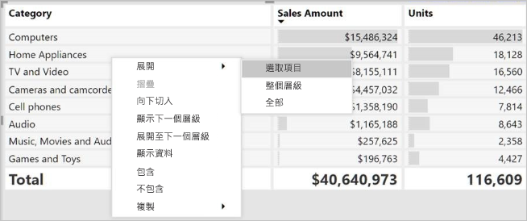
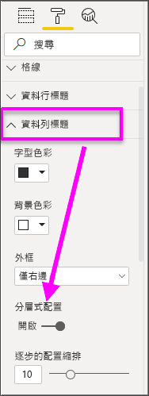
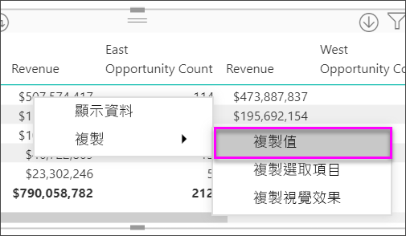
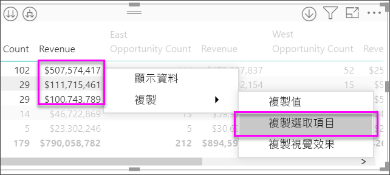
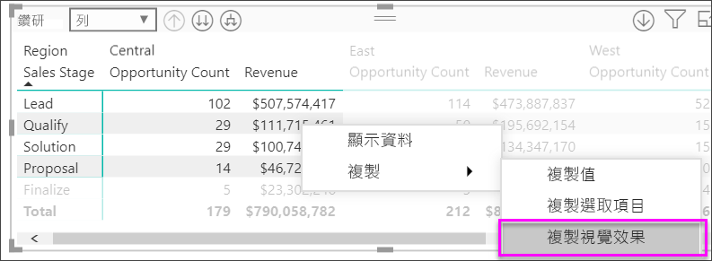

# 在 Power BI 中使用矩陣視覺效果

[!INCLUDE [power-bi-visuals-desktop-banner](../includes/power-bi-visuals-desktop-banner.md)]

矩陣視覺效果類似於表格。  資料表支援兩個維度，且資料是一般資料，這表示會顯示重複的值，並不會彙總。 矩陣可讓您更輕鬆地顯示跨多個維度 (支援分層式的配置) 資料，更具意義。 矩陣會自動彙總資料，並啟用向下鑽研。 

您可以在 **Power BI Desktop** 報表中建立矩陣視覺效果，並與該報表頁面上的其他視覺效果交叉醒目提示矩陣內的元素。 例如，您可以選取資料列、資料行，甚至是個別資料格，然後交叉醒目提示。 也可以將個別資料格和多個資料格的選取項目，複製及貼上到其他應用程式。 

矩陣有許多相關的功能，我們將在本文的下列各節中逐一介紹。

## 了解 Power BI 如何計算總和

在開始了解如何使用矩陣視覺效果之前，務必先了解 Power BI 如何計算資料表和矩陣中的總和與小計值。 針對總和與小計資料列，Power BI 會根據基礎資料的所有資料列來評估量值，而不是僅僅加總可見或顯示資料列中的值。 這表示在總和資料列中，所得到的值可能會與您預期的不同。

看看下列矩陣視覺效果。 

在此範例中，矩陣視覺效果最右邊的每個資料列都會顯示每位銷售人員/日期組合的 *Amount* (數量)。 不過，因為由於銷售人員能在多個日期上顯示，數字可能會出現一次以上。 因此，基礎資料的正確總和並不等於可見值的單純加總。 當加總的值屬於一對多關係中的「單一」端時，這是的常見模式。

當您查看總和與小計時，請記住這些值是根據基礎資料而來。 不只是根據可見的值而已。

<!-- use Nov blog post video

## Expanding and collapsing row headers
There are two ways you can expand row headers. The first is through the right-click menu. You’ll see options to expand the specific row header you clicked on, the entire level or everything down to the very last level of the hierarchy. You have similar options for collapsing row headers as well.

You can also add +/- buttons to the row headers through the formatting pane under the row headers card. By default, the icons will match the formatting of the row header, but you can customize the icons’ color and size separately if you want. 
Once the icons are turned on, they work similarly to the icons from PivotTables in Excel.

The expansion state of the matrix will save with your report. It can be pinned to dashboards as well, but consumers will need to open up the report to change the state. Conditional formatting will only apply to the inner most visible level of the hierarchy. Note that this expand/collapse experience is not currently supported when connecting to AS servers older than 2016 or MD servers.

Watch the following video to learn more about expand/collapse in the matrix:

-->
## 使用矩陣視覺效果的向下切入
透過矩陣視覺效果，您可以執行各式各樣有趣的向下切入活動，是之前還沒有的。 這包括使用資料列、資料行，甚至是個別區段和資料格向下切入的功能。 讓我們來看看上述每項的運作方式。

### 資料列標頭的向下切入

在 [視覺效果] 窗格中，當您將多個欄位新增至 [欄位]  的 [資料列]  區段時，您可以在矩陣視覺效果的資料列上啟用向下切入功能。 此功能類似於建立階層，之後您就可以在整個階層內向下切入 (然後備份)，並分析每個層級的資料。

在下圖中，[資料列]  區段包含 [銷售階段]  和 [商機大小]  ，以在我們可鑽研的資料列中建立群組 (或階層)。

當視覺效果在 [資料列]  區段中建立群組時，視覺效果本身會在視覺效果左上角顯示「鑽研」  和「展開」  圖示。

類似於其他視覺效果中的切入和展開行為，選取這些按鈕可讓我們在整個階層內向下切入 (或備份)。 在此情況下，我們可以從 [銷售階段]  向下切入至 [商機大小]  ，如下圖所示，其中已選取向下切入一層圖示 (乾草叉)。

除了使用這些圖示，您還可以選取任何資料列標題，然後從出現的功能表進行選擇以向下切入。

請注意，出現的功能表中還有幾個選項會產生不同的結果：

選取 [向下切入]  會展開「該」  資料列層級的矩陣，並「排除」  除了選取的資料列標題以外的所有其他資料列標題。 在下圖中，已選取 [提案]   > [向下切入]  。 請注意，其他最上層的資料列不會再出現於矩陣中。 這種向下切入的方式是很有用的功能，並且是 [交叉醒目提示] 區段中特別酷炫的功能。

選取 [向上切入]  圖示，回到之前的最上層檢視。 如果接著選取 [提案]   > [顯示下一個層級]  ，則會取得一份遞增排列的清單，列出下一個層級的所有項目 (在本例中為 [商機大小]  欄位)，但不包含較高層級的階層分類。

![使用 [顯示下一個層級] 的矩陣](media/desktop-matrix-visual/power-bi-next-level-matrix.png)

選取左上角的 [向上切入]  圖示，讓矩陣顯示所有最上層類別，然後選取 [提案]   > [展開至下一個層級]  ，查看階層裡兩個層級的所有值 -「銷售階段」  和「商機大小」  。

![使用 [展開下一個層級] 的矩陣](media/desktop-matrix-visual/power-bi-matrix-expand-next.png)

您也可以使用 [展開]  功能表項目來進一步控制顯示。  例如，選取 [提案]   > [展開]   > [選取]  。 Power BI 會針對「提案」  的每個「銷售階段」  和所有「商機大小」  選項，顯示一個總和資料列。

### 資料行標頭的向下切入
類似於資料列的向下切入功能，您也可以在資料行上向下切入。 在下圖中，在 [資料行]  欄位中有兩個欄位，這會建立類似於本文稍早針對資料列所使用的階層。 在 [資料行]  欄位中，包含 [區域]  和 [區段]  。 第二個欄位新增至 [資料行]  之後，新的下拉式功能表便會顯示在視覺效果上，它目前會顯示 [資料列]  。

若要在資料行上向下切入，請從矩陣左上角的 [鑽研]  功能表選取 [資料行]  。 選取 [東部]  區域，然後選擇 [向下切入]  。

當您選取 [向下切入]  時，隨即顯示 [區域] > [東部]  資料行階層的下一個層級，在此情況下是 [商機計數]  。 其他區域已隱藏。

其餘功能表項目在資料行上的運作方式與資料列相同 (請參閱上一節：**資料列標頭的向下切入**)。 您可以 [顯示下一個層級]  ，並對資料行 [展開至下一個層級]  ，就像是處理資料列一樣。

> [!NOTE]
> 矩陣視覺效果左上角的向下切入圖示和向上切入圖示只適用於資料列。 若要在資料行上向下切入，您必須使用右鍵功能表。

## 矩陣視覺效果的分層式配置

矩陣視覺效果會將階層中的子類別自動縮排在每個父系之下，此功能稱為分層式配置。

在矩陣視覺效果的原始版本中，子類別會顯示在完全不同的資料行中，並在視覺效果中佔用更多的空間。 下圖顯示原始矩陣視覺效果中的資料表；請注意，其子類別在不同的資料行中。

在下圖中，您會看到矩陣視覺效果，並已啟用分層式配置。 請注意，[Computers]  類別已將其子類別 ([Computers Accessories]、[Desktops]、[Laptops]、[Monitors] 等) 稍微縮排，以提供更精簡的視覺效果。

您可以輕鬆地調整分層式配置設定。 選取矩陣視覺效果時，在 [視覺效果]  窗格的 [格式]  區段 (油漆滾筒圖示) 中，展開 [資料列標題] 區段。 您有兩個選項：[分層式配置] 切換選項 (將它開啟或關閉) 和 [逐步的配置縮排] (以像素為單位指定縮排數量)。

如果您關閉 [分層式配置]，Power BI 會將子類別顯示在另一個資料行中，而不是縮排在父系類別之下。

## 矩陣視覺效果的小計

您可以在矩陣視覺效果中，開啟或關閉資料列和資料行的小計。 如下圖所示，資料列小計已設定為 [開啟]  。

在 [視覺效果] 窗格的 [格式] 區段中，展開 [小計]  卡片，然後將 [資料列小計] 滑桿移至 [關閉]  。 當您這樣做時，不會顯示小計。

相同程序適用於資料行小計。

## 矩陣視覺效果的交叉醒目提示

使用矩陣視覺效果，您可以選取矩陣中的任何元素作為交叉醒目提示的基礎。 在矩陣中選取一個資料行，Power BI 會醒目提示該資料行，就像是報表頁面上的任何其他視覺效果一樣。 這類的交叉亮顯功能，在選取各類視覺效果和資料點時尤為常見，因此矩陣視覺效果現在也提供相同的功能。

此外，交叉醒目提示也可以使用 Ctrl + 按一下滑鼠左鍵。 例如，在下圖中，已從矩陣視覺效果選取子類別集合。 請注意，視覺效果中未選取的項目是如何呈現灰色的，以及頁面中的其他視覺效果，又是如何反映矩陣視覺效果所做出的選擇的。

## 複製 Power BI 中的值，以用於其他應用程式

您的矩陣或資料表可能有想要在其他應用程式中使用的內容：Dynamics CRM、Excel 和其他 Power BI 報表。 在 Power BI 上按一下滑鼠右鍵，可以將單一資料格或資料格選取範圍複製到剪貼簿。 然後，貼到另一個應用程式。

* 若要複製單一資料格的值，請選取資料格、按一下滑鼠右鍵，然後選擇 [複製值]  。 使用剪貼簿上未格式化的資料格的值，您現在可以將它貼至另一個應用程式。

    

* 若要複製多個資料格，請選取資料格範圍，或使用 CTRL 來選取一或多個資料格。 

    

* 該複本將包含資料行和資料列標頭。

    

* 若要建立僅包含您選取之儲存格的視覺效果本身複本，請使用 CTRL 與滑鼠右鍵選取一或多個儲存格，然後選擇 [複製視覺效果] 

    

* 複本將會是另一個矩陣視覺效果，但只包含您複製的資料。

    

## 矩陣視覺效果的網底和字型色彩
透過矩陣視覺效果，[條件式格式設定] \(色彩、網底和資料橫條\) 可以套用至資料格背景，甚至也能套用至文字和值本身。

若要套用條件式格式設定，請選取矩陣視覺效果，然後開啟 [格式]  窗格。 展開 [條件式格式設定]  卡片，然後將 [背景色彩]  、[字型色彩]  或 [資料橫條]  的滑桿移至 [開啟]  。 開啟其中一個選項會顯示 [進階控制項]  連結，可讓您自訂色彩格式設定的色彩和值。
  
  ![顯示資料橫條控制項的 [格式] 窗格](media/desktop-matrix-visual/power-bi-matrix-data-bars.png)

選取 [進階控制項]  以顯示對話方塊，讓您進行調整。 此範例顯示 [資料橫條]  的對話方塊。

![[資料橫條] 窗格](media/desktop-matrix-visual/power-bi-data-bars.png)

## 後續步驟

[Power BI 中的散佈圖與泡泡圖](power-bi-visualization-scatter.md)

[Power BI 中的視覺效果類型](power-bi-visualization-types-for-reports-and-q-and-a.md)