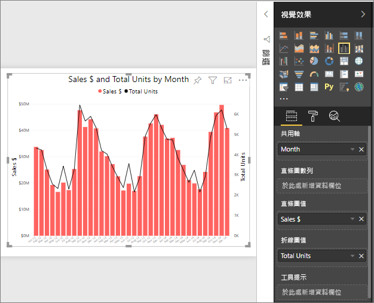

# Power BI 中的折線圖

[!INCLUDE[consumer-appliesto-nyyn](../includes/consumer-appliesto-nyyn.md)]

折線圖是一連串以點表示並由直線連接的資料點。 折線圖可以有一或多個線條。 折線圖有 X 軸和 Y 軸。 

## 建立折線圖
這些指示會使用「銷售與行銷範例」應用程式來建立折線圖，依類別顯示今年度銷售額。 若要跟著做，請從 appsource.com 取得範例應用程式。

> [!NOTE]
> 若要與 Power BI 同事共用報表，必須兩人都擁有個人的 Power BI Pro 授權，或將報表儲存在 Premium 容量中。

1. 從空白報表頁面開始。 如果您使用 Power BI 服務，請務必在[編輯檢視](../create-reports/service-interact-with-a-report-in-editing-view.md)中開啟報表。

2. 從 [欄位] 窗格，選取 [SalesFact]  \> [Total units]  \(單位總量\)，然後選取 [Date]  \(日期\) > [Month]  \(月份\)。  Power BI 會在您的報表畫布上建立一個直條圖。

    ![從 [欄位] 窗格選取](media/power-bi-line-charts/power-bi-step1.png)

4. 從 [視覺效果] 窗格選取折線圖範本，以轉換成折線圖。 

    
   

4. 篩選您的折線圖，顯示 2012-2014 年的資料。 如果您的 [篩選] 窗格已摺疊，請立即展開。 從 [欄位] 窗格，選取 [Date]  \(日期\) \> [Year]  \(年份\)，然後將它拖曳至 [篩選] 窗格。 將它置放在標題 [此視覺效果上的篩選]  下。 
     
    ![[欄位] 窗格旁的線條](media/power-bi-line-charts/power-bi-year-filter.png)

    將 [進階篩選條件]  變更為 [基本篩選條件]  ，然後選取 [2012]  、[2013]  和 [2014]  。

    

6. 選擇性地[調整圖表文字的大小和色彩](power-bi-visualization-customize-title-background-and-legend.md)。 

    

## 將其他線條新增至圖表
折線圖可以有許多不同的線條。 此外，在某些情況下，這些線條上的值可能非常散發，不適合在一起顯示。 讓我們看看如何將其他線條新增至目前的圖表，然後了解在線條所代表的值非常不同時，如何設定圖表格式。 

### 新增其他線條
若不想要以圖表上的單一線條來查看所有區域的單位總量，請依區域分割單位總量。 將 [地區]   > [區域]  拖曳至 [圖例] 部分，新增其他線條。

   

### 使用兩個 Y 軸
如果您想要在同一個圖表上查看總銷售額與單位總量，該怎麼辦？ 銷售數字遠高於單位數字，而使得折線圖難以使用。 事實上，代表單位總量的紅線似乎為零。

   

若要在一個圖表上顯示高度發散的值，請使用組合圖。 您可以閱讀 [Power BI 中的組合圖](power-bi-visualization-combo-chart.md)來全盤了解組合圖。 在以下範例中，我們可以新增第二個 Y 軸，同時顯示銷售額和單位總量。 

   

## 反白顯示和交叉篩選
如需使用 [篩選] 窗格的資訊，請參閱[將篩選加入報表](../create-reports/power-bi-report-add-filter.md)。

在折線圖上選取一個資料點會交叉醒目提示和交叉篩選報表頁面上的其他視覺效果，反之亦然。 若要跟著做，請開啟 [市場佔有率]  索引標籤。  

在折線圖上，單一資料點是 X 軸和 Y 軸上的點交集。 當您選取資料點時，Power BI 會新增標記，指出哪一個點 (代表單一線條) 或哪些點 (如果有兩個或多個線條) 是報表頁面上其他視覺效果的交叉醒目提示和交叉篩選來源。 如果您的視覺效果非常密集，Power BI 會選取離您在視覺效果上點選位置最近的點。

在此範例中，我們選取了一個資料點，其中包含：2014 年 7 月、% 單位市場佔有率 R12 為 33.16，而 % 單位市場佔有率為 34.74。

注意直條圖交叉醒目提示的方式，以及量測計交叉篩選的方式。

若要管理圖表互相交叉醒目提示及交叉篩選的方式，請參閱[在 Power BI 報表中與視覺效果互動](../create-reports/service-reports-visual-interactions.md)

## 考量與疑難排解
* 一個折線圖不能有兩個 Y 軸。  您必須改用組合圖。
* 在上述範例中，已將圖表的格式設定為放大字型、變更字型色彩、新增軸標題、置中圖表標題和圖例、兩個軸均以零起始等。 [格式設定] 窗格 (油漆滾筒圖示) 有一組看似永無止盡的選項，能讓圖表以您想要的方式呈現。 最棒的學習方法是開啟 [格式設定] 窗格，探索一番。

## 後續步驟

[Power BI 中的視覺效果類型](power-bi-visualization-types-for-reports-and-q-and-a.md)

