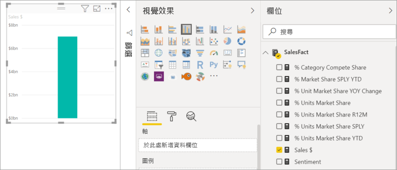
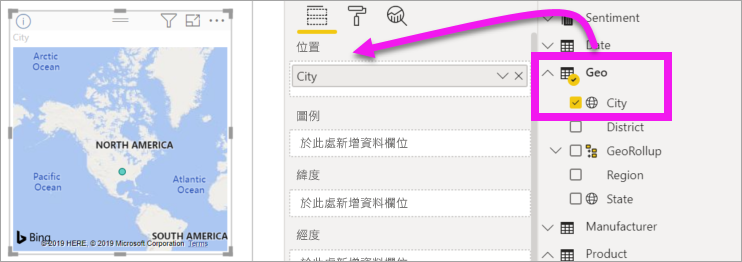

# 將視覺效果新增至 Power BI 報表 (第 1 部分)

[!INCLUDE[consumer-appliesto-nyyn](../includes/consumer-appliesto-nyyn.md)]    

[!INCLUDE [power-bi-visuals-desktop-banner](../includes/power-bi-visuals-desktop-banner.md)]

本文提供在報表中建立視覺效果的快速簡介。 它適用於 Power BI 服務和 Power BI Desktop。 如需更進階的內容，[請參閱本系列的第 2 部分](power-bi-report-add-visualizations-ii.md)。

## 必要條件

本教學課程使用[銷售與行銷 PBIX 檔案](https://download.microsoft.com/download/9/7/6/9767913A-29DB-40CF-8944-9AC2BC940C53/Sales%20and%20Marketing%20Sample%20PBIX.pbix)。

1. 從 Power BI Desktop 功能表列的左上方區段，選取 [檔案] > [開啟]
   
2. 尋找您的 **銷售與行銷範例 PBIX 檔案** 複本

1. 在報表檢視  中開啟 **銷售與行銷範例 PBIX 檔案** 。

1. 選取  新增頁面。

> [!NOTE]
> 若要與 Power BI 同事共用報表，必須兩人都擁有個人的 Power BI Pro 授權，或將報表儲存在 Premium 容量中。 請參閱[共用報告](../collaborate-share/service-share-reports.md)

## 將視覺效果新增至報表

1. 從 [欄位]  窗格選取欄位來建立視覺效果。

    從數值欄位開始，例如 [銷售額] > [總銷售額]。 Power BI 會建立具有單一直條的直條圖。

    

    或是以類別欄位開始，例如 [名稱] 或 [產品]。 Power BI 會建立資料表，並將該欄位新增至 [值] 區。

    

    或從地理位置欄位開始，例如 [地理位置] > [城市]。 Power BI 與 Bing 地圖服務會建立地圖視覺效果。

    

## 變更視覺效果的類型

 建立視覺效果，然後變更其類型。 
 
 1. 選取 [產品] > [類別]，然後選取 [產品] > [產品計數]，將兩者新增至 [值] 區。

    ![[欄位] 窗格的螢幕擷取畫面，[值] 區也已標示。](media/power-bi-report-add-visualizations-i/power-bi-create-visual.png)

1. 選取 **堆疊直條圖** 圖示將視覺效果變更為直條圖。

   ![標示堆疊直條圖圖示的 [視覺效果] 窗格螢幕擷取畫面。](media/power-bi-report-add-visualizations-i/power-bi-convert.png)

1. 若要變更視覺效果的排序方式，請選取 [其他動作] (...)。使用排序選項來變更排序的方向 (遞增或遞減)，並變更用來排序的資料行 ([排序依據])。

   
  
## 後續步驟

 繼續前往：

* [第 2 部分：在 Power BI 報表中加入視覺效果](power-bi-report-add-visualizations-ii.md)

* 在報表中[與視覺效果互動](../consumer/end-user-reading-view.md)。
