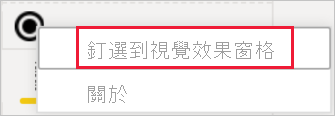

# Power BI 報表的視覺效果

視覺效果會顯示在資料中探索到的見解。 Power BI 報表可能需要有一個視覺效果的單一頁面，或是它可能會有充滿視覺效果的頁面。 在 Power BI 服務中，視覺效果可以[從報表釘選至儀表板](../service-dashboard-pin-tile-from-report.md)。

請務必區隔報表「設計師」  和報表「取用者」  。  如果您是建置或修改報表的人，您就是設計師。  設計師具有報表及其基礎資料集的編輯權限。 在 Power BI Desktop 中，這表示您可以在資料檢視中開啟資料集，並在報表檢視建立視覺效果。 在 Power BI 服務中，這表示您可以用[編輯檢視](../consumer/end-user-reading-view.md)在報表編輯器中開啟資料集或報表。 如果報表或儀表板已[與您共用](../consumer/end-user-shared-with-me.md)，您就是報表*取用者*。 您可以檢視報表及其視覺效果並與其互動，但無法與「設計工具」  一樣進行許多變更。

有許多不同的視覺效果類型可以直接從 Power BI 的 [視覺效果] 窗格使用。

如需更多的選擇，請前往 [Microsoft AppSource 社群網站](https://appsource.microsoft.com)以尋找並[下載](https://appsource.microsoft.com/marketplace/apps?page=1&product=power-bi-visuals) Microsoft 與社群所提供的[自訂視覺效果](../developer/visuals/custom-visual-develop-tutorial.md)。

<iframe width="560" height="315" src="https://www.youtube.com/embed/SYk_gWrtKvM?list=PL1N57mwBHtN0JFoKSR0n-tBkUJHeMP2cP" frameborder="0" allowfullscreen></iframe>

如果您是 Power BI 新手，或需要喚起記憶，請使用下列連結了解 Power BI 視覺效果的基本概念。  或者，使用我們的目錄 (沿著本文的左邊)，來找到更多有用的資訊。

## 在 Power BI 中加入視覺效果

在報表的頁面上[建立視覺效果](power-bi-report-add-visualizations-i.md)。 瀏覽[可用視覺效果清單和可用視覺效果教學課程](power-bi-visualization-types-for-reports-and-q-and-a.md)。 

## 上傳自訂視覺效果並在 Power BI 中使用

新增您自行建立或在 [Microsoft AppSource 社群網站](https://appsource.microsoft.com/marketplace/apps?product=power-bi-visuals)找到的自訂視覺效果。 腦中充滿創造力嗎？ 深入探索我們的原始程式碼，並使用我們的[開發人員工具](../developer/visuals/custom-visual-develop-tutorial.md)來建立新的視覺效果類型，然後[將其與社群共用](../developer/office-store.md)。 若要深入了解開發自訂視覺效果，請參閱[開發 Power BI 自訂視覺效果](../developer/visuals/custom-visual-develop-tutorial.md)。

## 個人化您的視覺效果窗格 (預覽)

如果您發現自己跨許多報表使用相同的自訂視覺效果，您可以將自訂視覺效果釘選到您的視覺效果窗格。 若要釘選視覺效果，請以滑鼠右鍵按一下視覺效果，將其釘選到窗格。

視覺效果一經釘選，就會上移以和其他內建視覺效果待在一起。 假設您已登入，則此視覺效果現在會繫結至您登入的帳戶，因此您建置的任何新報表都會自動包含此視覺效果。 這樣就很容易標準化特定的視覺效果，而不需要將它新增至每一份報表。

這項功能尚處於預覽狀態，所以您只會在 Power BI Desktop 中看到釘選的視覺效果。 此外，您必須登入才能使用這項功能。

## 變更視覺效果類型

請嘗試[變更視覺效果的類型](power-bi-report-change-visualization-type.md)，查看何者最適合您的資料。

## 釘選視覺效果

在 Power BI 服務中，當視覺效果是您想要的呈現方式時，就可以[將其釘選到儀表板](../service-dashboard-pin-tile-from-report.md)作為磚。 如果您在釘選後，變更目前用於報表中的視覺效果，儀表板上的圖格並不會變更 -- 如果該視覺效果是折線圖，即使您在報表中變更成環圈圖，其仍會保持折線圖的樣子。

## 限制與考量
- 視資料來源和欄位 (量值或資料行) 數目而定，視覺效果載入可能很緩慢。  基於可讀性和效能考量，建議將視覺效果的欄位總數限制在 10-20。 

- 視覺效果上限是 100 個欄位 (量值或資料行)。 如果無法載入視覺效果，請減少欄位數目。   

## 後續步驟

* [Power BI 中的視覺效果類型](power-bi-visualization-types-for-reports-and-q-and-a.md)
* [自訂視覺效果](../developer/power-bi-custom-visuals.md)
