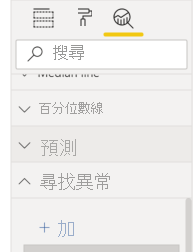
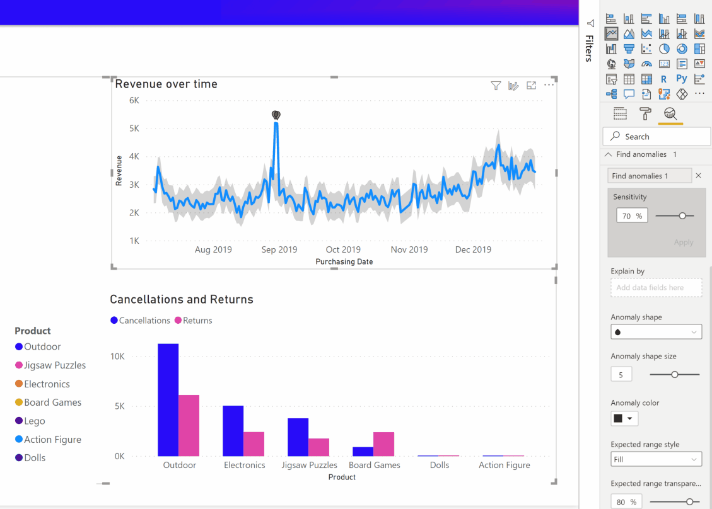

# 異常偵測 (預覽)

[!INCLUDE[consumer-appliesto-nyyn](../includes/consumer-appliesto-nyyn.md)]    

異常偵測可協助您透過自動偵測時間序列資料中的異常來增強折線圖。 其也會提供異常的說明，以協助進行根本原因分析。  您只要按幾下滑鼠就可以輕鬆地找到見解，而不需切割和細分資料。 您可以在 Power BI Desktop 和 Power BI 服務中建立和檢視異常。 本文中的步驟和圖例來自 Power BI Desktop。

此功能目前處於預覽狀態，因此您必須先開啟功能切換。 前往 [檔案] > [選項及設定] > [選項] > [預覽功能]，然後確定已開啟 [異常偵測]：

:::image type="content" source="media/power-bi-visualization-anomaly-detection//preview-feature-switch.png" alt-text="顯示如何啟用 [異常偵測] 預覽功能切換的螢幕擷取畫面。":::
 
## 開始使用
此教學課程使用適用於各種產品的線上銷售資料。若要完成此教學課程，請下載線上銷售案例的[範例檔案](https://github.com/microsoft/powerbi-desktop-samples/blob/main/Monthly%20Desktop%20Blog%20Samples/2020/2020SU09%20Blog%20Demo%20-%20September.pbix)。

您可以透過選取圖表，並在分析窗格中新增 [尋找異常] 選項，來啟用異常偵測。 

 

 例如，此圖表會顯示一段時間的收益。 新增異常偵測會自動為圖表擴充異常，以及預期的值範圍。 當值超出此預期界限時，即會將其標示為異常。 如需異常偵測器演算法的詳細資料，請參閱這個[技術部落格](https://techcommunity.microsoft.com/t5/ai-customer-engineering-team/overview-of-sr-cnn-algorithm-in-azure-anomaly-detector/ba-p/982798) \(英文\)。

 
 
## 格式異常

此體驗可高度自訂。 您可以將異常的圖形、大小及色彩，以及預期範圍的色彩、樣式及透明度格式化。 您也可以設定演算法的參數。  如果您增加敏感度，演算法就會對資料中的變更更加敏感。 在該情況下，即使是輕微的偏差也會標示為異常。 如果您降低敏感度，演算法就會更謹慎地選擇其認為是異常的項目。

 
 
## 說明
除了偵測異常，您也可以自動說明資料的異常。 當您選取異常時，Power BI 會跨您資料模型中的欄位執行分析，以找出可能的說明。 其會以自然語言為您提供異常說明，以及與該異常相關聯的因素，並依其說明強度進行排序。 我在此處看到 8 月 30 日的收益為 $5187，其高於 $2447 到 $3423 的預期範圍。 我可以開啟此窗格中的卡片，以查看說明的詳細資料。

 
### 設定說明
您也可以控制用於分析的欄位。 例如，透過將 [銷售人員] 和 [城市] 拖曳至 [說明依據] 欄位區，Power BI 就會將分析限制為僅限那些欄位。 在此案例中，8 月 31 日的異常似乎與特定銷售人員和特定城市相關聯。 在這裡，銷售人員 "Fabrikam" 具有 99% 的強度。 Power BI 會將「強度」計算為在依總值中偏差的維度進行篩選的情況下，針對預期值之偏差的比率。 例如，其是在元件時間序列 *Fabrikam* 和異常點的彙總時間序列「整體收益」之間，實際值減去預期值的比率。 開啟此卡片會顯示此銷售人員在 8 月 31 日收益出現尖峰的視覺效果。 使用 [新增至報表] 選項，以將此視覺效果新增至頁面。

## 限制
- 只有 [軸] 欄位中包含時間序列資料的折線圖視覺效果才支援異常偵測。
- 具有圖例、多個值或次要值的折線圖視覺效果均不支援異常偵測。
- 異常偵測至少需要 12 個資料點。
- 預測值/最小值/最大值/平均值/中位數/百分位數線均無法與異常偵測搭配使用。
- 不支援透過 SAP 資料來源的直接查詢、Power BI 報表伺服器、即時連線至 Azure Analysis Services 和 SQL Server Analysis Services。
- 異常說明無法搭配 [將值顯示為] 選項運作。
- 不支援向下切入以前往階層中的下一個層級。
