# 在 Power BI Desktop 中建立 ArcGIS 地圖

[!INCLUDE[consumer-appliesto-nyyn](../includes/consumer-appliesto-nyyn.md)]

[!INCLUDE [power-bi-visuals-desktop-banner](../includes/power-bi-visuals-desktop-banner.md)]

本教學課程是由 ArcGIS Map for Power BI 建立者的觀點撰寫而成。 「設計人員」  與同事共用 ArcGIS Map for Power BI 地圖後，同事雖然可以檢視地圖並與其互動，卻無法儲存變更。 若要深入了解如何檢視 ArcGIS 地圖，請參閱[與 ArcGIS Maps for Power BI 互動](power-bi-visualizations-arcgis.md)。

> [!NOTE]
> 要與 Power BI 同事共用您的報表，必須雙方都擁有個人的 Power BI Pro 授權，或者將報表儲存在 Premium 容量中。

ArcGIS 地圖與 Power BI 的結合，把在點之外加上地圖的做法帶到了全新境界。 從基礎地圖、位置類型、佈景主題、符號樣式及參考圖層中選擇，以建立具有豐富資訊的優異地圖視覺效果。 地圖上的官方資料圖層與空間分析結合之後，能讓人更深入了解視覺效果中的資料。

 雖然您無法在行動裝置上建立 ArcGIS Maps for Power BI 地圖，但可以檢視地圖並與其互動。 請參閱[與 ArcGIS 地圖互動](power-bi-visualizations-arcgis.md)。

> [!NOTE]
> ArcGIS Maps for Power BI 目前無法供 Power BI 報表伺服器使用。

> [!TIP]
> GIS 是 Geographic Information System (地理資訊系統) 的縮寫。

下方範例以 2016 年可支配所得中位數的人口統計圖層為背景，使用深灰色畫布以熱度圖形式顯示區域銷售額。 如同您在閱讀時所見，ArcGIS Maps for Power BI 提供幾乎無限制的增強式對應功能、人口統計資料，以及更吸引人的地圖視覺效果，讓您可以呈現更精彩的故事。

> [!TIP]
> 若要查看多個範例及閱讀見證，請前往 [ArcGIS Maps for Power BI 的 Esri 頁面](https://www.esri.com/powerbi)。 接著請參閱 Esri 的 [ArcGIS Maps for Power BI 使用者入門頁面](https://doc.arcgis.com/en/maps-for-powerbi/get-started/about-maps-for-power-bi.htm)。

## 使用者同意
ArcGIS Maps for Power BI 由 Esri (https://www.esri.com) 提供。 因此，您的 ArcGIS Maps for Power BI 使用方式受到 Esri 的條款及隱私權原則的規範。 如果 Power BI 使用者想要使用 ArcGIS Maps for Power BI 的視覺效果，就必須接受同意對話方塊。

**資源**

[條款](https://go.microsoft.com/fwlink/?LinkID=826322)

[隱私權原則](https://go.microsoft.com/fwlink/?LinkID=826323)

[ArcGIS Maps for Power BI 產品頁面](https://www.esri.com/powerbi)

## 必要條件

本教學課程使用 Power BI Desktop 及 PBIX [零售分析範例](https://download.microsoft.com/download/9/6/D/96DDC2FF-2568-491D-AAFA-AFDD6F763AE3/Retail%20Analysis%20Sample%20PBIX.pbix)。 您也可以使用 Power BI 服務建立 ArcGIS Maps for Power BI。 

1. 從功能表列的左上方區段，選取 [檔案]  \> [開啟] 
   
2. 尋找儲存在您本機電腦上的**零售分析範例 .PBIX 檔案**。

1. 在報表檢視  中開啟 [零售分析範例]  。

1. 選取  新增頁面。

   
## 建立 ArcGIS Maps for Power BI 地圖視覺效果

觀看影片中 Will 如何建立幾個不同的視覺效果，然後使用以下步驟，以[零售分析範例 .PBIX 檔案](../sample-datasets.md)親自試試看。
    

   > [!NOTE]
   > 這部影片使用舊版的 Power BI Desktop。
   > 

> [!VIDEO https://www.youtube.com/embed/EKVvOZmxg9s]

1. 從 [視覺效果] 窗格中選取 ArcGIS Maps for Power BI 圖示。
   
    ![ArcGIS 地圖的 [視覺效果] 窗格](media/power-bi-visualization-arcgis/power-bi-viz-pane.png)    

2. Power BI 會在報表畫布中新增空白範本。 我們將在本教學課程中使用免費版本。
   
   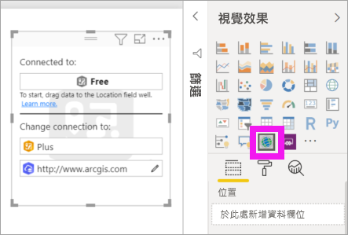

3. 將資料欄位從 [欄位]  窗格拖曳到 [位置]  或 [緯度]  及 (或) [經度]  貯體。 在本例中，我們使用 [門市] > [城市]  。
   
   > [!NOTE]
   > ArcGIS Maps for Power BI 會自動偵測您所選取的欄位，檢查是否最適合以地圖上的圖形或點來檢視。 您可以調整設定中的預設值 (請見下方資訊)。
   > 
   > 
   
    ![ArcGIS [欄位] 窗格](media/power-bi-visualization-arcgis/power-bi-fields-pane3new.png)

4. 將量值從 [欄位]  窗格拖曳到 [大小]  貯體，以調整資料的顯示方式。 在本例中，我們使用 [銷售額] > [去年銷售額]  。
   
    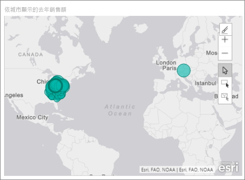

您已建立自己的第一份 ArcGIS Map for Power BI 地圖。 現在，讓我們使用基本地圖、位置類型、主題及更多項目來精簡及格式化地圖。

## 設定及格式化 ArcGIS Maps for Power BI
若要存取 **ArcGIS Maps for Power BI** 的格式設定功能︰

1. 選取視覺效果右上角的 [其他動作]  (...) 並選擇 [編輯]  來存取其他功能。
   
   ![ArcGIS [編輯] 窗格](media/power-bi-visualization-arcgis/power-bi-edit2.png)
   
   視覺效果隨即展開，且可用的功能會顯示在視覺效果上方。 選取每項功能時，皆會開啟工作窗格並提供詳細的選項。 
   
   ![Esri [功能] 窗格](media/power-bi-visualization-arcgis/power-bi-esri-features-new.png)
   

> [!TIP]
> **Esri** 有提供 **ArcGIS Maps for Power BI** 功能集的[完整文件](https://go.microsoft.com/fwlink/?LinkID=828772)。

### 基本地圖
提供四種基本地圖：深灰畫布、淺灰畫布、OpenStreetMap 和街道名。  「街道」  是 ArcGIS 的標準基本地圖。

若要套用基本地圖，請在 [工作] 窗格中選取它。

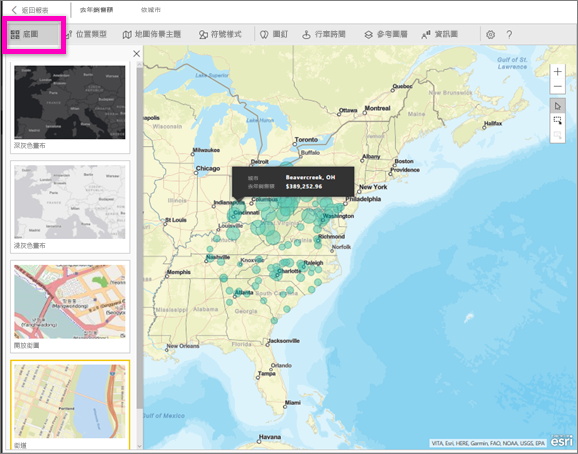

### 位置類型
ArcGIS Maps for Power BI 會自動偵測在地圖中顯示資料的最佳方式。 它會從資料點或界限中選取。 [位置類型] 選項可供微調這些選取項目。

**界限**：僅有當您的資料包含標準地理值時，才適用此項目。 ArcGIS Maps for Power BI 會自動找出要在地圖上顯示的圖形。 標準地理值包括國家/地區、州/省、郵遞區號等。但就像使用地理編碼一樣，Power BI 可能無法偵測應該預設為界限的欄位，或可能找不到資料的界限。  

### 地圖佈景主題
提供四種地圖佈景主題。 Power BI 會根據新增至 [位置]  和 [大小]  貯體的欄位，自動選取 [Location only] \(僅位置\)  或 [大小]  主題。 地圖已預設為 [大小]  ，因為我們在兩個貯體皆已新增欄位。 請先嘗試其他主題並返回 [大小]  ，再移至下一個步驟。  

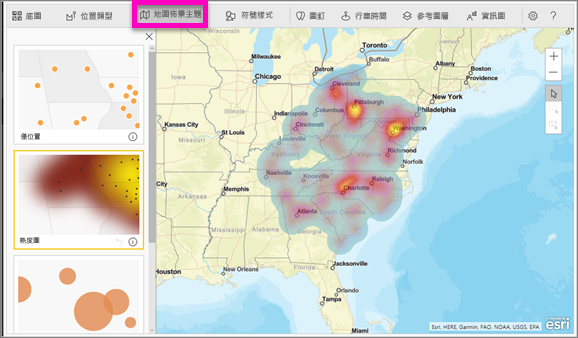

<table>
<tr><th>佈景主題</th><th>描述</th>
<tr>
<td>僅位置</td>
<td>根據您在 [位置] 貯體新增的欄位，在地圖上繪製資料點或區域分布界線。</td>
</tr>
<tr>
<td>熱度圖</td>
<td>在地圖上繪製資料的密集度。 有較高活動或值之區域會以較強的發光色彩表示。 </td>
</tr>
<tr>
<td>大小</td>
<td>根據您在 [大小] 貯體新增的欄位，在地圖上繪製資料點。</td>
</tr>
<tr>
<td>叢集</td>
<td>所指定叢集半徑內的資料點會分組為單一符號，其代表該地圖區域中的點數。 </td>
</tr>
</table>

### 符號樣式
符號樣式可供微調地圖上的資料呈現方式。 符號樣式會根據選取的 [位置類型] 和 [地圖佈景主題] 來與內容保持相關。 以下範例顯示設為 [大小]  的 [地圖佈景主題]，以及數個調整透明度、樣式和大小的符號樣式。 

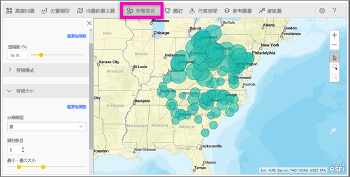

### 圖釘
新增圖釘，讓人將注意力放到地圖上的點。  

1. 選取 [圖釘]  索引標籤。
2. 在搜尋方塊中鍵入關鍵字 (例如地址、地點和景點)，然後從下拉式清單中選取。 地圖上會出現一個符號，而且地圖會自動縮放至該位置。 搜尋結果會儲存為 [圖釘] 窗格中的位置卡片。 您最多可以儲存 10 張位置卡片。
   
   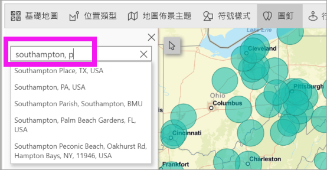
3. Power BI 會將圖釘新增到該地點，而您可以變更圖釘的色彩。
   
   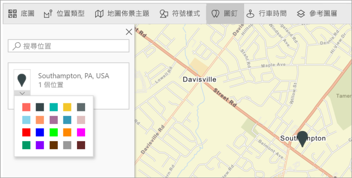
4. 新增及刪除圖釘。
   
   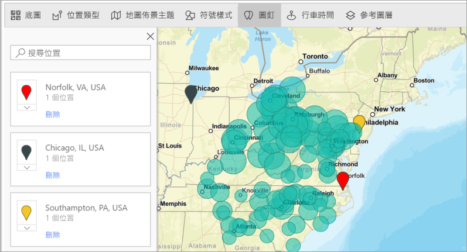

### 行車時間
[Drive time]\(行車時間) 窗格可讓您選取一個位置，然後判斷指定半徑範圍或行車時間內還有哪些其他地圖功能。 以下範例顯示以華盛頓特區為中心，半徑 50 英里的範圍  請遵循以下步驟建立您自己的行車時間圖層。 
    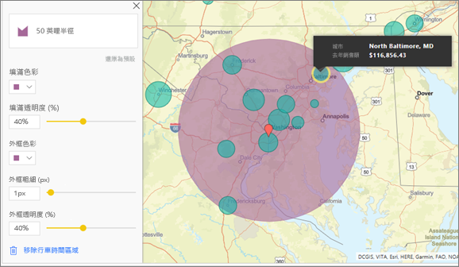

1. 選取單一選取工具，然後選擇釘選或泡泡。 在此範例中，我們已選取釘選夏洛特道格拉斯國際機場

   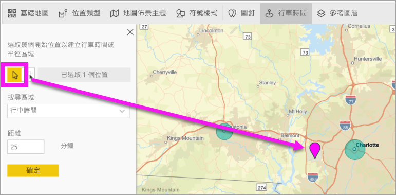
   
   > [!TIP]
   > 如果放大地圖會更容易選取位置。 您可以使用 + 圖示或滾動滑鼠來縮放地圖。
   > 
   > 
2. 假設您要飛往夏洛特道格拉斯國際機場幾天，並想要找出您的哪些連鎖商店位在合理行車距離內。 請將 [搜尋區域] 變更為 [行車時間]  ，並將 [距離] 變更為 [25]  分鐘。 選取 [確定]。    
   
    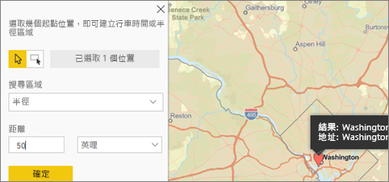

    

3. 在車行 25 分鐘的距離內有兩家店。 即會以紫色顯示半徑範圍。 選取任何位置以顯示其詳細資料。 選擇性地變更色彩和外框來格式化半徑。
   
    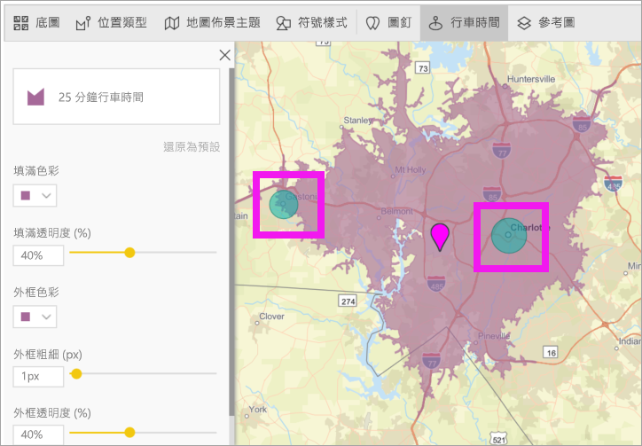

### 參考圖層
#### 參考圖層 - 人口統計
ArcGIS Maps for Power BI 提供人口統計圖層的選項，有助於將來自 Power BI 的資料與內容保持相關。

1. 選取 [Reference layer] \(參考圖層)  索引標籤，然後選擇 [人口統計]  。
2. 列出的每個圖層都有一個核取方塊。 加入勾選記號即可將該圖層新增至地圖。  在此範例中，我們已新增平均家庭收入的圖層。 
   
    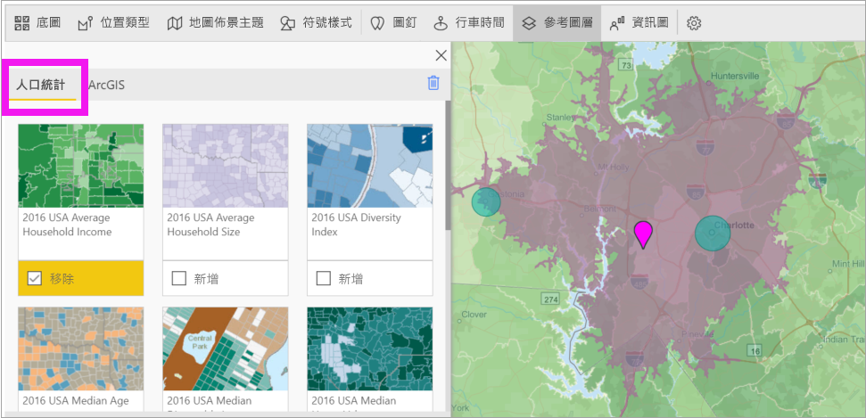
3. 每個圖層皆為互動式。 將滑鼠暫留在泡泡上以查看詳細資料。 按一下陰影區域以查看圖表形式的詳細資料。 我們在此選取了郵遞區號 28227，其有兩張圖表可供檢視。
   
    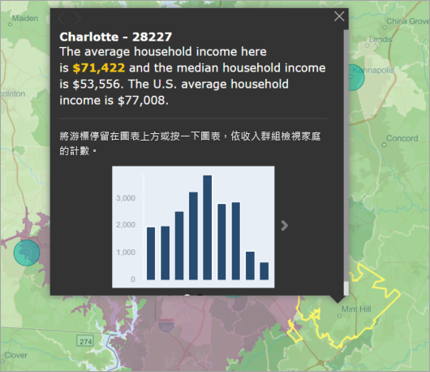

#### 參考圖層 - ArcGIS
ArcGIS Online 可讓您的組織發行公用網站的地圖。 此外，Esri 也透過 Living Atlas 提供網站地圖的豐富組合。 在 [ArcGIS] 索引標籤中，您可以搜尋所有公用網站地圖或 Living Atlas 地圖，並將其新增至地圖以作為參考圖層。

1. 選取 [Reference layer] \(參考圖層)  索引標籤，然後選擇 [ArcGIS]  。
2. 輸入搜尋字詞，然後選取地圖圖層。 在此範例中，我們選擇美國國會區域。
   
    
3. 若要查看詳細資料，請選取陰影區域來開啟 [從參考圖層選取]  ：使用參考圖層選取工具來選取參考圖層上的邊界或物件。

 

## 選取資料點
ArcGIS Maps for Power BI 允許五個選取模式，協助您精確且快速地選取資料。

將游標移到下圖所示的單一選取工具圖示上方，即可變更選取模式。 這會展開隱藏的列以顯示其他工具：

每個工具都具有唯一的角色，可讓您選取您的資料： 

 選取個別資料點。

 在地圖上繪製一個矩形，並選取包含的資料點。

 可讓您使用參考圖層內的界限或多邊形，來選取包含的資料點。

 可讓您使用緩衝區圖層來選取資料。

 可讓您選取彼此相似的資料點。

> [!NOTE]
> 一次最多可以選取 250 個資料點。
> 
> 

 

## 取得說明
**Esri** 有提供 **ArcGIS Maps for Power BI** 功能集的[完整文件](https://go.microsoft.com/fwlink/?LinkID=828772)。

您可以參與 [**ArcGIS Maps for Power BI** 相關的 Power BI 社群對話](https://go.microsoft.com/fwlink/?LinkID=828771)，提出問題、了解最新資訊、回報問題及尋找解答。

如果您有建議的改進項目，請將其提交到 [Power BI 的集思廣益清單](https://ideas.powerbi.com)。

 

## 管理組織內的 ArcGIS Maps for Power BI 使用情況
Power BI 可讓設計人員、租用戶系統管理員及 IT 系統管理員管理 ArcGIS Maps for Power BI 的使用狀況。 您會在下文中發現每個角色可以採取的步驟。 

### 設計工具選項
在 Power BI Desktop 中，設計人員可在 [安全性] 索引標籤停用 ArcGIS Maps for Power BI。選取 [檔案]   > [選項和設定]  ，然後選取 [選項]   > [安全性]  。 停用時，就不會預設載入 ArcGIS 地圖。

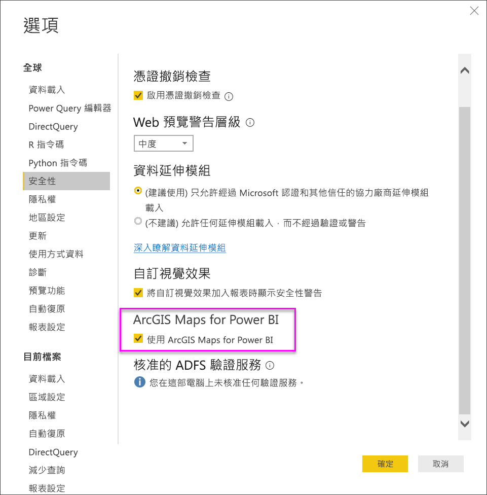

### 租用戶系統管理員選項
在 PowerBI.com 中，租用戶系統管理員可以關閉所有使用者的 ArcGIS Maps for Power BI。 選取 [設定]   > [系統管理入口網站]   > [租用戶設定]  。 停用後，Power BI 的 [視覺效果] 窗格中即不再顯示 ArcGIS Maps for Power BI 圖示。

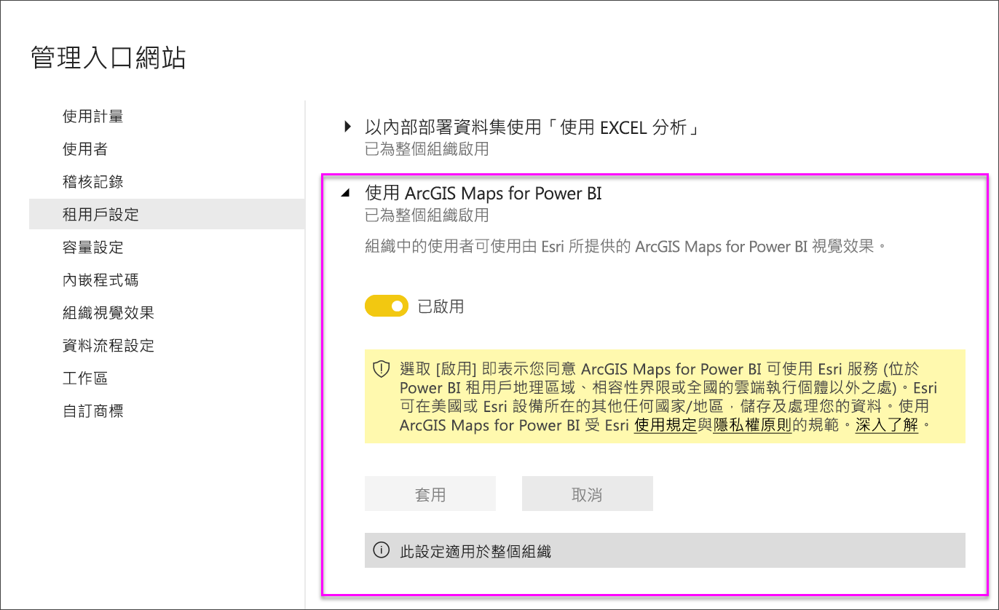

### IT 系統管理員選項
Power BI Desktop 支援使用 [群組原則]  來停用整個組織部署電腦的 ArcGIS Maps for Power BI。

<table>
<tr><th>屬性</th><th>值</th>
</tr>
<tr>
<td>索引鍵</td>
<td>Software\Policies\Microsoft\Power BI Desktop&lt;/td&gt;
</tr>
<tr>
<td>valueName</td>
<td>EnableArcGISMaps</td>
</tr>
</table>

值為 1 (十進位) 時，表示啟用 ArcGIS Maps for Power BI。

值為 0 (十進位) 時，表示停用 ArcGIS Maps for Power BI。

## 考量與限制
ArcGIS Maps for Power BI 可在下列服務和應用程式中使用：

<table>
<tr><th>服務/應用程式</th><th>可用性</th></tr>
<tr>
<td>Power BI Desktop</td>
<td>是</td>
</tr>
<tr>
<td>Power BI 服務 (app.powerbi.com)</td>
<td>是</td>
</tr>
<tr>
<td>Power BI 行動應用程式</td>
<td>是</td>
</tr>
<tr>
<td>Power BI 的發佈至網路功能</td>
<td>否</td>
</tr>
<tr>
<td>Power BI Embedded</td>
<td>否</td>
</tr>
<tr>
<td>Power BI 服務內嵌 (PowerBI.com)</td>
<td>否</td>
</tr>
</table>

在無法使用 ArcGIS Maps for Power BI 的服務或應用程式中，視覺效果將顯示為帶有 Power BI 標誌的空白視覺效果。

當為街道地址進行地理編碼時，僅限為前 1500 個地址進行地理編碼。 為位置名稱或國家/地區進行地理編碼時，不受 1500 個地址的限制。

 

**如何搭配 ArcGIS Maps for Power BI 運作？**
ArcGIS Maps for Power BI 由 Esri (https://www.esri.com) 提供。 因此，您的 ArcGIS Maps for Power BI 使用方式受到 Esri 的[條款](https://go.microsoft.com/fwlink/?LinkID=8263222)及[隱私權原則](https://go.microsoft.com/fwlink/?LinkID=826323)的規範。 如果 Power BI 使用者想要使用 ArcGIS Maps for Power BI 的視覺效果，就必須接受同意對話方塊 (如需詳細資訊，請參閱＜使用者同意＞)。  Esri 的 ArcGIS Maps for Power BI 使用方式受到 Esri 的條款及隱私權原則的規範，同意對話方塊也提供相關連結。 每位使用者第一次使用 ArcGIS Maps for Power BI 之前都必須先同意。 一旦使用者接受同意對話方塊，繫結至視覺效果的資料就會傳送至 Esri 服務至少進行地理編碼，這表示會將位置資訊轉換成可在地圖上表示的緯度和經度資訊。 您應該假設任何繫結至資料視覺效果的資料都可能會傳送至 Esri 服務。 Esri 提供基本地圖、空間分析、地理編碼等服務。ArcGIS Maps for Power BI 視覺效果透過受到 Esri 所提供及維護的憑證保護的 SSL 連線與這些服務互動。 您可以從 Esri 的 [ArcGIS Maps for Power BI 產品頁面](https://www.esri.com/powerbi)取得 ArcGIS Maps for Power BI 的其他資訊。

當使用者透過 ArcGIS Maps for Power BI 註冊由 Esri 提供的 Plus 訂閱時，即開始與 Esri 的直接關係。 Power BI 不會將使用者的個人資訊傳送至 Esri。 使用者使用自己的 AAD 身分識別登入並信任 Esri 提供的 AAD 應用程式。 如此一來，使用者便可以直接與 Esri 共用其個人資訊。 一旦使用者將 Plus 內容新增至 ArcGIS Maps for Power BI 視覺效果，其他 Power BI 使用者也需要 Esri 的 Plus 訂閱才能檢視或編輯該內容。 

如有 Esri 之 ArcGIS Maps for Power BI 運作方式的詳細技術性問題，請透過其支援網站與 Esri 聯繫。

**哪些資料會傳送給 Esri？**
您可以閱讀 Esri 的[文件網站](https://doc.arcgis.com/en/maps-for-powerbi/get-started/data-transfer.htm)，以了解哪些資料會傳輸給 Esri。

**使用 ArcGIS Maps for Power BI 會產生任何費用嗎？**

ArcGIS Map for Power BI 由 **Esri** 提供，不收取額外費用。 您必須同意使用者合約。  

**我在 Power BI Desktop 中收到有關快取將滿的錯誤訊息**

目前正在解決此 BUG。  在此同時，若要清除您的快取，請嘗試刪除此位置的檔案：C:\Users\\AppData\Local\Microsoft\Power BI Desktop\CEF 並重新啟動 Power BI。

**ArcGIS Maps for Power BI 是否支援 Esri 形狀檔？**

ArcGIS Maps for Power BI 會自動偵測國家/地區、州/省和郵遞區號等標準界限。 如有需要，您可以使用 [Power BI Desktop 的圖形對應](desktop-shape-map.md)來提供自有圖形。

**我可以離線檢視我的 ArcGIS 地圖嗎？**

不能，Power BI 需要網路連線才能顯示地圖。

**我可以從 Power BI 連接至我的 ArcGIS Online 帳戶嗎？**

目前還不行。 [請為這個提議進行投票](https://ideas.powerbi.com/forums/265200-power-bi-ideas/suggestions/9154765-arcgis-geodatabases)，日後當我們開始處理這項功能時，即會傳送電子郵件通知您。  

## 後續步驟
[與已和您共用的 ArcGIS 地圖互動](power-bi-visualizations-arcgis.md)

[宣布 ArcGIS maps for Power BI 正式運作的部落格文章](https://powerbi.microsoft.com/blog/announcing-arcgis-maps-for-power-bi-by-esri-preview/)

有其他問題嗎？ [嘗試在 Power BI 社群提問](https://community.powerbi.com/)

