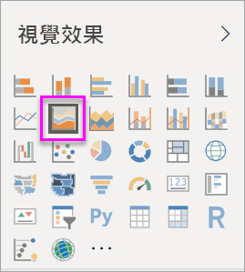
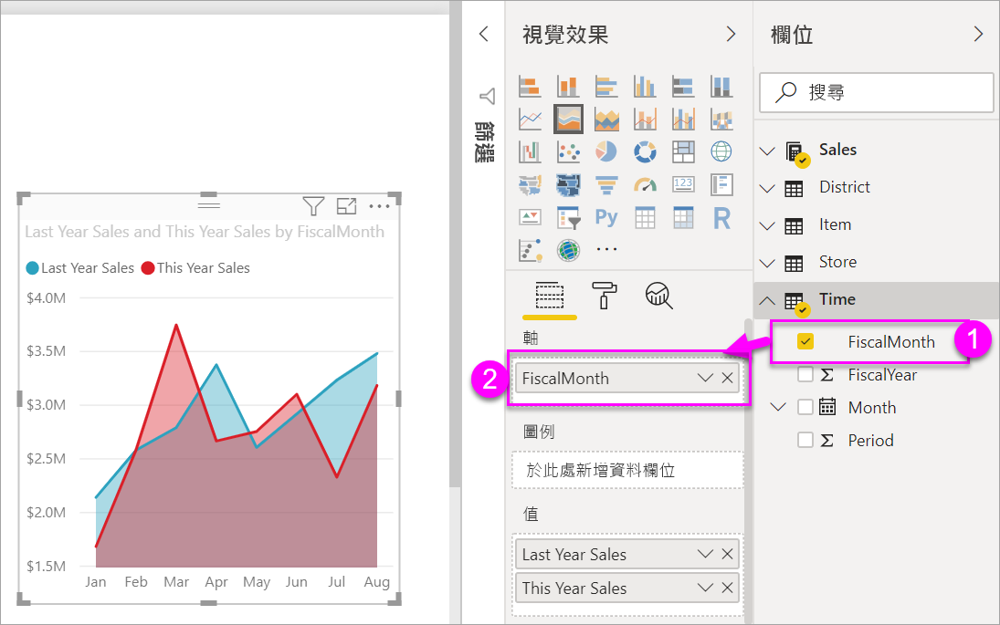

# 建立和使用基本區域圖

[!INCLUDE[consumer-appliesto-nyyn](../includes/consumer-appliesto-nyyn.md)]

[!INCLUDE [power-bi-visuals-desktop-banner](../includes/power-bi-visuals-desktop-banner.md)]

基本區域圖 (也稱為多層次區域圖表) 的基礎為折線圖。 軸和行之間的區域填滿色彩，以表示數量。 

區域圖強調隨著時間的變化大小，而且可用來強調跨趨勢的總計值。 例如，代表收益隨時間變化的資料，可以在區域圖中繪製，藉此強調總收益。

> [!NOTE]
> 若要與 Power BI 同事共用報表，必須兩人都擁有個人的 Power BI Pro 授權，或將報表儲存在 Premium 容量中。

## 使用基本區域圖的時機
基本區域圖極適合：

* 如果您要查看和比較時間序列中的數量趨勢 
* 如果個別數列代表實質上可數的集合

### 必要條件
本教學課程使用[零售分析範例 PBIX 檔案](https://download.microsoft.com/download/9/6/D/96DDC2FF-2568-491D-AAFA-AFDD6F763AE3/Retail%20Analysis%20Sample%20PBIX.pbix)。

1. 從功能表列的左上方區段中，選取 [檔案] > [開啟]
   
2. 尋找您的 **零售分析範例 PBIX 檔案** 複本

1. 在報表檢視  中開啟 **零售分析範例 PBIX 檔案**。

1. 選取  新增頁面。

## 建立基本區域圖
 

1. 這些步驟將可協助您建立依月份顯示本年度和去年度銷售額的區域圖。
   
   a. 從 [欄位] 窗格中選取 [銷售] \> [去年銷售]，以及 [今年銷售] > [值]。

   

   b.  從 [視覺效果] 窗格選取區域圖圖示，以將圖表轉換成基本區域圖。

   
   
   c.  選取 [時間] **\> [會計月份]** 以將它新增到 [軸] 部分。   
   
   
   d.  若要依照月份顯示圖表，請選取省略符號 \(視覺效果的右上角)，並選擇 \[Sort by month] \(按月份排序)。 若要變更排序次序，請再次選取省略符號，並選取 [遞增排序] 或 [遞減排序]。

## 反白顯示和交叉篩選
如需使用 [篩選] 窗格的資訊，請參閱[將篩選加入報表](../create-reports/power-bi-report-add-filter.md)。

若要反白顯示圖表中的一個特定區域，請選取該區域或其上框線。  不同於其他視覺效果類型，如果在相同的頁面上有其他視覺效果，反白顯示基本區域圖並不會交叉篩選報表頁面上的其他視覺效果。 不過，對報表頁面上的其他視覺效果來說，區域圖是觸發交叉篩選的目標。 

1. 選取區域圖，並將它複製到 [新商店分析] 報表頁面 (CTRL-C 與 CTRL-V) 以進行嘗試。
2. 選取區域圖的其中一個陰影區域，然後選取另一個陰影區域。 您會發現對頁面上其他視覺效果沒有任何影響。
1. 現在請選取一個元素。 請注意對區域圖的影響 -- 它會交叉篩選。

     

若要進一步了解，請參閱[報表中的視覺效果互動](../create-reports/service-reports-visual-interactions.md)

## 考量與疑難排解   
* [使報表讓行動不便人士易於存取](../create-reports/desktop-accessibility-overview.md)
* 基本區域圖不適用於比較值，原因是多層次區域會受阻擋。 Power BI 使用透明效果來表示重疊的區域。 不過，它只適用於兩個或三個不同的區域。 當您需要比較三個以上量值的趨勢時，請試著使用折線圖。 當您需要比較三個以上量值的數量時，請試著使用樹狀圖。

## 下一步
[Power BI 中的報表](power-bi-visualization-card.md)  
