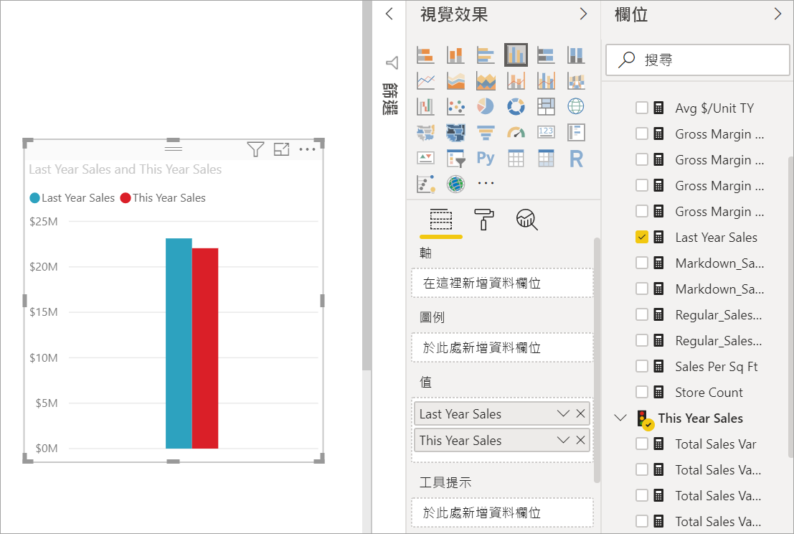
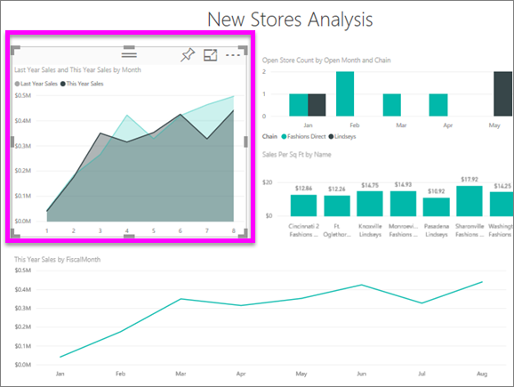
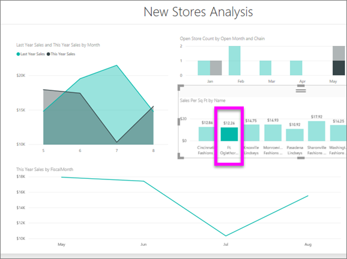

# 基本的區域圖
基本區域圖 (也稱為多層次區域圖表) 的基礎為折線圖。 軸和行之間的區域填滿色彩，以表示數量。 

區域圖強調隨著時間的變化大小，而且可用來強調跨趨勢的總計值。 例如，代表收益隨時間變化的資料，可以在區域圖中繪製，藉此強調總收益。

## 使用基本區域圖的時機
基本區域圖極適合：

* 如果您要查看和比較時間序列中的數量趨勢 
* 如果個別數列代表實質上可數的集合

### 先決條件
 - Power BI 服務
 - 零售分析範例

若要跟著做，請登入 Power BI 並選取 [取得資料] \> [範例] \> [零售分析範例]，然後選擇 [移至儀表板]。 

## 建立基本區域圖
 

1. 從 [零售分析範例] 儀表板，選取 [所有門市]  圖格，開啟 [零售分析範例] 報表。
2. 選取 [編輯報表]  ，在編輯檢視中開啟報表。
3. 選取報表底部的黃色加號圖示 (+)，以新增報表頁面。
4. 建立依月份顯示本年度和去年度銷售額的區域圖。
   
   a. 從 [欄位] 窗格中選取 [銷售] \> [去年銷售]，以及 [今年銷售] > [值]。

   

   b.  從 [視覺效果] 窗格選取區域圖圖示，以將圖表轉換成基本區域圖。

   
   
   c.  選取 [時間] \> [月] 以將它加入 [軸] 部分。   
   
   
   d.  若要依照月份顯示圖表，請選取省略符號 \(視覺效果的右上角)，並選擇 \[Sort by month] \(按月份排序)。 若要變更排序次序，請再次選取省略符號，並選取 [遞增排序] 或 [遞減排序]。

## 反白顯示和交叉篩選
如需使用 [篩選] 窗格的資訊，請參閱[將篩選加入報表](../power-bi-report-add-filter.md)。

若要反白顯示圖表中的一個特定區域，請選取該區域或其上框線。  不同於其他視覺效果類型，如果在相同的頁面上有其他視覺效果，反白顯示基本區域圖並不會交叉篩選報表頁面上的其他視覺效果。 不過，對報表頁面上的其他視覺效果來說，區域圖是觸發交叉篩選的目標。 

1. 請試著選取區域圖，並將它複製到另一個報表頁面 (CTRL + C 和 CTRL-V)。
2. 選取其中一個陰影區域，然後選取另一個陰影區域。 您會發現對頁面上其他視覺效果沒有任何影響。

    

3. 現在選取頁面上其他視覺效果的其中一個，例如直條圖直條或折線圖上的一個月。 請注意對區域圖的影響 -- 它會篩選。  

     

若要進一步了解，請參閱[報表中的視覺效果互動](../service-reports-visual-interactions.md)

## 考量與疑難排解   
* [使報表讓行動不便人士易於存取](../desktop-accessibility.md)
* 基本區域圖不適用於比較值，原因是多層次區域會受阻擋。 Power BI 使用透明效果來表示重疊的區域。 不過，它只適用於兩個或三個不同的區域。 當您需要比較三個以上量值的趨勢時，請試著使用折線圖。 當您需要比較三個以上量值的數量時，請試著使用樹狀圖。

## 下一個步驟
[Power BI 中的報表](power-bi-visualization-card.md)  

