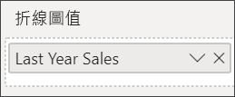

# Power BI 中的組合圖
在 Power BI 中，組合圖是結合折線圖和直條圖的單一視覺效果。 將 2 種圖結合成一個，讓您可以更快速地比較資料。

組合圖可以有一或兩條 Y 軸。

## 使用組合圖的時機
組合圖極適合：

* 當您的折線圖和直條圖具有相同的 X 軸。
* 當您要比較多個量值，其具有不同範圍的值。
* 當您要在一個視覺效果中說明兩個量值間的相互關聯。
* 當您要檢查量值是否符合另一個量值所定義的目標。
* 當您要節省畫布的空間。

### 先決條件
組合圖適用於 Power BI 服務和 Power BI Desktop。 本教學課程會使用 Power BI 服務建立組合圖。 若要跟著做，請開啟 Power BI 服務並連線到 [零售分析] 範例 ([指示如下](#create))。

## 建立單一軸的基本組合圖
觀看 Will 如何使用銷售和行銷範例建立組合圖。

<iframe width="560" height="315" src="https://www.youtube.com/embed/lnv66cTZ5ho?list=PL1N57mwBHtN0JFoKSR0n-tBkUJHeMP2cP" frameborder="0" allowfullscreen></iframe>  

 若要建立自己的組合圖，請登入 Power BI 服務並選取 [取得資料] \> [範例]\> [零售分析範例] &gt; [連線]&gt; [移至儀表板]  。

1. 從 [零售分析範例] 儀表板，選取 [所有門市]  圖格，開啟 [零售分析範例] 報表。
2. 選取 [編輯報表]  ，在編輯檢視中開啟報表。
3. 加入新的報表頁面。
4. 建立依月份顯示本年度銷售額和毛利的直條圖。

    a.  從 [欄位] 窗格中選取 [銷售額]  \> [本年度銷售額]   >  [值]  。

    b.  將 [銷售額]  \>[本年度毛利]  拖曳到 [值]  的部分。

    c. 選取 [時間]  \> [會計月份]  ，將其加入 [軸]  部分。

    
5. 選取視覺效果右上角的省略符號 (...)，然後選取 [Sort by] > [FiscalMonth] \(排序依據\) > [FiscalMonth]  。 若要變更排序次序，請再次選取省略符號，並選擇 [遞增排序]  或 [遞減排序]  。

6. 將直條圖轉換成組合圖。 有兩個組合圖可用：[折線與堆疊直條圖]  和 [折線與群組直條圖]  。 選取直條圖後，從 [視覺效果]  窗格中，選取 [折線與群組直條圖]  。

    
7. 從 [欄位]  窗格中，將 [銷售額]  \> [去年度銷售額]  拖曳到 [折線圖值]  值區。

   

   您的組合圖看起來應該像這樣：

   

## 建立具有兩軸的組合圖
在這項工作中，我們會比較毛利率與銷售額。

1. 建立追蹤的新折線圖**Gross Margin 去年 %** 依**FiscalMonth**。 選取省略符號，依 [月份]  和 [遞增]  排序。  
一月的 GM% 為 35%，尖峰在 4 月為 45%，於 7 月下降並再次於 8 月達到尖峰。 我們去年和今年會看到類似的銷售模式嗎？

   
2. 將 [今年度銷售額 > 值]  和 [去年度銷售額]  新增至折線圖。 [去年毛利率 %]  的刻度遠小於 [銷售額]  的刻度，因此難以比較。      

   
3. 若要使視覺效果更容易閱讀及解譯，請將折線圖轉換成折線與堆疊直條圖。

   
4. 將 [去年毛利率 %]  從 [資料行值]  拖曳到 [行值]  。 Power BI 會建立兩個軸，因此可用不同方式調整資料集；左邊的量值為銷售金額，而右邊的量值則為百分比。 我們看到我們問題的答案；是的，我們確實看到類似的模式。

       

## 將標題加入座標軸
1. 選取油漆滾筒圖示  來開啟 [格式化] 窗格。
2. 選取向下箭號以展開 [Y 軸]  選項。
3. 針對**y 軸 （欄）** ，將**位置**來**左**，將**標題**到**上**， **樣式**要**僅顯示標題**，以及**顯示單位**作為**數以百萬計**。

   
4. 底下**y 軸 （欄）** ，向下捲動，直到您看到**顯示次要**。 因為有許多選項可以 Y 軸，您可能使用這兩個捲軸。 [顯示次要] 區段會顯示格式化折線圖部分組合圖的選項。

   
5. 對於 [Y 軸 (行)]  ，保留 [位置]  為 [右]  ，將 [標題]  改為 [開啟]  ，並將 [樣式]  設為 [僅顯示標題]  。

   組合圖現在顯示兩個軸，而且都有標題。

   

6. (選擇性) 修改文字的字型、大小和色彩，並設定其他格式化選項，以改善圖表的顯示和可讀性。

接下來，您可能會想要：

* [將組合圖加入為儀表板圖格](../service-dashboard-tiles.md)。
* [儲存報表](../service-report-save.md)。
* [使報表讓行動不便人士易於存取](../desktop-accessibility.md)。

## 交叉反白顯示和交叉篩選

在組合圖中反白顯示直條或折線，會交叉反白顯示和交叉篩選報表頁面上的其他視覺效果，反之亦然。 若要變更此預設行為，請使用[視覺效果互動](../service-reports-visual-interactions.md)。

## 後續步驟

[Power BI 中的環圈圖](power-bi-visualization-doughnut-charts.md)

[Power BI 中的視覺效果類型](power-bi-visualization-types-for-reports-and-q-and-a.md)
