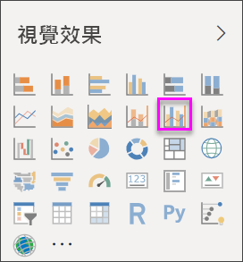
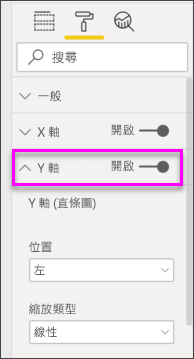
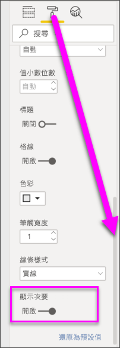

# 在 Power BI 中建立和使用組合圖

[!INCLUDE[consumer-appliesto-nyyn](../includes/consumer-appliesto-nyyn.md)]

[!INCLUDE [power-bi-visuals-desktop-banner](../includes/power-bi-visuals-desktop-banner.md)]

在 Power BI 中，組合圖是結合折線圖和直條圖的單一視覺效果。 將 2 種圖結合成一個，讓您可以更快速地比較資料。

組合圖可以有一或兩條 Y 軸。

## 使用組合圖的時機
組合圖極適合：

* 當您的折線圖和直條圖具有相同的 X 軸。
* 當您要比較多個量值，其具有不同範圍的值。
* 當您要在一個視覺效果中說明兩個量值間的相互關聯。
* 當您要檢查量值是否符合另一個量值所定義的目標。
* 當您要節省畫布的空間。

> [!NOTE]
> 要與 Power BI 同事共用您的報表，必須雙方都擁有個人的 Power BI Pro 授權，或者將報表儲存在 Premium 容量中。

### 必要條件
本教學課程使用[零售分析範例 PBIX 檔案](https://download.microsoft.com/download/9/6/D/96DDC2FF-2568-491D-AAFA-AFDD6F763AE3/Retail%20Analysis%20Sample%20PBIX.pbix)。

1. 從功能表列的左上方區段中，選取 [檔案] > [開啟]
   
2. 尋找您的 **零售分析範例 PBIX 檔案** 複本

1. 在報表檢視  中開啟 **零售分析範例 PBIX 檔案**。

1. 選取  新增頁面。

## 建立單一軸的基本組合圖
觀看 Will 如何使用銷售和行銷範例建立組合圖。
   > [!NOTE]
   > 這部影片使用舊版的 Power BI Desktop。
   > 
   > 
<iframe width="560" height="315" src="https://www.youtube.com/embed/lnv66cTZ5ho?list=PL1N57mwBHtN0JFoKSR0n-tBkUJHeMP2cP" frameborder="0" allowfullscreen></iframe>  

1. 從空白報表頁面開始建立依月份顯示本年度銷售額和毛利的直條圖。

    a.  從 [欄位] 窗格中，選取 [銷售額] \> [本年度銷售額] > [值]。

    b.  將 [銷售額] \> [本年度毛利] 拖曳到 [值] 區。

    c. 選取 [時間] \> [會計月份] 以將其新增到 [軸] 區。

    
5. 選取視覺效果右上角的 [更多選項] (...)，然後選取 [排序依據] > [FiscalMonth]。 若要變更排序次序，請再次選取省略符號，並選擇 [遞增排序] 或 [遞減排序]。 範例將使用 [遞增排序]。

6. 將直條圖轉換成組合圖。 有兩個組合圖可用：[折線與堆疊直條圖] 和 [折線與群組直條圖]。 選取直條圖後，從 [視覺效果] 窗格中，選取 [折線與群組直條圖]。

    
7. 從 [欄位] 窗格中，將 [銷售額] \> [去年度銷售額] 拖曳到 [折線圖值] 貯體。

   ![顯示 [去年銷售額] 的折線圖值區域](media/power-bi-visualization-combo-chart/linevaluebucket.png)

   您的組合圖看起來應該像這樣：

   

## 建立具有兩軸的組合圖
在這項工作中，我們會比較毛利率與銷售額。

1. 建立依 **會計月份** 追蹤 **去年毛利率 %** 的新折線圖。 選取省略符號，依 [月份] 和 [遞增] 排序。  
一月的 GM% 為 35%，尖峰在 4 月為 45%，於 7 月下降並再次於 8 月達到尖峰。 我們去年和今年會看到類似的銷售模式嗎？

   
2. 將 [今年度銷售額 > 值] 和 [去年度銷售額] 新增至折線圖。 [去年毛利率 %] 的刻度遠小於 [銷售額] 的刻度，因此難以比較。      

   
3. 若要使視覺效果更容易閱讀及解譯，請將折線圖轉換成折線與堆疊直條圖。

   

4. 將 [去年毛利率 %] 從 [資料行值] 拖曳到 [行值]。 Power BI 會建立兩個軸，因此可用不同方式調整資料集；左邊的量值為銷售金額，而右邊的量值則為百分比。 我們看到我們問題的答案；是的，我們確實看到類似的模式。

       

## 將標題加入座標軸
1. 選取油漆滾筒圖示  開啟 [格式化] 窗格。
1. 選取向下箭號以展開 [Y 軸]  選項。
1. 針對 [Y 軸 (欄)]，將 [位置] 設為 [左]、[標題] 設為 [開啟]、[樣式] 設為 [僅顯示標題]，且 [顯示單位] 設為 [百萬]。

   
4. 在 [Y 軸 (資料行)] 下方，向下捲動直到您看到 [顯示次要]。 因為 Y 軸有很多選項，所以您可能必須捲動兩次。 [顯示次要] 區段會顯示用於設定組合圖中折線圖部分格式的選項。

   
5. 對於 [Y 軸 (行)]，保留 [位置] 為 [右]，將 [標題] 改為 [開啟]，並將 [樣式] 設為 [僅顯示標題]。

   組合圖現在顯示兩個軸，而且都有標題。

   

6. (選擇性) 修改文字的字型、大小和色彩，並設定其他格式化選項，以改善圖表的顯示和可讀性。

接下來，您可能會想要：

* [將組合圖加入為儀表板圖格](../create-reports/service-dashboard-tiles.md)。
* [儲存報表](../create-reports/service-report-save.md)。
* [使報表讓行動不便人士易於存取](../create-reports/desktop-accessibility-overview.md)。

## 交叉反白顯示和交叉篩選

在組合圖中反白顯示直條或折線，會交叉反白顯示和交叉篩選報表頁面上的其他視覺效果，反之亦然。 若要變更此預設行為，請使用[視覺效果互動](../create-reports/service-reports-visual-interactions.md)。

## 後續步驟

[Power BI 中的環圈圖](power-bi-visualization-doughnut-charts.md)

[Power BI 中的視覺效果類型](power-bi-visualization-types-for-reports-and-q-and-a.md)
