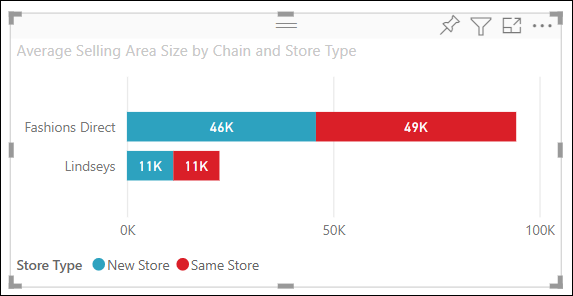

# 自訂視覺效果標題、背景、標籤與圖例

[!INCLUDE[consumer-appliesto-nyyn](../includes/consumer-appliesto-nyyn.md)]    

在本教學課程中，您將學到一些不同的方法，可以用來自訂視覺效果。 有很多選項可讓您自訂視覺效果。 深入了解它們的最佳方式就是探索 [格式]窗格 (選取油漆滾筒圖示)。 為了協助您開始進行，此文章示範如何自訂視覺效果標題、圖例、背景、標籤，以及如何新增主題。

您無法自訂所有視覺效果。 如需詳細資料，請參閱視覺效果的[完整清單](#visualization-types-that-you-can-customize)。

## 必要條件

- Power BI 服務或 Power BI Desktop

- 零售分析範例報表

> [!NOTE]
> 若要與 Power BI 同事共用報表，必須兩人都擁有個人的 Power BI Pro 授權，或將報表儲存在 Premium 容量中。 請參閱[共用報告](../collaborate-share/service-share-reports.md)。

## 自訂報表中的視覺效果標題

若要跟著做，請登入 Power BI Desktop 並開啟[零售分析範例](../create-reports/sample-datasets.md)報表。

> [!NOTE]
> 當您將視覺效果釘選至儀表板時，它會變成儀表板圖格。 您也可以使用[新的標題和副標題、超連結和調整大小](../create-reports/service-dashboard-edit-tile.md)，來自訂圖格本身。

1. 移至 [零售分析範例] 報表的 [新門市] 頁面。

1. 選取 [依開張月份和鏈結的開張門市計數] 群組直條圖。

1. 在 [視覺效果] 窗格中，選取滾筒刷圖示以顯示格式選項。

1. 選取 [標題] 以展開該區段。

   ![[格式] 窗格的螢幕擷取畫面，其中標示油漆滾筒圖示，並具有指向 [標題] 下拉式清單的箭號。](media/power-bi-visualization-customize-title-background-and-legend/power-bi-format-menu.png)

1. 將 [標題] 滑桿移至 [開啟]。

1. 若要變更標題，請在 [標題文字] 欄位中輸入 [依開張月份的門市計數]。

    ![已輸入標題文字的 [格式] 窗格螢幕擷取畫面。](media/power-bi-visualization-customize-title-background-and-legend/power-bi-title.png)

1. 將 [字型色彩] 變更為白色，並將 [背景色彩] 變更為藍色。    

    a. 選取下拉式清單，並從 [佈景主題色彩]、[最近使用的色彩]，或 [自訂色彩] 選擇色彩。
    
    

    b. 選取下拉式清單來關閉色彩視窗。

1. 將文字大小放大到 [16 點]。

1. 您要對圖表標題所做的最後一項自訂，是要讓視覺效果對齊中央。

    ![對齊控制項已選取 [置中] 選項的螢幕擷取畫面。](media/power-bi-visualization-customize-title-background-and-legend/power-bi-align.png)

    此時教學課程中，群組直條圖標題看起來類似這樣：

    

儲存您所做的變更，然後移至下個區段。

如果需要還原所有變更，請選取 [標題] 自訂窗格底部的 [還原為預設值]。

![[還原為預設值] 選項的螢幕擷取畫面。](media/power-bi-visualization-customize-title-background-and-legend/power-bi-revert.png)

## 自訂視覺效果的背景

選取相同的群組直條圖之後，展開 [背景] 選項。

1. 將 [背景] 滑桿移至 [開啟]。

1. 選取下拉式清單並選擇灰色。

1. 將 [透明度] 變更為 **74%** 。

此時教學課程中，群組直條圖背景看起來類似這樣：

儲存您所做的變更，然後移至下個區段。

如果需要還原所有變更，請選取 [背景] 自訂窗格底部的 [還原為預設值]。

## 自訂視覺效果的圖例

1. 開啟 [概觀] 報表頁面，然後選取 [依 FiscalMonth 和區域經理的總銷售額差異] 圖表。

1. 在 [視覺效果] 索引標籤中，選取油漆滾筒圖示來開啟 [格式] 窗格。

1. 展開 [圖例] 選項：

    ![[圖例] 卡片的螢幕擷取畫面。](media/power-bi-visualization-customize-title-background-and-legend/power-bi-legends.png)

1. 將 [圖例] 滑桿移至 [開啟]。

1. 將圖例移到視覺效果的左側。

1. 將 [標題] 切換為 [開啟] 來新增圖例標題。

1. 在 [圖例名稱] 欄位中輸入「經理」。

1. 將 [色彩] 變更為黑色。

儲存您所做的變更，然後移至下個區段。

如果需要還原所有變更，請選取 [圖例] 自訂窗格底部的 [還原為預設值]。

## 自訂堆疊視覺效果的總計標籤
堆疊視覺效果可以顯示資料標籤和總計標籤。 在堆疊直條圖上，資料標籤會識別資料行每個部分的值。 總計標籤會顯示整個彙總資料行的總計值。 

觀看 Rien 如何將總計標籤新增至堆疊圖表，然後依照下列步驟自行嘗試。

> [!VIDEO https://www.youtube.com/embed/OgjX-pFGgfM]

1. 開啟 [概觀] 報表頁面，然後選取 [依鏈結和商店類型的平均銷售區域大小] 橫條圖。

1. 在 [視覺效果] 索引標籤中，選取，將此橫條圖轉換成堆疊橫條圖。 請注意，視覺效果會保留其資料標籤。 

    

1. 在 [視覺效果] 索引標籤中，選取油漆滾筒圖示來開啟 [格式] 窗格。

1. 將 [總計標籤] 滑桿移至 [開啟]。 

    ![顯示總計標籤滑桿設為 [開啟] 的螢幕擷取畫面。](media/power-bi-visualization-customize-title-background-and-legend/power-bi-totals.png)

1. (選擇性) 將總計標籤格式化。 在此範例中，我們已將色彩變更為黑色、增加字型大小，並選擇將值顯示為 [千]。

    

## 使用主題自訂色彩

透過報表主題，您可以將設計變更套用至整個報表，例如使用公司色彩、變更圖示集，或套用新的預設視覺效果格式。 當您套用報表主題時，報表中的所有視覺效果都會使用所選主題中的色彩和格式。

若要將主題套用至您的報表，請從功能表列選取 [切換主題]。 選擇一個主題。  下列報表使用 [日光] 主題。

 
![使用黃色、橙色和紅色 [日光] 主題的報表](media/power-bi-visualization-customize-title-background-and-legend/power-bi-theme.png)

## 您可以自訂的視覺效果類型

以下清單列出視覺效果，以及可供每一個視覺效果使用的自訂選項：

| 視覺效果 | 標題 | 背景 | 圖例 | 總計標籤
|:--- |:--- |:--- |:--- |:--- |
| 區域 | 是 | 是 |是 | 是  |
| 橫條圖 | 是 | 是 |是 | 是 |
| card | 是 | 是 |n/a | n/a |
| 多列卡片 | 是 | 是 | n/a | n/a |
| 資料行 | 是 | 是 | 是 |  是 |
| 組合圖 | 是 | 是 | 是 | 是 |
| 環圈圖 | 是 | 是 | 是 | n/a |
| 區域分布圖 | 是 | 是 | 是 |n/a |
| 漏斗圖 | 是 | 是 | n/a |n/a |
| 量測計 | 是 | 是 | n/a |n/a |
| 關鍵影響因素 | 是 | 是 | n/a |n/a |
| KPI | 是 | 是 | n/a |n/a |
| 線條 | 是 | 是 | 是 |n/a |
| 地圖 | 是 | 是 | 是 |n/a |
| Matrix | 是 | 是 | n/a |是 |
| 圓形圖 | 是 | 是 | 是 |n/a |
| 問與答 | 是 | 是 | n/a |n/a |
| 散佈圖 | 是 | 是 | 是 |n/a |
| 圖形 | 是 | 是 | 是 |n/a |
| 交叉分析篩選器 | 是 | 是 | n/a |n/a |
| 資料表 | 是 | 是 | n/a |是 |
| 文字方塊 | 不可以 | 是 | n/a |n/a |
| 樹狀圖 | 是 | 是 | 是 |n/a |
| 瀑布圖 | 是 | 是 | 是 |n/a |

## 後續步驟

- [自訂 X 軸和 Y 軸屬性](power-bi-visualization-customize-x-axis-and-y-axis.md)

- [開始使用色彩格式和軸屬性](service-getting-started-with-color-formatting-and-axis-properties.md)

有其他問題嗎？ [試試 Power BI 社群](https://community.powerbi.com/)

