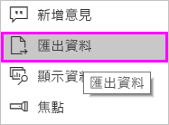
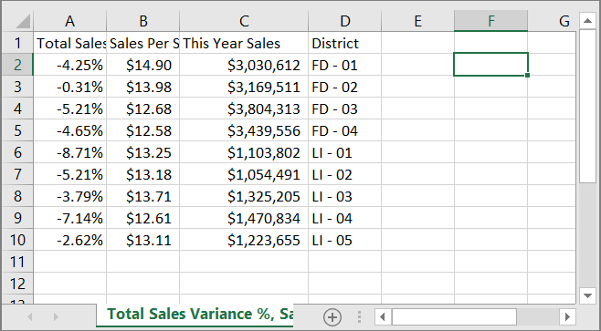
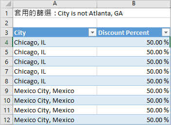

# 從視覺效果匯出資料
如果您想要查看用來建立視覺效果的資料，可以在 Power BI 中顯示該資料，或將資料匯出至 Excel 成為 .xlsx 或 .csv 檔案。 匯出資料的選項需要專業或進階授權，以及資料集和報表的編輯權限。 

觀看 Will 從其報表的其中一個視覺效果中匯出資料、將資料儲存為 .xlsx 檔案，並在 Excel 中開啟它。 然後遵循影片下方的逐步指示親自試試看。

<iframe width="560" height="315" src="https://www.youtube.com/embed/KjheMTGjDXw" frameborder="0" allowfullscreen></iframe>

## 從 Power BI 儀表板上的視覺效果
1. 選取視覺效果右上角的省略符號。

    
2. 選擇**匯出資料**圖示。

    
3. 資料會匯出到 .csv 檔案。 如果篩選了視覺效果，則也會篩選下載的資料。    
4. 您的瀏覽器會提示您儲存檔案。  儲存之後，請在 Excel 中開啟 .csv 檔案。

    

## 從報表中的視覺效果
若要跟著做，請在[編輯檢視](../consumer/end-user-reading-view.md)中開啟[採購分析範例報表](../sample-procurement.md)。 [新增空白的報表頁面](../power-bi-report-add-page.md)。 然後遵循下列步驟來新增彙總及視覺效果層級篩選。

1. 建立新的直條圖。  從 [欄位] 窗格，選取 [位置] > [城市] 和 [發票] > [折扣百分比]。  您可能必須將**折扣百分比**移到 [值] 中。 

    
2. 將 [折扣百分比] 的彙總從 [計數] 變更為 [平均]。 在 [值] 中，選取 [折扣百分比] 右邊的箭號 (可能是 [折扣百分比計數])，然後選擇 [平均]。

    
3. 新增篩選至 [城市] 以移除 [亞特蘭大]。

   

   現在我們已經準備好試用這兩個選項來匯出資料。 

4. 選取視覺效果右上角的省略符號。 選擇 [匯出資料]。

   
5. 在 Power BI 線上中，如果您的視覺效果有彙總 (其中一個範例就是如果您將 [計數] 變更為 [平均]、[總和] 或 [最小])，則會有兩個選項︰[摘要的資料] 和 [基礎資料]。 在 Power BI Desktop 中，您只會有**摘要的資料**選項。 如需了解彙總的協助，請參閱 [Power BI 中的彙總](../service-aggregates.md)。
    
6. 選取 [摘要的資料] > [匯出] 並選擇 .xlsx 或 .csv。 Power BI 會匯出資料。  如果您已套用篩選至視覺效果，匯出的資料會匯出為已篩選。 當您選取 [匯出] 時，瀏覽器會提示您儲存檔案。 儲存之後，請在 Excel 中開啟檔案。

   **摘要的資料**：如果您想要匯出在該視覺效果中所看到內容的資料，請選取此選項。  這種類型的匯出只會顯示您選擇建立視覺效果的資料 (資料行和量值)。  如果視覺效果具有彙總，則您會匯出彙總的資料。 例如，如果您有顯示 4 個橫條的橫條圖，就會取得 4 列的資料。 摘要的資料會以 .xlsx 和 .csv 提供。

   在此範例中，我們的 Excel 匯出會顯示每個城市的總計。 因為我們篩選掉了亞特蘭大，所以它不包含在結果中。  試算表的第一列會顯示在從 Power BI 擷取資料時所使用的篩選。

   
7. 現在請嘗試選取 [基礎資料] > [匯出]，然後選擇 .xlsx。 Power BI 會匯出資料。 如果您已套用篩選至視覺效果，匯出的資料會匯出為已篩選。 當您選取 [匯出] 時，瀏覽器會提示您儲存檔案。 儲存之後，請在 Excel 中開啟檔案。

   >[!WARNING]
   >匯出基礎資料可讓使用者查看所有詳細資料 -- 資料中的每個資料行。 Power BI 服務系統管理員可以替組織關閉這項功能。 如果您是資料集擁有者，您可以將專屬資料行設定為 [隱藏]，它們就不會顯示在 Desktop 或 Power BI 服務的 [欄位] 清單中。

   **基礎資料**：如果您想要查看視覺效果中的資料「和」模型中的其他資料，請選取此選項 (如需詳細資料，請參閱下列圖表)。  如果您的視覺效果具有彙總，選取 [基礎資料] 會移除彙總。 當您選取 [匯出] 時，資料會匯出到 .xlsx 檔案，且您的瀏覽器會提示您儲存檔案。 儲存之後，請在 Excel 中開啟檔案。

   在此範例中，我們的 Excel 匯出會為資料集裡的每個城市資料列顯示一個資料列，以及該單一項目的折扣百分比。 換句話說，資料會扁平化，而且不會彙總。 試算表的第一列會顯示在從 Power BI 擷取資料時所使用的篩選。  

   

## 匯出基礎資料詳細資料
選取 [基礎資料] 時可看到的內容會不同。 了解這些詳細資料可能需要您管理員或 IT 部門的協助。 在 Power BI Desktop 或服務中，於報表檢視中，「量值」會與計算機圖示  顯示在 [欄位] 清單中。 在 Power BI Desktop (而非 Power BI 服務) 中建立量值。

| 視覺效果包含 |                                                                              匯出時將看到的內容                                                                              |
|-----------------|-------------------------------------------------------------------------------------------------------------------------------------------------------------------------------------|
|   彙總    |                                                 「第一個」彙總以及該彙總之整個資料表中的非隱藏資料                                                  |
|   彙總    | 相關資料 - 如果視覺效果使用之其他資料表中的資料與包含彙總的資料表*\*\*有關*\* (只要該關聯性是 \*:1 或 1:1) |
|    量值     |                                      視覺效果中的所有量值，「和」包含視覺效果中所使用量值之任何資料表的所有量值                                      |
|    量值     |                                       包含該量值之資料表中的所有非隱藏資料 (只要該關聯性是 \*:1 或 1:1)                                       |
|    量值     |                                      所有資料表中與透過 \*:1 或 1:1 鏈結包含量值之資料表相關的所有資料                                      |
|  僅限量值  |                                                   所有相關資料表中的所有非隱藏資料行 (以展開量值)                                                   |
|  僅限量值  |                                                             針對模型量值之任何重複資料列所摘要的資料。                                                              |

### 設定匯出選項
Power BI 報表設計者會控制可供取用者使用的資料匯出選項類型。 這些選項包括：
- 僅允許匯出摘要資料 (這是新報表的預設值) 
- 允許匯出摘要和基礎資料 (這是在 2018 年 10 月之前的預設值) 
- 不允許匯出任何資料  

    > [!IMPORTANT]
    > 我們建議報表設計師重新瀏覽舊報表，並視需要手動重設匯出選項。

1. 若要設定這些選項，請從 Power BI Desktop 中開始。

2. 從左上角，選取 [檔案] > [選項和設定] > [選項]。 

3. 在 [目前檔案] 底下，選取 [報表設定]。

    

4. 從 [匯出資料] 下拉式清單中選取項目。

您也可以從 Power BI 服務中更新這項設定。  

請務必注意，如果 Power BI 管理入口網站設定與用於匯出資料的報表設定發生衝突，管理設定將會覆寫匯出資料設定。 

## 限制與考量
* 可從 **Power BI Desktop** 和 **Power BI 服務**匯出至 .csv 的資料列數上限為 30,000。
* 可匯出至 .xlsx 的資料列數上限為 150,000。
* 使用「基礎資料」匯出將無法運作，如果資料來源是 Analysis Services 即時連線，而版本早於 2016 且模型中的資料表沒有唯一的索引鍵。  
* 使用「基礎資料」匯出將無法運作，如果已針對匯出中的視覺效果啟用「顯示沒有資料的項目」選項。
* 使用 DirectQuery 時，可匯出的最大資料量為 16 MB。 這可能會導致匯出的資料列數小於上限，特別是如果有許多資料行、有難以壓縮的資料，以及有導致增加檔案大小並減少所匯出資料列數的其他因素。
* 如果視覺效果使用多個資料表中的資料，而且資料模型中的這些資料表沒有任何關聯性，則只會匯出第一個資料表的資料。 
* 目前不支援自訂視覺效果和 R 視覺效果。
* 如果使用者在組織外部，並使用與他們共用的儀表板，即無法匯出資料。 
* 在 Power BI 中，可以按兩下欄位和輸入新名稱來重新命名欄位 (資料行)。  這個新名稱稱為「別名」。 Power BI 報表可具有重複的欄位名稱，但 Excel 不允許重複。  因此，當資料匯出至 Excel 時，欄位別名會還原成原始的欄位 (資料行) 名稱。  
* 如果 .csv 檔案中有 Unicode 字元，Excel 中的文字可能無法正常顯示。 不過，以 [記事本] 開啟則會正常顯示。 Unicode 的範例包括貨幣符號和外文。 您可以將 csv 匯入 Excel，而不是直接開啟 csv，以解決這個問題。 若要這樣做：

  1. 開啟 Excel
  2. 從 [資料] 索引標籤選取 [取得外部資料] > [從文字]。
* Power BI 系統管理員可以停用匯出資料。

## 後續步驟
[Power BI 中的儀表板](../consumer/end-user-dashboards.md)  
[Power BI - 基本概念](../consumer/end-user-basic-concepts.md)

有其他問題嗎？ [嘗試在 Power BI 社群提問](http://community.powerbi.com/)

