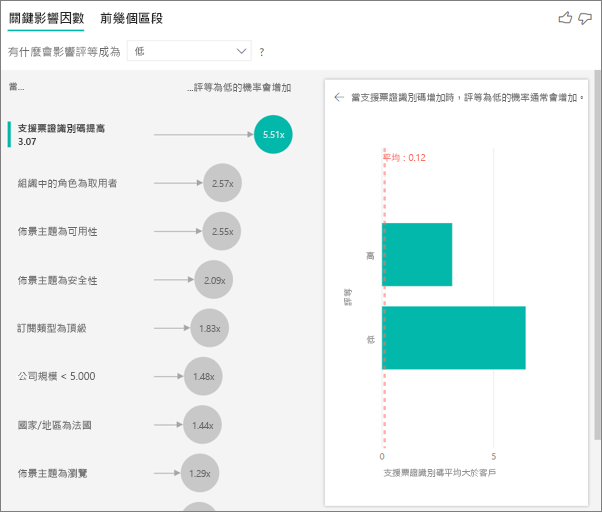
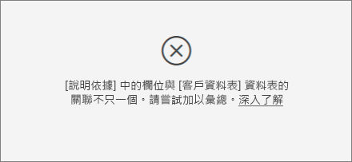
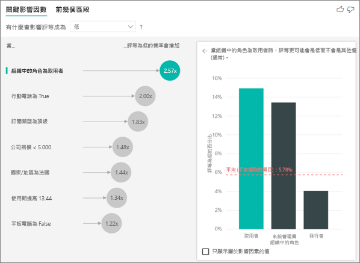

# 關鍵影響因素視覺效果
關鍵影響因素視覺效果可協助您了解影響您感興趣之計量的因素。 可分析您的資料、為重要因素排名並將其顯示為關鍵影響因素。 舉例來說，您希望了解影響員工流動率 (變換) 的因素。 其中一項因素可能是雇用合約長度，另一項可能是員工年齡。 
 
## 何時使用關鍵影響因素？ 
關鍵影響因素視覺效果適合用於下列情況： 
- 查看哪些因素會影響正在分析的計量。

- 對比這些因素的相對重要性。 例如，針對客戶流失，短期合約是否比長期合約的影響更大？ 

## 關鍵影響因素需求 
您要分析的計量必須是類別目錄欄位。    

## 關鍵影響因素視覺效果的功能

    

1. ***索引標籤*** - 在檢視之間切換選取索引標籤。 關鍵影響因素會為您顯示所選計量值的主要參與者。 主要區段顯示參與所選計量值的主要區段。 「區段」是值的組合。  例如，其中一個區段可能是已成為客戶至少 20 年的取用者，且住在西部區域。 

2. ***下拉式清單*** - 正在調查的計量值。 在此範例中，我們將探討計量**分級**，而我們選取的值為**低**。    

3. ***重新計算陳述式*** - 可協助我們解譯左窗格中的視覺效果。 

4. ***左側窗格*** - 左側窗格包含一個視覺效果。  在此案例中，左側窗格會顯示主要關鍵影響因素的清單。

5. ***重新計算陳述式*** - 可協助我們解譯右側窗格中的視覺效果。

6. ***右側窗格*** - 右側窗格包含一個視覺效果。 在此案例中，直條圖會顯示左側窗格中所選**關鍵影響因素**、**主題**的所有值。 左側窗格中的特定值 (**可用性**) 為綠色，而**主題**的所有其他值皆為黑色。

7. ***平均線*** - 會計算**主題**所有其他可能值的平均值 (除了**可用性**以外)。 因此，計算會套用至所有黑色的值。 會告訴我們有多少百分比的其他**主題**給了我們較低評等。 換句話說，客戶給予評等時，該客戶也會描述原因或評等的**主題**。 某些主題為可用性、速度、安全性等等。根據左側窗格中的視覺效果，**主題**為**可用性**是低評等的第二高關鍵影響因素。 如果我們將所有其他主題以及其對**低**評等的比重進行平均，我們得到的結果會是紅色。 

8. ***核取方塊*** - 只顯示屬於影響因素的值。

## 建立關鍵影響因素視覺效果 
 
觀賞這段影片來了解如何建立關鍵影響因素視覺效果，然後遵循下列步驟自行建立。 

<iframe width="560" height="315" src="https://www.youtube.com/embed/fDb5zZ3xmxU" frameborder="0" allow="accelerometer; autoplay; encrypted-media; gyroscope; picture-in-picture" allowfullscreen></iframe>

我們的產品經理希望了解哪些因素會導致客戶對我們的雲端服務留下負面評價。  若要跟著做，請在 Power BI Desktop 中開啟[客戶意見反應 PBIX 檔案](https://github.com/Microsoft/powerbi-desktop-samples/blob/master/2019/customerfeedback.pbix)。 您也可以下載 [Power BI 服務或 Power BI Desktop 的客戶意見反應 Excel 檔案](https://github.com/Microsoft/powerbi-desktop-samples/blob/master/2019/customerfeedback.xlsx)。 

> [!NOTE]
> [客戶意見反應] 資料集乃基於 [Moro et al., 2014] S. Moro、P. Cortez 和 P. Rita。 預測銀行電話行銷成功的資料導向方法。 決策支援系統，Elsevier，62:22-31，2014 年 6 月 

1. 開啟報表，然後選取關鍵影響因素圖示。  

    ![從 [視覺效果] 窗格中選取 [關鍵影響因素] 範本](media/power-bi-visualization-influencers/power-bi-template-new.png)

2. 將您希望調查的計量拖曳至 [分析] 欄位。 [分析] 欄位僅支援類別目錄 (非持續) 變數。 因為我們有興趣探討造成客戶對我們服務給予**低**評等的因素，所以我們選取 [客戶表] > [評等]。    
3. 接著，將您認為可能會影響**評等**的欄位拖曳至 [說明依據]。 您可以拖曳的欄位數量不受限制。 在此案例中，我們從下列項目開始： 
    - 國家/地區 
    - 組織中的角色 
    - 訂閱類型 
    - 公司規模 
    - 佈景主題     
4. 由於我們對負面評等有興趣，請在**哪些影響因素評等為**下拉式清單中選取 [低]。   

    ![從下拉式清單中選取 [低]](media/power-bi-visualization-influencers/power-bi-key-influencers.png)

分析於正在分析之欄位的資料表層級上執行。 在此案例中，我們感興趣的是**評等**計量，該計量定義於客戶層級 (每個客戶都給予高分或低分)。 我們所有的說明因素都必須在客戶層級定義，以供視覺效果使用。 

在上述範例中，我們所有的說明因素都與計量具有一對一或多對一關聯性。 比方說，每項分數都有一個與其建立關聯的主題 (客戶評論中的主要主題)。 同樣，來自同一國家/地區的客戶在其組織中都有一種成員資格類型和一個角色。 因此，說明因素已經是客戶的屬性且不需要轉換，視覺效果可讓其立即使用。 

稍後在教學課程中我們將探討更複雜的範例，包含一對多關聯性。 在這些案例下，資料行必須先彙總至客戶層級，才能執行分析。  

用於說明因素的量值和彙總，也會在**分析**計量的資料表層級進行評估，我們會在本文稍後看到一些範例。 

## 解譯類別目錄關鍵影響因素 
讓我們探討對於低評等的關鍵影響因素。 

### 可能對低評等造成影響的最主要單一因素

在我們的組織中有三個角色：取用者、系統管理員和發行者。 我們可看到，取用者是導致低評等的主要因素。 

![選取 [組織中的角色是取用者]](media/power-bi-visualization-influencers/power-bi-role-consumer.png)

更精確地說，取用者給我們負分的可能性是 2.57 倍。 關鍵影響因素圖表在左側清單中先列出 [組織中的角色是取用者]。 透過選取 [組織中的角色是取用者]，Power BI 會在右側窗格中顯示其他詳細資料，比較每個**角色**影響低評等的可能性。
  
- 14.93% 的取用者給予較低分數  
- 平均而言，所有其他角色在 5.78% 的時間會給予較低分數 
- 因此，與其他角色相比，取用者給予較低分數的可能性是 2.57 倍 (綠色列與紅色虛線之間的差異) 

### 可能對低評等造成影響的第二個單一因素

關鍵影響因素視覺效果能夠比較來自許多不同變數的因素並進行排名。  我們的第二個影響因素與**組織中角色**無關。在清單中選取第二個影響因素：[主題是可用性]。 

![選取 [主題是可用性]](media/power-bi-visualization-influencers/power-bi-theme.png)

這裡我們看到第二重要因素與客戶評論的主題相關。 評論產品「可用性」的客戶，與評論其他主題 (例如可靠性、設計或速度) 的客戶相比，給予較低分的可能性高 2.21 倍。 

您可以在視覺效果之間看到平均值 (紅色虛線) 從 5.78% 變更為 11.34%。 平均值乃基於所有其他值的平均，因此為動態。 在第一個影響因素案例中，平均值已排除客戶角色，而在第二個影響因素案例中，則排除可用性主題。 
 
勾選視覺效果底部的方塊，會僅對具影響力的值 (在此案例中為導致低分的角色) 進行視覺效果篩選。 因此我們可從 12 個主題看到四個 Power BI 為造成低評等的因素。 

## 與其他視覺效果互動 
 
使用者每次按一下交叉分析篩選器、篩選器或畫布上的其他視覺效果時，關鍵影響因素會在資料的新部分重新執行分析。 比方說，讓我們將 [公司規模] 拖曳至報表，並將其用為交叉分析篩選器。 我們希望查看我們企業客戶 (公司規模大於 50,000) 的關鍵影響因素是否與一般母體不同。  
 
選取 [> 50,000] 重新執行分析，我們可以看到影響因素已變更。 針對大型企業客戶，低評等的主要影響因素具有與**安全性**相關的**主題**。 我們可能會希望進一步調查，確認我們的大型客戶是否對特定安全功能不滿意。 

## 解譯連續的關鍵影響因素 
 
到目前為止，我們使用了視覺效果來探索不同的類別目錄欄位如何影響低評等。 您也可以將連續的因素 (例如年齡、身高、價格) 移至「說明依據」。 讓我們看看如果我們將客戶資料表中的「使用期」放入「說明依據」中，會發生什麼狀況。 使用期顯示客戶已使用服務多長時間。 
 
我們發現，隨著**使用期**提升，收到較低評等的可能性隨之提高。 此趨勢表示我們的長期客戶實際上較可能給予負面評等，這是有趣的深入解析，我可能希望稍後進行追蹤。  
 
視覺效果告訴我們，每當使用期增加 13.44 個月，收到低評等的可能性平均而言會增加 1.23 倍。 在此案例中，13.44 月表示使用期的標準差。 因此，我們得到的見解將探討以標準數量增加的使用期 (使用期的標準差)，會如何影響收到低評等的可能性。 
 
右側散佈圖繪製每個使用期值低評等的平均百分比，並包含趨勢線來醒目提示斜率。  

## 將量值/彙總解譯為關鍵影響因素 
 
最後，使用者也可以使用量值和彙總作為分析中的說明因素。 例如，我們可能希望了解客戶支援票證的數量，或開啟票證的平均持續時間，對我們收到的分數會造成什麼影響。 
 
在此案例中，我們希望知道客戶支援票證數量是否會影響他們給我們的分數。 我們將從支援服務票證資料表中匯入支援票證識別碼。 由於客戶可能有多個支援票證，我們需要將識別碼彙總至客戶層級。 此彙總十分重要，因為我們在客戶層級上執行分析，因此需要在該層級的資料粒度上定義所有驅動因素。 
 
我們將查看識別碼的數量 (以便每個客戶資料列都具有與其建立關聯的支援票證計數)。 在此案例中我們看到，隨著支援票證數量提升，收到低評等的可能性隨之提高 5.51 倍。 右側視覺效果顯示不同評等值的支援票證平均數量 (在客戶層級評估)。 

## 解譯結果：主要區段 
 
儘管「關鍵影響因素」索引標籤可讓使用者個別評估每個因素，使用者也可以切換至「主要區段」以了解各種因素組合會如何影響他們正在分析的計量。 
 
主要區段一開始會顯示 Power BI 發現之所有區段的概觀。 在下列範例中，我們看到已找到六個區段。 這些區段依區段內低評等的百分比排名。 例如，我們看到區段 1 中 74.3% 的客戶評等為「低」。  泡泡圖愈高，低評等的比例也愈高。 另一側的泡泡圖大小代表該區段內有多少客戶。 

![選取 [主要區段] 的索引標籤](media/power-bi-visualization-influencers/power-bi-top-segments-tab.png)

選取泡泡圖可深入了解該區段。 比方說，如果我們選取 [區段 1]，我們會發現其由相對較老的客戶 (已與我們合作超過 29 個月) 所組成，這些客戶擁有大量支援票證 (大於 4)。 最後，他們並非發行者 (所以他們是取用者或系統管理員)。  
 
在此群組中，74.3% 給予低評等。 平均客戶在 11.7% 的時間給予低評等，因此該區段的低評等比例明顯較高 (高 63 百分點)。 我們也發現區段 1 包含約 2.2% 的資料，因此其代表了母體的可定址部分。 

## 考量與疑難排解 
 
**預覽的限制有哪些？** 
 
關鍵影響因素視覺效果目前處於公開預覽狀態，有幾項使用者應該要注意的限制。 目前無法使用的功能包括： 
- 分析彙總/量值的計量 
- 在內嵌中使用視覺效果 
- 在 Power BI 行動版上使用視覺效果 
- RLS 支援 
- 直接查詢支援 
- 即時查詢支援 
 
**我看到一項錯誤，指出未發現影響因素/區段。為什麼會這樣？**  

如果您在 [說明依據] 中包含欄位但未發現影響因素，則會出現此錯誤。   
- 您在「分析」和「說明依據」中包含了您正在分析的計量 (您應從 [說明依據] 中將其移除) 
- 您的說明欄位具有太多類別與太少觀察值。 這會讓視覺效果難以判斷哪些因素是影響因素，因為很難根據少數觀察值來將項目一般化 
- 您的說明因素有足夠觀察值來進行一般化，但是視覺效果找不到任何有意義的關聯性來回報 
 
**我看到一項錯誤，指出我正在分析的計量沒有足夠資料來執行分析。為什麼會這樣？**  

視覺效果運作方式是查看一個群組 (例如給予低較評等的客戶) 的資料模式，與其他群組 (例如給予較高評等的客戶) 進行比較。 如果您模型中的資料幾乎沒有觀察值，則很難找到模式。 如果視覺效果沒有足夠資料來尋找有意義的影響因素，則視覺效果會指出需要更多資料來執行分析。 我們建議對所選狀態 (客戶流失) 進行至少 100 次觀察，並對您用於比較的狀態 (客戶未流失) 至少進行 10 次觀察。  
 
**我看到一項錯誤，指出「說明依據」中的欄位與包含我正在分析之計量的資料表不具有唯一關聯性。為什麼會這樣？**  
 
分析於正在分析之欄位的資料表層級上執行。 例如，如果您要分析客戶對服務的意見反應，您可能會擁有告訴您客戶給予較高或較低評等的資料表。 在此案例中，您的分析會執行於客戶資料表層級。 

如果相關資料表比包含計量的資料表更精細，則會出現此錯誤。 讓我們透過範例來說明： 
 
- 您正在分析導致客戶給予服務低評等的原因 
- 您想要了解客戶用於使用您服務的裝置，是否會影響他們給予的評論 
- 客戶可以透過多種不同方式來使用服務   
- 在下列範例中，客戶 10000000 使用瀏覽器和平板電腦來與服務互動 

如果您嘗試使用裝置的資料行作為說明因素，您會看到下列錯誤： 

這是因為裝置並非定義於客戶層級：客戶可以在多部裝置上使用服務。 若要讓視覺效果找出模式，裝置必須成為客戶的屬性。 在此案例中，我根據對商務的理解來提供幾個解決方案： 
 
- 比方說，如果我認為裝置數量可能會對客戶給予的分數造成影響，我可以將裝置的摘要變更為計數 
- 我可以轉換裝置資料行，查看在特定裝置上使用服務是否會影響客戶的評等  
 
在此範例中，我轉換了我的資料來建立「瀏覽器」、「行動裝置」和「平板電腦」的新資料行。 我現在可以在「說明依據」中使用這些項目。 我們發現所有裝置都是影響因素，而瀏覽器對客戶分數的影響最大。 

不透過瀏覽器來使用服務的客戶，比那些使用瀏覽器的客戶，給予低分的可能性高出 3.79 倍。 在清單的較下方處，我們可以看到行動裝置的情況相反。 使用行動應用程式的客戶，比不使用行動應用程式的客戶較可能給予較低分數。  

**我看到一項警告，指出量值未包含在我的分析中。為什麼會這樣？** [2052261] 

分析於正在分析之欄位的資料表層級上執行。 如果您正在分析客戶流失，您可能會使用會告訴您客戶是否流失的資料表。 在此案例中，您的分析會執行於客戶資料表層級。
 
根據預設，量值和彙總都會在該資料表層級進行分析。 如果我們有「平均每月消費」的量值，該量值會在客戶資料表層級進行分析。  

如果客戶資料表不具有唯一識別碼，將無法評估該量值，且分析會將其忽略。 若要避免此問題，請確定包含計量 (在此案例中為客戶資料表) 的資料表具有唯一識別碼 (例如客戶識別碼)。 使用 Power Query 來新增索引資料行也非常容易。
 
**我看到一項警告，指出我正在分析的計量具有超過 10 個唯一值，可能會影響我的分析品質。為什麼會這樣？**  

AI 視覺效果適合用於分析類別 (比方說，流失為「是」或「否」，客戶滿意度為「高」、「中」或「低」等等)增加要分析的類別數量，表示我們在每個類別中的觀察值會較少，這會導致視覺效果更難在資料中找到模式。 

若要尋找更強的影響因素，我們建議您將類似的值分組至單一單位。 例如，如果您有價格的計量，則將類似價格分組為「高」、「中」、「低」貯體，會取得比使用個別價格點更好的結果。 

**我的資料中有一些因素看起來應該是關鍵影響因素，但事實上並不是。為何會發生此情況？**

在下列範例中，我們看到客戶是取用者會造成較低評等 (14.93% 的評等為低)。 有趣的是，系統管理員角色也具有高比例的低評等 (13.42%)，但不視為影響因素。 

原因是，視覺效果在發現影響因素時也會將資料點的數量納入考量。 在下列範例中，我們有超過 29,000 名取用者，和十分之一的系統管理員 (大約 2,900)。 此外，只有 390 名給予低評等。 因此，視覺效果沒有足夠資料來判斷其是否真找到具有系統管理員評等的模式，或只是碰巧發現。  

**您如何計算關鍵影響因素？**

在幕後，AI 視覺效果會執行羅吉斯迴歸來計算關鍵影響因素。 羅吉斯迴歸是一種統計模型，將不同的群組互相比較。 如果我們正在探討造成低評等的因素，羅吉斯迴歸將查看給予低分之客戶與給予高分的客戶有何不同。 如果我們有多個類別 (高分、中間分數、低分)，我們會探討給予低評等之客戶與未給予低評等的客戶有何不同 (他們與那些給予高評等或中間評等的人有何不同)。 
 
羅吉斯迴歸會搜尋資料中的模式，找出給予低評等之客戶和給予低評等的客戶有何不同。 例如，可能會發現擁有較多支援票證的客戶，會比那些幾乎沒有或完全沒有支援票證的客戶給予更低評等。
 
羅吉斯迴歸也會考慮有多少資料點存在。 例如，系統管理員為少數，即使扮演管理員角色的客戶依照比例給予更多負分，也不會視為影響因素。 這是因為沒有足夠的資料點可用於推斷模式。 統計測試 (Wald 測試) 用於判斷某因素是否為影響因素。 視覺效果會使用 0.05 的 p 值來決定閾值。 
 
**您如何計算區段？**

在幕後，AI 視覺效果會執行決策樹來尋找感興趣的子群組。 決策樹目標是取得資料點的子群組，該資料點在我們感興趣的計量中相對較高 (例如給與低評等的客戶)。 

決策樹會採用每個說明因素，並嘗試判斷哪些因素會提供最佳「分割」。 例如，如果我們篩選資料來僅包含大型企業客戶，其是否會將給予我們高評等之客戶和給予低評等的客戶做出區隔？ 如果我們篩選資料來僅包含評論安全性的客戶，是否會更好？ 

一旦決策樹分割後，即會採用資料的該子群組 (例如評論安全性的客戶)，並僅針對該資料嘗試找出下一個最佳分割。 每次分割之後，決策樹也會考慮其是否有足夠的資料點作為代表性群組來推斷模式，或者是否只是資料中的異常，因此不是真正的區段。 (另一個統計測試會套用來檢查分割條件的統計顯著性，其 p 值為 0.05)。 

決策樹完成執行後，會接受所有分割 (安全性評論、大型企業) 並建立 Power BI 篩選條件。 此篩選條件的組合，會在視覺效果中封裝為區段。 
 
**為什麼在我將更多欄位拖曳至「說明依據」時，某些因素會成為影響因素或停止成為影響因素？**

視覺效果會將所有說明因素一起評估。 這表示，儘管因素本身可能是影響因素，但考慮到其他因素時，則可能不是。 假設我們要分析是什麼造成高房價，臥室和房屋大小為說明因素： 
- 就其本身而言，較多臥室可能是造成高房價的因素 
- 將房屋大小包含於分析中，表示我們要探討當房屋大小保持不變時，臥室會如何變化 
- 如果我們將房屋大小保持在 1500 平方英尺， 不斷增加臥室數量不太可能大幅提高房價，因此在考量房屋大小時，臥室可能並非重要因素。 

## 後續步驟
[Power BI 中的組合圖](power-bi-visualization-combo-chart.md)

[Power BI 中的視覺效果類型](power-bi-visualization-types-for-reports-and-q-and-a.md)
