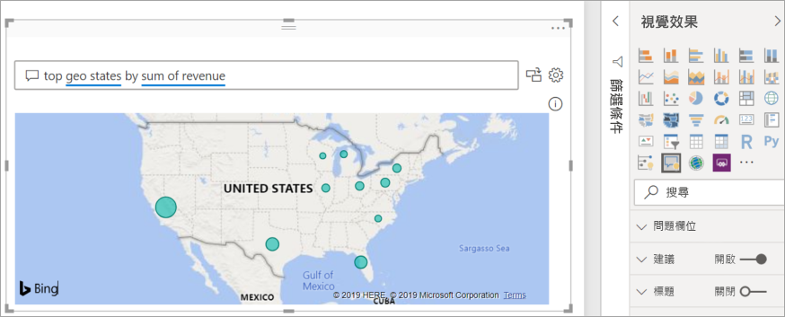
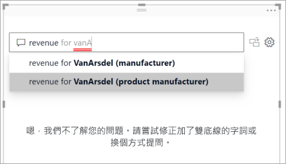
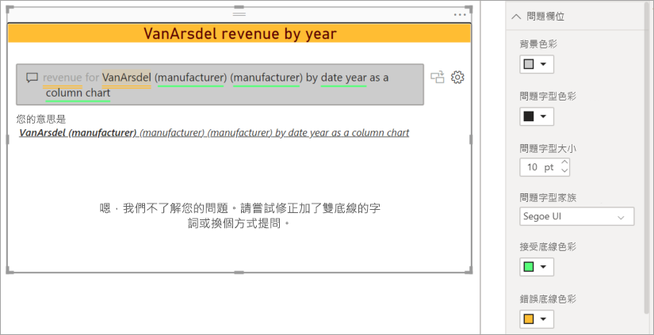
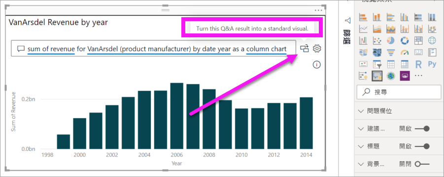
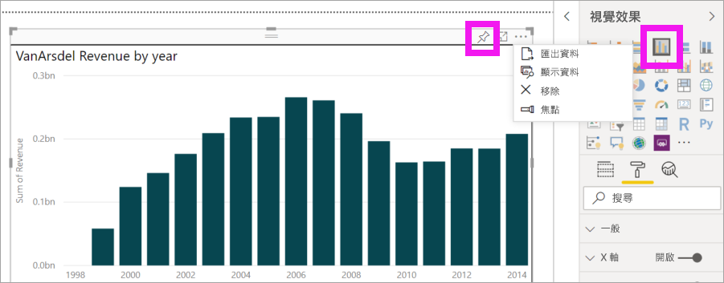
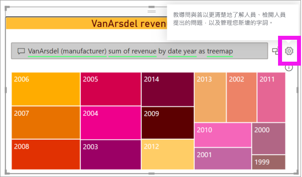

# Power BI 問與答視覺效果簡介

[!INCLUDE [power-bi-service-new-look-include](../includes/power-bi-service-new-look-include.md)]

## 什麼是問與答視覺效果

問與答視覺效果可讓使用者詢問自然語言問題，並以視覺效果形式獲得解答。 

[!INCLUDE [power-bi-visuals-desktop-banner](../includes/power-bi-visuals-desktop-banner.md)]

問與答視覺效果可以作為工具，讓「取用者」  快速獲得其資料的解答，也可以供「設計師」  使用，只要在報表的任何位置按兩下，然後使用自然語言開始進行，即可在報表中建立視覺效果。 由於其行為就像任何其他視覺效果一樣，因此問與答視覺效果可交叉篩選/交叉醒目顯示，也支援書籤。 問與答視覺效果也支援佈景主題，以及 Power BI 中可用的其他預設格式化選項。

問與答視覺效果是由四個核心元件所組成：

- 問題方塊。 這是使用者鍵入其問題的位置，並會顯示建議以協助完成其問題。
- 預先填入的建議問題清單。
- 將問與答視覺效果轉換成標準視覺效果的圖示。 
- 開啟問與答工具讓設計師設定基礎自然語言引擎的圖示。

## 先決條件

1. 本教學課程使用[銷售與行銷範例 PBIX 檔案](https://download.microsoft.com/download/9/7/6/9767913A-29DB-40CF-8944-9AC2BC940C53/Sales%20and%20Marketing%20Sample%20PBIX.pbix)。 

1. 從 Power BI Desktop 功能表列的左上方區段，選取 [檔案]   > [開啟] 
   
2. 尋找**銷售與行銷範例 PBIX 檔案**複本

1. 在報表檢視中開啟檔案 .

1. 選取  新增頁面。

如果您在建立問與答視覺效果時看到錯誤，請務必參閱[限制](../natural-language/q-and-a-limitations.md)一節，以了解是否支援資料來源設定。

## 使用建議的問題來建立問與答視覺效果
在此練習中，我們將選取其中一個建議的問題來建立問與答視覺效果。 

1. 從空白報表頁面開始，然後從 [視覺效果] 窗格選取問與答視覺效果圖示。

    ![已框選問與答視覺效果圖示的 [視覺效果] 窗格](media/power-bi-visualization-q-and-a/power-bi-icon.png)

2. 拖曳框線以調整視覺效果的大小。

    

3. 若要建立視覺效果，請選取其中一個建議的問題，或開始在問題方塊中鍵入。 在此範例中，我們選取了 [top geo states by sum of revenue] \(依收益總和的前幾州地區\)  。 Power BI 會竭盡所能選取要使用的視覺效果類型。 在此案例中是地圖。

    

    但您可以告知 Power BI 要使用的視覺效果類型，方法是將其新增至您的自然語言查詢。 請記住，並非所有視覺效果類型都適用於您的資料或對其有意義。 例如，此資料不會產生有意義的散佈圖。 但適合以區域分布圖顯示。

    

## 使用自然語言查詢來建立問與答視覺效果
在上述範例中，我們選取了其中一個建議的問題來建立問與答視覺效果。  在此練習中，我們將鍵入自己的問題。 當我們鍵入問題時，Power BI 會使用自動完成、建議和意見反應來協助我們。

如果您不確定所要詢問問題類型或要使用的術語，請展開 [顯示所有建議]  或查看 [欄位] 窗格 (可在畫布右側找到)。 這可協助您熟悉銷售與行銷資料集的字詞和內容。

![已框選 [顯示所有建議] 和 [欄位] 窗格的畫布](media/power-bi-visualization-q-and-a/power-bi-terminology.png)

1. 在問與答欄位中鍵入問題。 Power BI 會在無法辨識的字組加紅色底線。 Power BI 會盡可能協助定義無法辨識的字組。  在以下第一個範例中，選取適用的任一建議。  

    

2. 當我們鍵入更多問題時，Power BI 會在不了解問題時讓我們知道，並嘗試協助。 在以下範例中，Power BI 會詢問我們「您的意思是...」，並使用資料集中的術語來建議不同問題陳述方式。 

    

5. 有了 Power BI 的協助，我們就能夠使用所有可辨識的字詞詢問問題。 Power BI 會以折線圖顯示結果。 

    

6. 讓我們將視覺效果變更為直條圖。 

    

## 格式化和自訂問與答視覺效果
您可以使用格式化窗格並透過套用佈景主題來自訂問與答視覺效果。 

### 套用佈景主題
當您選取佈景主題時，該佈景主題會套用至整個報表頁面。 有許多佈景主題可供選擇，因此請試試看，直到您滿意外觀為止。 

1. 在功能表列中，選取 [首頁]  索引標籤，然後選擇 [切換佈景主題]  。 

    ![已選取 [切換佈景主題] 的桌面](media/power-bi-visualization-q-and-a/power-bi-themes.png)

    
    
2. 在此範例中，我們選取了 [更多佈景主題]   > [方便色盲人士辨識]  。

    

### 對問與答視覺效果進行格式化
您可以對問與答視覺效果、問題欄位及建議的顯示方式進行格式化。 您可以變更所有內容，從標題的背景到無法辨識字組的暫留時色彩。 在這裡，我們對問題方塊新增了灰色背景，並將底線變更為黃色和綠色。 標題則置中對齊並具有黃色背景。 

## 將問與答視覺效果轉換成標準視覺效果
我們已對方便色盲人士辨識的直條圖視覺效果稍微進行格式化，新增了標題和框線。 現在，我們準備將其轉換成報表中的標準視覺效果，並將其釘選至儀表板。

選取，**將此問與答結果轉換成標準視覺效果**。

此視覺效果不再是問與答視覺效果，而是標準直條圖。 您可以將其釘選至儀表板。 在報表中，此視覺效果的行為與其他標準視覺效果相同。 請注意，[視覺效果] 窗格會顯示已選取直條圖圖示，而不是問與答視覺效果圖示。

如果您使用 ***Power BI 服務***，則現在可以選取釘選圖示來將視覺效果釘選至儀表板。 

## 問與答視覺效果的進階功能
選取齒輪圖示開啟問與答視覺效果工具窗格。 

使用工具窗格來教學 Q&A 其無法辨識的字詞、管理這些字詞，以及管理此資料集和報表的建議問題。 在 [工具] 窗格中，您也可以使用此問與答視覺效果來檢視所詢問的問題，並查看使用者所標示的問題。 若要深入了解，請參閱[問與答工具簡介](../natural-language/q-and-a-tooling-intro.md)。

![問與答 [工具] 窗格](media/power-bi-visualization-q-and-a/power-bi-q-and-a-tooling-pane.png)

## 考量與疑難排解
問與答視覺效果與 Office 和 Bing 整合，以嘗試將無法辨識的常用字組與您資料集中欄位進行比對。  

## 後續步驟

您可以透過各種方式來整合自然語言。 如需詳細資訊，請參閱下列文章：

* [問與答工具](../natural-language/q-and-a-tooling-intro.md)
* [問與答最佳做法](../natural-language/q-and-a-best-practices.md)
