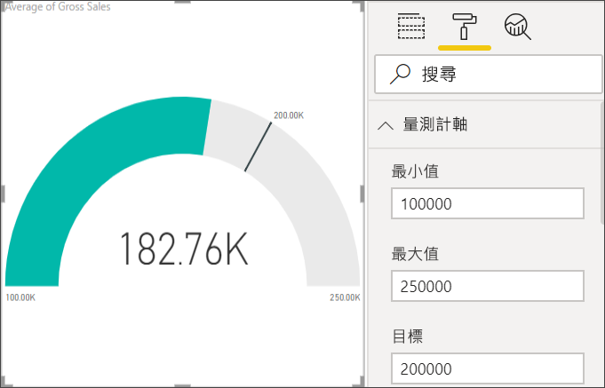

# Power BI 中的星形量測計圖表

[!INCLUDE[consumer-appliesto-nyyn](../includes/consumer-appliesto-nyyn.md)]

[!INCLUDE [power-bi-visuals-desktop-banner](../includes/power-bi-visuals-desktop-banner.md)]

星形量測計圖表具有圓弧線段，並且會顯示針對某一目標或關鍵效能指標 (KPI) 測量進度的單一值。 線條 (或「指針」  ) 代表目標或目標值。 陰影代表該目標的達成進度。 弧線內的值代表進度值。 Power BI 會將所有可能的值從最小 (最左邊的值) 到最大 (最右邊的值) 平均分散在弧線上。

在此範例中，您是汽車零售商，正在追蹤銷售小組每個月的平均銷售量。 指針代表汽車銷售量目標為 140。 最小的可能平均銷售量為 0，最大值為 200。  藍色陰影顯示小組這個月的銷售量平均約為 120。 幸好距離目標達成還有一週的時間。

> [!NOTE]
> 要與 Power BI 同事共用您的報表，必須雙方都擁有個人的 Power BI Pro 授權，或者將報表儲存在 Premium 容量中。

## 使用星形量測計的時機

星形量測計極適合用來：

* 顯示目標的達成進度。

* 代表 KPI 等量值百分位數。

* 顯示單一量值的健全狀況。

* 顯示可快速掃描和了解的資訊。

## 必要條件

本教學課程使用[財務範例 Excel 檔案](https://download.microsoft.com/download/9/6/D/96DDC2FF-2568-491D-AAFA-AFDD6F763AE3/Retail%20Analysis%20Sample%20PBIX.pbix)。

1. 從功能表列的左上方區段中，選取 [取得資料]   > [Excel] 
   
2. 尋找**財務範例 Excel 檔案**的複本

1. 在報表檢視  中開啟**財務範例 Excel 檔案**。

1. 選取 [財務]  和 [工作表 1] 

1. 按一下 [載入] 

1. 選取  新增頁面。

## 建立基本的星形量測計

### 步驟 1：建立追蹤總銷售額的量測計

1. 從空白報表頁面開始

1. 從 [欄位]  窗格，選取 [總銷售額]  。

   

1. 將彙總變更為 [平均]  。

   ![標示出 [總銷售額] 和 [平均] 彙總的 [欄位] 窗格螢幕擷取畫面。](media/power-bi-visualization-radial-gauge-charts/changetoaverage-new.png)

1. 選取量測計圖示  將直條圖轉換成量測計圖表。

    

    由於下載**財務範例**檔案的時間點不同，您可能會看到不一樣的數字。

    > [!TIP]
    > 根據預設，Power BI 會建立量測計圖表，其中假設目前值 (在此案例中為 [平均總銷售額]  ) 位於量測計的中點。 由於 [平均總銷售額]  值是美金 $182.76K 元，開始值 (最小值) 設定為 0 且結束值 (最大值) 設定為目前值的兩倍。

### 步驟 3：設定目標值

1. 將 [COGS]  從 [欄位]  窗格拖曳至 [目標值]  部分。

1. 將彙總變更為 [平均]  。

   Power BI 會加入指針來代表我們的目標值： **$145.48K**。

   ![已新增 [COGS 的平均] 的量測計圖表螢幕擷取畫面。](media/power-bi-visualization-radial-gauge-charts/gaugeinprogress-new.png)

    請注意到我們已經超過目標。

   > [!NOTE]
   > 您也可以手動輸入目標值。 請參閱[使用手動格式選項來設定最小值、最大值與目標值](#use-manual-format-options-to-set-minimum-maximum-and-target-values)一節。

### 步驟 4：設定最大值

在步驟 2 中，Power BI 會使用 [值]  欄位來自動設定最小值與最大值。 如果您想自行設定最大值該怎麼做？ 假設您不想使用目前值的兩倍作為最大的可能值，想設定為資料集中最高的總銷售額數字。

1. 將 [總銷售額]  從 [欄位]  窗格拖曳至 [最大值]  部分。

1. 將彙總變更為 [最大值]  。

   ![標示出 [總銷售額] 和 [最大值] 彙總的 [欄位] 窗格螢幕擷取畫面。](media/power-bi-visualization-radial-gauge-charts/setmaximum-new.png)

   接著會以新的結束值 (總銷售額 121 萬) 重新繪製量測計。

   

### 步驟 5：儲存報表

1. [儲存報表](../service-report-save.md)。

## 使用手動格式選項來設定最小值、最大值與目標值

1. 將 [銷售額的最大值]  從 [最大值]  部分移除。

1. 選取油漆滾筒圖示，開啟 [格式]  窗格。

   ![標示出量測計圖表及油漆滾筒圖示的 [格式] 窗格螢幕擷取畫面。](media/power-bi-visualization-radial-gauge-charts/power-bi-roller.png)

1. 展開 [量測計軸]  並輸入 [最小]  與 [最大]  的值。

    ![[量測計軸] 選項的螢幕擷取畫面。](media/power-bi-visualization-radial-gauge-charts/power-bi-gauge-axis.png)

1. 清除 [欄位]  窗格中的 [COGS]  選項，移除目標值。

    ![已清除 [COGS] 選項的螢幕擷取畫面。](media/power-bi-visualization-radial-gauge-charts/pbi-remove-target.png)

1. 當 [量測計軸]  下出現 [目標]  欄位時，請輸入值。

     ![標示出 [目標] 的 [量測計軸] 選項螢幕擷取畫面。](media/power-bi-visualization-radial-gauge-charts/power-bi-gauge-target.png)

1. 可選擇繼續格式化量測計圖。

一旦您完成這些步驟，您就會有類似如下的量測計圖表：

## 下一步

* [關鍵效能指標 (KPI) 視覺效果](power-bi-visualization-kpi.md)

* [Power BI 中的視覺效果類型](power-bi-visualization-types-for-reports-and-q-and-a.md)

有其他問題嗎？ [試試 Power BI 社群](https://community.powerbi.com/)
