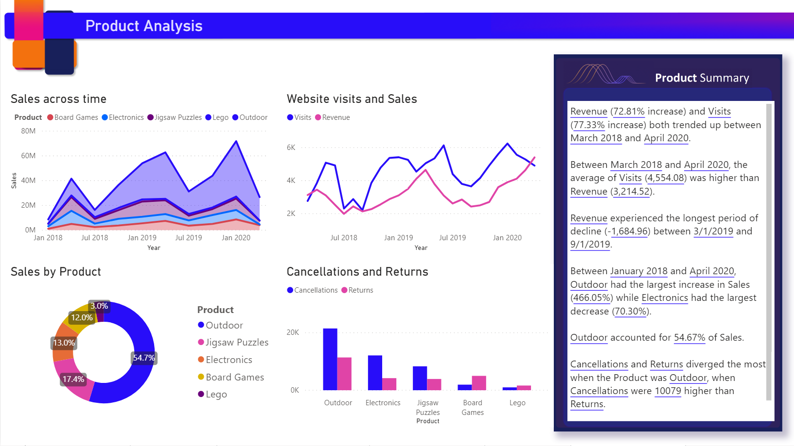
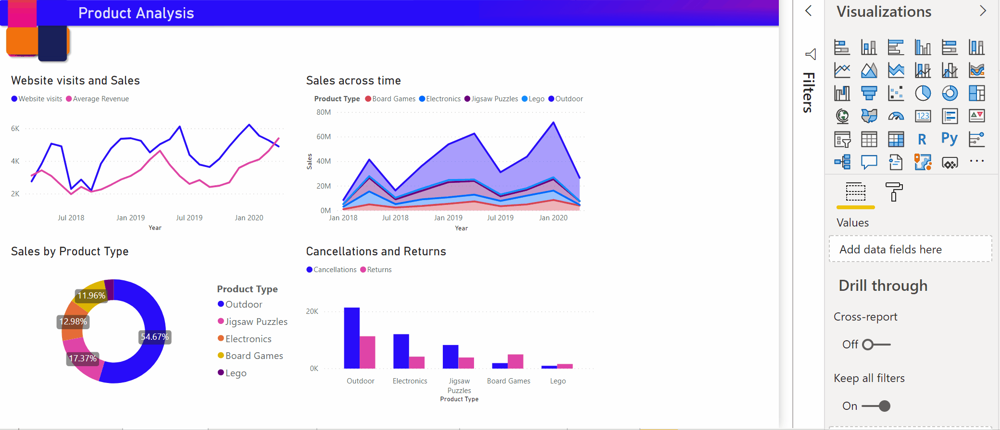
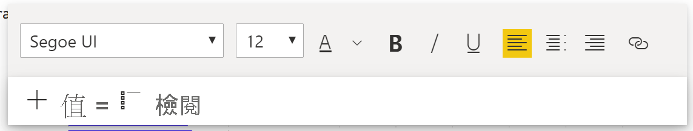
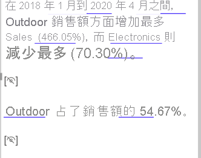
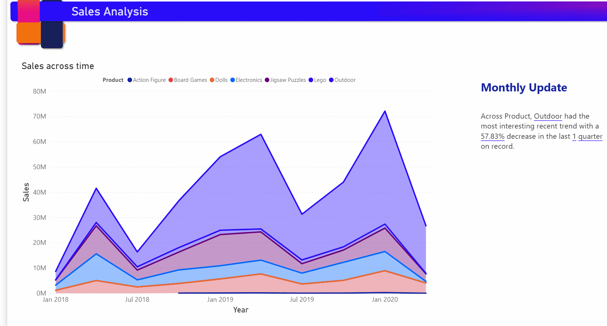

# 建立智慧型敘事摘要 (預覽)

[!INCLUDE[consumer-appliesto-nyyn](../includes/consumer-appliesto-nyyn.md)]    

[!INCLUDE [power-bi-visuals-desktop-banner](../includes/power-bi-visuals-desktop-banner.md)]

智慧型敘事視覺效果可協助您快速摘要說明視覺效果和報告。 其提供您可以自訂的相關創新見解。

在報告中使用智慧型敘事摘要來提出關鍵重點、指出趨勢，以及編輯適用於特定對象的語言和格式。 在 PowerPoint 中，您可以新增敘事，並在每次重新整理時更新，而不需貼上報告關鍵重點的螢幕擷取畫面。 您的對象可以使用摘要來了解資料、更快速地把握重點，並向他人說明該資料。

>[!NOTE]
> 由於智慧型敘事功能目前處於預覽狀態，因此，如果您想要使用此功能，則必須加以開啟。 在 Power BI 中，移至 [檔案] > [選項及設定] > [選項] > [預覽功能]。 然後選取 [智慧型敘事視覺效果]。
>
>![顯示 Power BI 選項的螢幕擷取畫面。 已選取 [智慧型敘事視覺效果] 選項。](media/power-bi-visualization-smart-narratives/2.png)

若要遵循此教學課程，請下載線上銷售案例的[範例檔案](https://github.com/microsoft/powerbi-desktop-samples/blob/master/Monthly%20Desktop%20Blog%20Samples/2020/2020SU09%20Blog%20Demo%20-%20September.pbix)。

## 開始使用 

在 [視覺效果] 窗格中，選取 [智慧型敘事] 圖示以自動產生摘要。

![顯示 [視覺效果] 窗格的螢幕擷取畫面。 已選取 [智慧型敘事] 圖示。](media/power-bi-visualization-smart-narratives/3.png)

您所看到的敘事會以頁面上的所有視覺效果為依據。 例如，在範例檔案中，智慧型敘事可以自動產生報告視覺效果的摘要，以提供營收、網站到訪人次及銷售量等資訊。 Power BI 會自動分析趨勢，以顯示營收和到訪人次兩者均已成長。 其甚至會計算成長率，在此案例中為 72%。
 

 
若要產生視覺效果的智慧型敘事，以滑鼠右鍵按一下該視覺效果，然後選取 [摘要]。 例如，在範例檔案中，嘗試摘要說明顯示各種交易的散佈圖。 Power BI 會分析資料，並顯示哪個城市或區域具有每筆交易的最高營收，以及最高的交易數。 智慧型敘事也會顯示這些計量的預期值範圍。 您會看到大部分城市每筆交易產生的營收不到 $45，而且少於 10 筆交易。
 
  

 
## 編輯摘要
 
智慧型敘事摘要是可高度自訂的。 您可以使用文字方塊命令來編輯或新增現有的文字。 例如，您可以將文字設為粗體，或變更文字色彩。
 

  
若要自訂摘要或新增您自己的見解，請使用「動態值」。 您可以將文字對應至現有的欄位和量值，或使用自然語言來定義要對應至文字的新量值。 例如，若要新增範例檔案中所傳回項目數的相關資訊，請新增值。 

當您輸入值名稱時，可以從建議清單中進行選擇，如同您在問與答視覺效果中所做的一樣。 因此，除了在問與答視覺效果中詢問資料相關的問題，您現在還可以建立自己的計算，而不需使用資料分析運算式 (DAX)。 
  

  
您也可以將動態值格式化。 例如，在範例檔案中，您可以將值顯示為貨幣、指定小數位數，然後選擇千分位分隔符號。 
   

   
若要將動態值格式化，請選取摘要中的值，以在 [檢閱] 索引標籤上查看編輯選項。或者，在文字方塊中，選取您要編輯之值旁邊的編輯按鈕。 
   
![顯示已選取 [值] 索引標籤之文字方塊的螢幕擷取畫面。 在值名稱旁邊，已醒目提示編輯按鈕。](media/power-bi-visualization-smart-narratives/9.png)
   
您也可以使用 [檢閱] 索引標籤，來檢閱、刪除或重複使用先前定義的值。 選取加號 (+)，以將值插入摘要。 您也可以開啟 [檢閱] 索引標籤底部的選項，以顯示自動產生的值。

有時，智慧型敘事中會出現隱藏的摘要符號。 這表示目前的資料和篩選條件不會產生值的結果。 如果沒有可用的見解，摘要便是空的。 例如，在範例檔案的折線圖中，若圖表線條是平坦的，則高值和低值的摘要可能是空的。 但摘要可能會在其他情況下出現。 隱藏的摘要符號只有在您嘗試編輯摘要時才會顯示。

   
## 視覺效果互動
摘要是動態的。 在您進行交叉篩選時，摘要會自動更新所產生的文字和動態值。 例如，如果您在範例檔案的環圈圖中選取電子產品，則報告的其餘部分就會進行交叉篩選，而摘要也會進行交叉篩選，以將重點放在電子產品上。  

在此案例中，到訪人次與營收有不同的趨勢，因此，摘要文字會更新以反映趨勢。 我們新增的傳回值計數會更新為 $4196。 當您進行交叉篩選時，會更新空白摘要。
   

   
您也可以執行更多進階篩選。 例如，在範例檔案中，查看多個產品的趨勢視覺效果。 如果您只對某一季的趨勢感興趣，則可選取相關的資料點來更新該趨勢的摘要。
   

   
## 限制

智慧型敘事功能不支援下列功能：
- 釘選至儀表板 
- 使用動態值和條件式格式設定 (例如，資料繫結標題)
- Azure Analysis Services，內部部署 AS
- KPI、卡片、多列卡片、對應、資料表、矩陣、R 視覺效果或 Python 視覺效果、自訂視覺效果 
- 對於資料行會依其他資料行分組的視覺效果，以及建置於資料群組欄位上之視覺效果的摘要 
- 對視覺效果進行交叉篩選
- 重新命名動態值，或編輯自動產生的動態值
- 包含即時計算的視覺效果摘要，例如 QnA 算術和總計百分比 
   

