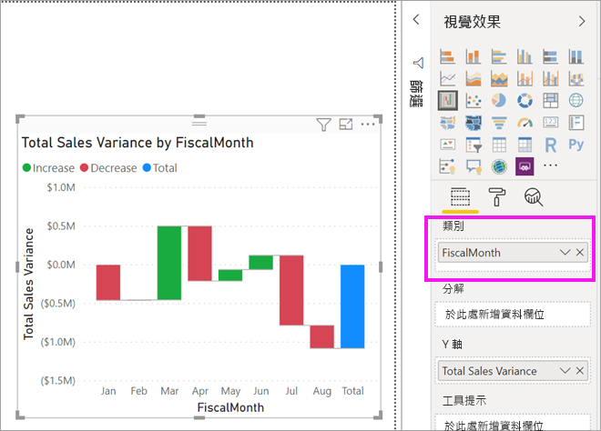

# Power BI 中的瀑布圖

[!INCLUDE[consumer-appliesto-nyyn](../includes/consumer-appliesto-nyyn.md)]

[!INCLUDE [power-bi-visuals-desktop-banner](../includes/power-bi-visuals-desktop-banner.md)]

瀑布圖會隨著 Power BI 加減值顯示累積總計。 適用於了解起始值 (例如淨收益) 如何受到一系列正面和負面變更的影響。

資料行會標示色彩，讓您快速地注意到增加和減少。 起始值和最終值資料行通常[在水平軸上開始](https://support.office.com/article/Create-a-waterfall-chart-in-Office-2016-for-Windows-8de1ece4-ff21-4d37-acd7-546f5527f185#BKMK_Float "在水平軸上開始")，而中間值則是浮動的資料行。 由於此樣式，瀑布圖也稱為橋樑圖 (bridge chart)。

## 使用瀑布圖的時機

瀑布圖極適合：

* 您擁有跨越時間、序列或不同類別的量值變更時。

* 稽核對總值造成的重大變更。

* 藉由顯示營收的各種來源來標示貴公司的年度收益，並達到總收益 (或虧損)。

* 呈現貴公司一年的開始和結束人數。

* 以視覺化方式顯示您的每月收入與支出，以及帳戶的日常餘額。

## 必要條件

本教學課程使用[零售分析範例 PBIX 檔案](https://download.microsoft.com/download/9/6/D/96DDC2FF-2568-491D-AAFA-AFDD6F763AE3/Retail%20Analysis%20Sample%20PBIX.pbix)。

1. 從功能表列的左上方區段中，選取 [檔案]   > [開啟] 
   
2. 尋找您的 **零售分析範例 PBIX 檔案** 複本

1. 在報表檢視  中開啟 **零售分析範例 PBIX 檔案**。

1. 選取  新增頁面。

> [!NOTE]
> 若要與 Power BI 同事共用報表，必須兩人都擁有個人的 Power BI Pro 授權，或將報表儲存在 Premium 容量中。    

## 建立瀑布圖

您將會建立一個顯示了每月銷售額差異 (估計銷售額與實際銷售額) 的瀑布圖。

### 建立瀑布圖

1. 從 [欄位]  窗格，選取 [銷售額]   > [總銷售額差異]  。

   ![選取 [銷售額] > [總銷售額差異] 後產生的視覺效果螢幕擷取畫面。](media/power-bi-visualization-waterfall-charts/power-bi-bar.png)

1. 選取瀑布圖圖示 

    

1. 選取 [時間]   > [FiscalMonth]  將其新增至 [類別]  部分。

    

### 排序瀑布圖

1. 確定 Power BI 依月份時間先後順序來排序瀑布圖。 選取圖表右上角的 [更多選項]  (...)。

    在此範例中，選取 [排序依據]  ，然後選擇 [FiscalMonth]  。 選取項目旁的黃色指標會指出套用選取選項的時間。

    ![選取 [排序依據] > [FiscalMonth]](media/power-bi-visualization-waterfall-charts/power-bi-sort-by-fiscalmonth.png)
    
    若要依時間順序顯示月份，請選取 [遞增排序]  。 如同上一個步驟，請檢查 [遞增排序]  左側是否有黃色指標。 這表示已套用您選取的選項。

    ![選取 [排序依據] > [遞增順序]](media/power-bi-visualization-waterfall-charts/power-bi-waterfall-ascending.png)

    

    請注意，圖表會從會計月份的一月排到八月。  

### 探索瀑布圖

深入了解造成每個月變化的最大因素為何。

1.  選取 [商店]   > [地區]  ，這會將 [地區]  新增至 [分解]  貯體。

    

    Power BI 會使用 [分解]  中的值，將其他資料新增至視覺效果。 其新增造成每個會計月份增加或減少的前五個因素。 例如，這表示 2 月現在會有六個資料點，而不是只有一個。  

    ![顯示 [分解] 貯體中的 [存放區]](media/power-bi-visualization-waterfall-charts/power-bi-waterfall-breakdown-default.png)

    假設您只想了解前兩個因素。

1. 在 [格式]  窗格中，選取 [分解]  ，然後將 [分解上限]  設定為 [2]  。

    ![[格式] > [分解]](media/power-bi-visualization-waterfall-charts/power-bi-waterfall-breakdown-two.png)

    快速檢閱會顯示俄亥俄州和賓夕法尼亞州地區是造成我們瀑布圖負向及正向移動的最大因素。

    

## 後續步驟

* [變更 Power BI 報表中的視覺效果互動方式](../create-reports/service-reports-visual-interactions.md)

* [Power BI 中的視覺效果類型](power-bi-visualization-types-for-reports-and-q-and-a.md)

