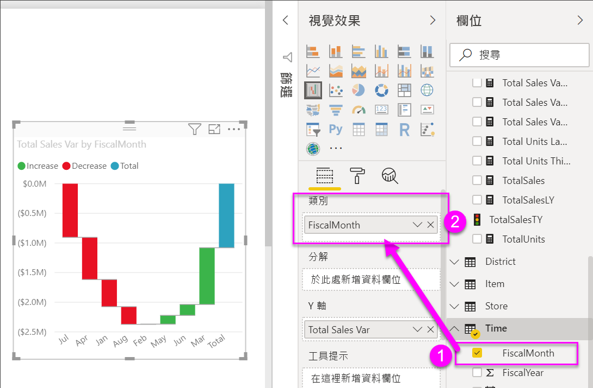

# Power BI 中的瀑布圖

瀑布圖會隨著 Power BI 加減值顯示累積總計。 適用於了解起始值 (例如淨收益) 如何受到一系列正面和負面變更的影響。

資料行會標示色彩，讓您快速地注意到增加和減少。 起始值和最終值資料行通常[在水平軸上開始](https://support.office.com/article/Create-a-waterfall-chart-in-Office-2016-for-Windows-8de1ece4-ff21-4d37-acd7-546f5527f185#BKMK_Float "在水平軸上開始")，而中間值則是浮動的資料行。 由於此樣式，瀑布圖也稱為橋樑圖 (bridge chart)。

<iframe width="560" height="315" src="https://www.youtube.com/embed/qKRZPBnaUXM" frameborder="0" allow="autoplay; encrypted-media" allowfullscreen></iframe>

## 使用瀑布圖的時機

瀑布圖極適合：

* 您擁有跨越時間、序列或不同類別的量值變更時。

* 稽核對總值造成的重大變更。

* 藉由顯示營收的各種來源來標示貴公司的年度收益，並達到總收益 (或虧損)。

* 呈現貴公司一年的開始和結束人數。

* 以視覺化方式顯示您的每月收入與支出，以及帳戶的日常餘額。

## 先決條件

* Power BI 服務或 Power BI Desktop

* 零售分析範例報表

## 取得零售分析範例報表

這些指示使用零售分析範例。 建立視覺效果需要有資料集和報表的編輯權限。 幸運的是，所有的 Power BI 範例都是可編輯的。 如果有人與您共用報表，您就無法在報表中建立視覺效果。 若要跟著做，請取得[零售分析範例報表](../sample-datasets.md)。

取得**零售分析範例**資料集之後，您就可以開始進行。

## 建立瀑布圖

您將會建立一個顯示了每月銷售額差異 (估計銷售額與實際銷售額) 的瀑布圖。

1. 從 [我的工作區]  ，選取 [資料集]   > [建立報表]  。

    ![[資料集] > [建立報表] 的螢幕擷取畫面。](media/power-bi-visualization-waterfall-charts/power-bi-create-a-report.png)

1. 從 [欄位]  窗格，選取 [銷售額]   > [總銷售額差異]  。

   ![選取 [銷售額] > [總銷售額差異] 後產生的視覺效果螢幕擷取畫面。](media/power-bi-visualization-waterfall-charts/power-bi-first-value.png)

1. 選取瀑布圖圖示  將圖表轉換成矩形式樹狀結構圖。

    如果 [總銷售額差異]  並非位於 [Y 軸]  區域，請將它拖曳到該處。

    

1. 選取 [時間]   > [FiscalMonth]  將其新增至 [類別]  部分。

    

1. 確定 Power BI 依時間先後順序來排序瀑布圖。 選取圖表右上角的省略符號 (...)。

    檢查 [遞增排序]  和 [FiscalMonth]  選項左側是否有黃色指標

    ![選取 [排序依據] > [FiscalMonth]](media/power-bi-visualization-waterfall-charts/power-bi-sort-by.png)

    您也可以查看 X 軸的值，這些值會依 [一月]  到 [八月]  的順序顯示。

    深入了解造成每個月變化的最大因素為何。

1. 將 [存放區]   >  [地區]  拖曳至 [分解]  貯體。

    ![顯示 [分解] 貯體中的 [存放區]](media/power-bi-visualization-waterfall-charts/power-bi-waterfall-breakdown.png)

    根據預設，Power BI 會新增造成每個月增加或減少的前五個因素。

    ![顯示 [分解] 貯體中的 [存放區]](media/power-bi-visualization-waterfall-charts/power-bi-waterfall-breakdown-initial.png)

    您只想了解前兩個因素。

1. 在 [格式]  窗格中，選取 [分解]  ，然後將 [分解上限]  設定為 [2]  。

    ![[格式] > [分解]](media/power-bi-visualization-waterfall-charts/power-bi-waterfall-breakdown-maximum.png)

    快速檢閱會顯示俄亥俄州和賓夕法尼亞州地區是造成我們瀑布圖負向及正向移動的最大因素。

    

    這是一個相當有趣的發現。 是因為俄亥俄州和賓夕法尼亞州這兩個地區的銷售額遠高於其他地區的銷售額，才使得它們造成如此顯著的影響嗎？ 您可以確認這一點。

1. 建立依地區劃分的今年銷售額與去年銷售額地圖。

    

    該地圖證實了您的理論。 它顯示了這兩個地區在去年 (泡泡大小) 和今年 (泡泡陰影) 都擁有最高的銷售額。

## 反白顯示和交叉篩選

如需使用 [篩選]  窗格的資訊，請參閱[在編輯檢視中將篩選新增至報表](../power-bi-report-add-filter.md)。

在瀑布圖中醒目提示資料行會交叉篩選報表頁面上的其他視覺效果，反之亦然。 不過，[總計]  資料行不會觸發醒目提示或回應交叉篩選。

## 後續步驟

* [變更 Power BI 報表中的視覺效果互動方式](../service-reports-visual-interactions.md)

* [Power BI 中的視覺效果類型](power-bi-visualization-types-for-reports-and-q-and-a.md)
