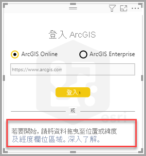
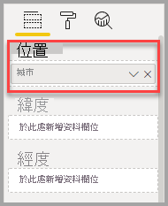
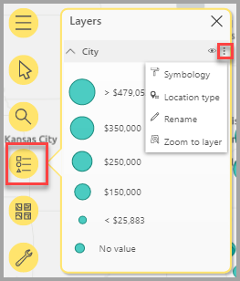
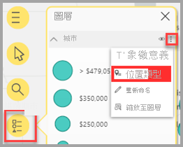
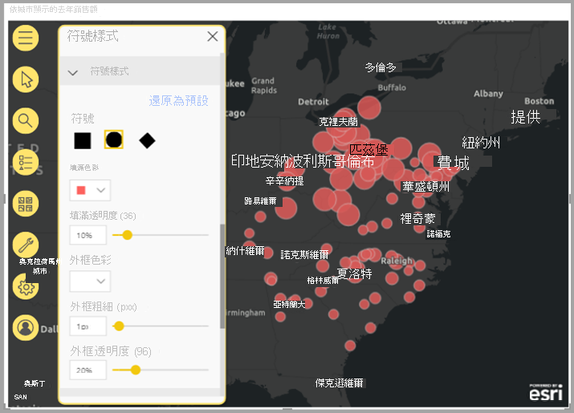
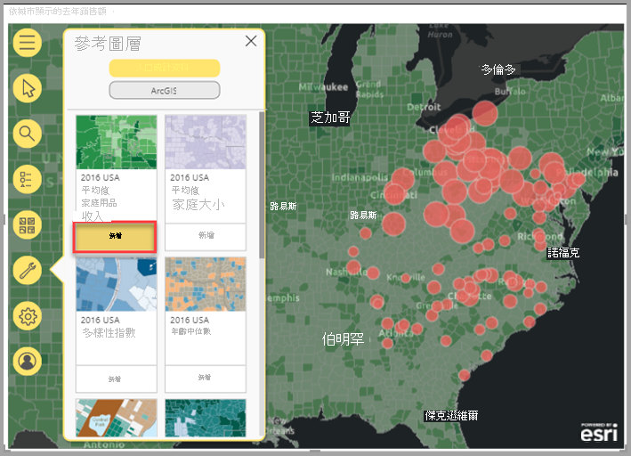
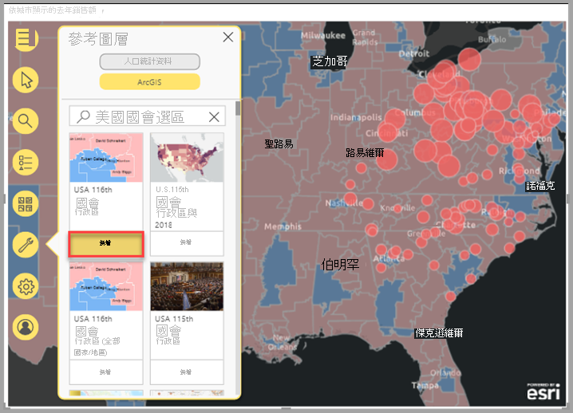
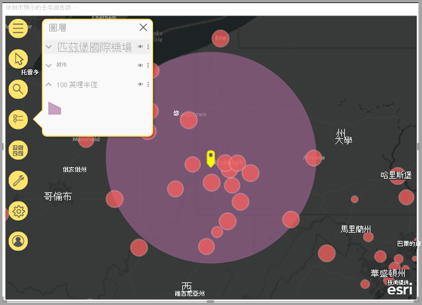

# 在 Power BI 中建立 ArcGIS 地圖

[!INCLUDE[consumer-appliesto-yyyn](../includes/consumer-appliesto-yyyn.md)]    

> [!NOTE]
> 這些視覺效果可以在 Power BI Desktop 和 Power BI 服務中建立與檢視。 本文中的步驟和圖例來自 Power BI Desktop。

此概觀是從 ArcGIS Map for Power BI 建立者的觀點撰寫而成。 「設計人員」與同事共用 ArcGIS Map for Power BI 地圖後，同事雖然可以檢視地圖並與其互動，卻無法儲存變更。 若要深入了解如何檢視 ArcGIS 地圖，請參閱[探索 ArcGIS Maps for Power BI](https://doc.arcgis.com/en/maps-for-powerbi/use/explore-maps.htm)。

ArcGIS 地圖與 Power BI 的結合，把在點之外加上地圖的做法帶到了全新境界。 從基礎地圖、位置類型、佈景主題、符號樣式及參考圖層中選擇，以建立具有豐富資訊的優異地圖視覺效果。 地圖上的官方資料圖層與空間分析結合之後，能讓人更深入了解視覺效果中的資料。 雖然您無法在行動裝置上建立 ArcGIS Maps for Power BI 地圖，但可以檢視地圖並與其互動。

> [!NOTE]
> ArcGIS Maps for Power BI 目前無法供 Power BI 報表伺服器使用。

> [!TIP]
> GIS 是 Geographic Information System (地理資訊系統) 的縮寫。

下方範例以 2016 年可支配所得中位數的人口統計圖層為背景，使用深灰色畫布以熱度圖形式顯示區域銷售額。 如同您在閱讀時所見，使用 ArcGIS Maps for Power BI 提供增強式地圖功能、人口統計資料，以及更吸引人的地圖視覺效果，讓您可以呈現更精彩的故事。

> [!TIP]
> 若要查看多個範例及閱讀見證，請瀏覽 [**Esri 的 ArcGIS Maps for Power BI 頁面**](https://www.esri.com/powerbi) \(英文\)。 另請檢視 Esri 的 **[ArcGIS Maps for Power BI 線上](https://doc.arcgis.com/en/maps-for-powerbi/get-started/about-maps-for-power-bi.htm)說明**。

## 使用者同意

ArcGIS Maps for Power BI 由 Esri ([https://www.esri.com](https://www.esri.com/)) 提供。 因此，您的 ArcGIS Maps for Power BI 使用方式受到 Esri [條款](https://go.microsoft.com/fwlink/?LinkID=826322)與[隱私權原則](https://go.microsoft.com/fwlink/?LinkID=826323)的規範。 如果 Power BI 使用者想要使用 ArcGIS Maps for Power BI 視覺效果，就必須接受同意對話方塊。 只有當您第一次使用 ArcGIS Maps for Power BI 時，才會出現此對話方塊。

## 必要條件

本教學課程使用 Power BI Desktop 及 PBIX [零售分析範例](https://download.microsoft.com/download/9/6/D/96DDC2FF-2568-491D-AAFA-AFDD6F763AE3/Retail%20Analysis%20Sample%20PBIX.pbix)。 您也可以使用 Power BI 服務建立 ArcGIS Maps for Power BI。

1. 從功能表列的左上方區段，選取 [檔案] > [開啟報表]。
2. 尋找儲存在您本機電腦上的 **零售分析範例 PBIX 檔案**。
3. 在報表檢視中開啟 [零售分析範例]。
4. Select ![[新增頁面] 圖示](media/power-bi-visualizations-arcgis/arcgis-tutorial-icon-02.png) 以在報表中新增頁面。

## 建立 ArcGIS Maps for Power BI 地圖視覺效果

若要將地圖新增到報表，請遵循下列步驟：

1. 從 [視覺效果] 窗格中選取 ArcGIS Maps for Power BI 圖示。

    ![[視覺效果] 窗格中的 ArcGIS 地圖圖示](media/power-bi-visualizations-arcgis/arcgis-tutorial-02.png)

2. Power BI 會在報表畫布中新增空白範本。 在此概觀中，我們將使用 Power BI 隨附的「標準」版本。 如果您登入具有適當授權的有效 ArGIS 帳戶，您將可以存取更多功能；如需詳細資訊，請參閱 [ArcGIS Maps for Power BI 線上說明](https://doc.arcgis.com/en/maps-for-powerbi/get-started/account-types.htm)。

    

3. 將資料欄位從 [欄位] 窗格拖曳到 [位置] 或將座標拖曳到適當的 [緯度] 和/或 [經度] 貯體。 在本例中，我們使用 [門市] > [城市]。

    > [!NOTE]
    > ArcGIS Maps for Power BI 會自動偵測您所選取的欄位是否最適合以地圖上的圖形或點來檢視。 您可以在設定中調整預設值 (請參閱[設定 ArcGIS Maps for Power BI 視覺效果格式](#format-the-arcgis-maps-for-power-bi-visualization))。

    

4. 將量值從 [欄位] 窗格拖曳到 [大小] 貯體，以調整資料的顯示方式。 在本例中，我們使用 [銷售額] > [去年銷售額]。

    

您已建立自己的第一份 ArcGIS Map for Power BI 地圖。 現在，讓我們使用基本地圖、位置類型、主題及更多項目來精簡及格式化地圖。

## 設定 ArcGIS Maps for Power BI 視覺效果格式

若要存取 **ArcGIS Maps for Power BI** 的格式設定功能︰

1. 在 [視覺效果] 窗格上，按一下 [格式] 索引標籤以檢視格式設定選項。

    ![[格式] 索引標籤](media/power-bi-visualizations-arcgis/arcgis-tutorial-06.png)

    ArcGIS Maps 格式設定選項包括：

    * **圖層：** 變更圖層清單 (ToC) 的標題、開啟或關閉圖層清單、將清單錨定在地圖上、定義錨定清單的位置。 [圖層] 清單預設為開啟，而且可在展開的地圖工具 ![[地圖] 圖示](media/power-bi-visualizations-arcgis/arcgis-tutorial-icon-03.png) 中找到。
    * **地圖工具：** 開啟或關閉導航工具、在其目前位置鎖定地圖範圍、定義地圖上資訊圖卡片的位置。 [放大] 與 [縮小] 按鈕預設為關閉。
    * **位置類型：** 指定資料所在的國家/地區有助於改善您地圖上的位置正確性。 如果您的資料位於單一國家/地區，請從下拉式清單選擇該國家/地區。 如果您的資料為全球性，請選擇 [世界]。
    * **搜尋：** 開啟或關閉搜尋功能、變更圖釘的預設色彩。 [搜尋] 預設為開啟，而且可在展開的地圖工具 ![[搜尋] 圖示](media/power-bi-visualizations-arcgis/arcgis-tutorial-icon-04.png) 中找到。

### 編輯 ArcGIS Maps for Power BI 地圖

在您將資料新增到地圖視覺效果之後，地圖工具就會變成可用。

> [!NOTE]
> 此教學課程只顯示 ArcGIS Maps for Power BI **標準** 版本中可用的功能與選項。 如果您已登入具有適當授權的有效 [ArcGIS 帳戶](https://doc.arcgis.com/en/maps-for-powerbi/get-started/account-types.htm)，就可以存取更多功能。

展開地圖工具：

1. 按一下 [地圖工具] 按鈕以展開工具。

    ![[地圖工具] 按鈕](media/power-bi-visualizations-arcgis/arcgis-tutorial-07.png)

地圖工具會展開以顯示可用的功能。 選取每項功能時，皆會開啟工作窗格並提供詳細的選項。

> [!TIP]
> Esri 提供有關如何使用 ArcGIS Maps for Power BI 的[豐富文件](https://go.microsoft.com/fwlink/?LinkID=828772)。

#### 變更底圖

底圖針對地圖中的資料提供背景或視覺效果內容。 例如，顯示街道的底圖可以為您的地址資料提供內容。 使用 **標準** 帳戶時，提供四個底圖：深灰畫布、淺灰畫布、OpenStreetMap 和街道名。

若要變更底圖，請遵循下列步驟：

1. 按一下 [底圖] 按鈕 ![[底圖] 圖示](media/power-bi-visualizations-arcgis/arcgis-tutorial-icon-05.png) 以顯示圖庫。
2. 選取 [暗灰色畫布] 底圖。

    

    地圖會使用新的底圖來更新。

如需詳細資訊，請參閱 ArcGIS Maps for Power BI 線上說明中的[變更底圖](https://doc.arcgis.com/en/maps-for-powerbi/design/change-the-basemap.htm)。

#### Bing 地圖圖層

在 ArcGIS Maps for Power BI 中，您會透過圖層來處理地理資料。 圖層是地理資料的邏輯集合，可用來建立地圖；它們也是地理分析的基礎。

若要顯示 [圖層] 清單，請按一下地圖工具中的 [圖層] ![[圖層] 圖示](media/power-bi-visualizations-arcgis/arcgis-tutorial-icon-06.png) 按鈕。

[圖層] 清單會顯示組成地圖的每個圖層，而且每個圖層都有自己的一組選項，可協助您自訂及處理地圖。 視選取的圖層類型而定，功能表中會出現不同的選項。例如，您可以針對使用 Power BI 資料所建立的圖層，變更其符號學與位置類型 (例如您為此範例建立的 **城市** 圖層)，但那些選項無法供參考或行駛時間圖層使用。

如需詳細資訊，請參閱 ArcGIS Maps for Power BI 線上說明中的[使用圖層](https://doc.arcgis.com/en/maps-for-powerbi/design/work-with-layers.htm)。

#### 指定位置類型

ArcGIS Maps for Power BI 使用其強大的地理技術，正確地將位置資料放在地圖上，並根據資料類型預設自動將項目轉譯為點或界限。 例如，緯度經度座標會轉譯為地圖上的點，而州領域則會轉譯為界限或多邊形。 您可以透過指定位置類型來變更位置的轉譯方式。

使用 [位置類型] 功能可改善地圖上位置的正確性。 若要快速執行此動作，您可以在視覺效果的 [格式] 窗格中選擇國家/地區 (展開 [位置類型] 類別，然後選擇適當的國家/地區)，或使用 [圖層選項] 窗格中的完整 [位置類型] 功能來存取更多選項。

完整 [位置類型] 功能可透過圖層選項功能表來存取，而且除了可讓您指定資料所在的國家/地區之外，還可讓您選擇要以點或界限 (多邊形) 來表示您的資料。 界限通常會定義為標準地理區域，例如國家/地區、省、郵遞區號等等。 如果您為資料位置選擇界限與特定國家/地區，您可以選擇各種不同的標準界限，例如縣/市、人口普查區、學區或行政區。 每個國家/地區都有不同的位置類型可用。

若要修改資料的位置類型，請遵循下列步驟：

1. 在 [圖層] 清單中，選取您要使用的資料圖層。
2. 按一下 [圖層選項] 按鈕，然後選擇 [位置類型]。

    

    接受預設值，將位置轉譯為地圖上的點，並指定 [一個國家/地區] > [美國]。

    

如需詳細資訊，請參閱 ArcGIS Maps for Power BI 線上說明中的[指定位置類型](https://doc.arcgis.com/en/maps-for-powerbi/design/specify-location-type.htm)。

#### 自訂地圖的符號學

ArcGIS Maps for Power BI 使用 [欄位] 窗格中的值，以智慧方式判斷其應該如何轉譯地圖上的位置。 「符號學」功能可讓您修改預設樣式，以更清楚地訴說您的故事。 您可以選擇不同的地圖佈景主題，並自訂用來代表地圖上位置的符號與色彩。 根據您新增到地圖視覺效果 [欄位] 窗格的值，可以使用不同的地圖佈景主題與樣式選項。

若要變更圖層的符號學，請遵循下列步驟：

1. 在 [圖層] 清單中，選取您要使用的資料圖層。

2. 按一下 [圖層選項] 按鈕，然後選擇 [符號學]。

[符號學] 窗格隨即出現，並展開 [地圖佈景主題] 類別。

##### 變更地圖佈景主題

在此範例中，因為我們已將值新增到 [位置] 與 [大小] 欄位，所以地圖預設會使用 [大小] 佈景主題。

若要變更地圖佈景主題，請遵循下列步驟：

1. 選擇一些其他地圖佈景主題，以查看地圖如何變更。

    

2. 選擇 [大小] 佈景主題。

如需詳細資訊，請參閱 ArcGIS Maps for Power BI 線上說明中的[變更地圖佈景主題](https://doc.arcgis.com/en/maps-for-powerbi/design/change-the-map-theme.htm)。

##### 圖層透明度

如果您的地圖包含數個圖層，則其在轉譯具有某種程度透明度的圖層時可能會很有用，以便其他圖層上的項目仍然可見。

若要設定圖層的透明度值，請遵循下列步驟：

1. 在 [符號學] 窗格中，展開 [透明度] 類別。

2. 在文字方塊中輸入百分比，或將滑桿移到左邊 (較不透明) 或右邊 (較透明)。

##### 符號樣式

符號樣式可讓您微調地圖上的資料呈現方式。 預設符號樣式是以選取的位置類型與地圖佈景主題為基礎，而且可用的樣式選項會根據包含值之欄位區與那些值的本質而有所不同。

若要變更符號樣式，請遵循下列步驟：

1. 在 [符號學] 窗格中，展開 [符號樣式] 類別。

2. 視需要變更符號設定。 選擇符號圖形、色彩、透明度與外框色彩、粗細與透明度。 展開 [符號大小] 類別以變更那些選項；視您的資料性質與選取的地圖佈景主題而定，會顯示不同的選項。

    以下範例顯示設為 [大小] 的地圖佈景主題，以及數個調整透明度、樣式與大小的符號樣式。

    

3. 當您完成設定樣式選項時，請關閉 [符號學] 窗格。

### 分析您的資料

ArcGIS Maps for Power BI 提供數種工具，可讓您探索資料中的模式，並使用地圖來訴說精彩的故事。

分析功能包括：

- 選取地圖上的位置
- 搜尋特定的地址、地點或景點
- 新增參考圖層以提供更多內容
- 尋找指定半徑或行駛時間區域內的位置
- 新增卡片，以顯示地圖上顯示之區域的人口統計詳細資料

#### 選取位置

ArcGIS Maps for Power BI 提供數種不同的選取工具，可協助您選取地圖上的位置。 視目前在 [圖層] 清單中選取的圖層類型而定，會出現不同的工具。

若要顯示選取工具，請遵循下列步驟：

1. 從地圖工具，按一下 [選取工具] 按鈕  以展開工具組。

    有四個可用的選取工具；視目前作用中的圖層類型而定，不同的工具可能會出現在 [選取工具] 功能表中。 因為此範例中的地圖只包含資料層，所以只會顯示 [單一選取] 與 [方塊選取] 工具。
    
    | **工具** | **說明** |
    | --- | --- |
    |  | **單一選取**：這是可用於按一下個別位置的單一選取工具；這是預設的選取工具。 按住 Ctrl 並按一下以選取多個位置。按一下地圖上的資料位置，就會加以取並觸發與其他視覺效果的互動。按一下參考圖層上的圖釘或位置以顯示其工具提示。 |
    |   | **方塊選取**：拖曳矩形選取範圍以選取多個位置，或按一下個別位置加以選取。如同選取工具，按一下參考圖層上的圖釘或位置會顯示其工具提示。當方塊選取工具處於作用中狀態時，您無法移動瀏覽地圖。 |
    |   | **參考圖層選取**：如果您已將 [參考圖層](https://doc.arcgis.com/en/maps-for-powerbi/design/add-a-reference-layer.htm)新增到地圖，請使用此工具來選取位置，方法是按一下參考圖層上的區域。 參考上分隔區域內的位置會反白顯示；地圖其他區域中的位置無法使用。只有在地圖包含一或多個參考圖層，且參考圖層目前為作用中時，才會顯示此工具。 |
    |   | **行駛時間選取**：如果您已在地圖上新增 [行駛時間區域](https://doc.arcgis.com/en/maps-for-powerbi/design/find-nearby-locations.htm)，請使用行駛時間區域選取工具來選取已定義區域內的資料位置。 |
    
2. 選取地圖上的一或多個位置。 您一次最多可選取 250 個資料點。

如需詳細資訊，請參閱 ArcGIS Maps for Power BI 線上說明中的[選取地圖上的位置](https://doc.arcgis.com/en/maps-for-powerbi/design/select-features-on-the-map.htm)。

#### 釘選位置

釘選地圖上的特定地址、地點或景點。 針對此範例，您將會搜尋匹茲堡國際機場。

若要釘選位置，請遵循下列步驟：

1. 從地圖工具，按一下 [搜尋] 按鈕 ![[搜尋] 圖示](media/power-bi-visualizations-arcgis/arcgis-tutorial-icon-04.png) 以開啟 [搜尋] 窗格。
2. 在 [搜尋] 方塊中，輸入 **匹茲堡國際** 關鍵字。

    關鍵字可以包含地址、地點或景點。 當您輸入時，會出現類似的最近搜尋或以類似關鍵字為基礎的建議。

3. 從結果清單，選擇 [匹茲堡國際機場]，然後按一下 [關閉]。

    地圖上會出現一個符號，而且地圖會自動縮放至該位置。 只有在目前的工作階段期間，才會在地圖上保留圖釘；無法隨著地圖儲存釘選的位置。 釘選的位置也會顯示為 [圖層] 清單中的圖層；您可以重新命名、顯示或隱藏圖層，或將其從地圖上移除，就像處理其他圖層一樣。

4. 若要變更圖釘的色彩，請在地圖視覺效果的 [格式] 窗格中展開 [搜尋] 類別，然後選擇新的色彩。

> [!NOTE]
> [搜尋] 功能取代了先前在 ArcGIS Maps for Power BI 中提供的釘選功能。

如需詳細資訊，請參閱 ArcGIS Maps for Power BI 線上說明中的[釘選位置](https://doc.arcgis.com/en/maps-for-powerbi/design/pin-locations.htm)。

#### 新增參考圖層

參考圖層會針對您已在地圖上顯示的 Power BI 資料提供內容。 參考圖層可以包含人口統計資料，例如家庭收入、年齡或教育程度。 其也可以包含 ArcGIS Online 上的公開共用功能圖層，這些圖層提供有關地圖上位置周圍區域的詳細資訊。

##### 新增人口統計圖層

標準 ArcGIS Maps for Power BI 帳戶包括精心設計的美國人口統計圖層選項，有助於將來自 Power BI 的資料與內容保持相關。

若要新增人口統計圖層，請遵循下列步驟：

1. 從地圖工具，按一下 [分析工具] 按鈕 ![[分析工具] 圖示](media/power-bi-visualizations-arcgis/arcgis-tutorial-icon-12.png) 以展開工具組。
2. 按一下 [參考圖層] 按鈕 。

    [參考圖層] 窗格隨即出現，並顯示 [人口統計] 索引標籤與其圖層選項。

3. 在資源庫中捲動，然後在您要新增到地圖的圖層縮圖上按一下 [新增]。

    針對此範例，請尋找 [2016 美國平均家庭收入] 圖層，然後按一下 [新增]。
    
    地圖會更新以顯示新的圖層。
    
    
    
人口統計參考圖層是互動式的；按一下某區域即可檢視包含更多資訊的工具提示。 您也可以使用 [參考選取] 工具，[在地圖上選取落於參考圖層上之區域內的區域](https://doc.arcgis.com/en/maps-for-powerbi/design/select-features-on-the-map.htm)。

##### 從 ArcGIS 新增參考圖層

ArcGIS Maps for Power BI 可讓您在 ArcGIS 上搜尋公開共用的功能層，讓您可以存取數以千計的參考圖層，這些圖層提供有關資料層位置周圍區域的資訊。 當您使用有效的 ArcGIS 帳戶登入 ArcGIS Maps for Power BI 時，您可以搜尋組織中的內容、組織的群組或公開內容。 在此範例中，因為您使用的是標準帳戶，所以只有公開共用的內容會出現在搜尋結果中。

若要新增 ArcGIS 參考圖層，請遵循下列步驟：

1. 在 [參考] 窗格中，按一下 [ArcGIS] 索引標籤。

2. 在 [搜尋] 欄位中，輸入 **美國國會地區**，然後按 **Enter**。

    資源庫會填入數個可能的結果。

3. 找出 [美國 116th 國會地區] 圖層，然後按一下 [新增]。

    地圖會更新以顯示新的圖層。
    
    
    
ArcGIS 參考圖層是互動式的；按一下某區域即可檢視包含更多資訊的工具提示。 您也可以使用 [參考選取] 工具，[在地圖上選取落於參考圖層上之區域內的區域](https://doc.arcgis.com/en/maps-for-powerbi/design/select-features-on-the-map.htm)。

#### 尋找附近位置

您可以使用地圖上的位置 (包括釘選的位置) 作為起點，來尋找並選取地圖上的附近位置。 例如，如果您搜尋特定景點，則可以在地圖上選取該地點之指定行駛時間或距離內的位置。

在此範例中，您將使用先前釘選的匹茲堡國際機場作為起點，來尋找機場 100 英里內的位置。 使用類似的步驟來尋找指定行駛時間內的位置。

若要尋找距離原點指定行駛距離內的位置，請遵循下列步驟：

1. 從地圖工具，按一下 [分析工具] 按鈕 ![[分析工具] 圖示](media/power-bi-visualizations-arcgis/arcgis-tutorial-icon-12.png) 以展開工具組。

2. 按一下 [行駛時間] 按鈕 。

    [行駛時間] 窗格隨即出現。

3. 按一下單一選取工具，然後在地圖上選取您稍早釘選的 [匹茲堡國際機場] 位置。
4. 從 [搜尋區域] 下拉式功能表，選擇 [半徑]，並指定 **100** 英里的距離。
5. 按一下 [確定]  。

    地圖會顯示圍住已釘選之機場位置的圓圈。 [行駛時間] 窗格會展開以顯示行駛距離區域的樣式選項。
    
    
    
    行駛距離區域也會顯示為 [圖層] 清單中的圖層；您可以重新命名、顯示或隱藏圖層，或將其從地圖上移除，就像處理其他圖層一樣。

6. 在 [圖層] 清單中行駛時間圖層為作用中的情況下，使用行駛時間選取工具來按一下行駛距離區域。

    已選取落在搜尋區域內的位置；地圖上未選取的位置會顯示得比較小或變得更透明。 其他視覺效果也會更新，以反映選取的位置。

如需詳細資訊，請參閱 ArcGIS Maps for Power BI 線上說明中的[尋找附近位置](https://doc.arcgis.com/en/maps-for-powerbi/design/find-nearby-locations.htm)。

#### 新增資訊圖卡片

就像參考圖層一樣，資訊圖卡片提供有關地圖上區域的其他詳細資料。 資訊圖卡會在地圖頂端進行版面配置，而且會顯示有關所選位置周邊區域的特定人口統計資訊，或目前地圖範圍中顯示之一般區域的人口統計資訊。 如需詳細資訊，請參閱 ArcGIS Maps for Power BI 線上說明中的[新增資訊圖卡片](https://doc.arcgis.com/en/maps-for-powerbi/design/add-infographics.htm)。

### 取得協助

Esri 提供有關 ArcGIS Maps for Power BI 的豐富線上文件。

若要從視覺效果存取 ArcGIS Maps for Power BI 線上說明，請遵循下列步驟：

1. 從地圖工具，按一下 [設定] 按鈕 ![[設定] 圖示](media/power-bi-visualizations-arcgis/arcgis-tutorial-icon-15.png)。

2. 在 [設定] 窗格上，按一下 [說明] 按鈕。
3. 在出現的確認視窗中，按一下 [確定]。

    ArcGIS Maps for Power BI 線上說明會在瀏覽器視窗中開啟。
    
    - 在 ArcGIS Maps for Power BI 線上說明中尋找[常見問題集](https://doc.arcgis.com/en/maps-for-powerbi/get-started/pbi-faq.htm#anchor5)的答案。
    - 您可以在與 [**ArcGIS Maps for Power BI** 相關的 Power BI 社群討論串](https://go.microsoft.com/fwlink/?LinkID=828771)中詢問問題、尋找最新資訊及尋找答案。
    - 如果您有建議的改進項目，請將其提交到 [Power BI 的集思廣益清單](https://ideas.powerbi.com/)。
    
### 管理組織內的 ArcGIS Maps for Power BI 使用狀況

Power BI 可讓設計人員、Power BI 系統管理員與使用者系統管理員管理 ArcGIS Maps for Power BI 的使用狀況。 下列各節概述每個角色可以採取的動作。

#### 設計工具選項

在 Power BI Desktop 中，設計人員可在 [安全性] 索引標籤停用 ArcGIS Maps for Power BI。選取 [檔案]  >  [選項和設定]，然後選取 [選項]  >  [安全性]。 停用時，就不會預設載入 ArcGIS 地圖。

#### 系統管理員選項

在 Power BI 服務中，系統管理員可以關閉所有使用者的 ArcGIS Maps for Power BI。 選取 [設定] > [系統管理入口網站] > [租用戶設定]。 停用後，Power BI 的 [視覺效果] 窗格中即不再顯示 ArcGIS Maps for Power BI 圖示。

#### 使用者系統管理員選項

Power BI Desktop 支援使用 [群組原則] 來停用整個組織部署電腦的 ArcGIS Maps for Power BI。

| **Attribute** | **ReplTest1** |
| --- | --- |
| Key | Software\Policies\Microsoft\Power BI Desktop |
| valueName | EnableArcGISMaps |

值為 1 (十進位) 時，表示啟用 ArcGIS Maps for Power BI。

值為 0 (十進位) 時，表示停用 ArcGIS Maps for Power BI。

## 考量與限制

ArcGIS Maps for Power BI 可在下列服務和應用程式中使用：

| 服務/應用程式 | 可用性 |
| --- | --- |
| Power BI Desktop | 是 |
| Power BI 服務 (powerbi.com) | 是 |
| Power BI 行動應用程式\* | 是 |
| Power BI 的發佈至網路功能 | 否 |
| Power BI Embedded | 否 |
| Power BI 服務內嵌 (powerbi.com) | 否 |
| Power BI 報表伺服器 | 否 |

\*在行動環境中，您可以檢視使用 Power BI ([標準帳戶](https://doc.arcgis.com/en/maps-for-powerbi/get-started/account-types.htm)) 隨附之 ArcGIS Maps for Power BI 視覺效果所建立的地圖。 在行動環境中，不支援包含來自 ArcGIS 之進階版內容的地圖。

在無法使用 ArcGIS Maps for Power BI 的服務或應用程式中，視覺效果將顯示為帶有 Power BI 標誌的空白視覺效果。

下表比較所有 Power BI 使用者可用的標準功能與已登入之 ArcGIS 使用者可用的功能：

|  標準 (Power BI 隨附) |   使用您的 ArcGIS 帳戶 |
| --- | --- | --- |
| 底圖 |
| 4 基本底圖 | 所有 Esri 底圖加上貴組織底圖 (包括自訂底圖) 的存取權 |
| 地理編碼 |
| 每個地圖 3,500 個位置 | 每個地圖 10,000 個位置 |
 | 每個月 10,000 個位置 | 無每月限制 |
| 參考圖層 |
| 10 個包含美國人口統計的參考圖層 | 從您的 ArcGIS 組織存取所有 Web 地圖與圖層 |
 | ArcGIS 中的公開共用功能圖層 | ArcGIS 中的公開共用功能圖層 |
 | ArcGIS Living Atlas of the World 地圖與圖層 (功能服務) 的存取權 |
| 資訊圖 |
| 精心設計的美國人口統計變數圖庫 (7 個類別) | ArcGIS GeoEnrichment 資料瀏覽器 (包括美國與全球人口統計變數) 的完整存取權 |
|

## 後續步驟

- [與已和您共用的 ArcGIS 地圖互動](https://doc.arcgis.com/en/maps-for-powerbi/use/explore-maps.htm)
- [公告 ArcGIS maps for Power BI](https://www.esri.com/arcgis-blog/?s=#ArcGIS%20Maps%20for%20Power%20BI) 更新的部落格文章
- 有其他問題嗎？ [嘗試在 Power BI 社群提問](https://community.powerbi.com/)