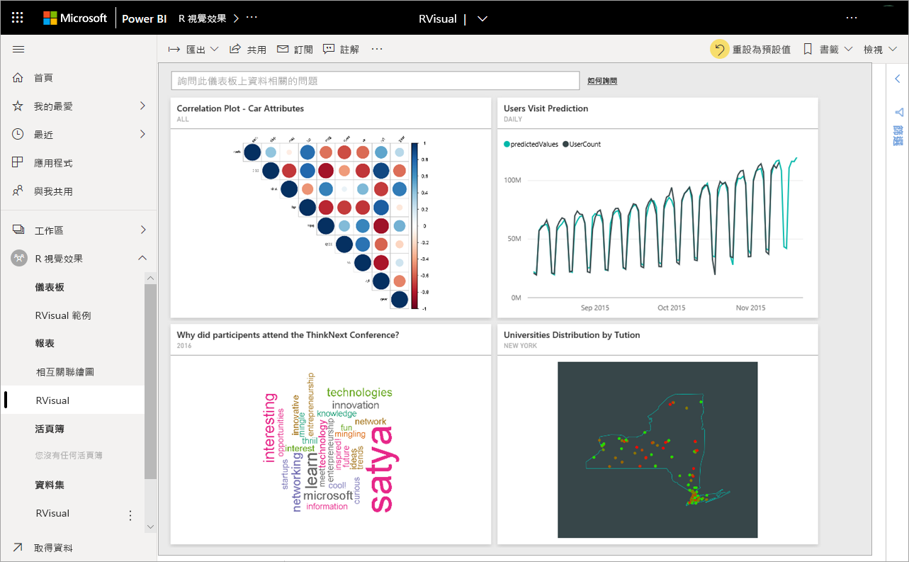
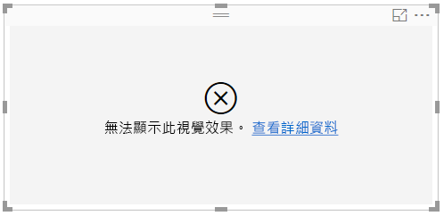

# 在 Power BI 中建立和使用 R 視覺效果
R 視覺效果目前僅能在 **Power BI Desktop** 中建立，然後發行到 Power BI 服務。 如需如何建立 R 視覺效果的詳細資訊，請參閱 [使用 R 建立 Power BI 視覺效果](../desktop-r-visuals.md)。

## 在 Power BI 服務中檢視 R 視覺效果
Power BI 服務支援檢視使用 R 指令碼建立的視覺效果，並與其互動。 以 R 指令碼建立的視覺效果通常稱為「R 視覺效果」  ，可以使用 R 豐富的分析和視覺效果功能呈現進階的資料成形和分析，例如預測。

> [!NOTE]
> [R 程式設計語言](https://www.r-project.org/)是統計學家、資料科學家和商務分析師使用最廣泛的程式設計語言之一。 R 語言有一個開放原始碼社群，提供了逾 7000 種的附加元件套件，以及廣為大眾使用的 R 使用者群組。 部署在 Power BI 服務中的 R 版本是 *Microsoft R 3.4.4*。
> 
> 

下圖顯示的 Power BI 儀表板，使用了一系列用於進階分析的 R 視覺效果。

R 視覺效果建立在 [Power BI Desktop 報表](../desktop-get-the-desktop.md)中，如下圖顯示的報表。

一旦在 **Power BI Desktop** 中建立了報表，您就可以將包含一或多個 R 視覺效果的報表發行到 Power BI 服務。 

 此服務不支援所有的 R 套件。 如需 Power BI 服務目前支援的封裝清單，請在本文結尾參閱支援的封裝。

您可以下載這份[範例 Power BI Desktop 檔案](https://download.microsoft.com/download/D/9/A/D9A65269-D1FC-49F8-8EC3-1217E3A4390F/RVisual_correlation_plot_sample%20SL.pbix) (.pbix 檔案)，其中包含數個 R 視覺效果，可供您查看運作方式及進行實驗。

在 **Power BI Desktop** 中建立、然後發行到 Power BI 服務的 R 視覺效果，絕大多數的行為就如同 Power BI 服務中的其他視覺效果；您可以與其互動，加以篩選、配量以及釘選到儀表板，或與他人共用。 如需共用儀表板和視覺效果的詳細資訊，請參閱 [與同事和其他人共用儀表板](../service-share-dashboards.md)。 R 視覺效果和其他視覺效果的不同之處在於無法顯示工具提示，也無法用於篩選其他視覺效果。

如下圖所示，Power BI 服務中的 R 視覺效果無論在儀表板或報表中，大部分的表現及行為都和任何其他視覺效果一樣，因此使用者不需要留意建立視覺效果的基礎 R 指令碼。

## R 指令碼安全性
R 視覺效果是從 R 指令碼建立，可能包含具有安全性或隱私權風險的程式碼。

這些風險主要存在於指令碼作者在自己的電腦上執行指令碼時的撰寫階段。

Power BI 服務套用「沙箱」  技術，保護使用者與服務免於安全性風險。

這種「沙箱」  方法會對 Power BI 服務中執行的 R 指令碼施加某些限制，諸如存取網際網路，或存取建立 R 視覺效果時非必要的其他資源。

## R 指令碼錯誤體驗
當 R 指令碼發生錯誤時，R 視覺效果不會進行繪製，而且會顯示錯誤訊息。 如需錯誤的詳細資料，請從畫布的 R 視覺效果錯誤中選取 [查看詳細資料]  ，如下圖所示。

下圖顯示另一例，當 R 指令碼因為 Azure 遺漏 R 封裝而無法正確執行時，會出現錯誤訊息。

## 授權
R 視覺效果需要 [Power BI Pro](../service-self-service-signup-for-power-bi.md) 授權，才能在報表、重新整理、篩選及交叉篩選中呈現。 如需 Power BI Pro 授權的詳細資訊，以及和免費授權有何差異，請參閱[何謂 Power BI Pro 內容？](../service-admin-purchasing-power-bi-pro.md)

Power BI 的免費使用者只能取用在 Premium 工作區中與他們共用的磚。 如需詳細資訊，請參閱[購買 Power BI Pro](../service-admin-purchasing-power-bi-pro.md)。

下表依授權說明 R 視覺效果的功能。

|  |在 Power BI Desktop 中撰寫 R 視覺效果  | 使用 R 視覺效果建立 PBI 服務報表 |在報表中檢視 R 視覺效果  | 在儀表板檢視 R 磚 |
|---------|---------|---------|---------|--------|
|**來賓** (Power BI Embedded)     |  支援|  不支援      | 僅在 Premium/Azure 容量中支援  | 僅在 Premium/Azure 容量中支援 |
|**非受控租用戶** (未驗證網域) | 支援 | 不支援 |  不支援 |支援 (B2B 案例) |
|具有免費授權的**受控租用戶**    |  支援       |  不支援       |    僅在 Premium 容量中支援    | 支援 |
具有 Pro 授權的**受控租用戶**     |   支援      | 支援      | 支援    |支援|

## 已知的限制
Power BI 服務的 R 視覺效果有某些限制︰

* R 視覺效果支援僅限於[了解支援哪些 R 套件](../service-r-packages-support.md)一文中指出的套件 。 目前不支援自訂封裝。
* 資料大小限制 – R 視覺效果用於繪製的資料限制為 150,000 個資料列。 如果選取超過 150,000 個資料列，則只會使用前 150,000 個資料列，而且影像上會顯示訊息。 此外，輸入資料的限制為 250 MB。
* 解決方案 - 所有 R 視覺效果都會以 72 DPI 顯示。
* 繪圖裝置 - 僅支援繪圖至預設裝置。 
* 計算時間限制 - 如果 R 視覺效果計算超過 60 秒，指令碼會逾時並導致錯誤。
* R 視覺效果會在資料更新、篩選及反白顯示時進行重新整理。 不過，影像本身不會互動，也不支援工具提示。
* R 視覺效果會回應反白顯示的其他視覺效果，但您不能點選 R 視覺效果中的項目，無法交叉篩選其他項目。
* 「時間」  資料類型目前不支援 R 視覺效果。 請改用日期/時間。
* 使用 [發行至 Web]  時不會顯示 R 視覺效果。
* 儀表板和報表列印目前不會列印 R 視覺效果
* Analysis Services 的 DirectQuery 模式目前不支援 R 視覺效果
* R 視覺效果能夠將文字標籤轉換成圖形元素。 在 Power BI 服務中這麼做需要執行下列額外步驟：
  
  * 在 R 指令碼的開頭新增下行：
    
        powerbi_rEnableShowText =  1
* 中文、日文與韓文字型必須執行下列所有額外步驟，才能在 Power BI 服務中正常運作︰
  
  * 首先，請安裝 R 套件 *showtext* 和其所有其相依性。 做法是執行下列指令碼︰
    
        *install.packages("showtext")*
  * 接下來，在 R 指令碼的開頭新增下行︰
    
        powerbi_rEnableShowTextForCJKLanguages =  1

## R 套件概觀
R 套件是以定義完善的格式所合併的 R 函式、資料和已編譯程式碼集合。 R 在安裝時隨附一組標準套件，並且有其他套件可供下載和安裝。 安裝之後，必須將 R 套件載入要使用的工作階段。 可用 R 套件的主要來源是 CRAN，即 [Comprehensive R Archive Network](https://cran.r-project.org/web/packages/available_packages_by_name.html)。

**Power BI Desktop** 可以使用任意類型的 R 套件，沒有任何限制。 您可以自行安裝 R 套件，以用於 **Power BI Desktop** (例如，使用 [RStudio IDE](https://www.rstudio.com/))。

[這篇文章](../service-r-packages-support.md)中**支援的套件**一節列出的套件支援 **Power BI 服務**中的 R 視覺效果。 如果您在支援的套件清單中找不到感興趣的套件，則可以要求支援套件。 如需如何要求支援的相關資訊，請參閱 [Power BI 服務中的 R 套件](../service-r-packages-support.md)。

### R 套件的需求和限制
有少數 R 套件的需求和限制：

* Power BI 服務大部分支援具有 GPL-2、GPL-3、MIT+ 等這類免費和開放原始碼軟體授權的 R 套件。
* Power BI 服務支援 CRAN 中所發行的套件。 服務不支援私人或自訂 R 套件。 我們鼓勵使用者先製作其在 CRAN 上可用的私人套件，再要求 Power BI 服務中可用的套件。
* **Power BI Desktop** 具有 R 套件的兩個變化：
  
  * 針對 R 視覺效果，您可以安裝任何套件 (包含自訂 R 套件)
  * 針對自訂 R 視覺效果，公用 CRAN 套件僅支援自動安裝套件
* 基於安全性和隱私權考量，我們目前不支援服務中透過全球資訊網提供用戶端-伺服器查詢的 R 套件 (例如 RgoogleMaps)。 會封鎖這類嘗試的網路功能。 如需支援與不支援的 R 套件清單，請參閱 [Power BI 服務中的 R 套件](../service-r-packages-support.md)。
* 包含新 R 套件的核准程序具有樹狀結構的相依性；無法支援需要在服務中安裝的一些相依性。

### 支援的封裝：
如需支援的 R 套件長清單 (及不支援的套件短清單)，請參閱下列文章：

* [Power BI 服務中的 R 套件](../service-r-packages-support.md)

